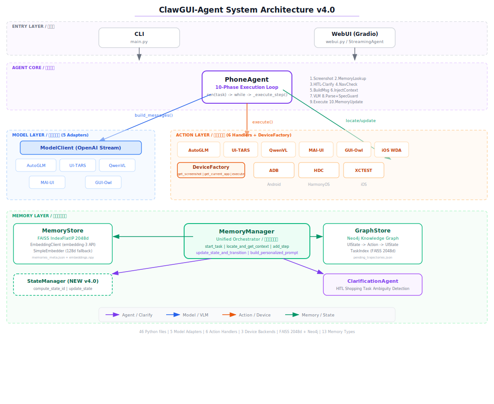
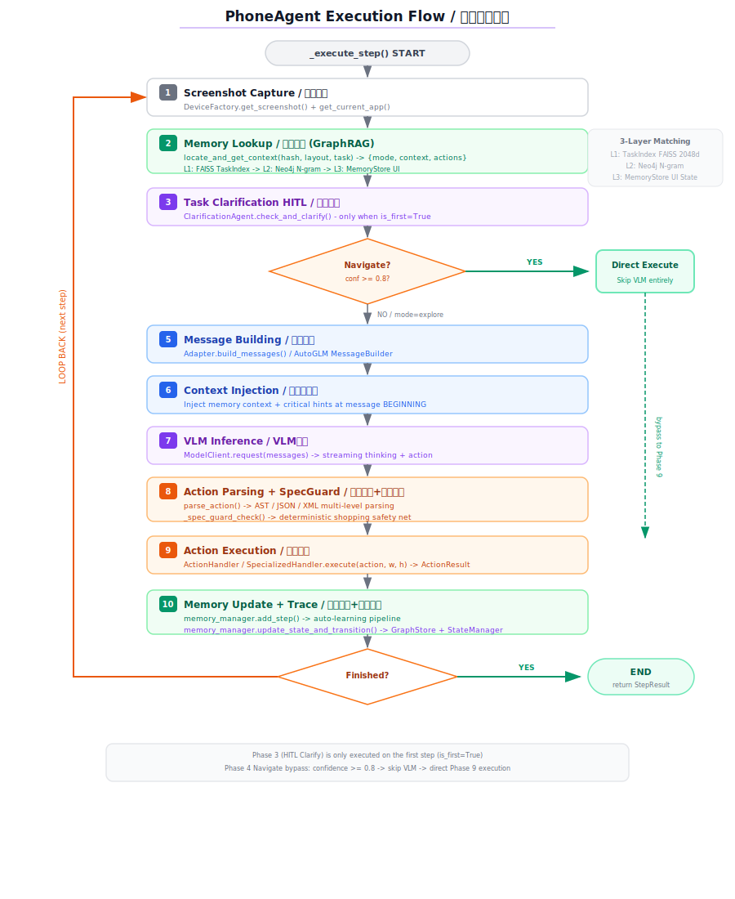
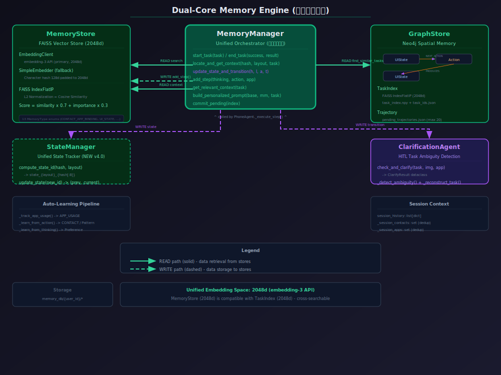

# ClawGUI-Agent 系统架构文档 v4.0

> 日期：2026-05-03
> 状态：生产就绪（v3.0 中 9/13 设计缺陷已修复）
> 基于对 `phone_agent/` 全部 46 个源文件的逐文件审计 + 最近 15+ commits 的变更追踪

---

## 一、目录结构

```
phone_agent/
├── __init__.py
├── agent.py                    # PhoneAgent 主循环 (946行)
├── agent_ios.py                # iOS 专用智能体 (无记忆系统)
├── clarify.py                  # ClarificationAgent 子代理 (281行) ✅ 已重写
├── device_factory.py           # 跨平台设备抽象工厂 (ADB/HDC/XCTEST)
├── tracer.py                   # GUI 执行轨迹记录器
│
├── model/
│   ├── adapters.py             # 5个VLM适配器 + 模型类型检测
│   └── client.py               # OpenAI-compatible 流式推理客户端
│
├── actions/
│   ├── handler.py              # AutoGLM 动作解析器+执行器 (含 _extract_function_call)
│   ├── handler_uitars.py       # UI-TARS 专用处理器
│   ├── handler_qwenvl.py       # QwenVL 专用处理器
│   ├── handler_maiui.py        # MAI-UI 专用处理器
│   ├── handler_guiowl.py       # GUI-Owl 专用处理器
│   └── handler_ios.py          # iOS WDA 动作处理器
│
├── config/
│   ├── prompts.py / prompts_zh.py / prompts_en.py   # AutoGLM 提示词
│   ├── prompts_uitars.py / prompts_qwenvl.py        # 各模型专用提示词
│   ├── prompts_maiui.py / prompts_guiowl.py
│   ├── apps.py / apps_harmonyos.py / apps_ios.py    # 应用包名映射
│   ├── timing.py               # 统一操作延迟配置
│   └── i18n.py                 # 中/英 UI 字符串
│
├── adb/                        # Android ADB 后端
├── hdc/                        # HarmonyOS HDC 后端
├── xctest/                     # iOS XCTEST/WebDriverAgent 后端
│
└── memory/                     # 记忆系统（双核引擎 + 状态管理）
    ├── __init__.py              # 导出全部记忆组件 (29行)
    ├── memory_manager.py        # 调度枢纽 (1146行) ✅ 不再被架空
    ├── memory_store.py          # FAISS 向量存储 2048d (666行) ✅ FAISS 搜索启用
    ├── graph_store.py           # Neo4j 图存储 (433行)
    ├── state_manager.py         # 统一状态追踪器 (101行) ✅ 新增
    ├── task_index.py            # FAISS 任务语义索引 2048d (108行)
    └── embedding_client.py      # embedding-3 API 客户端 (48行)
```

**总计：46 个 Python 源文件**

---

## 二、整体架构



### 架构分层

```
┌──────────────────────────────────────────────────────────────────┐
│                      Entry Layer (入口层)                         │
│                   CLI (main.py)  │  WebUI (webui.py)              │
└─────────────────────────────┬────────────────────────────────────┘
                              │ task
                              ▼
┌──────────────────────────────────────────────────────────────────┐
│                      Agent Core (代理核心)                        │
│                         PhoneAgent                               │
│                                                                  │
│  run(task):                                                      │
│    _context=[], start_task(), _execute_step(is_first=True)       │
│    while step_count < max_steps:                                 │
│      _execute_step(is_first=False)                               │
│                                                                  │
│  _execute_step(): 10个阶段的单步执行                              │
│    ① 截图采集  ② 记忆查找  ③ HITL澄清  ④ 导航检查               │
│    ⑤ 消息构建  ⑥ 上下文注入  ⑦ VLM推理  ⑧ 动作解析+SpecGuard     │
│    ⑨ 动作执行  ⑩ 记忆更新+轨迹记录                               │
└──┬──────────────┬──────────────┬──────────────┬──────────────────┘
   │              │              │              │
   ▼              ▼              ▼              ▼
┌──────────┐ ┌──────────┐ ┌──────────┐ ┌──────────────────┐
│  Model   │ │  Action  │ │  Device  │ │  Memory System   │
│ Adapters │ │ Handlers │ │  Factory │ │  (双核记忆引擎)   │
│ (5个)    │ │ (6个)    │ │          │ │                  │
└──────────┘ └──────────┘ └─────┬────┘ │ ┌──────────────┐ │
                                │       │ │ Semantic Core│ │
                    ┌───────────┼───┐   │ │ (FAISS 2048d)│ │
                    ▼           ▼   ▼   │ │ embedding-3  │ │
                  ADB         HDC  XCTEST│ └──────────────┘ │
                  (Android) (Harmony) (iOS)│ ┌──────────────┐ │
                                          │ │ Spatial Core │ │
                                          │ │ (Neo4j Graph)│ │
                                          │ │ + TaskIndex  │ │
                                          │ │ (FAISS 2048d)│ │
                                          │ │              │ │
                                          │ │ StateManager │ │
                                          │ │ (统一状态)    │ │
                                          │ └──────────────┘ │
                                          └──────────────────┘
```

### 关键变更 (v3.0 → v4.0)

| 变更项 | v3.0 状态 | v4.0 状态 |
|--------|----------|----------|
| 嵌入空间 | 128d vs 2048d 分裂 | 统一 2048d |
| FAISS 搜索 | 死代码（O(n) 暴力） | FAISS IndexFlatIP 启用 |
| 状态管理 | agent.py/MemoryManager 各自维护 | StateManager 统一管理 |
| 图构建 | agent.py 直接访问 graph_store | 通过 MemoryManager.update_state_and_transition() |
| 任务澄清 | 内联方法 + 孤立文件 | ClarificationAgent 独立子代理 |
| Navigate 模式 | 无置信度检查 | confidence >= 0.8 阈值 |
| 安全防护 | 无 | SpecGuard 三层防护 |
| clarify.py | 55行孤立重复代码 | 281行完整子代理 |

---

## 三、Agent 执行流程详解



### 3.1 run(task) — 任务入口

```
run(task)
  ├─ _context = []
  ├─ _step_count = 0
  ├─ clear_history()  ← 清空 QwenVL/GUI-Owl adapter 历史
  ├─ tracer.start_task() if enabled
  ├─ memory_manager.start_task(task)  ← 提取联系人/App，初始化 StateManager
  │
  ├─ _execute_step(task, is_first=True)   ← 第一步（带任务描述）
  │   └─ if finished → end_task() → return
  │
  └─ while step_count < max_steps:
       _execute_step(is_first=False)       ← 后续步骤
       └─ if finished → end_task() → return

end_task():  ← 三处调用点（第一步完成、循环中完成、超时）
  memory_manager.end_task(success, result, end_state_id)
  tracer.end_task(result, total_steps)
```

### 3.2 _execute_step() — 单步执行的10个阶段

#### Phase ①: 截图采集 (agent.py:401-404)

```python
screenshot = device_factory.get_screenshot(device_id)  # → base64, width, height
current_app = device_factory.get_current_app(device_id) # → "微信" / "home_screen"
```

#### Phase ②: 记忆查找 — GraphRAG 三层匹配 (agent.py:406-441)

```python
ui_hash = MD5(screenshot.base64_data)
semantic_layout = current_app

context_data = memory_manager.locate_and_get_context(ui_hash, semantic_layout, task)
# → {mode, max_similarity, semantic_context, next_actions, current_state_id}
```

**三层匹配策略（当前实现）：**

```
Layer 1: TaskIndex FAISS (embedding-3, 2048d) 语义向量搜索
  ├─ similarity >= 0.85 → mode="navigate" (直接执行快捷动作)
  ├─ similarity >= 0.60 → mode="explore" + 注入压缩轨迹上下文
  └─ similarity < 0.60  → 不注入图谱上下文

Layer 2: Neo4j N-gram 关键词回退 (FAISS结果为空时)
  └─ 中文N-gram分词 + 令牌重叠计分 + 关键词奖励

Layer 3: MemoryStore FAISS UI状态回退 (2048d)
  └─ 搜索 MemoryType.UI_STATE，补充页面特征参考
```

#### Phase ③: HITL 任务澄清 — 仅第一步 (agent.py:443-460)

```python
if is_first:
    clarify_result = self.clarification_agent.check_and_clarify(
        task, screenshot.base64_data, current_app, memory_context,
        clarification_callback=self.clarification_callback
    )
    if clarify_result.needs_clarification:
        task = clarify_result.clarified_task  # 用澄清后的任务替换
        # 重新评估记忆上下文
        context_data = memory_manager.locate_and_get_context(...)
```

**ClarificationAgent 工作流：**
```
原始任务 + 截图 + 当前App + 记忆上下文
    │
    ▼
_detect_ambiguity() → VLM 判断模糊性
    ├─ "CLEAR" → needs_clarification=False
    └─ "CLARIFY: [问题]" → _ask_user() → _reconstruct_task() → clarified_task
```

#### Phase ④: 导航模式检查 (agent.py:462-494)

```python
if mode == "navigate" and context_data.get("next_actions"):
    best_action = context_data["next_actions"][0]
    if best_action.get("confidence", 0) >= 0.8:  # ✅ 置信度阈值
        # 直接执行图谱快捷动作，完全绕过 VLM
        result = action_handler.execute(action, width, height)
        return StepResult(success=True, finished=False, ...)
    # 低于阈值 → 回退到 explore 模式，继续 VLM 推理
```

#### Phase ⑤: 消息构建 (agent.py:496-567)

按模型类型分支：

| 模型类型 | 构建策略 | 上下文图片 | 说明 |
|---------|---------|-----------|------|
| AutoGLM | 追加式：`system + user(task+image)` → 后续 `user(image)` | 无限制 | 推理后移除图片 |
| UI-TARS | 追加式 + limit_context(5) | 最多5张 | 助手消息完整保留 |
| QwenVL | 重构建式：每轮 `system + user(task+history+image)` | 始终1张 | 需 add_history() |
| MAI-UI | 多消息式：`system → user(text) → user(image)` | 最多3张 | 助手消息完整保留 |
| GUI-Owl | 重构建式：同 QwenVL | 始终1张 | 需 add_history() |

AutoGLM 模式下的个性化 Prompt 构建：

```python
# build_personalized_prompt() 在 "必须遵循的规则" 前插入记忆上下文
system_prompt = build_personalized_prompt(base_prompt, memory_manager, task)
```

#### Phase ⑥: 上下文注入 (agent.py:569-596)

**注入位置变更：消息开头（而非末尾）**

```python
# ✅ v4.0: 注入到消息开头，VLM 优先关注
item["text"] = f"[记忆上下文]\n{extra_context}\n\n{item['text']}"
```

注入内容包含：
- **semantic_context**：来自 `locate_and_get_context()` 的图谱匹配结果
- **critical_hints**：来自 `_detect_critical_scenario()` 的安全提示（仅购物 App）
- **用户个性化信息**：联系人-应用绑定、任务历史、购物偏好

#### Phase ⑦: VLM 推理 (agent.py:598-659)

```python
response = self.model_client.request(self._context)
# → ModelResponse(thinking, action, raw_content)
```

流式输出：thinking 实时打印，action 缓冲。

#### Phase ⑧: 动作解析 + SpecGuard 安全防护 (agent.py:661-710)

```
专用Handler路径 (UI-TARS/QwenVL/MAI-UI/GUI-Owl):
  parsed = specialized_handler.parse_response(raw_content)
  result = specialized_handler.execute(parsed, width, height)

AutoGLM 通用路径:
  action = parse_action(response.action)        # AST/JSON/XML 多级解析
  action = _spec_guard_check(action, thinking, current_app)  # ✅ 代码级安全网
```

**SpecGuard 三层防护体系：**

| 层级 | 机制 | 触发条件 | 行为 |
|------|------|---------|------|
| Layer 1 | System Prompt | 始终生效 | 规则声明：规格页面唯一合法操作是 Interact |
| Layer 2 | `_detect_critical_scenario()` | 购物 App + 规格关键词 | 在 VLM 上下文注入强制性 Interact 提示 |
| Layer 3 | `_spec_guard_check()` | VLM 输出提到购买意图但未发 Interact | **确定性地**将动作覆写为 Interact |

```python
# Layer 3 核心逻辑
def _spec_guard_check(action, thinking, current_app):
    if current_app not in _SHOPPING_APPS:
        return action
    if action.get("action_type") == "Interact":
        return action  # 已经是 Interact，放行
    if _has_spec_keywords(thinking) and _has_purchase_intent(thinking):
        # 强制覆盖为 Interact，提示用户选择规格
        return {"action_type": "Interact", "_metadata": "do"}
    return action
```

#### Phase ⑨: 动作执行 (agent.py:712-755)

```python
# 专用Handler
result = specialized_handler.execute(parsed_action, width, height)

# AutoGLM
result = action_handler.execute(action, width, height)  # → ActionResult
```

支持的 13 种动作类型：`Launch`, `Tap`, `Type`, `Type_Name`, `Swipe`, `Back`, `Home`, `Double Tap`, `Long Press`, `Wait`, `Take_over`, `Interact`, `finish`

#### Phase ⑩: 记忆更新 + 轨迹记录 (agent.py:817-866)

```python
# 自动学习流水线
memory_manager.add_step(thinking, action, current_app)
  ├─ _track_app_usage(app)        → APP_USAGE 记忆 (会话级去重)
  ├─ _learn_from_action(action)   → 联系人/搜索模式提取
  └─ _learn_from_thinking(thinking) → 实体提取+偏好推断

# ✅ 统一状态管理（v4.0 核心改进）
memory_manager.update_state_and_transition(
    screenshot_hash, semantic_layout, action, task
)
# 内部实现：
#   1. StateManager.compute_state_id(hash, layout) → new_state_id
#   2. StateManager.update_state(new_state_id) → (prev, current)
#   3. GraphStore.add_state_transition(prev, current, action, task)
#   4. Return current_state_id
```

### 3.3 动作历史管理

| 模型类型 | 历史管理方式 |
|---------|------------|
| AutoGLM | 追加 `thinking<answer>{action}</answer>` 格式到 context |
| UI-TARS | 追加完整 raw_content 到 context |
| MAI-UI | 追加完整 raw_content 到 context |
| QwenVL | adapter.add_history(action_desc) → 下次 build_messages 时重建 |
| GUI-Owl | adapter.add_history(action_desc) → 下次 build_messages 时重建 |

---

## 四、双核记忆引擎



### 4.1 架构总览：三层设计（v4.0 已统一）

```
agent.py
   │
   ▼
MemoryManager (统一调度枢纽 — 不再被架空)
   │           │           │
   ▼           ▼           ▼
MemoryStore  GraphStore  StateManager
(语义核)      (空间核)      (状态核)
FAISS 2048d  Neo4j        统一状态追踪
```

**v4.0 关键改进：** agent.py 不再直接访问 GraphStore。所有记忆系统交互都通过 MemoryManager 的统一 API。

### 4.2 语义记忆核 — MemoryStore (FAISS 2048d)

```
存储层:
  memory_db/{user_id}/
    ├── memories_meta.json   ← 所有记忆的元数据 (JSON)
    └── embeddings.npy       ← 2048维向量 (NumPy)

嵌入器 (双级回退):
  1. EmbeddingClient (embedding-3 API, 2048d)      ← 主嵌入器
  2. SimpleEmbedder (字符哈希, 128d → 补零到2048d)  ← 回退嵌入器

搜索: FAISS IndexFlatIP + L2归一化 = 余弦相似度  ✅ 已启用
  - 得分 = similarity * 0.7 + importance * 0.3
  - 暴力搜索作为 FAISS 的后备方案

✅ v4.0 已修复：FAISS 索引不再死代码
✅ v4.0 已修复：嵌入空间统一为 2048d
```

**MemoryType 枚举 (13种)：**

| 类型 | 值 | 默认重要性 | 说明 |
|------|-----|----------|------|
| USER_PREFERENCE | user_preference | 0.6 | 用户设置/使用偏好 |
| CONTACT | contact | 0.7 | 联系人信息 |
| CONTACT_APP_BINDING | contact_app_binding | 0.8 | ✅ 已修复拼写 |
| APP_USAGE | app_usage | 0.5 | 应用使用记录 |
| TASK_HISTORY | task_history | 0.4 | 任务执行历史 |
| TASK_PATTERN | task_pattern | 0.6 | 任务模式/流程 |
| USER_CORRECTION | user_correction | 1.0 | 用户纠正（最高优先级） |
| PRODUCT_PREFERENCE | product_preference | 0.5 | 商品品类偏好 |
| PRICE_SENSITIVITY | price_sensitivity | 0.5 | 价格敏感度 |
| BRAND_AFFINITY | brand_affinity | 0.5 | 品牌忠诚度 |
| SCENE_RECOMMENDATION | scene_recommendation | 0.5 | 场景推荐 |
| UI_STATE | ui_state | 0.4 | UI状态特征 |
| UI_TRANSITION | ui_transition | 0.4 | UI状态转换 |

### 4.3 空间记忆核 — GraphStore (Neo4j + TaskIndex)

**图数据模型：**

```
  ┌──────────────┐     NEXT_ACTION      ┌──────────┐     PRODUCES      ┌──────────────┐
  │   UIState    │ ──────────────────→  │  Action  │ ────────────────→ │   UIState    │
  │ state_id     │                      │ action_id│                    │ state_id     │
  │ app          │                      │ type     │                    │ app          │
  │ semantic_layout│                    │ target   │                    │ semantic_layout│
  └──────────────┘                      └──────────┘                    └──────────────┘
        ↑                                                                    ↑
        │ STARTS_AT                                                          │ ENDS_AT
        │                              ┌──────────────┐                      │
        └──────────────────────────────│  TaskTarget  │──────────────────────┘
                                       │ target_id    │
                                       │ description  │
                                       │ app          │
                                       │ success      │
                                       │ committed_at │
                                       └──────────────┘
```

**TaskIndex (FAISS + EmbeddingClient)：**

```
嵌入维度: 2048d (embedding-3 API)
索引类型: FAISS IndexFlatIP + L2归一化 = 余弦相似度
存储:
  memory_db/{user_id}/
    ├── task_index.npy   ← FAISS 向量
    └── task_ids.json    ← 任务ID列表

✅ v4.0：与 MemoryStore 使用相同的 2048d 嵌入空间
```

**轨迹提交流程：**

```
任务完成 → _save_pending_trajectory() → pending_trajectories.json (本地暂存, 最多20条)
                                              ↓
                              memory_manager.commit_pending(index=0) (手动调用)
                                              ↓
                              graph_store.commit_task_trajectory() → Neo4j + TaskIndex
```

### 4.4 状态管理核 — StateManager (v4.0 新增)

```python
class StateManager:
    """统一状态追踪器 — 解决 agent.py/MemoryManager 状态分裂"""

    def compute_state_id(screenshot_hash, semantic_layout) -> str:
        # "state_{semantic_layout}_{screenshot_hash[:8]}"
        # 结合语义上下文 + 部分哈希 → 允许相似页面匹配

    def update_state(new_state_id) -> tuple[str | None, str]:
        # 返回 (prev_state, current_state)，原子性更新

    def start_task(initial_state_id=None)
    def end_task(final_state_id=None)
    def get_current_state() -> str | None
    def get_prev_state() -> str | None
    def get_state_history() -> list[str]
    def reset()
```

**状态 ID 设计：**
`state_{semantic_layout}_{screenshot_hash[:8]}`

- `semantic_layout`：当前 App 名称（如 "微信"）
- `screenshot_hash[:8]`：MD5 前 8 位（允许同 App 内不同页面区分）
- 组合后可在会话内稳定识别同一页面

### 4.5 MemoryManager 统一 API（v4.0 不再被架空）

```
任务生命周期:
  start_task(task, start_state_id)       → 提取实体，初始化 StateManager
  end_task(success, result, end_state)   → 记录历史，学习模式，保存轨迹

上下文检索:
  locate_and_get_context(hash, layout, task) → {mode, context, actions, state_id}
  get_relevant_context(task)              → 个性化上下文字符串
  build_personalized_prompt(base, mm, task) → 注入记忆的系统提示词

自动学习:
  add_step(thinking, action, app)         → 自动提取管线

状态管理 (统一入口):
  update_state_and_transition(hash, layout, action, task) → current_state_id
  get_current_state_id()                  → 委托给 StateManager

轨迹管理:
  commit_pending(index=0)                 → 提交待审核轨迹到 Neo4j
```

### 4.6 自动学习流水线

```
add_step(thinking, action, app)
│
├─ _track_app_usage(app)
│   └─ MemoryStore.add(APP_USAGE, app)  ← 会话级去重
│
├─ _learn_from_action(action)
│   ├─ Type_Name → 提取联系人 → MemoryStore.add(CONTACT)
│   ├─ Launch → 提取App偏好
│   └─ Type → 提取搜索模式
│
└─ _learn_from_thinking(thinking)
    ├─ Regex提取联系人 (含黑名单过滤)
    ├─ 偏好模式匹配 ("用户喜欢/偏好/习惯/经常")
    └─ MemoryStore 去重检查 (threshold=0.85)
```

**成功模式学习（end_task 触发）：**

```python
_learn_successful_pattern():
    # 记录 App 流程序列为 TASK_PATTERN
    _learn_contact_app_binding():
        # 关键机制：学习 "联系人 → 常用App" 绑定
        # binding_key = f"{contact.lower()}_{app.lower()}"
        # 含频率计数器 → 用于排序推荐
        # CONTACT_APP_BINDING 类型，importance=0.8
```

---

## 五、上下文注入机制

### 5.1 个性化上下文 (AutoGLM 专用)

`get_relevant_context(task)` → 格式化为以下结构（在系统提示词中插入）：

```
【用户个性化信息 - 请严格按照以下信息选择应用】

**🎯 基于使用频率的应用推荐（必须遵循）:**
  ⚡ 联系「张三」：推荐使用 **微信** (使用5次) 而非 QQ (使用1次)

**📋 相关任务历史:**
  模式: 「在京东点外卖」→ 京东

**🛒 购物偏好:**
  倾向于选择百亿补贴

**其他信息:**
  ⚠️ 注意: 用户纠正 - 应选择名字完全匹配的联系人
```

### 5.2 轨迹上下文 (Explore 模式)

当 Layer 1/2 匹配到相似任务时，通过 `locate_and_get_context()` 注入：

```
【行动参考】
"在京东点KFC外卖"(京东·3次)：搜索框→KFC→官方店→套餐→购物车
（注意：当前界面可能与历史轨迹不同，请根据实际截图调整动作）

【用户个性化信息 - 请严格按照以下信息选择应用】
...
```

**v4.0 改进：**
- 上下文注入到消息**开头**（而非末尾），VLM 优先关注
- 明确的歧义警告：历史轨迹仅为参考，用户指令优先级最高
- 关键场景检测（购物规格页面）：注入强制性 Interact 提示

### 5.3 SpecGuard 安全场景注入

```python
def _detect_critical_scenario(current_app, screenshot):
    if current_app in _SHOPPING_APPS:
        return """
        ⚠️ 【关键场景检测】
        当前处于购物应用的规格选择页面。
        如果需要对商品规格（颜色、尺寸、容量等）进行选择：
        - 唯一合法的操作是 Interact，向用户询问规格偏好
        - 绝对不能点击任何购买按钮
        - 绝对不能替用户做规格选择
        """
    return ""
```

---

## 六、模型适配器体系

| 适配器 | 模型 | 消息策略 | 图片限制 | 坐标空间 | 推理内容 |
|--------|------|---------|---------|---------|---------|
| AutoGLMAdapter | AutoGLM/GLM-4V | 追加式 | 无限制 | [0,1000] | thinking |
| UITarsAdapter | UI-TARS (Doubao) | 追加式 | 5张 | 绝对像素 | thinking |
| QwenVLAdapter | Qwen2.5/3-VL | 重构建式 | 1张 | [0,999] | thinking |
| MAIUIAdapter | MAI-UI | 多消息追加 | 3张 | [0,999] | reasoning_content |
| GUIOwlAdapter | GUI-Owl | 重构建式 | 1张 | [0,999] | N/A |

模型检测优先级：GUI-Owl > UI-TARS > Qwen-VL > MAI-UI > AutoGLM（默认）

### 各适配器关键差异

**AutoGLM：** 唯一的"追加式+移除图片"策略 → 上下文不受图片数量限制，但累积的文本历史会增加 token 消耗。

**QwenVL / GUI-Owl：** "重构建式"——每次都重新构建完整的 system + user 消息。历史操作通过 `add_history()` 追加以文本形式包含在 user_query 中。优势是始终只有 1 张图片。

**MAI-UI：** 独特的"多消息式"——第一条用户消息分成两条（先文本后图片），适配 MAI-UI 的输入格式要求。使用 `reasoning_content` 字段。

**UI-TARS：** 使用绝对像素坐标（非归一化），在 `smart_resize` 空间中操作。通过 `limit_context(5)` 防止上下文溢出。

---

## 七、v3.0 设计缺陷修复追踪

### ✅ 已修复（9项）

| # | 缺陷 | 严重度 | 修复方式 | 相关 Commit |
|---|------|--------|---------|------------|
| 7.1 | agent.py/MemoryManager 状态分裂 | 🔴 CRITICAL | 新增 StateManager + update_state_and_transition() | afd550e, 0ab2fa8 |
| 7.2 | 嵌入维度分裂 (128d vs 2048d) | 🔴 CRITICAL | MemoryStore 升级到 2048d embedding-3 | 44bd7d6 |
| 7.3 | MemoryStore FAISS 索引死代码 | 🔴 CRITICAL | search() 改用 FAISS IndexFlatIP | 44bd7d6 |
| 7.4 | clarify.py 孤立/重复文件 | 🔴 CRITICAL | 重写为 ClarificationAgent (281行) | f3109ec |
| 7.5 | Navigate 模式无置信度阈值 | 🟠 MEDIUM | 添加 confidence >= 0.8 检查 | 0ab2fa8 |
| 7.9 | Interact 回复捕获重复三次 | 🟡 MINOR | 删除重复代码块 | 0ab2fa8 |
| 7.10 | CONTACT_APP_BINDNG 拼写错误 | 🟡 MINOR | 修正为 CONTACT_APP_BINDING | 0ab2fa8 |
| 7.11 | 硬编码 15 步轨迹限制 | 🟡 MINOR | 改为可配置 max_steps 参数 | 0ab2fa8 |
| 7.13 | start_state_id 从未传入 | 🟡 MINOR | StateManager.start_task() 接受并设置 | 0ab2fa8 |

### ⚠️ 部分解决（2项）

| # | 缺陷 | 严重度 | 当前状态 |
|---|------|--------|---------|
| 7.6 | Neo4j 不可用时静默降级 | 🟠 MEDIUM | 现在连接失败会抛出 RuntimeError（不再静默），但无用户可见提示 |
| 7.7 | MD5(截图) 状态标识不稳定 | 🟠 MEDIUM | StateManager 结合 semantic_layout + partial hash 改善会话内匹配 |

### ❌ 尚未解决（2项）

| # | 缺陷 | 严重度 | 说明 |
|---|------|--------|------|
| 7.8 | 失败路径无惩罚学习 | 🟠 MEDIUM | 边的置信度只增不减，失败任务不影响路径权重 |
| 7.12 | semantic_layout 粒度过粗 | 🟡 MINOR | 仍仅使用 current_app 名称，未包含具体页面结构 |

---

## 八、v4.0 新增组件

### 8.1 ClarificationAgent (clarify.py, 281行)

**目的：** 在 PhoneAgent 执行任何动作之前运行的专用子代理，检测购物/外卖任务是否包含足够信息。

**设计：**
- 使用与主代理相同的模型配置（从环境变量读取）
- 独立的 `openai.OpenAI` 客户端实例（非流式 API）
- 返回结构化的 `ClarifyResult` 数据类
- 分三步执行：模糊性检测 → 用户提问 → 任务重写

```python
@dataclass
class ClarifyResult:
    needs_clarification: bool
    question: str | None           # 向用户展示的问题
    clarified_task: str | None     # 重写后的可执行任务
```

**关键实现细节：**
- `_detect_ambiguity()` 使用专门的提示词，包含购物/外卖场景的详细判断标准
- 响应解析通过搜索 `CLARIFY:` 子字符串（兼容模型添加前缀文本的情况）
- `_reconstruct_task()` 将原始任务+用户补充重写为 < 50 字符的流畅指令
- 在 WebUI 模式下通过 `clarification_callback`，CLI 模式下通过 stdin/TTY

### 8.2 StateManager (memory/state_manager.py, 101行)

**目的：** 为 agent.py 和 MemoryManager 提供统一的状态管理，消除状态分裂。

**设计：**
- 维护 prev_state / current_state / task_states / state_history
- 计算复合状态 ID：`state_{semantic_layout}_{screenshot_hash[:8]}`
- 原子性状态更新：返回 immutable 的 (prev, current) tuple
- 任务边界追踪：start_task → [state1, state2, ...] → end_task

### 8.3 SpecGuard (agent.py, 内嵌)

**目的：** 确定性地防止模型在购物规格选择页面跳过 Interact 直接购买。

**三层防护：**

```
Layer 1 (Prompt): 系统提示词声明规则
  "如果任务要求的任何参数未指定，唯一合法的操作是 Interact"

Layer 2 (Pre-inference): _detect_critical_scenario()
  在购物App截图时，向VLM上下文注入强制性Interact提示

Layer 3 (Post-inference): _spec_guard_check()
  代码级安全网：检查VLM输出 → 如果提到规格+购买意图但无Interact
  → 确定性地将动作覆写为 Interact
```

### 8.4 _extract_function_call (handler.py)

**目的：** 修复 VLM 在函数调用后追加自然语言解释导致的 `SyntaxError`。

```python
def _extract_function_call(response: str) -> str:
    """使用括号深度追踪提取第一条 do()/finish() 调用"""
    # 找到 do( 或 finish( 的起始位置
    # 追踪括号深度 → 在 depth=0 处截断
    # 丢弃之后的自然语言文本
```

---

## 九、数据流图

```
User Task: "给张三发微信说晚上见面"

PhoneAgent.run(task)
│
├─ memory_manager.start_task(task)
│   ├─ _extract_from_task() → regex 匹配 "张三", "微信"
│   ├─ StateManager.start_task()
│   └─ MemoryStore.add(CONTACT, APP_USAGE)
│
└─ [Loop] _execute_step()
    │
    ├─ ① device_factory.get_screenshot() → base64 + w/h
    ├─ ① device_factory.get_current_app() → "微信"
    │
    ├─ ② memory_manager.locate_and_get_context(ui_hash, "微信", task)
    │   ├─ graph_store.find_similar_tasks("给张三发微信...")
    │   │   ├─ TaskIndex.search() → embedding-3 FAISS 2048d
    │   │   └─ fallback: Neo4j N-gram match
    │   ├─ graph_store.get_task_trajectory(task_id) → {steps, app}
    │   ├─ _condense_trajectory_context() → "发送消息(微信·5次)：搜索→张三→输入→发送"
    │   ├─ get_relevant_context(task) → "⚡ 联系张三：推荐微信(5次)"
    │   └─ MemoryStore.search(UI_STATE) → 页面特征参考
    │   return {mode: "explore", semantic_context: "...", max_similarity: 0.72}
    │
    ├─ ③ [if is_first] clarification_agent.check_and_clarify()
    │   └─ 如 "给张三发" → CLARIFY: "用什么App发？" → 用户回复 "微信"
    │       → _reconstruct_task() → "用微信给张三发消息说晚上见面"
    │
    ├─ ④ [if mode=="navigate" and confidence>=0.8] 跳过VLM直接执行
    │
    ├─ ⑤ adapter.build_messages() → messages
    ├─ ⑥ inject semantic_context into message BEGINNING
    │   └─ "⚡ 联系张三：推荐微信(5次)\n【行动参考】发送消息(微信·5次)...\n\n{original_prompt}"
    │
    ├─ ⑦ model_client.request(messages) → ModelResponse(thinking, action)
    │   └─ thinking: "当前在微信主界面，需要找到张三..."
    │   └─ action: 'do(action="Tap", element=[500, 300])'
    │
    ├─ ⑧ parse_action(action_str) → {"action_type": "Tap", "element": [500, 300]}
    ├─ ⑧ _spec_guard_check(action, thinking, "微信") → 非购物App，放行
    │
    ├─ ⑨ action_handler.execute(action, width, height) → ActionResult(success=True)
    │   └─ _convert_relative_to_absolute([500, 300], 1080, 2400) → tap(540, 720)
    │
    ├─ ⑩ memory_manager.add_step(thinking, action, "微信")
    │   ├─ _track_app_usage("微信") → 去重（已在本会话记录）
    │   ├─ _learn_from_action({"action_type": "Tap"}) → 无联系人/App信息
    │   └─ _learn_from_thinking("在微信中找到张三的聊天窗口...") → 提取 "张三"
    │
    ├─ ⑩ memory_manager.update_state_and_transition(hash, "微信", action, task)
    │   ├─ StateManager.compute_state_id(hash, "微信") → "state_微信_a1b2c3d4"
    │   ├─ StateManager.update_state("state_微信_a1b2c3d4") → (None, "state_微信_a1b2c3d4")
    │   └─ GraphStore.add_state_transition(None, "state_微信_a1b2c3d4", action, task)
    │
    └─ context.append(assistant_message)

Task完成:
  memory_manager.end_task(success=True, result, end_state)
  ├─ MemoryStore.add(TASK_HISTORY)
  ├─ _learn_successful_pattern() → TASK_PATTERN
  │   └─ _learn_contact_app_binding("张三", "微信") → frequency++
  └─ _save_pending_trajectory() → pending_trajectories.json
```

---

## 十、文件规模与复杂度

| 文件 | 行数 | 复杂度风险 | 核心职责 |
|------|------|-----------|---------|
| agent.py | 946 | 中 | Agent主循环 + 5种模型分支 + SpecGuard |
| memory/memory_manager.py | 1146 | 高 | 记忆调度+上下文构建+自动学习+状态协调 |
| memory/memory_store.py | 666 | 低 | FAISS向量存储 2048d + 双级嵌入器 |
| memory/graph_store.py | 433 | 中 | Neo4j图+Cypher查询+TaskIndex |
| model/adapters.py | ~800 | 中 | 5个适配器的消息构建+解析 |
| actions/handler*.py | ~1500 | 中 | 6个平台/模型专用处理器 |
| clarify.py | 281 | 低 | HITL任务澄清子代理 |
| memory/state_manager.py | 101 | 低 | 统一状态追踪 |
| memory/task_index.py | 108 | 低 | FAISS+EmbeddingClient任务索引 |
| memory/embedding_client.py | 48 | 低 | embedding-3 HTTP客户端 |
| **核心总计** | **~6000** | | |

---

## 十一、环境变量与配置

| 变量 | 默认值 | 用途 |
|------|--------|------|
| `PHONE_AGENT_BASE_URL` | `http://localhost:8000/v1` | 模型 API 端点 |
| `PHONE_AGENT_MODEL` | `autoglm-phone-9b` | 模型名称 |
| `PHONE_AGENT_API_KEY` | `EMPTY` | API 密钥 |
| `PHONE_AGENT_MAX_STEPS` | `100` | 每任务最大步数 |
| `PHONE_AGENT_DEVICE_ID` | 自动检测 | ADB 设备 ID |
| `PHONE_AGENT_DEVICE_TYPE` | `adb` | `adb` / `hdc` / `ios` |
| `PHONE_AGENT_WDA_URL` | `http://localhost:8100` | iOS WebDriverAgent URL |
| `PHONE_AGENT_LANG` | `cn` | 提示词语言 `cn`/`en` |
| `PHONE_AGENT_MODEL_TYPE` | `auto` | 模型类型（覆盖自动检测） |
| `NEO4J_URI` | — | Neo4j 连接 URI |
| `NEO4J_USER` | — | Neo4j 用户名 |
| `NEO4J_PASSWORD` | — | Neo4j 密码 |
| `NEO4J_DATABASE` | — | Neo4j 数据库名 |
| `EMBEDDING_API_KEY` | — | embedding-3 API 密钥 |

---

*本文档基于 2026-05-03 对 `phone_agent/` 全部 46 个源文件的逐文件审计 + 15+ commits 的变更追踪。*
*Architecture diagrams: [01-system-architecture.svg](docs/diagrams/01-system-architecture.svg), [02-execution-flow.svg](docs/diagrams/02-execution-flow.svg), [03-memory-system.svg](docs/diagrams/03-memory-system.svg)*
