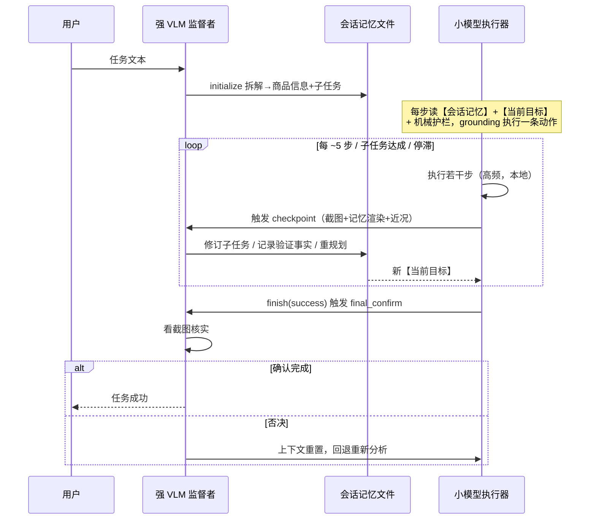

# 第4章 强 VLM 里程碑监督与会话记忆文件设计

第 3 章完成了系统总体设计，提出了"三区域 + 监督层"的总体架构与非对称权威原则，并指出小模型在长程购物任务中的模型不确定性集中表现为长任务焦点丢失、数字判断幻觉与伪完成三类失败模式。其中数字判断属于确定性判断，由第 5 章的机械护栏接管；而焦点丢失与伪完成本质上是语义层问题——前者要求系统持续理解"任务进行到哪一步、下一步该做什么"，后者要求系统核实"任务是否真正完成"，二者都超出了纯代码规则的判断能力，也超出了小模型在长上下文下的可靠推理能力。本章针对这两类语义层失败，给出监督层的详细设计：首先阐述设计动机与"任务开始拆解一次、里程碑低频介入"的中间路径（4.1 节）；然后依次展开里程碑监督者的三项职责（4.2 节）、四触发器去抖机制（4.3 节）、任务计划的原子修订协议（4.4 节）、降级语义与 provider 链鉴别（4.5 节）；4.6 节设计作为监督者与执行器解耦接口的会话记忆文件；4.7 节说明监督机制与每步规划器的互斥关系，为第 8 章的三档消融实验铺垫；最后给出本章小结。

## 4.1 设计动机与中间路径

### 4.1.1 纯小模型与每步强 VLM 两条路线的不足

第 3 章的问题分析表明，可端侧部署的小 GUI 模型（如 9B 量级的 AutoGLM-Phone）具备良好的单步 grounding 能力，但在长程任务上存在系统性短板：随着步数增长与对话历史累积，模型出现反复重述全部计划、原地打转的焦点丢失；在临近结束时出现未真正加购却宣布"已成功加入购物车"的伪完成。这些失败在真机测试中反复复现，且无法通过提示工程根除——它们源于小模型有限的上下文管理与自我核查能力，属于模型容量层面的结构性缺陷 [MobileLLM, ICML 2024] [ScreenSpot-Pro, ACM MM 2025]。

一条直观的补救路线是让强 VLM（云端大模型）接管每一步的规划决策，小模型仅做执行。本系统在前期验证中实现了该路线（即 4.7 节的每步规划器），实测估算表明每步引入强 VLM 调用使单步延迟翻三倍；更重要的是，它使任务的每一步都依赖云端模型，与"小模型量化部署到端侧、决策闭环在本地完成"的设计理念根本冲突——若每步都要上云，端侧小模型就退化为一个昂贵的点击代理，整个端侧部署命题失去意义。这一两难也是大小模型协同领域的共性问题：查询级级联与路由 [FrugalGPT, arXiv 2023] [RouteLLM, arXiv 2024] 把强弱模型的选择做成请求前的一次性决策，无法在同一任务内部持续协作；而步级验证 [V-Droid, arXiv 2025] 仍然要求强模型介入每一个动作选择点，成本与延迟问题依旧。

### 4.1.2 中间路径：一次拆解 + 里程碑低频介入

本文采取介于两个极端之间的中间路径：**强 VLM 在任务开始时介入一次完成任务拆解，此后仅在里程碑处低频介入，进行进度核实与计划修订**。其核心观察是：长程购物任务中真正需要强语义理解的决策点是稀疏的——任务如何分解为子任务、某个子任务是否真正达成、任务整体是否完成，这些判断每隔数步才出现一次；而两个里程碑之间的具体操作（点哪个元素、输入什么文本）恰是小模型擅长的高频 grounding 决策。据此，强 VLM 的调用预算约为"1 + 步数/5"次/任务（实测估算）：1 次任务拆解，加上约每 5 步一次的里程碑检查。相比每步规划，云调用次数下降约一个数量级，而监督的语义覆盖并未削弱——因为被省去的调用本来就落在不需要强语义判断的机械步骤上。

图 4-1 给出强 VLM 与小模型的交替时序。四条泳道分别为用户、强 VLM 监督者、会话记忆文件与小模型执行器：强 VLM 的介入点稀疏地分布在任务开始（initialize）、若干里程碑（checkpoint）与任务结束声明（final_confirm）三类时刻；小模型执行器则在两次介入之间高频地在本地完成"截图—推理—动作"循环，每步读取会话记忆文件渲染的【会话记忆】与【当前目标】。监督者与执行器从不直接对话——所有信息交换都经由会话记忆文件与任务计划这两个持久数据结构中转，这是 4.6 节将展开的解耦设计。



图 4-1 强 VLM 与小模型的交替时序图

需要指出，该中间路径与评测领域的里程碑思想有承接关系：MobiFlow [MobiAgent, arXiv 2025] 以 milestone DAG 对移动智能体轨迹判分，但其里程碑仅在评测期使用、不参与执行；本文则把同等粒度的里程碑前移为执行期的在线监督信号，使强 VLM 的核实结论能实时修订执行器的计划。与 token 级的"小模型起草、大模型验证"范式 [Speculative Decoding, ICML 2023] 相比，本文将验证粒度从 token 提升到任务步骤；与面向静态长文档的端云协作 [Minions, arXiv 2025] 相比，本文面向有状态的 GUI 闭环控制，云端模型的角色是进度监督与完成裁决而非任务分解的全部。

## 4.2 里程碑监督者的三项职责

监督者由 `MilestoneSupervisor`（`milestone_supervisor.py`）实现，承担 initialize、checkpoint、final_confirm 三项职责，分别对应任务的开始、中段与结束三类语义决策点。

### 4.2.1 initialize：一次性任务拆解

`initialize(task)` 在任务开始时调用一次，强 VLM 读取任务文本，输出两类结果：其一是有序子任务序列，如"搜索蓝牙耳机 → 设置价格筛选 → 进入详情确认参数 → 选规格并加入购物车"；其二是结构化商品信息抽取，包括 `search_query`（净化后的搜索词）、`product`（目标商品）、`specs`（规格约束）、`target_action`（目标动作类型）与 `target_page`（完成判定所需的目标页面类型）。输出 schema 与系统原有的 `_vlm_pre_plan` 预规划完全一致（兼容 `set_vlm_plan` 与 `TaskPlan.from_vlm_output` 两个下游入口），因此当监督者不可用时，系统可无缝回退到 `_vlm_pre_plan` 路径，下游代码无需感知差异。拆解结果随即构建为带稳定 `step_id` 的 `TaskPlan`，并写入会话记忆文件。

### 4.2.2 checkpoint：里程碑修订与核实

`checkpoint(...)` 是监督机制的主体。每次触发时，系统向强 VLM 提交一个精心组装的输入包：当前截图（经裁剪压缩以控制传输与推理成本）、会话记忆文件的渲染文本、近 8 步动作摘要、当前页面类型、本次触发原因（4.3 节四触发器之一），以及机械事实快照——由会话状态以代码追踪的商品数量与价格。机械事实快照的意义在于：它是不经过任何模型转述的原始证据，使监督者的判断有一个不受幻觉污染的锚点。

checkpoint 的系统提示固化了两条核心原则："**执行模型自述不可信，以截图与已验证事实为准**"与"**原始任务永不改变**"。前者直接针对伪完成——小模型的执行历史中可能充满"已成功加入购物车"之类的虚假自述，监督者被明确要求只采信截图呈现的界面状态与已通过核实的事实；后者保证无论计划如何修订，任务目标本身不会在多轮转述中漂移。

checkpoint 的输出为结构化的 `CheckpointResult`，包含四个字段：已完成子任务的 id 列表（基于截图证据确认哪些子任务真正达成）、新验证事实（如"已应用价格筛选 500-1000"）、重新规划的剩余子任务（全量替换计划中未完成的部分，详见 4.4 节）、以及完成/阻塞判定。该结果经原子修订协议应用到 `TaskPlan`，并镜像回会话记忆文件。

### 4.2.3 final_confirm：完成核实

当小模型执行器输出 finish 声明任务成功时，`final_confirm` 被调用：强 VLM 查看最终截图，核实任务是否真正完成，输出三态结论——`task_complete`（确认完成，放行）、`task_blocked`（确认任务无法继续，转显式失败）、否决（界面状态与完成声明不符，触发上下文重置与回退重新分析）。在本章范围内，final_confirm 作为监督者的第三项职责，其关键语义是**不消耗里程碑调用预算**：它属于完成判定环节而非常规监督，拥有独立的连续否决上限（见 4.3 节末尾的预算讨论）。final_confirm 在完成判定中的权威地位、与机械完成门的互斥关系及否决后的恢复路径，详见第 5 章 5.3 节。

在工程实现上，监督者的三项职责复用 `PageClassifier` 的 provider 链与截图压缩基础设施——监督者、页面分类器与离线探索规划器共享同一套强 VLM 接入层，避免重复建设，但这一共享也带来了 4.5 节将讨论的静默退化风险。

## 4.3 里程碑触发器

何时触发 checkpoint 由 `MilestoneTrigger` 决定。它是纯逻辑的去抖组件，不含任何模型调用，其设计目标是在"监督覆盖充分"与"调用预算受控"之间取得确定性的平衡。系统定义四个触发器，如表 4-1 所示。

表 4-1 里程碑触发器定义

| 触发器 | 触发条件 | 去抖机制 |
|---|---|---|
| T1 步数间隔 | `step - last_checkpoint_step ≥ INTERVAL`（默认 5，最小 2） | 间隔条件天然去抖 |
| T2 子任务达成 | 计划同步标记子任务 done，且 `step - last ≥ MIN_GAP`（默认 2） | 不满足最小间隔则推迟到 T1 |
| T3 停滞 | `is_stagnating()` 检测到连续 2 次同动作同页面，且 ≥ MIN_GAP | 同一停滞段内不重复触发 |
| T4 完成门拦截 | 机械完成门拦截 finish 后的下一判定点立即触发 | 每任务至多 2 次 |

四个触发器分别覆盖四类需要监督介入的情形：T1 提供保底的周期性检查，确保即使执行平稳也不会长期脱离监督；T2 在子任务达成的自然节点上请求核实与下一阶段规划；T3 在执行器原地打转（停滞检测由会话状态以"连续两次相同动作作用于相同页面"的确定性规则给出）时请求干预；T4 则在机械完成门拦截了一次 finish 之后，让监督者尽快裁决"完成声明被拦"这一冲突——这是优先级最高的情形，因为它意味着执行器的自我判断与机械证据已经矛盾。

触发器的调度规则全部是确定性的：优先级 T4 > T3 > T2 > T1；判定点位于执行循环中计划同步块之后（第 3 章九阶段中的 Phase 5），每步至多触发一个；每次 checkpoint 完成后 `last_checkpoint_step` 前移，四个触发器共享这一基准，从而任何一次触发都会同时抑制其余触发器在最小间隔内的再次激活。这种纯逻辑去抖保证了调用频率的上界可静态分析，不依赖模型行为。

调用预算方面，每任务的 checkpoint 总预算为 `MAX_CALLS`（默认 `2 + max_steps/INTERVAL`），耗尽后所有触发器静默，系统退回纯小模型加机械护栏的运行模式。值得强调的是 final_confirm 不计入该预算的设计理由：完成核实由 finish 声明驱动，若与常规里程碑共享预算，执行器反复的 finish 尝试会快速耗尽 `MAX_CALLS`，使完成判定权悄无声息地从监督者切换到证据强度更弱的机械完成门——这是一种隐蔽的权威降级，会在实验中表现为难以归因的伪完成漏判。将 final_confirm 划归完成判定环节、由其自身的连续 3 次否决上限约束（第 5 章 5.3 节），消除了这一耦合。

## 4.4 任务计划的原子修订

checkpoint 输出的重规划子任务通过 `TaskPlan.apply_revision` 应用，该协议保证修订的原子性与历史不可篡改性。其核心规则为：状态为 done 或 skipped 的子任务保留原对象、不可改写——已完成的历史是审计事实，监督者只能确认完成、不能重写过去；状态为 pending 的尾部子任务用修订内容全量重建，其中空修订列表表示保留原尾部不变；修订应用后 `current_index` 重定位到首个未完成步。修订内容须通过校验：空描述的子任务被丢弃，子任务总数超过 12 步上限或其他非法形态导致整体拒绝——非法修订不部分生效，计划保持修订前状态。校验通过后以原子赋值替换计划内部数组并返回变更摘要，随后经 `sync_subtasks_from_plan` 将新计划镜像回会话记忆文件。其伪代码如下：

```
function apply_revision(completed_step_ids, revised_subtasks):
    # 1. 确认完成：仅允许 pending → done 的状态前移
    for id in completed_step_ids:
        if plan[id].status == pending:
            plan[id].mark_done()
    # 2. 校验修订（任何一条失败则整体拒绝，计划不变）
    cleaned = [s for s in revised_subtasks if s.description 非空]
    frozen  = [s for s in plan if s.status in {done, skipped}]
    if len(frozen) + len(cleaned) > 12:
        return REJECTED            # 超出上限，整体拒绝
    # 3. 重建：冻结段原对象保留 + pending 尾部全量替换
    if cleaned 为空:
        new_tail = 原 pending 尾部  # 空修订 = 维持现状
    else:
        new_tail = 以稳定 step_id 重建的 cleaned
    new_plan = frozen + new_tail
    # 4. 原子生效与镜像
    plan.steps = new_plan          # 原子赋值
    plan.current_index = 首个未完成步索引
    memory_file.sync_subtasks_from_plan(plan)
    return 变更摘要
```

该协议的设计意图有二。其一是防止监督者幻觉破坏执行状态：强 VLM 同样可能产生错误输出，原子性与整体拒绝保证最坏情形下计划维持原状，而不会进入半修订的不一致状态。其二是保证可解释性：每次修订的变更摘要连同触发原因记入会话记忆文件的修订审计日志（4.6 节），使任务结束后可以完整回放"监督者在何时、因何、把计划改成了什么"。

## 4.5 降级语义与 provider 链鉴别

监督机制引入了对云端强 VLM 的依赖，而云端调用必然存在网络故障、超时与解析失败。本节设计的降级语义遵循一条统一原则：**失败等于维持现状**——监督失败绝不应使任务状态变得比没有监督更糟。

具体规则为：单次 checkpoint 失败（网络、解析或超时）时，保留旧计划不变，向修订审计日志记入一条 `RevisionEntry("checkpoint_failed")`，并将触发基准 `last_checkpoint_step` 前移以防止下一步立即重试形成重试风暴；连续 2 次失败则在本任务内禁用监督者，避免反复等待超时拖垮任务时延；强 VLM 完全不可用时监督者根本不挂载，系统整体退化为"机械护栏 + 纯小模型"的基线形态。所有 checkpoint 调用点均以 try/except 防御性包装，监督者的任何崩溃既不杀死任务，也不阻塞 finish 通道。这一组规则确保监督层是严格的"增益型"组件：它在场时提升可靠性，缺位或故障时系统回到无监督基线，而非引入新的失败模式。

降级语义中有一个更隐蔽、对实验有效性至关重要的问题：**provider 链的静默退化**。如 4.2 节所述，监督者、页面分类器与离线规划器共用同一条三级 provider 链：`AMSG_STRONG_VLM_*` → `OFFLINE_VLM_*` → `PHONE_AGENT_*`。该链的末级指向执行器小模型本身，且其默认配置永远齐全——这意味着当实验环境未配置强 VLM 时，provider 链不会报错，而是静默退化到小模型：此时名义上的"监督者"实际上就是执行器自己的模型。由于监督者与执行器同源，它无法纠正同源幻觉——执行器把 ¥1424 判为"500-1000 元内"，同一个模型做监督时大概率重复同样的错误——里程碑机制名存实亡，但日志与行为表面上与正常监督无异。

这种静默掏空对论文实验是致命的：若"强 VLM 监督"组实际运行的是小模型自监督，三档消融的对比结论将完全失效。为此系统引入 provider 链鉴别机制：`MilestoneSupervisor.is_strong_vlm()` 与 `provider_label` 在运行时鉴别链上实际生效的 provider；监督者挂载时打印真实监督模型标识（如 `监督模型: amsg_strong_vlm:qwen3-vl-plus`），一旦检测到退化至小模型则发出显式告警，提示"监督已退化为小模型自监督，无法纠正幻觉"。`_vlm_pre_plan` 的降级路径也对齐同一条三级链与同一鉴别逻辑。该机制把"监督配置是否真实生效"从隐式假设变为每次运行都被验证的显式事实，是第 8 章实验有效性的前提保障。

## 4.6 会话记忆文件

监督者修订的计划与核实的事实需要一个持久载体传递给执行器，执行器的抗遗忘也需要一个不随对话历史漂移的锚点。会话记忆文件（`SessionMemoryFile`，`session_memory_file.py`）同时承担这两个角色。它是纯数据模块，自身不含任何 VLM 依赖——这保证了记忆的读写路径永远可用，与监督者的可用性解耦。

### 4.6.1 数据结构

会话记忆文件的结构如下：`session_id` 与平台标识；`original_task`——原始任务文本，**永不改写**，它是执行器偏离任务时重新校准的锚，无论计划被修订多少轮、上下文被重置多少次，原始任务始终以第一手形态在场；`product` 与 `constraints`——initialize 提取的目标商品与结构化约束（价格区间、颜色等）；`subtasks`——带稳定 `step_id` 的子任务列表，与 `TaskPlan` 双向同步；`verified_facts`——经截图核实的事实列表，每条带 `kind` 分类（`product_selected` 已选定商品、`price_confirmed` 价格已确认、`cart_added` 已加购、`filter_applied` 已应用筛选），区别于执行器的自述，只有监督者核实或机械护栏确认的事实才能进入该列表；`revisions`——修订审计日志，每次 checkpoint 的触发原因与变更摘要留痕，最多保留 30 条，是系统可解释性的直接素材；以及 `vlm_call_count` 与任务状态 `status`（active/completed/failed）。

### 4.6.2 原子持久化

会话记忆文件落盘于 `memory_db/{user}/sessions/{session_id}.json`，采用原子写协议：先写入 `.json.tmp` 临时文件，再以 `os.replace` 原子替换目标文件。进程在任意时刻崩溃，磁盘上要么是完整的旧版本、要么是完整的新版本，最多丢失一个 checkpoint 间隔内的修订。内存中的对象始终是事实源，磁盘 IO 失败仅记录日志、不影响运行——持久化是为崩溃恢复与事后审计服务的，不在执行关键路径上。

### 4.6.3 注入渲染

会话记忆文件通过两个渲染接口作用于执行器。`render_injection()` 每步渲染约 12 行注入文本，置于小模型上下文的最前部，内容依次为：原始任务、目标商品与约束、已验证事实（最多 5 条）、子任务进度清单。图 4-2 给出真实任务中的注入样例。

```
【会话记忆】
原始任务: 去淘宝帮我买一个蓝牙耳机，要求500-1000元内
目标商品: 蓝牙耳机（约束: price_range=500-1000元）
已验证事实:                          ← 截图核实过, 最多渲染 5 条
  ✔ 已应用价格筛选 500-1000（Step 6）
  ✔ 已选定 JBL Clips ¥966（Step 14）
子任务进度:
  1. [done]    搜索蓝牙耳机
  2. [done]    设置价格筛选
  3. [current] 进入详情确认参数
  4. [pending] 选规格并加入购物车
```

图 4-2 `render_injection()` 实际注入样例（每步喂给小模型的抗遗忘上下文）

`brief_line()` 则渲染单行进度摘要（"已完成 X/Y 个子任务；当前：……"）写入会话状态的 `overall_progress` 字段。它取代了已被废弃的旧历史压缩文本：旧机制 `compress_session_history` 将多步历史压缩为一段自然语言，真机测试中曾发生小模型把"压缩 5 步历史"这段元文本误当作任务本身并宣布完成的事故——这正是第 3 章伪完成失败模式的一个实例。该函数现为 no-op，其职能完全由会话记忆文件的结构化渲染取代：注入文本的每一行都是任务事实而非过程元描述，从源头消除了这类误读。

### 4.6.4 双重角色与架构前提

综上，会话记忆文件承担双重角色。对执行器而言，它是**抗遗忘锚**：无论对话历史多长、多混乱，每步上下文的最前部永远是不变的原始任务、经核实的事实与单一的当前焦点，使小模型不必依赖自身的长上下文能力维持任务一致性。对系统架构而言，它是**监督者与执行器的解耦接口**：监督者只写记忆文件与任务计划，执行器只读其渲染结果，二者无直接调用关系，任一方的故障不会沿调用链传播到另一方。

这一设计还确立了一个对后续章节至关重要的架构性质：**任务的全部持久状态都在会话记忆文件中，对话上下文是可丢弃的**。正因如此，当完成声明被否决或模型连续输出不可解析内容时，系统可以放心地丢弃被污染的对话上下文，仅凭系统提示、会话记忆摘要、修订后的当前目标与新截图重建执行现场——第 5 章的确定性故障恢复闭环正是建立在这一前提之上。

## 4.7 与每步规划器的互斥

系统另保留一条更激进的监督路线：每步规划器（`step_planner.py`，由 `PHONE_AGENT_STRONG_PLANNER=1` 启用，默认关闭），即 4.1 节讨论过的"强 VLM 接管每步规划"方案。它在本文中的定位不是产品形态，而是**消融实验的性能上界**：它代表了"不计成本时强 VLM 监督所能达到的可靠性极限"，用以度量里程碑监督与该上界的差距。

每步规划器与里程碑监督互斥：启用每步规划时里程碑机制自动停用——每一步都已有强 VLM 介入，里程碑级的低频检查纯属冗余，叠加运行只会重复消耗预算并使行为归因混乱。这一互斥关系自然构成三档消融矩阵：第一档为纯小模型基线（`PHONE_AGENT_MILESTONE=0`），仅保留机械护栏与图谱，无任何运行期强 VLM 介入；第二档为里程碑监督（系统默认），强 VLM 调用约 1 + 步数/5 次/任务（实测估算）；第三档为每步规划上界（`STRONG_PLANNER=1`），每步一次强 VLM 调用，延迟翻三倍（实测估算）。三档在"任务成功率—端到端延迟—云调用次数"三个维度上构成一条权衡曲线，第 8 章将以该矩阵为核心实验设计，检验本文的中心论断：里程碑级低频监督能以远低于每步规划的成本，达到接近上界的长程可靠性。

## 4.8 本章小结

本章完成了监督层的详细设计。首先，针对纯小模型长任务能力不足与每步强 VLM 规划成本过高的两难，提出"任务开始拆解一次 + 里程碑低频介入"的中间路径，将强 VLM 调用预算控制在约 1 + 步数/5 次/任务（实测估算）。其次，设计了里程碑监督者的三项职责：initialize 一次性拆解任务并提取结构化商品信息，checkpoint 以"执行模型自述不可信、原始任务永不改变"为原则在里程碑处核实进度并重规划，final_confirm 在完成声明时以截图核实裁决三态结论；并以四触发器纯逻辑去抖（步数间隔、子任务达成、停滞、完成门拦截）控制触发时机与预算。再次，设计了任务计划的原子修订协议与"失败=维持现状"的降级语义，并以 provider 链鉴别机制防止"强 VLM 监督"配置被静默掏空，保障实验有效性。最后，设计了会话记忆文件作为抗遗忘锚与监督者—执行器的解耦接口，其原子持久化与结构化渲染确立了"持久状态全在记忆文件、对话上下文可丢弃"的架构前提；并以与每步规划器的互斥关系导出三档消融矩阵，为第 8 章实验奠定基础。监督机制解决语义层的进度理解与计划修订问题；下一章设计与之互补的符号层机械护栏，接管小模型不擅长的确定性判断。
