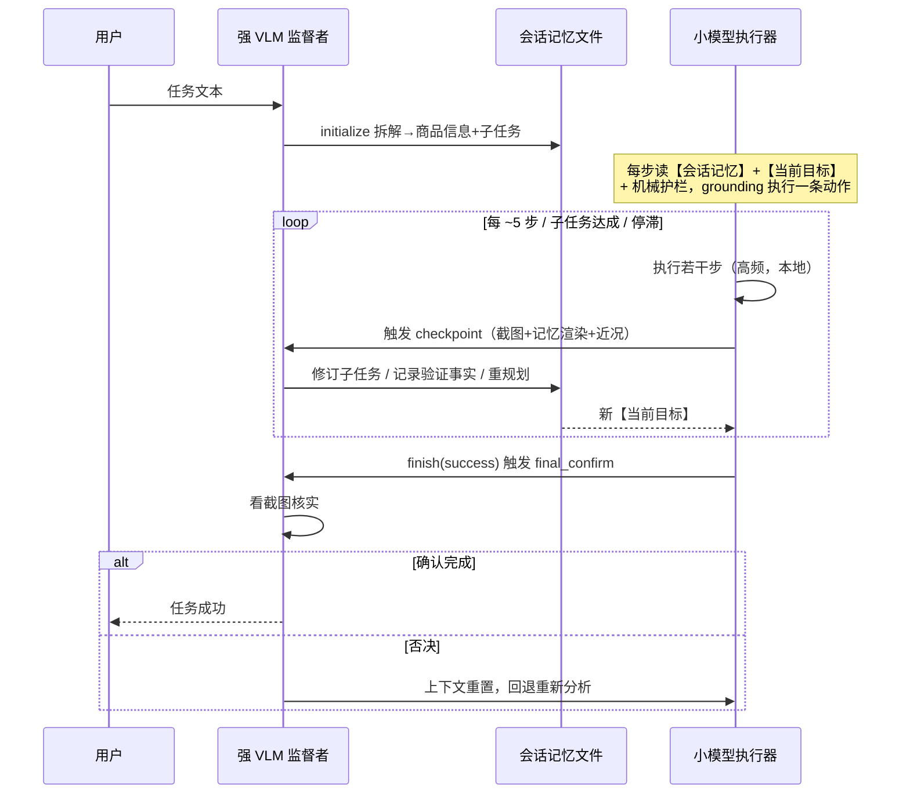

# 基于检索增强的移动端购物智能体研究

---

# 摘要

随着移动购物成为日常消费的主要形态，用视觉语言模型（Vision-Language Model, VLM）驱动图形用户界面（GUI）智能体自动完成手机购物任务成为研究热点。现有方案面临端云两难：云端大模型每步规划准确，但延迟约增三倍、成本高、无法端侧部署；可端侧部署的小型 GUI 模型延迟与隐私友好，却在长程购物任务上暴露出焦点丢失、数字幻觉、伪完成、空响应等系统性失败。本文提出，这些失败的根源在于小模型缺乏、也难以在参数中记住完成任务所需的导航、偏好与长程事实知识；为此，本文将这些知识沉淀为可检索、自更新、有质量门的外部知识库，在每个决策点检索增强小模型，设计并实现了基于检索增强的移动端购物智能体 Shopping-Agent，包含三个创新点。其一也是核心：提出主动移动空间图谱 AMSG（Active Mobile Spatial Graph）作为导航知识的检索引擎，以语义页面状态抽象、延迟后条件验证与四阶段边生命周期使图谱自更新，并按逐边锚定性落地为快速路径、图谱副驾与模型路径三档调度，使可靠的机械导航跳过模型推理。其二：设计会话记忆文件与强 VLM 里程碑监督机制，以低频介入（约 1+步数/5 次每任务）维护"已验证事实"知识库并提供抗遗忘检索接口，保证检索到的是真事实而非模型的虚假自述。其三：设计零云调用的机械反幻觉护栏与确定性故障恢复，保障"检索—决策—执行"链路安全，并作为图谱检索库的入库质量门。系统支持五个 GUI 模型家族与三类设备平台，已在淘宝、京东完成端到端验证，并设计三档消融实验给出准确率—延迟—成本权衡分析【实验数据待补充】。本文表明，端侧小模型的长程可靠性可来自外部知识的检索增强与系统的确定性结构，而非模型规模扩张。

**关键词：** 检索增强；移动 GUI 智能体；端侧小模型；空间知识图谱；里程碑监督

# Abstract

As mobile shopping becomes a primary form of everyday consumption, automating smartphone shopping tasks with VLM-driven GUI agents has become an active research topic. Existing solutions face an on-device/cloud dilemma: cloud large models plan accurately but roughly triple the per-step latency and cannot be deployed on device, whereas quantizable on-device small GUI models are latency- and privacy-friendly yet exhibit systematic failures on long-horizon shopping tasks—focus loss, numerical hallucination, false completion, and empty responses. This thesis argues that the root cause is the small model's lack of, and inability to memorize, the navigation, preference, and long-horizon factual knowledge required for long tasks; rather than scaling the model or delegating decisions to the cloud, such knowledge is externalized into a retrievable, self-updating, quality-gated knowledge base and retrieved at each decision point to augment the small model. Accordingly, this thesis designs and implements Shopping-Agent, a retrieval-augmented mobile shopping agent, with three contributions. First and at the core, the Active Mobile Spatial Graph (AMSG) serves as the retrieval engine for navigation knowledge: via semantic page-state abstraction, delayed postcondition verification, and a four-stage edge lifecycle the graph grows on success and demotes on failure, and per-edge groundedness yields a Fast Path / Co-pilot / model-path three-tier dispatch that lets reliable mechanical navigation bypass model inference. Second, a session memory file with strong-VLM milestone supervision maintains a retrievable base of verified facts and an anti-drift retrieval interface, with the strong VLM intervening only at low frequency (about 1 + steps/5 calls per task) so that the small model retrieves real facts rather than fabricated self-reports. Third, a zero-cloud-call mechanical anti-hallucination guardrail system with deterministic recovery secures the retrieval–decision–execution chain and serves as the admission quality gate of the graph retrieval base. The system supports five GUI model families and three platforms, has been verified end-to-end on Taobao and JD, and a three-tier ablation (pure small model / milestone supervision / per-step planning) provides an accuracy–latency–cost trade-off analysis [data to be supplemented]. This work shows that the long-horizon reliability of on-device small models can arise from retrieval augmentation and deterministic system structure rather than model scaling.

**Key words:** retrieval-augmented generation; mobile GUI agent; on-device small model; spatial knowledge graph; milestone supervision

---

# 第1章 绪论

## 1.1 研究背景与意义

### 1.1.1 研究背景

移动购物已成为大众日常消费的主要渠道，但在手机上完成一次有约束的购物任务——例如"在预算 500 至 1000 元内购买一副具有降噪功能的蓝牙耳机"——仍然需要用户在搜索、筛选、比价、规格选择、加购、结算等多个页面间进行长达数十步的手工交互。将这一过程交给软件智能体自动完成，长期以来受制于移动 GUI 环境的特殊性：与 Web 页面不同，移动应用界面没有稳定可解析的 DOM 结构，同一页面在不同应用版本、不同设备、广告与弹窗干扰、不同滚动位置下外观各异；同一个按钮的点击结果可能是规格选择浮层、登录页、促销弹窗、结算页，甚至没有任何反应。传统的基于控件树或脚本录制的自动化方法在这种高度动态的视觉环境中难以维持。

近年来，视觉语言模型（VLM）的快速发展使"截图输入、动作输出"的纯视觉 GUI 智能体成为可能：智能体以屏幕截图为观测，由模型推理出下一步的点击、滑动或输入动作，形成"截图—推理—执行"的闭环循环。这一范式催生了大量移动 GUI 智能体研究 [AppAgent, CHI 2025][Mobile-Agent, arXiv 2024][CogAgent, CVPR 2024]，也推动了 AutoGLM [AutoGLM, arXiv 2024]、UI-TARS [UI-TARS, arXiv 2025] 等 GUI 专用基座模型的出现。然而，当这一范式落到真实的移动购物场景时，立即面临一个端云两难的部署困境。

一方面，以云端大模型（强 VLM）为每步决策者的方案虽然单步决策质量高，但代价沉重：每一步都需要将截图上传云端并等待大模型推理，本文在系统构建期的前期实测表明，每步引入强 VLM 规划会使单步延迟增至约三倍；按步计费的云端调用使长程任务成本随步数线性膨胀；用户的购物意图、浏览记录与支付页截图持续上传云端带来隐私暴露；而数百亿参数的大模型本身无法部署到手机端侧。另一方面，可量化部署到手机本地的小型 GUI 模型（如 AutoGLM-Phone-9B 这一量级的模型，本文称小模型）在延迟、成本与隐私上具有天然优势，其单步元素定位（grounding）能力经过专门训练也已可用，但其在长程任务上的能力短板在真机环境中暴露得非常彻底。本文在淘宝、京东真实应用上的实测观察到四类系统性失败模式：

第一，**长任务焦点丢失**。任务超过十余步后，小模型开始反复重述全部计划、在相邻页面间原地打转，遗忘当前应当推进的子目标。第二，**数字判断幻觉**。小模型不可靠地执行数值比较——真机实测中曾出现连续三次将 ¥1424、¥172、¥201 的商品价格判定为"在 500—1000 元区间内"的实例，若不加约束将直接导致越界购买。第三，**伪完成**。小模型会虚报任务成功：曾把"压缩了 5 步历史"这一内部操作当成任务完成宣布结束，也曾在未真正执行加购动作时输出"已成功加入购物车"。第四，**空响应**。在关键步骤输出无任何有效内容的回答，使闭环循环失去驱动。这些失败模式并非偶发噪声，而是小模型能力上限与长程任务需求之间的结构性矛盾，单靠提示工程无法根除。

由此引出本文的核心研究命题：**如何让一个能力有限、可量化部署到手机本地的小型 GUI 模型，在长程购物任务上达到接近大模型的可靠性？**本文给出的答案不是把决策权交还云端大模型（这会重新陷入延迟、成本与隐私的困境），而是用三层确定性结构约束小模型：其一，空间图谱加速机械导航——把"首页→搜索框→搜索结果"这类与屏幕内容语义无关的机械转移沉淀为跨会话的图谱知识，复用时直接跳过模型推理；其二，机械护栏接管确定性判断——数字比较、约束核实、完成证据这些可以用纯代码确定判定的事项，绝不交给小模型推理；其三，强 VLM 仅在里程碑处低频介入——任务开始时拆解一次计划，此后每隔数步或在子任务达成、停滞、完成声明被拦截时核实进度并修订计划，调用预算约为 1+步数/5 次每任务（由触发器公式推得的设计预算）。三层结构各司其职，使高频执行留在端侧、确定性判断零云调用、语义监督低频上云。

### 1.1.2 研究意义

本文工作的意义体现在理论与应用两个层面。

在理论层面，本文提出的"里程碑级监督"为大小模型协同提供了一个新的粒度层级。现有的大小模型协同研究主要发生在三个粒度：token 级（如投机解码中大模型逐 token 验证小模型草稿 [Speculative Decoding, ICML 2023]）、查询级（如按单次请求在大小模型间级联或路由 [FrugalGPT, arXiv 2023][RouteLLM, arXiv 2024]）与步级（如验证器对每步动作候选打分 [V-Droid, arXiv 2025]）。token 级与步级协同过于细粒度，无法摆脱对大模型的高频依赖；查询级路由又过于粗粒度，无法在一个长程任务内部持续纠偏。本文的里程碑级监督填补了这一空档：强 VLM 不参与逐步执行，而是以任务内的状态化检查点形式低频介入，依靠会话记忆文件这一持久锚维持跨检查点的监督状态，从而在低频调用下获得接近每步监督的纠偏能力。同时，本文系统性地论证了"可靠性来自系统设计的确定性兜底，而非寄望模型自我修正"这一工程命题——每一类真机实测失败模式都对应一条非概率的、不依赖提示词的确定性检测与恢复路径，且均有有界终止保证，这为端侧智能体的可靠性工程提供了可借鉴的设计范式。

在应用层面，本文系统直接面向真实电商应用的购物自动化。系统在淘宝、京东两个国内主流电商 App 上完成了端到端验证，覆盖搜索、筛选、规格选择、加购等核心购物链路；机械价格裁决与 SpecGuard 购买安全守卫把"不买越界商品、不在未经用户确认时提交支付"做成了系统属性而非提示约定，对购物这类涉及真实资金的敏感场景提供了确定性的安全保障。由于全部护栏均为规则代码、不依赖云端，小模型量化部署到手机本地后整套约束结构原样成立，这使本文方案对低成本、隐私敏感的端侧部署场景具有直接的工程价值。

## 1.2 国内外研究现状

本节按四个主题组织相关研究：移动 GUI 智能体、图谱与结构化记忆驱动的导航、小模型端侧部署与大小模型协同、GUI 智能体基准评测。每个主题以"现状—不足"收尾，末尾汇总现有工作留下的研究缺口。

### 1.2.1 移动 GUI 智能体

移动 GUI 智能体研究大体沿两条路线展开。一条是**框架路线**，即以通用大模型为推理核心、围绕其构造感知与执行框架。AppAgent [AppAgent, CHI 2025] 是最早的 VLM 驱动手机操作智能体之一，通过自主探索与人类演示构建应用知识文档供部署期查阅；Mobile-Agent [Mobile-Agent, arXiv 2024] 采用纯视觉感知（OCR 与检测定位）摆脱对系统 XML 元数据的依赖；Mobile-Agent-v2 [Mobile-Agent-v2, NeurIPS 2024] 引入规划、决策、反思三智能体协作与任务内记忆单元缓解长程导航中的历史漂移；AutoDroid [AutoDroid, MobiCom 2024] 通过随机探索构建 UI 转移图（UI Transition Graph, UTG），以探索记忆注入增强大模型的应用领域知识。另一条是**基座模型路线**，即训练 GUI 专用模型。CogAgent [CogAgent, CVPR 2024] 以双分辨率视觉编码器支持高分辨率截图中微小 UI 元素的识别；UI-TARS [UI-TARS, arXiv 2025] 训练端到端原生 GUI 智能体模型，将反思与里程碑识别等 System-2 推理能力内化于模型；AutoGLM [AutoGLM, arXiv 2024] 提出分离规划与定位的"中间接口"并以自进化在线课程强化学习训练 GUI 基座智能体；Mobile-Agent-v3 [Mobile-Agent-v3, arXiv 2025] 发布开源基座模型 GUI-Owl 并配套多智能体框架，在 AndroidWorld 上取得领先成绩。

上述工作的不足在于：基座模型路线依靠大规模训练与云端虚拟环境自进化提升能力，训练成本高昂，且能力提升与模型规模强绑定，难以惠及端侧可部署的小模型；框架路线中的反思、自我纠错等机制（以及 UI-TARS 把里程碑识别内化于模型的做法）均以模型内隐能力形式存在，外部不可审计、不可干预——当模型自身产生幻觉时，依赖同一模型的反思无法发现同源错误。

### 1.2.2 图谱与结构化记忆驱动的导航

为减少重复探索，一批工作将环境知识组织为结构化记忆。PG-Agent [PG-Agent, ACM MM 2025] 用自动管线将顺序轨迹转化为页面图，部署期以检索增强生成（RAG）方式检索图中的感知指南辅助多智能体执行；KG-RAG [KG-RAG, EMNLP 2025] 将不完整 UTG 经大模型离线图搜索转为结构化向量库，在线以嵌入检索导航路径；WebNavigator [WebNavigator, arXiv 2026] 离线构建网站交互图并提出"拓扑盲区"问题，在线直接以图驱动导航跳转；MobileGPT [MobileGPT, MobiCom 2024] 以"屏幕—子任务—任务"层级树组织应用记忆，显著降低重复任务成本；AgentRR [AgentRR, arXiv 2025] 与 MobiAgent [MobiAgent, arXiv 2025] 将经典的记录—重放机制引入智能体，把交互轨迹抽象为多级经验或 ActTree 结构以加速重复执行。更一般的经验复用机制还包括从轨迹归纳可复用工作流的 AWM [AWM, arXiv 2024]、以完整轨迹为少样本范例的 Synapse [Synapse, ICLR 2024]、提炼自然语言经验规则的 ExpeL [ExpeL, AAAI 2024]、以可执行代码为技能库的 Voyager [Voyager, TMLR 2024]，以及以 Tips 与 Shortcuts 实现自进化的 Mobile-Agent-E [Mobile-Agent-E, arXiv 2025]。

这一主题的不足集中在四点：其一，图谱普遍为**离线一次性构建**，建成即冻结，应用界面更新后边失效而系统不自知，新页面也无法写回；其二，**边没有可靠性度量**——图中的边只记录"存在一条转移"，同一动作的多种结果（登录拦截、A/B 测试弹窗）被同等存入，规划器可能选中只在特定条件下成立的路径；其三，**图谱与模型的控制边界一刀切**——要么图谱只作 RAG 文本提示、模型仍每步推理（不节省任何模型调用），要么图谱直接接管导航跳转（边失效时没有回退机制），缺少对"哪些转移图谱可独立完成、哪些必须看屏幕决定"的逐边区分；其四，普遍**缺少后条件验证**，即没有机制核实"智能体实际到达了哪个页面"，使任何基于图谱的统计都建立在假设而非事实之上。

### 1.2.3 小模型端侧部署与大小模型协同

小模型端侧部署的可行性已有充分证据：MobileLLM [MobileLLM, ICML 2024] 系统研究了亚十亿参数端侧语言模型的架构设计；Octopus v2 [Octopus v2, arXiv 2024] 证明 2B 量级端侧模型在函数调用任务上可超过云端大模型方案的准确率与延迟；AutoDroid-V2 [AutoDroid-V2, arXiv 2024] 让端侧小模型生成脚本式多步代码而非逐步决策，以降低调用次数与误差累积。在大小模型协同方面，投机解码 [Speculative Decoding, ICML 2023] 开创了"小模型起草、大模型验证"的 token 级协同范式；FrugalGPT [FrugalGPT, arXiv 2023] 与 RouteLLM [RouteLLM, arXiv 2024] 分别以级联与学习路由在查询级分配大小模型；Minions [Minions, arXiv 2025] 提出端侧小模型与云端大模型在长文档任务内的协作协议；V-Droid [V-Droid, arXiv 2025] 将大模型用作每步动作候选的验证器而非生成器。

上述工作的不足在于协同粒度的两极分化：token 级（投机解码）与步级（V-Droid）协同要求大模型在每个 token 或每个动作处在场，无法摆脱高频云调用；查询级级联与路由（FrugalGPT、RouteLLM）在请求入口做一次性分配，大模型与小模型在任务内不再交互，无法对长程任务执行过程中逐渐累积的偏差进行持续纠偏；Minions 虽实现任务内协作，但面向静态的长文档推理，云端模型承担的是任务分解而非对有状态闭环控制过程的进度监督与完成裁决。现有协同机制中缺少的是**任务内、里程碑粒度、有状态**的监督形态——大模型以低频检查点介入、依靠持久化的会话状态跨检查点维持监督连续性，这正是长程 GUI 任务所需要的。

### 1.2.4 GUI 智能体基准评测

评测体系方面，AitW [AitW, NeurIPS 2023] 以 71.5 万条人类演示轨迹建立了离线动作匹配评测的事实标准；AndroidWorld [AndroidWorld, arXiv 2024] 提供 116 个可参数化任务与系统状态奖励信号的在线 Android 环境，是当前最主流的在线基准；AndroidLab [AndroidLab, ACL 2025] 在统一动作空间下同时支持语言与多模态模型的可复现评测，并提供指令微调数据；SPA-Bench [SPA-Bench, arXiv 2024] 覆盖 340 个中英文真实第三方应用任务并引入成本、耗时等多维指标；在底层能力评测上，ScreenSpot [SeeClick, ACL 2024] 建立了首个跨平台 GUI grounding 基准，而 ScreenSpot-Pro [ScreenSpot-Pro, ACM MM 2025] 在高分辨率专业软件场景下显示最先进模型的 grounding 准确率仅 18.9%，证明 GUI grounding 远未解决——这也从侧面支撑了本文"小模型 grounding 不可靠，需要系统级容错"的动机。

评测主题的不足在于：离线基准无法度量真实环境中的闭环成功率；在线基准的任务集中于开源与系统应用，缺少中文电商场景下"多条件商品筛选 + 价格区间约束 + 规格选择"这类长程多约束任务；过程性指标（任务推进到哪个阶段、在哪类页面失败）也普遍缺失。

### 1.2.5 研究现状小结

为直观对比，表 1-1 从图谱更新方式、边可靠性、图谱—模型边界、后条件验证与完成监督五个粗粒度维度比较了代表性结构化记忆方法与本文系统（逐文献的机制级深入辨析见第 4 章设计动机部分）。

表 1-1 代表性结构化记忆方法与本文系统的粗粒度对比

| 方法 | 图谱/记忆更新 | 边可靠性度量 | 图谱—模型边界 | 后条件验证 | 在线完成监督 |
|---|---|---|---|---|---|
| AutoDroid (UTG) [AutoDroid, MobiCom 2024] | 离线随机探索，建后冻结 | 无 | 文本注入，模型每步推理 | 无 | 无 |
| MobileGPT [MobileGPT, MobiCom 2024] | 层级树，任务期增补 | 无 | 树检索重放 | 无 | 无 |
| PG-Agent [PG-Agent, ACM MM 2025] | 离线批量建图，在线只读 | 无 | RAG 提示，模型每步推理 | 无 | 无 |
| KG-RAG [KG-RAG, EMNLP 2025] | 离线建库后冻结 | 无 | 向量检索提示 | 无 | 无 |
| WebNavigator [WebNavigator, arXiv 2026] | 离线爬取建图 | 哈希去重，无统计 | 图直接接管导航，无回退 | 无 | 无 |
| MobiAgent/AgentRR [MobiAgent, arXiv 2025] | 轨迹记录，手动纠正 | 无 | 二元重放匹配 | 无 | 里程碑仅用于离线判分 |
| 本文（Shopping-Agent/AMSG） | 每次成功任务在线增量更新 | 成功率 + 四阶段生命周期 | 逐边锚定性三档调度 | t+1 延迟验证 | 强 VLM 在线监督与完成裁决 |

综合上述四个主题，现有研究留下四个相互关联的缺口。**缺口一：能力—成本两难**——纯模型路线要么依赖昂贵的云端大模型与高频调用，要么受限于端侧小模型的长程能力短板，token 级、查询级与步级的大小模型协同均未提供任务内里程碑粒度的状态化监督。**缺口二：无状态重复探索**——多数智能体每个任务从零开始，已被反复验证的机械导航路径每次仍需消耗模型推理。**缺口三：无生命周期的图谱**——结构化记忆普遍离线一次性构建、边无可靠性度量、无后条件验证，无法应对真实应用的持续界面演化。**缺口四：二元的图谱—模型控制**——图谱要么只做提示不省调用、要么直接接管无回退，缺少逐边区分控制强度的机制。其中缺口一对应本文创新点(1)，缺口二至缺口四对应创新点(3)；而创新点(2)所针对的小模型确定性判断不可靠问题，则来自本文 3.2 节真机实测揭示的失败模式而非上述文献缺口（详见 1.3 节末段的映射说明）。

## 1.3 本文主要工作与创新点

针对上述研究缺口，本文设计并实现了基于检索增强的移动端购物智能体 Shopping-Agent。其总体思路是：小模型在长程购物任务上的失败，根源不在推理能力本身，而在于它缺乏、也难以在参数中记住完成任务所需的导航、偏好与长程事实知识；因此本文不依赖模型规模扩张或把决策交还云端，而是把这些知识沉淀为可检索、能自更新、有质量保障的外部知识库，在每个决策点检索出来增强小模型。系统据此构建面向购物场景的多源检索增强体系，按"检索什么知识"组织为四类检索通道：图结构检索（导航知识，AMSG/Neo4j）、向量语义检索（偏好知识，FAISS）、按需上下文检索（动态事实，检索网关）与记忆事实检索（抗遗忘，会话记忆文件）。系统已在淘宝、京东两个真实电商应用上完成端到端验证。

本文的主要创新点如下，三者围绕检索增强的三个核心问题层层展开，其中创新点 (1) 为核心：

**创新点 (1)（核心）——主动移动空间图谱 AMSG 与锚定性三档调度：导航知识的自进化检索引擎。** 针对无状态智能体重复探索同一导航路径，以及现有图谱方法"检索只作提示、不省模型调用"（PG-Agent）与"知识库离线构建后冻结、随应用更新失效"（KG-RAG、WebNavigator）的缺陷，本文提出主动移动空间图谱 AMSG（Active Mobile Spatial Graph）。它以语义页面状态抽象统一去重图谱节点，以延迟后条件验证与四阶段边生命周期使图谱"在成功中增长、在失效中自动降级"，并以逐边锚定性划分图谱与模型的执行边界，落地为快速路径（Fast Path）/图谱副驾（Graph Co-pilot）/模型路径三档调度，让统计可靠的机械导航直接跳过模型推理。由此，检索到的导航知识不再只是提示，而是可直接驱动执行、且能自我保鲜的活知识库（详见第 4 章）。

**创新点 (2)——会话记忆文件与强 VLM 里程碑监督：已验证事实的可检索知识库与抗遗忘接口。** 针对小模型在长程任务上的焦点丢失与伪完成，本文设计会话记忆文件，以永不改写的原始任务为抗漂移锚，每步渲染注入经截图核实的事实与单一当前目标；并以强 VLM 里程碑监督机制低频维护该知识库——强 VLM 仅在任务开始（拆解）与里程碑处（修订、核实）介入，由四触发器去抖、原子计划修订与降级语义将调用预算约束在每任务约 1+步数/5 次，保证小模型每步检索到的是经核实的真事实而非自身的虚假自述（详见第 5 章）。

**创新点 (3)——机械反幻觉护栏与确定性故障恢复：检索链路的安全保障与检索库质量门。** 针对小模型的数字判断幻觉与伪完成，本文设计零云调用的机械护栏体系：机械价格裁决与购买安全守卫（SpecGuard）把小模型不可靠的数值判断前移到确定性代码，单一完成权威堵死伪完成，异常看门狗与空输出恢复保障链路鲁棒，每条可能循环的恢复路径都有有界终止保证。其中完成判定同时充当 AMSG 检索库的入库质量门——只有真正成功的任务才把导航轨迹写回图谱，从源头保证被检索的导航知识可信（详见第 6 章）。

三个创新点分别回答检索增强的三个核心问题：创新点 (1) 解决"导航知识怎么检索出来并安全高效地用"，是检索引擎；创新点 (2) 解决"检索的事实怎么保证为真"，是检索内容的维护与抗遗忘接口；创新点 (3) 解决"检索—决策—执行链路怎么不被幻觉带偏、检索库怎么不被污染"，是安全保障。三者的有效性由第 8 章的三组消融实验（三档调度矩阵、护栏消融、图谱消融）在淘宝、京东真机环境下验证，量化结果【实验数据待补充】。

## 1.4 论文组织结构

本文共分九章，组织结构如下：

第 1 章为绪论，阐述移动购物场景下 GUI 智能体的研究背景与端云两难问题，综述国内外研究现状并归纳研究缺口，提出以检索增强弥补小模型知识短板的总体思路与三个创新点。

第 2 章介绍相关理论与技术，包括视觉语言模型与 GUI 智能体的基本范式、GUI grounding 模型、作为检索基础设施的知识图谱与 Neo4j 及 FAISS 向量检索，以及 ADB/HDC/XCTest 设备自动化技术。

第 3 章进行系统总体设计，刻画环境与模型两类不确定性，分析小模型长程失败背后的知识缺失，给出面向购物场景的多源检索增强体系（四类检索通道）、三区域加监督层的总体架构与执行循环总体流程。

第 4 章详细设计核心创新——主动移动空间图谱 AMSG 与锚定性三档调度，包括语义页面状态抽象、逐边锚定性与四阶段边生命周期、延迟后条件验证、三档调度与搜索 Compound 边合成、多 App 组织与离线建图管线，以及自进化闭环与分类器独立性红线。

第 5 章详细设计会话记忆文件与强 VLM 里程碑监督机制，包括会话记忆文件的结构与渲染注入、initialize/checkpoint/final_confirm 三类介入、四触发器去抖、原子计划修订与 provider 链鉴别。

第 6 章详细设计机械反幻觉护栏体系与确定性故障恢复机制，包括机械价格裁决、SpecGuard 购买安全守卫、完成门单一权威、异常看门狗与空输出恢复，并给出故障模式到确定性响应与有界终止的完整映射。

第 7 章介绍系统实现与可视化，包括多模型家族适配与坐标桥、多平台设备抽象、记忆系统多数据面与 WebUI 可视化的实现要点。

第 8 章给出系统测试与实验，包括淘宝、京东真机实验环境、指标体系与三组消融实验设计，并报告实验结果【实验数据待补充】。

第 9 章总结全文工作，重申创新点及其验证结论，讨论系统局限并展望后续研究方向。

下一章首先介绍本文工作所依赖的相关理论与技术基础。

# 第2章 相关理论与技术

本章介绍支撑后续系统设计与实现的理论与技术基础：视觉语言模型及其驱动的 GUI 智能体范式（2.1 节）、GUI grounding 模型的能力边界与本文执行器的选型依据（2.2 节）、知识图谱与 Neo4j 图数据库（2.3 节）、移动设备自动化技术（2.4 节）。本章只涉及后文实际使用的技术，每项技术均说明其在本文系统中的使用位置与选型理由。

## 2.1 视觉语言模型与 GUI 智能体

### 2.1.1 视觉语言模型基本原理

视觉语言模型（Vision-Language Model, VLM）通过将视觉编码器与大语言模型相连接，使模型能够在统一的表示空间内同时处理图像与文本输入，并以自然语言（或结构化文本）形式输出推理结果。经过多模态指令微调后，VLM 具备了"看图执行指令"的能力：给定一张图像与一条自然语言指令，模型能够理解图像内容、遵循指令完成描述、问答或决策等任务。面向图形用户界面（Graphical User Interface, GUI）场景的专用 VLM（如 CogAgent [CogAgent, CVPR 2024]）进一步在高分辨率界面截图上做了针对性优化，以识别屏幕上尺寸微小的控件元素。本文不涉及 VLM 的训练与改造，而是将其作为推理期的黑盒能力单元使用，因此对其内部结构仅作上述概述。

### 2.1.2 GUI 智能体的"截图—推理—动作"闭环范式

GUI 智能体（GUI Agent）是以 VLM 为决策核心、以真实图形界面为操作环境的自主智能体。与基于 API 调用的传统软件自动化不同，GUI 智能体像人类用户一样"看屏幕、做操作"：其基本工作方式是一个不断重复的闭环——截取当前屏幕图像作为观测，将截图连同任务指令与历史信息送入 VLM 推理，模型输出一条动作描述（如点击某坐标、输入某文本、滑动、返回），系统将该动作注入设备执行，随后再次截图观测新的界面状态，进入下一轮循环，直至模型宣布任务完成或达到步数上限。AppAgent [AppAgent, CHI 2025] 与 Mobile-Agent [Mobile-Agent, arXiv 2024] 是该范式在智能手机场景下的早期代表，验证了"纯视觉观测 + 动作注入"无需依赖系统无障碍接口即可操作真实应用。

在该闭环之上，GUI 智能体研究逐渐形成了"记忆—规划—反思"的一般性增强框架：记忆模块保存历史观测与经验以缓解上下文长度限制，规划模块将长程任务拆解为可执行的子目标序列，反思模块对执行结果进行检查并在偏离时修正计划。Mobile-Agent-v2 [Mobile-Agent-v2, NeurIPS 2024] 将三者显式化为规划、决策、反思三个协作智能体，证明了在长程移动任务中引入独立的规划与反思角色能够有效缓解执行历史漂移问题。

本文系统的执行循环正是建立在"截图—推理—动作"闭环范式之上：第 3 章的九阶段执行循环是对该基本闭环在感知、护栏、图谱协同等环节上的系统化扩展；而上述记忆、规划、反思职能在本文中由第 5 章的强 VLM 里程碑监督者承担——监督者在任务开始时完成规划（任务拆解）、在里程碑处完成反思（计划修订与事实核实），会话记忆文件则承担跨步骤的记忆职能。选择该范式的根本原因在于：移动购物应用不提供稳定的程序化接口，视觉闭环是唯一普适可行的控制通路（详见 2.4 节）。

## 2.2 GUI grounding 模型

### 2.2.1 grounding 与 planning 的能力区分

GUI 模型的能力可以划分为两个相对独立的维度。其一是 grounding（界面元素定位）：给定一条自然语言指令（如"点击右上角的筛选按钮"）与一张屏幕截图，模型输出该指令对应的屏幕坐标——这是"指哪打哪"的感知—定位能力。其二是 planning（任务规划）：给定一个高层任务目标，模型自主决定"接下来应该做什么"——这是任务拆解与长程决策能力。SeeClick [SeeClick, ACL 2024] 首次将 GUI grounding 作为独立预训练目标提出，并构建了跨平台的 grounding 基准 ScreenSpot；其后续的高分辨率专业软件基准 ScreenSpot-Pro [ScreenSpot-Pro, ACM MM 2025] 显示，最先进模型的定位准确率仍处于很低的水平，表明 grounding 问题远未解决，单步定位误差是 GUI 智能体不可忽略的固有噪声来源。

### 2.2.2 GUI 模型家族及其坐标系差异

近年来涌现了多个面向 GUI 操作的专用模型家族，包括 AutoGLM [AutoGLM, arXiv 2024]、UI-TARS [UI-TARS, arXiv 2025]、Qwen-VL 系列、MAI-UI 以及 GUI-Owl [Mobile-Agent-v3, arXiv 2025] 等。这些模型家族在输出动作的坐标空间约定上互不兼容：例如 AutoGLM 输出 [0, 1000] 区间的归一化坐标，UI-TARS 输出经 smart_resize 变换空间下的绝对像素坐标，其余家族亦各有归一化区间或绝对像素的不同约定；此外各家族的响应文本格式与多轮上下文组织策略也各不相同。这意味着任何希望同时兼容多个模型家族的 GUI 智能体系统，都必须在模型输出与设备执行之间建立统一的坐标与动作中间表示。本文系统对五个模型家族的完整适配方案与坐标桥实现将在第 7 章 7.2 节给出，此处仅指出该异构性问题的存在，它是第 7 章模型协议桥设计的直接动因。

### 2.2.3 本文执行器选型：以 AutoGLM-Phone-9B 为代表的小型 GUI 模型

本文系统以 AutoGLM-Phone-9B 这类小参数量 GUI 模型作为主执行器，选型依据有二。第一，部署可行性：9B 量级模型经量化后可部署于手机端侧，符合本文"端侧优先"的总体目标；而依赖云端大模型每步决策的方案，经前期真机实测会使每步延迟增至约三倍，且违背端侧部署理念（该对比作为消融上界保留在第 8 章实验设计中）。第二，能力结构与系统设计的互补性：真机观察表明（来源于本文图谱构建过程中的实测观察，相关探索机制见 4.8.3 节），此类小模型的 grounding 能力达标——能够将"点击右上角筛选按钮"这样的具体指令准确定位到屏幕坐标——但规划能力不足：它不知道"要覆盖从搜索结果页到筛选面板的转移，需要先点击筛选按钮"，在缺乏外部引导时会长期在主链路上打转。

这一"grounding 达标、planning 不足"的能力结构观察是贯穿本文设计的动机前提：既然小模型的短板集中在规划与长程状态追踪，那么系统就应当把规划职能外置——第 5 章由强 VLM 监督者在里程碑处低频接管规划与反思，第 4 章由空间图谱以结构化先验的形式提供导航方向——而把小模型保留在其擅长的单步 grounding 岗位上。本文因此不试图通过训练弥补小模型的规划短板，而是通过系统结构将规划需求从小模型身上剥离。

## 2.3 知识图谱与 Neo4j

### 2.3.1 属性图模型与 Cypher 查询

知识图谱以图结构组织知识：实体表示为节点，实体间的语义联系表示为边。属性图（Property Graph）模型是其主流的工程实现形式，其中节点（Node）与关系（Relationship）均可携带任意键值对属性（Property），关系有类型且有方向。相比关系型数据库需要通过连接操作间接表达实体关联，属性图将"关联"提升为一等存储对象，对"从某状态出发可经哪些动作到达哪些状态"这类多跳路径查询具有天然的表达与性能优势。

Neo4j 是目前应用最广泛的属性图数据库，其声明式查询语言 Cypher 以模式匹配方式描述图查询。本文用到 Cypher 的两个关键特性。其一是 MERGE 语句的幂等语义：MERGE 按给定模式在图中查找匹配项，存在则复用、不存在才创建，因而对同一逻辑实体的重复写入不会产生重复节点或重复关系——这一性质对增量构建的图谱至关重要，因为同一页面状态与同一转移会在多次任务中被反复观测到。其二是复合索引（composite index）：在节点的多个属性组合上建立索引，使按属性组合的等值查找成为索引命中而非全图扫描。

### 2.3.2 在本文中的使用

本文使用 Neo4j 存储 AMSG 空间图谱（第 4 章），将移动应用的界面状态空间建模为 (UIState)-[NEXT_ACTION]->(Action)-[PRODUCES]->(UIState) 的页面—动作—页面模式：UIState 节点表示语义化的页面状态，Action 节点表示在该页面上可执行的动作，PRODUCES 关系表示动作产生的页面转移。选用 Neo4j 的理由与上述两个特性直接对应：图谱由真实任务轨迹在线增量构建，MERGE 的幂等性保证同一页面状态、同一动作的重复观测合并到同一节点而非膨胀为重复条目；运行时每一步都需要按 (app, page_type) 二元组定位当前页面在图谱中的对应节点，复合索引 (app, page_type)（以及面向跨应用聚合的 (domain, page_type)）保证该高频定位查询是索引命中，满足执行循环的实时性约束。图谱的节点模式、边生命周期等具体设计属于本文的方法内容，在第 4 章展开。

### 2.3.3 FAISS 向量检索

除图结构记忆外，本文还使用 FAISS（Facebook AI Similarity Search）向量检索库管理用户偏好记忆。FAISS 对高维稠密向量提供高效的近似最近邻检索：将文本经嵌入模型映射为向量后存入索引，查询时按向量相似度召回语义相近的条目。与图谱按 (app, page_type) 精确定位的检索方式不同，向量检索适合"语义模糊匹配"场景——用户的历史偏好（如品牌、价位习惯）没有结构化的定位键，只能按当前任务的语义相似度召回。本文在任务澄清与槽位填充环节使用 FAISS 检索跨会话的用户偏好（例如任务"买个手机"缺少规格约束时，从历史偏好中填充而非追问用户），属于记忆系统五数据面之一，其实现在第 7 章介绍。

## 2.4 移动设备自动化技术

### 2.4.1 ADB：Android 调试桥

ADB（Android Debug Bridge）是 Android 平台的官方调试通道，由主机端客户端、主机端服务进程与设备端守护进程三部分组成，经 USB 或 TCP/IP 连接设备。本文使用其三类能力：一是屏幕捕获，通过 screencap 获取当前屏幕的位图，作为执行循环每一步的视觉观测来源；二是输入注入，通过 input 命令模拟点击、滑动、按键等触控事件，将模型输出的动作施加到真实设备；三是键盘管理，文本输入需要切换到 ADB 专用输入法、清空既有文本、注入目标字符串、再恢复原输入法的完整序列，否则中文输入与残留文本会导致输入失败或污染。ADB 是 Android 自动化事实上的标准通道，无需设备 root，对任意第三方应用普适有效，这是本文选择它作为 Android 控制层的原因。

### 2.4.2 HDC 与 XCTest/WebDriverAgent

HDC（HarmonyOS Device Connector）是 HarmonyOS 平台与 ADB 对应的设备调试工具，提供同构的截图、输入注入与应用管理能力，命令语法与 ADB 相近但不完全兼容。iOS 平台不存在等价的命令行注入通道，自动化须经由 Apple 的 XCTest 测试框架实现：开源的 WebDriverAgent 将 XCTest 能力封装为 HTTP 服务，宿主机通过 HTTP 请求驱动设备完成截图与触控操作。三个平台的控制通道在传输方式（命令行/HTTP）、会话模型与能力细节上均不相同。

本文系统通过 DeviceFactory 设备抽象层统一 ADB 与 HDC 两个命令行通道，使上层执行循环与具体平台解耦；iOS 因通道形态差异较大而走独立的执行通路（IOSPhoneAgent 经 WebDriverAgent HTTP 驱动），具体设计在第 7 章 7.3 节给出。选择"抽象工厂统一安卓系、iOS 独立通道"而非强行三平台归一，是因为 HTTP 会话型通道与命令行通道的错误模型与时序特性差异过大，强行统一会使抽象层泄漏平台细节。

移动 GUI 自动化区别于 Web 自动化的一个根本性技术约束是：移动应用不向外暴露稳定的 DOM 树或控件层级——无障碍接口提供的视图层级在大量商业应用（尤其是自绘界面与 WebView 混合页面）中残缺或失真，唯一普适可靠的观测手段是屏幕像素本身。这意味着智能体对环境状态的全部认知必须经由视觉推断获得，而视觉观测受应用版本、广告、弹窗、滚动位置等因素影响呈现高度不稳定性。该约束是第 3 章将"环境不确定性"作为系统设计两大问题刻画之一的技术根源：正因为没有稳定的程序化状态可查询，系统才需要语义化的页面状态抽象与确定性的护栏机制来对抗观测噪声。

## 2.5 本章小结

本章介绍了本文工作依赖的四类技术基础：VLM 驱动的 GUI 智能体"截图—推理—动作"闭环范式构成本文执行循环的骨架；GUI grounding 模型的能力分析确立了"小模型 grounding 达标、规划不足"的选型前提，是后文将规划职能外置给监督者与图谱的动机；Neo4j 属性图的 MERGE 幂等写入与复合索引支撑空间图谱的增量构建与实时定位，FAISS 向量检索支撑用户偏好记忆；ADB/HDC/XCTest 设备自动化通道及"移动 GUI 无稳定 DOM"的固有约束界定了系统的观测与执行边界。下一章在此基础上进行需求分析与总体设计。

# 第3章 需求分析与系统总体设计

本章回答"系统要做什么、整体长什么样"两个问题：从移动端购物场景出发给出功能性与非功能性需求，剖析小模型驱动 GUI 智能体面临的两类不确定性及其失败模式，提炼贯穿全文的四条设计原则，最后给出"三区域 + 监督层"的总体架构、闭环数据流与九阶段执行循环。本章建立的"不确定性 → 失败模式 → 设计应对"映射与总体架构框架，是第 4、5、6 章详细设计的索引与追溯主线。

## 3.1 需求分析

### 3.1.1 功能性需求

本系统的目标用户场景是：用户以一句自然语言下达购物任务（如"去淘宝帮我买一个蓝牙耳机，要求 500-1000 元内，有降噪功能"），系统在真实移动设备上自动完成从打开应用到加入购物车的完整链路。结合淘宝、京东等主流购物应用的真机交互流程，功能性需求归纳为以下四项。

**FR1：自然语言购物任务的端到端执行。** 系统须支持购物任务全链路的自动化操作，包括：商品搜索（输入搜索词并提交）、价格区间筛选、进入商品详情页、规格（SKU）选择、加入购物车。其中结算页与支付页属于**高风险边界**，系统对其施加两层机械约束：护栏层面，价格越界或用户指定规格未确认的购买提交动作在发出前被硬拦截并替换为用户询问（SpecGuard 守卫购买提交点，见第 6 章）；图谱层面，高风险目标边（如 cart→checkout）永不进入快速执行路径、永不被自动重放（见第 4 章）。上述约束保证越界购买与规格不符的提交不会在未经用户确认的情况下发生。

**FR2：任务澄清与用户交互。** 自然语言任务常存在信息缺口（"买个手机"未指定品牌、价位），系统须具备主动澄清能力：在任务首步通过澄清机制判断是否需要向用户追问；执行过程中遇到需要用户决策的情形（如候选商品价格全部越界）时，通过 `Interact` 动作暂停执行并询问用户，用户回答回填任务上下文后继续；遇到登录、验证码、短信验证等机器无法或不应代办的环节时，通过 `Take_over` 动作交出控制权请求人工接管，接管完成后恢复自动执行。

**FR3：多模型家族与多设备平台支持。** 系统须以统一架构同时支持五个 GUI 模型家族（AutoGLM、UI-TARS、Qwen-VL、MAI-UI、GUI-Owl，各家族坐标系与响应协议互不兼容）作为可替换的小模型执行器，并支持三类设备平台：Android（ADB）、HarmonyOS（HDC）与 iOS（XCTest/WebDriverAgent）。模型与设备的差异须被协议桥与设备抽象层吸收，上层决策逻辑与图谱知识对模型、设备保持无关（详见第 7 章）。

**FR4：执行过程可视化。** 系统须提供 Web 界面，实时展示每步的截图、模型流式输出、页面分类结果、图谱调度路径（快速路径/模型路径）与后条件验证结果，并支持用户在界面上响应 `Interact` 询问与 `Take_over` 接管请求，使长达数十步的自动执行过程对用户透明可控。

以核心场景为例，自然语言购物任务执行的用例描述如表 3-1 所示。

表 3-1 "自然语言购物任务执行"用例描述

| 项目 | 内容 |
|---|---|
| 用例名称 | 自然语言购物任务端到端执行 |
| 参与者 | 用户、移动设备、小模型执行器、强 VLM 监督者 |
| 前置条件 | 设备已连接（ADB/HDC/XCTest 可用）；目标购物应用已安装并登录 |
| 基本流 | ① 用户输入自然语言任务；② 系统将任务拆解为有序子任务并提取商品信息与约束；③ 循环执行"截图感知 → 图谱定位 → 调度决策 → 动作执行 → 状态更新"，依次完成搜索、筛选、进入详情、选择规格、加入购物车；④ 完成判定通过后向用户报告成功 |
| 扩展流 | ②a 任务信息不足 → 首步澄清追问；③a 候选商品价格越界 → `Interact` 询问用户；③b 出现验证码/登录页 → `Take_over` 人工接管后续行；③c 模型空输出 → 上下文重置回退重析；④a 完成声明被否决 → 回退继续执行 |
| 后置条件 | 成功：目标商品已在购物车，轨迹与导航经验持久化；失败：以显式失败终止并保存轨迹 |

### 3.1.2 非功能性需求

工程类系统的非功能性需求必须以可量化、可验证的形式给出，本文将其表述为设计参数，并要求第 8 章测试逐项对照验证。需求汇总如表 3-2 所示。

表 3-2 非功能性需求与设计参数

| 编号 | 需求 | 设计参数（量化指标） | 验证方式 |
|---|---|---|---|
| NFR1 | 可靠性 | 伪完成被系统性堵死：任何成功 finish 必须通过监督者截图核实或机械到访门二者之一；每类已识别故障模式均有有界终止保证（完成否决/拦截连续 3 次、空输出连续 4 次、验证页连续命中 >5 次等均触发确定性失败终止），不存在"既不结束也不推进"的死循环 | 第 8 章故障注入与端到端任务测试 |
| NFR2 | 效率 | 机械导航步走快速路径约 0.5 s/步，模型推理步约 5 s/步（均为量级估算，精确值由第 8 章实测）；同类任务重复执行时，随图谱成熟、快速路径命中率上升，端到端延迟单调下降 | 第 8 章延迟测量与图谱成熟度曲线 |
| NFR3 | 云调用成本 | 强 VLM 每任务调用预算约 1 + 步数/5 次（设计预算，由触发器公式推得）：任务开始拆解 1 次 + 约每 5 步一次里程碑核查 | 第 8 章三档消融的云调用计数 |
| NFR4 | 端侧可部署性 | 全部机械护栏为纯规则代码，每步零额外云调用、不依赖任何云端服务；小模型量化部署到设备本地后，整套约束结构原样成立 | 代码审计 + 第 8 章离线配置验证 |
| NFR5 | 购物安全性 | 价格越界或用户指定规格未确认的购买提交动作在发出前被硬拦截并替换为用户询问；高风险目标边（如 cart→checkout）永不进入图谱快速执行路径 | 第 8 章越界商品安全测试 |

其中 NFR1 与 NFR5 是购物场景区别于一般 GUI 自动化的核心约束：购物任务的失败代价不对称——多走几步只是慢，而错误地宣布"已加购"或买入越界商品会直接损害用户利益，因此可靠性与安全性须由系统结构保证而非寄望于模型表现。NFR2 至 NFR4 共同刻画了本文"端侧—云协同"的成本目标：高频决策留在本地，云端介入被压缩到低频里程碑。

## 3.2 问题分析：两类不确定性

需求明确之后，设计的出发点是准确刻画"是什么让小模型驱动的长程购物任务不可靠"。本文将不可靠性的来源归结为两类性质不同的不确定性，二者要求不同的应对手段。

### 3.2.1 环境不确定性

移动 GUI 自动化运行在一个**没有稳定 DOM 的视觉环境**中，这与 Web 自动化有本质区别。具体表现为三个层面。其一，**感知层面**：同一逻辑页面在不同应用版本、不同设备分辨率、不同广告投放、弹窗叠加与滚动位置下外观各异，基于截图像素或固定模板的页面识别无法稳定复用。其二，**转移层面**：同一个按钮在不同上下文下可能打开 SKU 选择浮层、跳转登录页、弹出促销弹窗、进入结算页，甚至无任何反应——动作的后果是不确定的，昨天有效的操作经验今天可能因界面改版而失效。其三，**上下文层面**：长程任务积累的操作历史本身成为干扰源——过长的历史会混淆模型推理，遮蔽当前真正要完成的目标。

环境不确定性对任何规模的模型都存在，但它决定了一个关键设计判断：**任何缓存的导航经验都必须附带可靠性度量并接受持续验证**，否则经验复用会在界面变化后变成系统性错误（这一判断的完整展开见第 4 章的边生命周期设计）。

### 3.2.2 模型不确定性

第二类不确定性是小模型特有的能力缺陷。本文在真机环境（淘宝、京东）以 9B 量级 GUI 模型为主执行器进行了长程购物任务实测，观察到四类反复复现的失败模式，它们构成本文设计的直接实证依据：

（1）**长任务焦点丢失**。任务超过十余步后，小模型开始反复重述全部计划、在已完成的页面间原地打转，丧失"当前应该做哪一步"的焦点。

（2）**数字判断幻觉**。模型对数值比较不可靠：实测中模型曾连续三次将价格为 ¥1424、¥172、¥201 的商品判断为"在 500-1000 元区间内"——三个价格无一在区间内。在购物场景中，这类幻觉直接威胁资金安全。

（3）**伪完成**。模型虚报任务成功：实测中曾把系统的"压缩 5 步历史"内部操作当成任务完成的信号而宣布结束；也曾在从未真正执行加购动作的情况下输出"已成功加入购物车"。伪完成不仅欺骗用户，还会污染以"任务成功"为质量门的经验持久化（见第 4 章）。

（4）**空响应**。模型在关键步骤输出无内容或不可解析的回答，使执行循环失去驱动。

这四类失败模式有一个共同特征：**它们不能靠提示工程或"让模型再想一遍"可靠消除**——焦点丢失与幻觉正是模型能力上限的体现，要求模型自我纠正在逻辑上是循环论证。这一观察直接导出 3.3 节的设计原则。

### 3.2.3 不确定性—失败模式—设计应对映射

综合两类不确定性，本文建立表 3-3 所示的系统性映射：每一行对应一类已识别的不确定性来源，给出其具体失败模式与本文的设计应对，并标注详细设计所在章节。该表是全文的追溯主线——第 4、5、6 章的每一项机制设计都能回溯到本表的某一行，第 8 章的故障注入测试亦按本表组织。

表 3-3 不确定性 → 失败模式 → 设计应对映射

| 不确定性 | 失败模式 | 设计应对 | 详见 |
|---|---|---|---|
| 感知 | 页面外观随版本/广告/弹窗变化 | `PageState` 将截图抽象为基于 app、页面类型、地标、可操作项、槽位、风险的语义状态；分类器采用"浮层优先 + 自洽性"原则区分叠加态页面 | 第 4 章 |
| 转移 | 同一动作结果不确定 | `EdgeLifecycleManager` 追踪每条转移的经验结果分布、优势比与熵；只有统计可靠的转移才进入可执行动作库 | 第 4 章 |
| 上下文 | 长历史混淆推理 | 会话记忆文件作为抗遗忘锚（原始任务永不改写）；按需检索；历史压缩 | 第 5 章 |
| 焦点丢失 | 小模型偏离任务 | 强 VLM 里程碑监督每隔数步修订计划，将单一【当前目标】喂给小模型 | 第 5 章 |
| 数字幻觉 | 价格判断错误 | 机械价格裁决——代码计算预算对比并注入【禁购】/【放行】结论，不让模型执行数值比较；SpecGuard 在购买提交点硬拦截越界商品 | 第 6 章 |
| 伪完成 | 虚报任务成功 | 机械完成门（到访证据）+ 强 VLM final_confirm（截图核实），二者构成单一完成权威 | 第 5、6 章 |
| 空响应 | 无有效输出 | 空/不可解析输出不再转 finish；触发对话上下文重置与回退重新分析 | 第 6 章 |

由表 3-3 可见，七类不确定性来源（环境侧三类与模型侧四类失败模式）的应对呈现清晰的分工格局：感知与转移类不确定性由图谱区域的结构化抽象与统计验证吸收（第 4 章）；上下文与焦点类由监督层的会话记忆与里程碑修订吸收（第 5 章）；数字、完成与空响应类由纯代码的机械护栏吸收（第 6 章）。这一分工源于下一节阐述的统一原则。

## 3.3 设计原则

### 3.3.1 非对称权威原则

本文设计的第一条、也是统摄性的原则是**非对称权威**（asymmetric authority）：**每一类决策都交给最适合它、且失败代价最小的主体**，而不是把所有决策权统一交给某个单一智能体（无论大小模型）。系统中存在四个决策主体，其权威边界划分如下。

**空间图谱**负责加速与约束**机械导航**——首页→搜索入口、搜索→结果页、筛选面板切换这类与任务语义无关、跨任务高度重复的结构性转移。图谱的权威受两条禁令约束：**绝不在内容敏感页（商品选择、SKU 选择、结算）重放过期坐标**——这些页面上"点哪里"取决于当前任务语义，重放历史坐标可能点中错误商品；**绝不自动重放任何撤销类动作（Back/Home）**——图谱无法区分"模型偏离了路线需要纠正"与"模型有意绕路完成子目标"，自动撤销会破坏模型的合法决策。

**小模型**保留对当前屏幕内容的 **grounding 权威**——某个元素在哪、该点哪里，这是 GUI 模型经专门训练的强项，每步执行一条动作。系统不剥夺小模型的视觉定位能力，只约束其不擅长的判断。

**机械护栏**（纯规则代码）**接管全部确定性判断**——数字比较、约束核实、完成证据检查。3.2.2 节的实测表明小模型连"¥1424 是否在 500-1000 之间"都会判错，而这类判断用代码实现是零成本且绝对可靠的；让模型推理可被代码确定计算的问题，是对失败代价的错误分配。

**强 VLM** 仅在任务开始（拆解）与里程碑处（修订、核实）**低频介入**，是**计划修订权威与任务结束权威**。语义层面的"任务进展到哪了、计划要不要改、是否真的完成了"超出小模型能力，但不需要每步回答——以约每 5 步一次的频率介入即可。

这一分工可以用"决策路由四象限"刻画，如图 3-1 所示：纵轴区分判断的性质（确定性的 vs 语义性的），横轴区分执行位置（本地 vs 云端）。确定性 × 本地象限由图谱与机械护栏占据（高频、每步执行）；语义性 × 本地象限是小模型的 grounding（高频）；语义性 × 云端象限是强 VLM 的三类介入（低频，约 1 + 步数/5 次/任务的设计预算）；而**确定性 × 云端象限刻意留空——确定性判断绝不上云**，也绝不交给小模型推理。

图 3-1 决策路由四象限（纵轴：确定性 vs 语义性；横轴：本地 vs 云端；底部标注调用频率——本地侧高频每步，云端侧低频约 1+步数/5 次/任务；确定性 × 云端象限为空）

非对称权威的关键性质是：**所有护栏都是规则代码，不依赖云端**。这意味着当小模型量化部署到手机本地后，整套约束结构原样成立——这正是 NFR4 端侧可部署性的结构基础。

### 3.3.2 单一完成权威原则

第二条原则针对伪完成问题：任务完成的判定**有且仅有一个权威生效，两条判定路径互斥而非并行**。监督者在场时，由强 VLM 的 final_confirm 截图核实独裁，机械到访门让位；监督者缺位或预算耗尽时，机械门兜底。之所以不允许双权威并行，是因为机械门依赖有噪声的页面分类，并行运行会让先执行的机械门误拦监督者本可放行的真完成。两条路径各自配备确定性的失败逃逸，保证完成判定环节绝无死循环。该原则的完整论证、判定树与逃逸机制详见第 6 章。

### 3.3.3 确定性恢复原则

第三条原则回答"失败之后怎么办"：**系统的可靠性来自设计层面的确定性兜底，而非寄望小模型自我修正**。对 3.2.2 节实测的每一类失败模式，系统都提供确定性的（非概率、不依赖提示词的）检测信号与恢复路径，且每条路径都有有界终止保证。支撑这一原则成立的架构前提是：**任务的全部持久状态保存在会话记忆文件中，对话上下文是可丢弃的**——因此"否决 → 丢弃被污染的上下文 → 基于会话记忆回退重新分析"的恢复闭环才能成立。失败模式到确定性响应的完整映射详见第 6 章。

### 3.3.4 架构红线：分类器独立性

最后一条原则是一项有意识的"不做"决策：**绝不把运行时的预期后条件喂给页面分类器做偏置**。分类器输出是图谱后条件验证的事实依据（ground truth），若以"系统预期到达某页"提示分类器，验证将退化为自我证实，摧毁边生命周期统计的真实性。这条红线的具体含义与代价权衡详见第 4 章。

## 3.4 系统总体架构

### 3.4.1 三区域与监督层

依据上述原则，系统组织为**三个逻辑运行区域加一个监督层**，总体架构如图 3-2 所示。理解该架构的关键在于数据怎么流动、谁决定什么：每个区域对应非对称权威中的一类决策主体。

图 3-2 系统总体架构（监督层：MilestoneSupervisor 三职责 + SessionMemoryFile；决策区域：_execute_step_impl 主控、TaskPlan、机械护栏、SpecGuard、三档调度；图谱区域：GraphRuntimeController 定位/Dijkstra/RuntimeDAG/ActionAdvisor/EdgeLifecycle，存储 Neo4j/FAISS/JSON；执行区域：ModelClient/ModelProtocolBridge/ActionHandler/DeviceFactory；含执行后截图反馈回路）

**监督层**位于架构顶端、独立于运行时三区域，以低频（每任务约 1 + 步数/5 次强 VLM 调用的设计预算）介入。核心组件 `MilestoneSupervisor` 承担三项职责：任务开始时的一次性拆解（initialize）、里程碑处的计划修订与进度核实（checkpoint）、完成声明时的截图核实（final_confirm）。`SessionMemoryFile`（会话记忆文件）是监督层与执行层之间的解耦接口与抗遗忘持久锚：监督层修订记忆文件与计划，决策区域每步读取注入。监督层的触发机制、修订协议与降级语义详见第 5 章。

**决策区域**回答"做什么"。`PhoneAgent._execute_step_impl()` 是系统唯一的编排入口：每步调用图谱区域获取定位与动作建议，在里程碑处调用监督层修订计划，应用机械护栏与 SpecGuard 购买安全守卫，最后在三档调度（快速路径/图谱副驾/模型路径）中选择本步的执行路径。`TaskPlan` 维护带稳定标识的子任务序列，接受监督层的原子修订。

**图谱区域**回答"在哪、走哪"。`GraphRuntimeController.locate_and_get_context()` 在一次调用中完成页面定位（以 (app, page_type) 匹配 Neo4j）、上一步后条件验证、Dijkstra 路径规划与 RuntimeDAG 缓存，返回的 `mode` 字段（navigate/explore/verify_with_vlm/goal_reached）直接驱动决策区域的调度选择；图谱导航提示放在独立的 `graph_hint` 键中，不污染个性化记忆。`ActionAdvisor` 仅暴露统计可靠（promoted）的边作为快速执行提示，`EdgeLifecycleManager` 维护每条边的成功率统计。底层存储为 Neo4j（跨会话图谱）、FAISS（用户偏好）与 JSON（轨迹、会话）。需要强调的职责边界是：**图谱区域只做结构性导航，不做任何语义判断**——它回答"从首页到搜索页怎么走"，绝不回答"该买哪个商品"。图谱的内部机制详见第 4 章。

**执行区域**回答"怎么操作设备"。`ModelClient` 驱动小模型推理；`ModelProtocolBridge` 将五个模型家族的原生输出归一化为统一的设备动作中间表示，并完成坐标空间互转——这使图谱知识对模型无关，同一份 Neo4j 图谱可服务不同模型；`ActionHandler` 将规范动作编译为设备调用；`DeviceFactory` 统一 ADB 与 HDC 设备抽象（iOS 经独立的 XCTest 通道）。实现细节详见第 7 章。

### 3.4.2 闭环数据流

四个部分通过一条闭环数据流连接，如图 3-3 所示：截图与页面分类（浮层优先/自洽性）→ 异常看门狗与验证检测 → 图谱定位与上步后条件验证 →（条件命中时）里程碑 checkpoint 修订记忆与计划 → 三档调度门控 → 设备执行 → 新截图后条件验证与成功率更新 → 反馈回感知端；模型输出 finish 时进入完成判定（监督者截图核实或机械到访门），确认则任务结束并触发"暂存 → 质量门 → Neo4j"的图谱持久化，否决则上下文重置回退重新分析。

图 3-3 闭环数据流（快速路径、模型路径、里程碑介入与完成判定四类节点以不同颜色区分；否决分支回流至感知端构成恢复闭环）

这条闭环具有五个关键特性，它们共同保证了需求表 3-2 中各项指标的可达性：

第一，**每步都有反馈**。每一步的后条件验证结果实时更新边的成功率统计，而不是等到任务结束才批量结算——图谱对环境变化的感知延迟以"步"而非"任务"为单位。第二，**持久化是延迟的**。实时更新的只是内存中的生命周期计数器，Neo4j 写入仅在任务成功结束时触发，失败任务的观测整体丢弃，保证持久图谱的质量。第三，**快速路径有保护**。快速路径执行后立即做同步后条件检查，不匹配则自动回退模型推理，最坏代价是多花一次模型调用——经验复用的收益不以正确性为代价。第四，**完成判定有单一权威与确定性兜底**。监督者在场时由其截图核实独裁，缺位时机械到访门接替为唯一权威，任何配置下伪完成都无法直接放行。第五，**失败可恢复**。完成被否决或模型空输出时，系统丢弃被污染的对话上下文，基于会话记忆文件回退重新分析，而非带着错误状态继续。

## 3.5 九阶段执行循环总体流程

本节按时间顺序给出一个任务从接收到结束的总体流程，作为后续各章详细设计的索引框架。本节对每一阶段仅作概述并标注详述章节，不展开机制原理。

### 3.5.1 任务接收

用户输入自然语言任务后，主入口 `PhoneAgent.run(task)` 在进入步骤循环前依次执行四步初始化。**①状态全量重置**：清空对话上下文、步数、到访页面集、各类故障计数器、任务计划与模型适配器历史，保证任务间完全隔离。**②强 VLM 任务拆解**：`MilestoneSupervisor.initialize(task)` 将任务拆解为有序子任务并提取搜索词、商品、规格、目标动作与目标页面；输出经 `_sanitize_search_query` 确定性净化——剥离价格区间与特征词，保证后续搜索框只输入裸商品名（防止"蓝牙耳机 500-1000 元降噪"整句污染搜索）。**③构建会话状态**：创建会话记忆文件（原子落盘）、`TaskPlan`（子任务带稳定 step_id）与 `MilestoneTrigger`（触发器去抖状态）。**④记忆会话启动**：重置单任务会话状态与检索网关，清空 RuntimeDAG 缓存，从任务文本提取用户偏好。

### 3.5.2 九阶段步骤循环

初始化完成后，主循环反复调用 `_execute_step_impl()` 执行单步，每步内部按固定顺序经过九个阶段，如图 3-4 所示。

图 3-4 九阶段执行循环泳道流程图（纵向泳道，左侧标注 Phase 序号，菱形为分支判断，红色块为提前返回的人工接管/终止出口）

**Phase 1 感知**。获取截图（损坏截图返回敏感标记的兜底图）、当前应用与界面哈希；页面分类器输出页面类型（浮层优先与自洽性原则一句带过，详见第 4 章）；RuntimeDAG 提示可用时可跳过分类器节省一次调用。到访页面记入 `_visited_pages` 作为完成证据来源。

**Phase 2 异常看门狗**。敏感截图或连续无法分类的页面累计计数，连续 2 次即触发 `Take_over` 人工接管。这是机械信号兜底——不依赖模型认出验证码，黑屏本身就是证据。详见第 6 章。

**Phase 3 验证检测**。检测登录、验证码、短信验证页面，按阶梯策略处理：连续命中 1-3 次自动请求接管，4-5 次交还模型尝试，超过 5 次任务失败终止。详见第 6 章。

**Phase 4 图谱定位与首步澄清**。一次调用完成页面定位、上步后条件验证、路径规划与 RuntimeDAG 缓存，返回调度模式与导航提示；仅任务第 1 步运行澄清机制（规则检查 → FAISS 偏好填充 → 强 VLM 判断是否追问的三层短路）。图谱定位机制详见第 4 章。

**Phase 5 计划同步与里程碑触发**。当前页面若匹配任务计划的未来步（快速路径超前推进所致），批量推进中间步并标记子任务达成；随后评估里程碑触发器，命中则运行 checkpoint——强 VLM 查看截图修订会话记忆与计划。checkpoint 调用以防御包装隔离，崩溃不影响任务。触发器条件与修订协议详见第 5 章。

**Phase 6 三档调度与上下文组装**。按图谱提示的可靠性选择执行路径：满足快速执行条件（grounded、置信度达标、有坐标或复合步骤）的走快速路径（Fast Path）跳过模型推理；图谱有方向但须模型选择具体元素时走图谱副驾（Graph Co-pilot），将导航提示注入模型上下文；否则走模型路径——组装包含会话记忆摘要、单焦点当前目标、图谱导航提示、机械价格裁决结论（【禁购】/【放行】注入）与按需检索记忆的消息后调用小模型。三档调度的判据详见第 4 章，消息组装中的护栏注入详见第 6 章。

**Phase 7 执行与安全拦截**。模型输出经协议桥归一化为规范动作后，先过 SpecGuard 购买安全守卫（守卫商品详情、规格选择、结算、支付四类页面，价格越界动作替换为 `Interact` 询问），再编译为设备调用执行；执行异常一律构造失败结果，绝不借道 finish 伪装成功。SpecGuard 详见第 6 章，执行链路实现详见第 7 章。

**Phase 8 完成判定**（仅当模型输出 finish 时进入）。按单一完成权威原则裁决：监督者在场时由 final_confirm 截图核实独裁，缺位时由机械到访门兜底；否决则上下文重置回退重析。判定树与逃逸机制详见第 5、6 章。

**Phase 9 状态更新**。`Interact` 的用户回答回填任务文本；缓存本步的预期转移供下一步后条件验证；更新会话状态（记步、商品提取、停滞检测）；压缩历史仅保留最近 2 条完整对话。

此外，循环外围有一条贯穿的空输出恢复机制：模型输出不可解析时不转 finish，连续 2 次重置对话上下文、连续 4 次显式失败终止，详见第 6 章。

### 3.5.3 任务结束

循环终止于完成判定放行、最大步数耗尽、用户中止或确定性失败。任务结束时 `end_task` 执行四步收尾：轨迹保存（无论成败，供离线分析与图谱演进）→ 学习用户偏好（仅成功，写入 FAISS）→ 图谱刷新（仅成功，经规范化与质量过滤后写入 Neo4j）→ VLM 轨迹审核（仅成功，新发现的转移以假设状态导入图谱）。"仅成功才持久化"的质量门设计详见第 4 章。

## 3.6 本章小结

本章给出了四项功能性需求与五项量化的非功能性需求（后者将在第 8 章逐项验证），将系统不可靠性的来源刻画为环境与模型两类不确定性，并结合真机实测的四类小模型失败模式建立了"不确定性 → 失败模式 → 设计应对"的全文追溯映射（表 3-3）。在此基础上提炼出非对称权威、单一完成权威、确定性恢复与分类器独立性四条设计原则，据此给出"三区域 + 监督层"的总体架构、闭环数据流与九阶段执行循环。监督层、机械护栏体系与空间图谱的详细设计依次见第 4、5、6 章。

# 第4章 AMSG 空间图谱与三档调度

第 6 章建立的机械护栏体系解决了小模型在确定性判断上的不可靠问题，但即使每一步判断都正确，无状态的智能体仍然面临另一类系统性浪费：每个任务都从零开始探索相同的导航路径。"打开首页—点击搜索框—输入关键词—进入结果页"这样的机械导航序列在每次购物任务中重复出现，却每次都要消耗完整的模型推理；任务结束后，这些被实际执行验证过的导航知识随对话上下文一起被丢弃。本章针对这一"无状态重复探索"问题，设计跨任务持久的主动移动空间图谱（Active Mobile Spatial Graph, AMSG），作为本文创新点(3)的主体内容。本章采用系统集成视角展开：4.1 节在机制层面辨析现有图谱方法的不足并提出三条对应的设计洞察，4.2 节至 4.8 节依次给出页面状态抽象、多App组织与领域模式、锚定性分类与三档调度、搜索Compound边合成、延迟后条件验证与边生命周期、RuntimeDAG运行时集成以及持久化管线与质量门。图谱的完整技术设计文档随系统一并开源（代码仓库 `phone_agent/docs/AMSG_DESIGN.md`），本章收录其中支撑创新点论证所必需的内容，并聚焦图谱如何嵌入第 3 章定义的九阶段执行循环。

## 4.1 现有图谱方法的不足与设计动机

第 1 章已在文献综述层面梳理了结构化记忆驱动GUI智能体的研究脉络，本节不再重复综述，而是在机制层面辨析现有图谱方法的设计缺陷，以此引出AMSG的三条核心设计决策。

需要首先承认的是，PG-Agent [PG-Agent, ACM MM 2025] 提出的基本直觉是正确的：移动应用的页面天然形成一个由操作连接的图结构，一次线性的任务轨迹本质上是这个图上的一条路径采样；将多条轨迹重建为页面图，比孤立存储单条轨迹能提供更丰富的导航知识。AMSG完全继承这一直觉。问题在于实现方式——PG-Agent及其同类工作（KG-RAG [KG-RAG, EMNLP 2025]、WebNavigator [WebNavigator, arXiv 2026]、MobiAgent/AgentRR [MobiAgent, arXiv 2025]）共享三个根本缺陷。

**缺陷一：图谱是静态的，建完即冻结。** PG-Agent从预收集的episode批量构建页面图，在线阶段只读不写；KG-RAG的UTG向量库与WebNavigator的交互图同样是离线产物。静态图谱在两个场景下失效。其一是应用更新：移动应用的版本迭代会改变按钮位置、页面布局与导航流程，使图谱中的边逐渐失效——随着应用的持续迭代，构建数月后的页面图中可能已有相当比例的边不再成立，而由于系统不追踪边的实际执行结果，它无法知道哪些边已经失效。其二是新页面发现：智能体在执行中遇到图谱未覆盖的新页面（如新增促销页、改版后的结算流程）时，静态图谱无法将新发现写回，下次仍要从零探索。

**缺陷二：边是布尔的，没有可靠性度量。** 现有方法的边只记录"从页面A经操作X可达页面B"的存在性，不记录"这个转移有多可靠"。但真实环境中同一操作可能产生多种结果。以"立即购买"按钮为例：同一点击可能进入规格选择页（正常流程）、被登录页拦截（未登录）或命中 A/B 测试的促销弹窗，且各结果的发生比例随用户状态与投放上下文变化。布尔边模型会把多种结果都当作有效转移存入，规划器随后可能选中一条只在特定条件下才成立的"路径"。WebNavigator用DOM哈希去重但不追踪单边的成功/失败统计；MobiAgent的AgentRR以二元匹配模型判断轨迹是否可复用，同样没有边级可靠性度量。

**缺陷三：图谱与VLM的边界是一刀切的。** PG-Agent把图谱用作RAG源，检索导航指南注入提示，但VLM仍然每步推理——图谱不减少任何模型调用，只改善提示内容。WebNavigator走向另一个极端：Retrieve-Reason-Teleport让图谱直接控制导航，VLM只处理页面内操作——这假设图谱总是正确，边失效时没有回退机制。两种方式都忽略了一个关键事实：有些转移图谱可以独立完成（搜索按钮的位置是固定的），有些转移必须看了当前屏幕才能决定（选哪个商品取决于任务）。混同处理这两类转移，要么浪费模型调用，要么承担图谱过时的风险。

针对三个缺陷，AMSG的设计建立在三条一一对应的洞察之上。**洞察一：执行本身就是免费的验证数据流。** 智能体每执行一步，环境都会给出"实际到达了哪个页面"这一真实反馈；只要把事实来源从"以为会到哪"换成"实际到达哪"，图谱就能持续自我校正——这引出4.6 节的延迟后条件验证机制。**洞察二：边的价值在于统计可靠性而非存在性。** 只有经多次验证、成功率达标的边才应进入智能体的可执行动作库——这引出四阶段边生命周期。**洞察三：转移天然分为机械与决策两类。** 位置固定、不依赖屏幕内容的机械转移可以由图谱独立执行，依赖屏幕内容的决策转移必须留给模型——这引出锚定性分类与三档调度。以下各节依次展开这些设计。

## 4.2 页面状态抽象与语义签名

图谱设计的第一个问题是节点存什么。AMSG 在 Neo4j 中采用如下基本模式（Neo4j图数据库的基础已在第 2 章铺垫）：

```
(UIState) -[NEXT_ACTION]-> (Action) -[PRODUCES]-> (UIState)
```

**UIState（页面状态节点）不存储截图，而存储语义元组：**

```
PageState = (app, page_type, landmarks, affordances, slots, risk_level)
```

即应用标识、页面类型、地标元素、可操作项、槽位与风险等级。不采用截图哈希做节点去重的理由是复用性：搜索"iPhone"与搜索"耳机"得到的截图完全不同，但页面结构相同（搜索栏+商品列表+筛选按钮）；若以截图哈希去重，每次搜索不同关键词都会产生新节点，图谱不断膨胀却无法复用。而以语义元组抽象后，同一个`search_result`节点可在所有购物任务中复用。节点去重依靠确定性语义签名`app|domain|page_type|landmarks|affordances|slots`（由`semantic_signature()`计算），签名相同的观测合并到同一节点。

**Action（动作节点）不存储坐标，而存储语义意图：**

```
Action = (type, intent, semantic_target, postcondition, lifecycle_stage)
```

即动作类型、意图、语义目标、预期后条件与生命周期阶段。坐标不参与去重的理由是迁移性："点击搜索按钮"在不同设备、不同分辨率下坐标不同，但语义相同；若按坐标区分，同一意图会在不同设备上裂成多个节点。坐标作为`target_locator`属性附加在动作上，是该动作"已被锚定"的证据（见4.4 节），但不进入身份判定。动作去重键为`source_page_type|intent|semantic_target|region|target_page_type`，确保坐标不同但意图相同的动作合并为一个节点。

**关系上记录执行统计**：每条关系维护`frequency`（成功次数）、`fail_count`（失败次数）与`confidence`（成功次数占总次数之比）。这是4.6 节边生命周期系统的数据基础——也正是这一字段使AMSG的边区别于现有方法的布尔边。

## 4.3 多App组织与领域模式

### 4.3.1 单库逻辑分区与AppRegistry

购物任务往往涉及多个App（淘宝、京东等），图谱需要回答多App如何组织的问题。AMSG不为每个App建立独立的Neo4j数据库，而是在单库内按`app`属性做逻辑分区。理由有三：其一，跨App结构迁移的聚合查询（4.3.3 节同域结构先验的核心）在单库内是一条Cypher语句即可完成的操作，多库方案则需要Neo4j Enterprise版的Fabric特性；其二，节点本就携带`app`属性，查询天然按App作用域过滤；其三，单库只需一个驱动连接池，无需维护App到库的路由层。

App身份由AppRegistry组件统一管理：包名、中文名、英文名及历史编码变体均映射到规范`app_id`（如`jd`），再映射到领域（如`shopping`）。每个图谱节点写入三个字段：`app`（规范id，所有程序检索的作用域键）、`app_raw`（注册表主显示名，如"京东"，供人工浏览Neo4j时过滤）、`domain`（领域，跨App聚合的分区键）。复合索引`(app, page_type)`与`(domain, page_type)`保证两类查询均为索引命中。

这里有一个值得记录的设计教训：staging数据与Neo4j已有节点做规范合并后，同一条边的两端可能一端是规范id（`jd`）、一端是历史原始值（`京东`）；任何用精确相等比较App身份的代码都会在此处静默丢边——这类错误不抛异常、不留日志，只表现为图谱莫名"缺了几条边"。由此确立的工程规则是：一切App一致性比较必须经过别名感知的`_same_app()`函数，禁止裸字符串比较。

### 4.3.2 领域模式作为结构先验与开放词表

图谱不是无约束生长的。领域模式文件`shopping.yaml`定义了购物场景的结构先验：页面类型集合及其风险等级（如`checkout`恒为高风险）、典型转移、探索覆盖目标、危险动作词表（按common→域→App三级累加）、干扰页面集合（dialog/permission/login/ad/captcha）、陷阱词表以及默认探索任务模板。页面分类器的系统提示词完全由该模式生成——模式即分类器的知识来源，这保证了图谱节点的页面类型词表与分类器输出严格一致。

但封闭词表是泛化的瓶颈。真机测试中曾出现一个典型失败：外卖商家页不在购物模式的页面类型词表内，分类器只能将其硬塞为最相近的`product_detail`，产生系统性误分类。这一案例催生了**开放词表机制**：分类器遇到词表外的页面时，输出`new:<类型名>`加一句话定义进入提案池；同一提案出现不少于2次（设计参数）才浮出供审核，且提案永不直接建边，须经人工审核后才合入域模式或App专属profile。该机制的有效性有一个定性验证案例：向`shopping.yaml`增加即时零售页面类型（频道首页`channel_home`、商家列表`shop_list`及`store`的覆盖扩展）后，京东秒送的外卖链路无需修改任何代码即被正确分类——结构先验的扩展完全通过配置完成。

### 4.3.3 同域结构先验的三层检索

新App冷启动时图谱中没有任何可用边，但同领域App的页面结构高度相似。AMSG将图谱检索组织为三层，且只有第一层产生可执行动作：第一层是**App专属子图**——promoted 边的快速路径（见4.4 节）只能来自当前App自己的子图；第二层是**同域结构先验**——当App子图过冷且调度模式为explore时，注入同域其他App在该页面类型上的常见转移（模式定义的转移与跨App promoted 边的聚合，按支持度排序），但仅作为文本提示进入语义上下文，绝不携带坐标——其他App的`target_locator`禁止执行，从机制上杜绝跨App坐标污染；第三层是**common_mobile兜底**，提供dialog、permission、login、captcha等通用干扰页的处置知识。

这一分层使"京东冷启动时借用淘宝的购物结构方向感"成为可能：智能体在陌生App上虽然没有可直接执行的边，却知道"购物App的搜索结果页通常可以打开筛选面板"这类方向性知识。该机制由环境变量`AMSG_DOMAIN_PRIORS`控制开关，为第 8 章的冷启动消融实验提供对照配置。

## 4.4 锚定性分类与三档调度

### 4.4.1 锚定性：图谱与模型的逐边边界

针对4.1 节的缺陷三，AMSG在每条边上独立标注**锚定性（groundedness）**：该转移是图谱可独立执行的机械操作，还是必须由模型观察当前屏幕后才能决定的决策操作。典型的锚定转移如`home→search_input`（搜索入口位置固定）；典型的非锚定转移如`search_result→product_detail`（选哪个商品取决于任务）。系统以代码级常量（`action_advisor.py` 中的 `_UNGROUNDED_TRANSITIONS`）维护一张非锚定转移表（共 9 对），如表 6-1 所示；域模式中另有 `vlm_verify_transitions` 配置项，承担按领域扩展"需模型核验的转移"的职责，二者职能不同。

**表6-1 非锚定转移表（必须由模型决策具体元素的转移）**

| 转移 | 非锚定原因 |
|---|---|
| search_result → product_detail | 选哪个商品取决于当前任务 |
| search_result → store | 选哪家店铺取决于当前任务 |
| product_detail → spec_selection | 选什么规格取决于用户需求 |
| spec_selection → cart/checkout | 购买提交点，高风险决策 |
| cart → checkout | 购买提交点，高风险决策 |
| search_input → search_result | 裸Tap会提交残留文本（仅合成Compound边可锚定，见4.5 节） |
| filter_panel → search_result | 离开筛选面板需要内容决策 |
| spec_selection → product_detail | 弹窗关闭/取消决策 |

一条边能否走快速路径由`is_fast_executable()`判定，条件为：`grounded=True` 且 `confidence ≥ 0.9`（设计参数）且（有已验证坐标，或为Compound复合步骤，或动作类型属于{Launch, Wait}）。此外有一条无条件禁令：**Back与Home永不快速执行**。撤销类动作属于修复域而非导航域——图谱无法区分"模型偏离了路线"与"模型有意绕路"（如先关闭一个弹窗再继续），自动重放撤销动作会与模型的合理意图相对抗。这条禁令与第 6 章故障模式映射表中"图谱对抗模型绕路"一项相呼应：该故障的确定性响应正是将撤销类动作划为非锚定。

### 4.4.2 三档调度

锚定性分类落地为执行循环Phase 6的三档调度（参见第 3 章九阶段执行循环），三档按图谱介入强度递减排列：

**第一档：Fast Path（快速路径）。** 当ActionAdvisor返回的提示中存在与当前有效计划目标匹配、且满足快速执行条件的promoted 边时，系统直接执行该边缓存的动作，完全跳过模型调用，单步耗时约 0.5 秒（量级估算，精确值由第 8 章实测）。快速路径带同步后条件检查：执行后立即截取新屏幕并分类，若实际页面与边的预期后条件匹配则确认成功；若失配则立即回退到模型路径完成本步，并为该边记一次失败观测。这一保护使快速路径的最坏代价被严格限定为"多花一次模型调用"——失配时本步仍由模型完成，不会把错误状态带入后续步骤。

**第二档：Graph Co-pilot（图谱副驾）。** 对于域模式标注为`verify_with_vlm`的转移以及非锚定边，图谱不直接执行，而是将路径概要与下一步动作的语义描述作为`graph_hint`注入模型提示：图谱给方向，模型做grounding。模型可以采纳也可以忽略该提示——决策权始终在模型。

**第三档：模型路径。** 图谱无可用知识（mode=explore）时，模型基于完整上下文自主推理，单步耗时约 5 秒（量级估算，精确值由第 8 章实测）；图谱在旁路记录新观测，为后续任务积累候选边。

与现有方法对照，三档调度的本质区别可以一句话概括：PG-Agent对所有边统一采用RAG（图谱永不减少模型调用），WebNavigator对所有边统一采用Teleport（图谱错误时无回退），而AMSG在每条边上独立决定控制强度——锚定且统计可靠的边接管执行，非锚定的边只提供方向，二者之间由可靠性统计动态划界。

## 4.5 搜索Compound边合成

搜索是购物任务中最高频的导航操作，但`search_input→search_result`这条转移有一个微妙的陷阱，使其无法以朴素方式锚定：搜索框中可能残留上一次的输入文本，若图谱直接重放"点击搜索按钮"的裸Tap动作，会把残留文本作为查询词提交，导致搜索结果与当前任务无关。而在线轨迹中记录到的恰恰只有裸Tap——智能体执行时输入与提交是两个独立步骤，图谱按步记录无法自动得到"先输入再提交"的复合语义。

AMSG通过`ActionAdvisor._append_search_compound()`解决这一问题：当当前页面为搜索输入页且图谱中存在已验证的搜索提交Tap坐标时，顾问层从该坐标合成一条grounded的**Compound复合边**，语义为"Type \<query\> + Tap"——先清空并输入查询词，再点击提交。其中`<query>`是一个槽位，执行时由任务计划中经第 6 章搜索词净化（剥离价格区间与特征词）后的裸商品名填充。合成的Compound边满足4.4.1 节的快速执行条件（Compound属于显式豁免坐标要求的类别），从而使"输入关键词并搜索"这一两步操作真正进入Fast Path——这是表6-1中`search_input→search_result`标注"仅合成Compound边可锚定"的含义。

## 4.6 延迟后条件验证、边生命周期与分类器独立性红线

### 4.6.1 延迟后条件验证：生命周期的事实来源

4.2 节的关系统计字段只有在数据来源真实时才有意义。AMSG的事实来源机制是**延迟后条件验证（t+1验证）**：步骤t执行动作后，系统将三元组（当前页面，动作，预期目标页面）暂存为pending transition（第 3 章 Phase 9）；步骤t+1的图谱协同阶段开头，将分类器给出的实际`page_type`与预期目标对比——匹配则记`record_observation(outcome="success")`，不匹配则记failure并触发修复策略。每个pending transition只在此单一通道记账一次，快速路径的同步后条件检查结果同样汇入该通道，不会双重计数。

该机制是生命周期统计正确性的必要前提：没有它，成功率统计的数据来源是"智能体以为会到达哪个页面"，而非"实际到达了哪个页面"——前者是假设，后者才是事实。一个从未被验证的边可以拥有任意高的"置信度"，因为它的每次"成功"都只是模型自己的预期被记录了下来。延迟后条件验证是整个生命周期系统正确性的前提，而据本文调研，PG-Agent、KG-RAG与WebNavigator均不具备此机制。

### 4.6.2 四阶段边生命周期

在真实观测流之上，每条边由一个四阶段状态机管理生命周期，如图 6-1 所示：

```
hypothesis ──验证达标──> candidate ──成功率达标──> promoted
                                                    │
                                          成功率跌破阈值
                                                    ↓
                                                demoted ──模型重新探索──> (新hypothesis)
```

**图6-1 边生命周期四阶段状态机（占位）**

四个阶段中只有promoted对ActionAdvisor可见：promoted的锚定边可进入快速路径，promoted的非锚定边作为提示注入模型；hypothesis、candidate与demoted对智能体完全不可见。提升条件为`verification_count ≥ N` 且 `dominance_ratio ≥ θ` 且 `risk ≠ high`（N与θ为设计参数）；降级条件为promoted 边的成功率跌破40%（设计参数）。两条补充规则保证统计的纯净性：其一，边的坐标只能来自真实执行的观测，离线审核批准的边（见4.8.3 节）入图时同样是hypothesis，不豁免在线验证；其二，高风险目标边（如`cart→checkout`）可以为图谱结构完整性而存在，但因`risk=high`永远无法提升，从而永不进入快速路径——这与第 6 章SpecGuard守卫购买提交点的设计形成双保险。

生命周期带来的直接收益是**无人工干预的自修复**：应用UI更新导致某条promoted 边失效后，后条件验证开始记录failure，统计优势比随之下降，跌破阈值后该边自动降级；智能体回退到模型路径重新探索该转移，新观测建立新的hypothesis，验证达标后重新提升。整个闭环不需要任何人工检测UI变更——成功率的统计偏移本身就是变更信号。按系统文档的经验估算（非实测数据），该自修复过程通常在3至5次任务内完成。

### 4.6.3 页面分类器独立性红线

延迟后条件验证依赖一个隐含前提：分类器输出的`page_type`是独立于智能体预期的客观观测。由此引出本系统的一条架构红线。

页面分类器的输出是后条件验证的ground truth，其自身的正确性由两条原则保障。一是**浮层优先**：当弹窗、抽屉等浮层叠加在底层页面上时，`page_type`以最上层弹层为准——这针对一个真机实测的失败模式：商品规格弹窗叠加在商品详情页上时，分类器若按底层内容判为`product_detail`，会使`product_detail→spec_selection`转移被错误记为失败。二是**自洽性**：分类结论必须与分类器自己生成的页面摘要相互一致，不一致时降低置信度。

红线本身是：**绝不把运行时的预期后条件喂给分类器作为偏置。** "告诉分类器我们预期到达spec_selection"看似能提高分类准确率，实际会使后条件验证退化为自我证实——分类器倾向于确认预期，failure几乎不再被记录，生命周期统计的真实性被从源头摧毁，4.6.1 节建立的"事实来源"重新变回"假设来源"。因此这是一个有意识不做的改进：分类器对运行时预期保持完全无知，是用即时准确率换取统计长期真实性的明确取舍。

## 4.7 RuntimeDAG与运行时集成

### 4.7.1 统一定位入口locate_and_get_context()

图谱嵌入执行循环的入口是`GraphRuntimeController.locate_and_get_context()`，在执行循环的图谱协同阶段（第 3 章 Phase 4）被调用，一次调用完成四件事：以`(app, page_type)`匹配Neo4j完成页面定位；验证上一步的pending transition（4.6.1 节）；以Dijkstra加权最短路算法规划到目标页面的路径并缓存为RuntimeDAG；返回`mode`字段直接驱动Phase 6的三档调度。`mode`的四种取值及含义如表6-2所示。

**表6-2 locate_and_get_context()返回的mode含义与对应调度行为**

| mode | 含义 | 调度行为 |
|---|---|---|
| navigate | 图谱有路径，下一步可执行 | 锚定边走Fast Path；非锚定边走模型路径并注入提示 |
| explore | 图谱无路径（冷启动或覆盖缺口） | 完整模型推理，图谱旁路记录新观测 |
| verify_with_vlm | 图谱有方向但需模型选择具体元素 | Graph Co-pilot：注入graph_hint，模型grounding |
| goal_reached | 当前页面已是目标页面类型 | 无需导航动作 |

返回的图谱提示放在独立的`graph_hint`键中注入模型上下文，与个性化记忆（用户偏好等）严格分离，避免导航知识污染个性化数据面。

### 4.7.2 RuntimeDAG路径缓存

完整定位管线（Neo4j查询+Dijkstra规划+上下文组装）每步耗时约50至200 毫秒（工程量级估算），其中Dijkstra本身仅微秒级——开销主要在数据库往返。考虑到一条规划好的路径在后续若干步内通常保持有效，重复执行完整管线是浪费。RuntimeDAG将Dijkstra结果缓存为内存中的边数组加游标：命中时直接取`route[current_index]`返回下一步动作，耗时约10 毫秒（工程量级估算），完全不查询Neo4j。

DAG缓存还有一个连带优化：DAG可用且满足约束条件时，`should_use_page_classifier()`返回False，Phase 1跳过页面分类器的VLM调用，再省一次模型调用。其代价是明确的：若此步恰有弹窗出现，智能体会带着错误的`page_type`执行一步——但该错误会被下一步的延迟后条件验证捕获（实际页面与DAG预期失配），DAG随之失效。这是一个典型的"乐观执行+事后验证"取舍。

DAG的失效是被动的，触发条件包括：后条件验证失配、前台应用切换、连续失败超过阈值、路径下一步为高风险边。失效后下一步的Phase 4自动重建——智能体无需感知缓存的存在。

## 4.8 持久化管线与质量门

### 4.8.1 在线暂存与质量门一：任务成功才写入

图谱持久化遵循一条核心规则：**没有任何原始动作直接写入Neo4j。** 任务执行期间，每步的观测仅暂存到内存中的`_local_states`与`_local_edges`，同时生命周期管理器在内存中更新成功/失败计数——全程不接触数据库。

任务结束时，`end_task(success=True)`才触发`flush_staged_graph()`将暂存观测写入；`end_task(success=False)`则不调用flush，整条任务的观测被丢弃。丢弃而非逐条甄别的论点是效率：一个20 步的失败任务可能有15 步是错误操作（走错路、陷入循环、被弹窗带偏），这些观测整体上是污染源，逐步审核每条观测的成本远高于直接丢弃——失败任务中偶有的正确转移，会在后续成功任务中被重新观测到。

`flush_staged_graph()`分三步执行：第一步`canonicalize_state_graph()`做规范化——按语义签名去重页面状态（不同关键词的搜索结果页合并为同一节点）、过滤`unknown`瞬态页面、检查应用一致性（不同App的页面间不应有直接转移边，比较经`_same_app()`）；第二步对每条边做生命周期提升检查；第三步以MERGE语义幂等写入Neo4j——重复写入不产生重复节点，生命周期元数据同步写入Action节点属性。

### 4.8.2 质量门二：VLM轨迹审核

第一道门拦截整体性失败，第二道门拦截局部性噪声——特别是分类器误判产生的虚假转移（如关闭广告弹窗被记为`dialog→home`的"导航"）。flush完成后，`TrajectoryReviewer.review_and_import()`从保存的轨迹JSON中提取转移链，过滤同页/unknown/finish/wait等伪转移，对Neo4j去重后，将真正的新候选交由强 VLM判定真伪，仅批准者以`hypothesis`阶段导入——仍需在线验证才能提升。

这道门有两个值得记录的失败安全设计决策。其一，VLM输出解析失败时，候选标记为"未审核"而非全部放行——早期实现采用解析失败即全部通过的反向回退，这意味着审核环节越不可靠、放进图谱的噪声越多，是危险的失效模式；修正后解析失败等价于"这批候选暂不入图"。其二，导入使用语义键MERGE而非CREATE——早期的CREATE实现会在审核流程重跑时产生重复Action节点，破坏图谱的去重不变量。

### 4.8.3 陌生App的离线建图管线（概述）

在线学习解决持续演化，离线管线解决冷启动。面对图谱从未见过的App，AMSG提供一条五阶段闭环管线，本节仅作概述，详细设计（含探索期防御栈的完整威胁—防御对照表）见随系统开源的技术文档（代码仓库 `phone_agent/docs/AMSG_DESIGN.md`），不属本章重点。

管线的两条设计原则是：真实App环境高度干扰，逃逸机制不得依赖VLM分类正确（以截图感知哈希、覆盖进度、前台包名等机械信号兜底——与第 6 章看门狗的设计哲学一脉相承）；离线探索产物一律不直写正式图谱，人工审核是离线数据的质量门。五个阶段依次为：**阶段一App引导**——对陌生App做安全采样（启动、Back、下滑各截一图，绝不点击），强 VLM据此推断领域并产出draft profile，经校验层对齐域模式后进入人工确认门，draft状态可用于探索但拒绝入图；**阶段二分轮焦点探索**——采用规划-执行分离：强 VLM规划器每步观察截图与剩余覆盖目标，输出一条具体指令（如"点击右上角的筛选按钮"），小 GUI 模型只接收这一条指令做grounding执行，看不到宏大任务。这一分离源于真机观察（定性发现，正式结论需第 8 章实验支撑）：小 GUI 模型能把"点击筛选按钮"精确ground到坐标，却不知道覆盖`search_result→filter_panel`需要点筛选按钮——它有grounding能力而无规划能力。探索按轮组织（每轮24 步，设计参数），每轮从历届覆盖缺口中取一个焦点目标，完成即收尾；**阶段三staging规范化**——每轮产物自动打包为staging批次，做语义签名去重、瞬态页过滤、搜索宏合成与高风险边界过滤，只落磁盘不碰Neo4j；**阶段四人工审核门**——基于Gradio的逐条审核界面，呈现前后截图对、观测统计与VLM预判，并执行双盲交叉验证：强 VLM在不知探索期标签的条件下独立重分类两端截图，不一致者标红置顶；批次概览显示完整漏斗统计，不存在静默丢失；**阶段五批准入图**——批准的边以`lifecycle_stage="hypothesis"`加溯源属性写入Neo4j，人工批准不豁免在线验证。京东（含秒送外卖链路）从零到核心链路完整入图即按此流程完成（定性事实）。

### 4.8.4 自进化闭环与收敛性

以上机制组合为一个跨任务的正反馈循环：任务成功→flush与轨迹审核使图谱增长→下一任务定位时命中更多promoted 边→更多步骤走快速路径→更少模型调用、任务更快更稳→成功率上升进一步强化图谱。配合4.6.2 节的自动降级，图谱"在成功时增长、在失效时收缩"——这正是AMSG名称中"Active（主动/活性）"的含义。

该循环不会无限膨胀，收敛性来自页面状态空间的有限性：按经验估算（非实测数据），典型购物App约有8至12种核心页面类型与15至25种常用转移，约10至20次成功任务后核心购物流程（首页→搜索→结果→详情→规格→购物车）的转移即基本覆盖，此后新任务以强化已有边为主、偶尔发现边缘场景的新转移。相应地，单任务延迟随图谱成熟呈下降趋势——快速路径步数占比上升、模型调用步数下降，稳定期延迟主要由必须模型推理的非锚定步骤决定；该趋势的量化刻画（冷启动/早期/稳定期的延迟对比）属于预期趋势假设，留待第 8 章实验验证，本章不展开数字。

## 4.9 本章小结

本章完成了创新点(3)的设计。针对现有页面图谱方法的三个根本缺陷（静态冻结、布尔边、图谱与模型边界一刀切），AMSG 在表示层以语义元组与确定性签名抽象页面状态、以单库逻辑分区与领域模式组织多App知识；在运行时以逐边锚定性分类驱动 Fast Path/Graph Co-pilot/模型路径三档调度，辅以搜索Compound边合成、`locate_and_get_context()`统一定位入口与RuntimeDAG路径缓存；在学习闭环上以延迟后条件验证为事实来源，经四阶段边生命周期、分类器独立性红线、双质量门持久化管线与五阶段离线建图管线，构成"在成功中增长、在失效中收缩"的自进化图谱。至此三个创新点的设计全部完成；下一章给出系统的具体实现与可视化。

# 第5章 强 VLM 里程碑监督与会话记忆文件设计

第 3 章识别的四类小模型失败模式中，数字判断属于确定性判断、空响应属于执行驱动故障，均由第 6 章的机械护栏与恢复机制接管；而焦点丢失与伪完成本质上是语义层问题——前者要求系统持续理解"任务进行到哪一步、下一步该做什么"，后者要求系统核实"任务是否真正完成"，二者都超出了纯代码规则的判断能力，也超出了小模型在长上下文下的可靠推理能力。本章针对这两类语义层失败给出监督层的详细设计：5.1 节阐述设计动机与"任务开始拆解一次、里程碑低频介入"的中间路径；5.2 节至 5.5 节依次展开里程碑监督者的三项职责、四触发器去抖机制、任务计划的原子修订协议、降级语义与 provider 链鉴别；5.6 节设计作为监督者与执行器解耦接口的会话记忆文件；5.7 节说明监督机制与每步规划器的互斥关系，为第 8 章的三档消融实验铺垫。

## 5.1 设计动机与中间路径

### 5.1.1 纯小模型与每步强 VLM 两条路线的不足

第 3 章的问题分析表明，可端侧部署的小 GUI 模型（如 9B 量级的 AutoGLM-Phone）具备良好的单步 grounding 能力，但在长程任务上存在系统性短板：随着步数增长与对话历史累积，模型出现反复重述全部计划、原地打转的焦点丢失；在临近结束时出现未真正加购却宣布"已成功加入购物车"的伪完成。这些失败在真机测试中反复复现，且无法通过提示工程根除——它们源于小模型有限的上下文管理与自我核查能力，属于模型容量层面的结构性缺陷（实测观察的完整刻画见 3.2.2 节）。

一条直观的补救路线是让强 VLM（云端大模型）接管每一步的规划决策，小模型仅做执行。本系统在前期验证中实现了该路线（即 5.7 节的每步规划器），前期实测表明每步引入强 VLM 调用使单步延迟增至约三倍；更重要的是，它使任务的每一步都依赖云端模型，与"小模型量化部署到端侧、决策闭环在本地完成"的设计理念根本冲突——若每步都要上云，端侧小模型就退化为一个昂贵的点击代理，整个端侧部署命题失去意义。这一两难也是大小模型协同领域的共性问题：查询级级联与路由 [FrugalGPT, arXiv 2023] [RouteLLM, arXiv 2024] 把强弱模型的选择做成请求前的一次性决策，无法在同一任务内部持续协作；而步级验证 [V-Droid, arXiv 2025] 仍然要求强模型介入每一个动作选择点，成本与延迟问题依旧。

### 5.1.2 中间路径：一次拆解 + 里程碑低频介入

本文采取介于两个极端之间的中间路径：**强 VLM 在任务开始时介入一次完成任务拆解，此后仅在里程碑处低频介入，进行进度核实与计划修订**。其核心观察是：长程购物任务中真正需要强语义理解的决策点是稀疏的——任务如何分解为子任务、某个子任务是否真正达成、任务整体是否完成，这些判断每隔数步才出现一次；而两个里程碑之间的具体操作（点哪个元素、输入什么文本）恰是小模型擅长的高频 grounding 决策。据此，强 VLM 的调用预算约为"1 + 步数/5"次/任务（由触发器公式推得的设计预算）：1 次任务拆解，加上约每 5 步一次的里程碑检查。相比每步规划，云调用次数约降至五分之一（INTERVAL=5 时，50 步任务约 11 次对 50 次）；按设计预期，监督的语义覆盖不应因此显著削弱——因为被省去的调用本来就落在不需要强语义判断的机械步骤上，该预期由第 8 章三档消融实验检验。

图 4-1 给出强 VLM 与小模型的交替时序。四条泳道分别为用户、强 VLM 监督者、会话记忆文件与小模型执行器：强 VLM 的介入点稀疏地分布在任务开始（initialize）、若干里程碑（checkpoint）与任务结束声明（final_confirm）三类时刻；小模型执行器则在两次介入之间高频地在本地完成"截图—推理—动作"循环，每步读取会话记忆文件渲染的【会话记忆】与【当前目标】。监督者与执行器从不直接对话——所有信息交换都经由会话记忆文件与任务计划这两个持久数据结构中转，这是 5.6 节将展开的解耦设计。



图 4-1 强 VLM 与小模型的交替时序图

需要指出，该中间路径与评测领域的里程碑思想有承接关系：MobiFlow [MobiAgent, arXiv 2025] 以 milestone DAG 对移动智能体轨迹判分，但其里程碑仅在评测期使用、不参与执行；本文则把同等粒度的里程碑前移为执行期的在线监督信号，使强 VLM 的核实结论能实时修订执行器的计划。与 token 级的"小模型起草、大模型验证"范式 [Speculative Decoding, ICML 2023] 相比，本文将验证粒度从 token 提升到任务步骤；与面向静态长文档的端云协作 [Minions, arXiv 2025] 相比，本文面向有状态的 GUI 闭环控制，云端模型的角色是进度监督与完成裁决而非任务分解的全部。

## 5.2 里程碑监督者的三项职责

监督者由 `MilestoneSupervisor`（`milestone_supervisor.py`）实现，承担 initialize、checkpoint、final_confirm 三项职责，分别对应任务的开始、中段与结束三类语义决策点。

### 5.2.1 initialize：一次性任务拆解

`initialize(task)` 在任务开始时调用一次，强 VLM 读取任务文本，输出两类结果：其一是有序子任务序列，如"搜索蓝牙耳机 → 设置价格筛选 → 进入详情确认参数 → 选规格并加入购物车"；其二是结构化商品信息抽取，包括 `search_query`（净化后的搜索词）、`product`（目标商品）、`specs`（规格约束）、`target_action`（目标动作类型）与 `target_page`（完成判定所需的目标页面类型）。输出 schema 与系统原有的 `_vlm_pre_plan` 预规划完全一致（兼容 `set_vlm_plan` 与 `TaskPlan.from_vlm_output` 两个下游入口），因此当监督者不可用时，系统可无缝回退到 `_vlm_pre_plan` 路径，下游代码无需感知差异。拆解结果随即构建为带稳定 `step_id` 的 `TaskPlan`，并写入会话记忆文件。

### 5.2.2 checkpoint：里程碑修订与核实

`checkpoint(...)` 是监督机制的主体。每次触发时，系统向强 VLM 提交如下输入：当前截图（经裁剪压缩以控制传输与推理成本）、会话记忆文件的渲染文本、近 8 步动作摘要、当前页面类型、本次触发原因（5.3 节四触发器之一），以及机械事实快照——由会话状态以代码追踪的商品数量与价格。机械事实快照的意义在于：它是不经过任何模型转述的原始证据，使监督者的判断有一个不受幻觉污染的锚点。

checkpoint 的系统提示固化了两条核心原则："**执行模型自述不可信，以截图与已验证事实为准**"与"**原始任务永不改变**"。前者直接针对伪完成——小模型的执行历史中可能充满"已成功加入购物车"之类的虚假自述，监督者被明确要求只采信截图呈现的界面状态与已通过核实的事实；后者保证无论计划如何修订，任务目标本身不会在多轮转述中漂移。

checkpoint 的输出为结构化的 `CheckpointResult`，包含四个字段：已完成子任务的 id 列表（基于截图证据确认哪些子任务真正达成）、新验证事实（如"已应用价格筛选 500-1000"）、重新规划的剩余子任务（全量替换计划中未完成的部分，详见 5.4 节）、以及完成/阻塞判定。该结果经原子修订协议应用到 `TaskPlan`，并镜像回会话记忆文件。

### 5.2.3 final_confirm：完成核实

当小模型执行器输出 finish 声明任务成功时，`final_confirm` 被调用：强 VLM 查看最终截图，核实任务是否真正完成，输出三态结论——`task_complete`（确认完成，放行）、`task_blocked`（确认任务无法继续，转显式失败）、否决（界面状态与完成声明不符，触发上下文重置与回退重新分析）。在本章范围内，final_confirm 作为监督者的第三项职责，其关键语义是**不消耗里程碑调用预算**：它属于完成判定环节而非常规监督，拥有独立的连续否决上限（见 5.3 节末尾的预算讨论）。final_confirm 在完成判定中的权威地位、与机械完成门的互斥关系及否决后的恢复路径，详见第 6 章 6.3 节。

在工程实现上，监督者的三项职责复用 `PageClassifier` 的 provider 链与截图压缩基础设施——监督者、页面分类器与离线探索规划器共享同一套强 VLM 接入层，避免重复建设，但这一共享也带来了 5.5 节将讨论的静默退化风险。

## 5.3 里程碑触发器

何时触发 checkpoint 由 `MilestoneTrigger` 决定。它是纯逻辑的去抖组件，不含任何模型调用，其设计目标是在"监督覆盖充分"与"调用预算受控"之间取得确定性的平衡。系统定义四个触发器，如表 4-1 所示。

表 4-1 里程碑触发器定义

| 触发器 | 触发条件 | 去抖机制 |
|---|---|---|
| T1 步数间隔 | `step - last_checkpoint_step ≥ INTERVAL`（默认 5，最小 2） | 间隔条件天然去抖 |
| T2 子任务达成 | 计划同步标记子任务 done，且 `step - last ≥ MIN_GAP`（默认 2） | 不满足最小间隔则推迟到 T1 |
| T3 停滞 | `is_stagnating()` 检测到连续 2 次同动作同页面，且 ≥ MIN_GAP | 同一停滞段内不重复触发 |
| T4 完成门拦截 | 机械完成门拦截 finish 后的下一判定点立即触发 | 每任务至多 2 次 |

四个触发器分别覆盖四类需要监督介入的情形：T1 提供保底的周期性检查，确保即使执行平稳也不会长期脱离监督；T2 在子任务达成的自然节点上请求核实与下一阶段规划；T3 在执行器原地打转（停滞检测由会话状态以"连续两次相同动作作用于相同页面"的确定性规则给出）时请求干预；T4 则在机械完成门拦截了一次 finish 之后，让监督者尽快裁决"完成声明被拦"这一冲突——这是优先级最高的情形，因为它意味着执行器的自我判断与机械证据已经矛盾。

触发器的调度规则全部是确定性的：优先级 T4 > T3 > T2 > T1；判定点位于执行循环中计划同步块之后（第 3 章九阶段中的 Phase 5），每步至多触发一个；每次 checkpoint 完成后 `last_checkpoint_step` 前移，四个触发器共享这一基准，从而任何一次触发都会同时抑制其余触发器在最小间隔内的再次激活。这种纯逻辑去抖保证了调用频率的上界可静态分析，不依赖模型行为。

调用预算方面，每任务的 checkpoint 总预算为 `MAX_CALLS`（默认 `2 + max_steps/INTERVAL`），耗尽后所有触发器静默，系统退回纯小模型加机械护栏的运行模式。final_confirm 不计入该预算，理由如下：完成核实由 finish 声明驱动，若与常规里程碑共享预算，执行器反复的 finish 尝试会快速耗尽 `MAX_CALLS`，使完成判定权在无告警的情况下从监督者切换到证据强度更弱的机械完成门——这是一种隐蔽的权威降级，会在实验中表现为难以归因的伪完成漏判。将 final_confirm 划归完成判定环节、由其自身的连续 3 次否决上限约束（第 6 章 6.3 节），消除了这一耦合。

## 5.4 任务计划的原子修订

checkpoint 输出的重规划子任务通过 `TaskPlan.apply_revision` 应用，该协议保证修订的原子性与历史不可篡改性。其核心规则为：状态为 done 或 skipped 的子任务保留原对象、不可改写——已完成的历史是审计事实，监督者只能确认完成、不能重写过去；状态为 pending 的尾部子任务用修订内容全量重建，其中空修订列表表示保留原尾部不变；修订应用后 `current_index` 重定位到首个未完成步。修订内容须通过校验：空描述的子任务被丢弃，子任务总数超过 12 步上限或其他非法形态导致整体拒绝——非法修订不部分生效，计划保持修订前状态。校验通过后以原子赋值替换计划内部数组并返回变更摘要，随后经 `sync_subtasks_from_plan` 将新计划镜像回会话记忆文件。其伪代码如下：

```
function apply_revision(completed_step_ids, revised_subtasks):
    # 1. 确认完成：仅允许 pending → done 的状态前移
    for id in completed_step_ids:
        if plan[id].status == pending:
            plan[id].mark_done()
    # 2. 校验修订（任何一条失败则整体拒绝，计划不变）
    cleaned = [s for s in revised_subtasks if s.description 非空]
    frozen  = [s for s in plan if s.status in {done, skipped}]
    if len(frozen) + len(cleaned) > 12:
        return REJECTED            # 超出上限，整体拒绝
    # 3. 重建：冻结段原对象保留 + pending 尾部全量替换
    if cleaned 为空:
        new_tail = 原 pending 尾部  # 空修订 = 维持现状
    else:
        new_tail = 以稳定 step_id 重建的 cleaned
    new_plan = frozen + new_tail
    # 4. 原子生效与镜像
    plan.steps = new_plan          # 原子赋值
    plan.current_index = 首个未完成步索引
    memory_file.sync_subtasks_from_plan(plan)
    return 变更摘要
```

该协议的设计意图有二。其一是防止监督者幻觉破坏执行状态：强 VLM 同样可能产生错误输出，原子性与整体拒绝保证最坏情形下计划维持原状，而不会进入半修订的不一致状态。其二是保证可解释性：每次修订的变更摘要连同触发原因记入会话记忆文件的修订审计日志（5.6 节），使任务结束后可以完整回放"监督者在何时、因何、把计划改成了什么"。

## 5.5 降级语义与 provider 链鉴别

监督机制引入了对云端强 VLM 的依赖，而云端调用必然存在网络故障、超时与解析失败。本节设计的降级语义遵循一条统一原则：**失败等于维持现状**——监督失败绝不应使任务状态变得比没有监督更糟。

具体规则为：单次 checkpoint 失败（网络、解析或超时）时，保留旧计划不变，向修订审计日志记入一条 `RevisionEntry("checkpoint_failed")`，并将触发基准 `last_checkpoint_step` 前移以防止下一步立即重试形成重试风暴；连续 2 次失败则在本任务内禁用监督者，避免反复等待超时拖垮任务时延；强 VLM 完全不可用时监督者根本不挂载，系统整体退化为"机械护栏 + 纯小模型"的基线形态。所有 checkpoint 调用点均以 try/except 防御性包装，监督者的任何崩溃既不杀死任务，也不阻塞 finish 通道。这一组规则确保监督层是严格的"增益型"组件：它在场时提升可靠性，缺位或故障时系统回到无监督基线，而非引入新的失败模式。

降级语义中有一个更隐蔽、对实验有效性至关重要的问题：**provider 链的静默退化**。如 5.2 节所述，监督者、页面分类器与离线规划器共用同一条三级 provider 链：`AMSG_STRONG_VLM_*` → `OFFLINE_VLM_*` → `PHONE_AGENT_*`。该链的末级指向执行器小模型本身，且其默认配置永远齐全——这意味着当实验环境未配置强 VLM 时，provider 链不会报错，而是静默退化到小模型：此时名义上的"监督者"实际上就是执行器自己的模型。由于监督者与执行器同源，它无法纠正同源幻觉——执行器把 ¥1424 判为"500-1000 元内"，同一个模型做监督时大概率重复同样的错误——里程碑机制实质失效，但日志与行为表面上与正常监督无异。

这种静默退化对论文实验是致命的：若"强 VLM 监督"组实际运行的是小模型自监督，三档消融的对比结论将完全失效。为此系统引入 provider 链鉴别机制：`MilestoneSupervisor.is_strong_vlm()` 与 `provider_label` 在运行时鉴别链上实际生效的 provider；监督者挂载时打印真实监督模型标识（如 `监督模型: amsg_strong_vlm:qwen3-vl-plus`），一旦检测到退化至小模型则发出显式告警，提示"监督已退化为小模型自监督，无法纠正幻觉"。`_vlm_pre_plan` 的降级路径也对齐同一条三级链与同一鉴别逻辑。该机制把"监督配置是否真实生效"从隐式假设变为每次运行都被验证的显式事实，是第 8 章实验有效性的前提保障。

## 5.6 会话记忆文件

监督者修订的计划与核实的事实需要一个持久载体传递给执行器，执行器的抗遗忘也需要一个不随对话历史漂移的锚点。会话记忆文件（`SessionMemoryFile`，`session_memory_file.py`）同时承担这两个角色。它是纯数据模块，自身不含任何 VLM 依赖——这保证了记忆的读写路径永远可用，与监督者的可用性解耦。

### 5.6.1 数据结构

会话记忆文件的结构如下：`session_id` 与平台标识；`original_task`——原始任务文本，**永不改写**，它是执行器偏离任务时重新校准的锚，无论计划被修订多少轮、上下文被重置多少次，原始任务始终以第一手形态在场；`product` 与 `constraints`——initialize 提取的目标商品与结构化约束（价格区间、颜色等）；`subtasks`——带稳定 `step_id` 的子任务列表，与 `TaskPlan` 双向同步；`verified_facts`——经截图核实的事实列表，每条带 `kind` 分类（`product_selected` 已选定商品、`price_confirmed` 价格已确认、`cart_added` 已加购、`filter_applied` 已应用筛选），区别于执行器的自述，只有监督者核实或机械护栏确认的事实才能进入该列表；`revisions`——修订审计日志，每次 checkpoint 的触发原因与变更摘要留痕，最多保留 30 条，是系统可解释性的直接素材；以及 `vlm_call_count` 与任务状态 `status`（active/completed/failed）。

### 5.6.2 原子持久化

会话记忆文件落盘于 `memory_db/{user}/sessions/{session_id}.json`，采用原子写协议：先写入 `.json.tmp` 临时文件，再以 `os.replace` 原子替换目标文件。进程在任意时刻崩溃，磁盘上要么是完整的旧版本、要么是完整的新版本，最多丢失一个 checkpoint 间隔内的修订。内存中的对象始终是事实源，磁盘 IO 失败仅记录日志、不影响运行——持久化是为崩溃恢复与事后审计服务的，不在执行关键路径上。

### 5.6.3 注入渲染

会话记忆文件通过两个渲染接口作用于执行器。`render_injection()` 每步渲染约 12 行注入文本，置于小模型上下文的最前部，内容依次为：原始任务、目标商品与约束、已验证事实（最多 5 条）、子任务进度清单。图 4-2 给出真实任务中的注入样例。

```
【会话记忆】
原始任务: 去淘宝帮我买一个蓝牙耳机，要求500-1000元内
目标商品: 蓝牙耳机（约束: price_range=500-1000元）
已验证事实（仅渲染经截图核实的条目，最多 5 条）:
  - 已应用价格筛选 500-1000（Step 6）
  - 已选定 JBL Clips ¥966（Step 14）
子任务进度:
  1. [done]    搜索蓝牙耳机
  2. [done]    设置价格筛选
  3. [current] 进入详情确认参数
  4. [pending] 选规格并加入购物车
```

图 4-2 `render_injection()` 实际注入样例（每步喂给小模型的抗遗忘上下文）

`brief_line()` 则渲染单行进度摘要（"已完成 X/Y 个子任务；当前：……"）写入会话状态的 `overall_progress` 字段。它取代了已被废弃的旧历史压缩文本：旧机制 `compress_session_history` 将多步历史压缩为一段自然语言，真机测试中曾发生小模型把"压缩 5 步历史"这段元文本误当作任务本身并宣布完成的事故——这正是第 3 章伪完成失败模式的一个实例。该函数现为 no-op，其职能完全由会话记忆文件的结构化渲染取代：注入文本的每一行都是任务事实而非过程元描述，从源头消除了这类误读。

### 5.6.4 双重角色与架构前提

会话记忆文件因此承担双重角色。对执行器而言，它是**抗遗忘锚**：无论对话历史多长、多混乱，每步上下文的最前部永远是不变的原始任务、经核实的事实与单一的当前焦点，使小模型不必依赖自身的长上下文能力维持任务一致性。对系统架构而言，它是**监督者与执行器的解耦接口**：监督者只写记忆文件与任务计划，执行器只读其渲染结果，二者无直接调用关系，任一方的故障不会沿调用链传播到另一方。

这一设计还确立了一个贯穿后文的架构性质：**任务的全部持久状态都在会话记忆文件中，对话上下文是可丢弃的**。正因如此，当完成声明被否决或模型连续输出不可解析内容时，系统可以放心地丢弃被污染的对话上下文，仅凭系统提示、会话记忆摘要、修订后的当前目标与新截图重建执行现场——第 6 章的确定性故障恢复闭环正是建立在这一前提之上。

## 5.7 与每步规划器的互斥

系统另保留一条更激进的监督路线：每步规划器（`step_planner.py`，由 `PHONE_AGENT_STRONG_PLANNER=1` 启用，默认关闭），即 5.1 节讨论过的"强 VLM 接管每步规划"方案。它在本文中的定位不是产品形态，而是**消融实验的性能上界**：它代表了"不计成本时强 VLM 监督所能达到的可靠性极限"，用以度量里程碑监督与该上界的差距。

每步规划器与里程碑监督互斥：启用每步规划时里程碑机制自动停用——每一步都已有强 VLM 介入，里程碑级的低频检查纯属冗余，叠加运行只会重复消耗预算并使行为归因混乱。这一互斥关系自然构成三档消融矩阵：第一档为纯小模型基线（`PHONE_AGENT_MILESTONE=0`），仅保留机械护栏与图谱，无任何运行期强 VLM 介入；第二档为里程碑监督（系统默认），强 VLM 调用约 1 + 步数/5 次/任务（设计预算）；第三档为每步规划上界（`STRONG_PLANNER=1`），每步一次强 VLM 调用，前期实测显示单步延迟增至约三倍。三档在"任务成功率—端到端延迟—云调用次数"三个维度上构成一条权衡曲线，第 8 章将以该矩阵为核心实验设计，检验本文的中心论断：里程碑级低频监督能以远低于每步规划的成本，达到接近上界的长程可靠性。

## 5.8 本章小结

本章针对纯小模型长任务能力不足与每步强 VLM 规划成本过高的两难，设计了"任务开始拆解一次 + 里程碑低频介入"的监督层：initialize、checkpoint、final_confirm 三项职责覆盖任务的开始、中段与结束，四触发器纯逻辑去抖将强 VLM 调用预算控制在约 1 + 步数/5 次/任务（由触发器公式推得的设计预算）；任务计划的原子修订协议与"失败=维持现状"的降级语义保证监督失败不恶化任务状态，provider 链鉴别防止监督配置静默退化失效；会话记忆文件作为抗遗忘锚与监督者—执行器的解耦接口，确立了"持久状态全在记忆文件、对话上下文可丢弃"的架构前提，其与每步规划器的互斥关系则导出第 8 章的三档消融矩阵。监督机制解决语义层的进度理解与计划修订问题；下一章设计与之互补的符号层机械护栏，接管小模型不擅长的确定性判断。

# 第6章 机械反幻觉护栏与确定性故障恢复

第 5 章的里程碑监督是低频的，预算约为每任务 1+步数/5 次调用（设计预算），两次介入之间的每一步执行仍由小模型独立完成，其数字判断幻觉、伪完成、空响应等失败模式（见 3.2.2 节）无法依靠低频监督逐步纠正。本章在符号层面设计与监督互补的第二道防线：机械反幻觉护栏体系与确定性故障恢复机制，将数字比较、约束核实、完成证据等确定性判断从小模型手中收归规则代码，并为每一类真机实测的失败模式建立"确定性检测—确定性响应—有界终止"的闭环。6.1 节给出护栏体系的设计原则与总体构成，6.2 节至 6.5 节依次展开机械价格裁决与购买安全守卫、完成门单一权威、异常看门狗与验证检测、空输出恢复四组核心机制，6.6 节给出故障模式到确定性响应的完整映射。

## 6.1 设计原则与护栏体系总览

护栏体系的首要设计原则是：**能用代码确定性判断的，绝不交给小模型推理**。第 3 章的需求分析已经指出，小模型的不确定性集中暴露在两类场景：一类是本质上属于符号计算的判断（如"¥1424 是否在 500—1000 元区间内"），另一类是需要证据支撑的状态断言（如"任务是否真正完成"）。这两类判断对大模型而言尚且不可靠，对端侧量化部署的 9B 级小模型更是系统性短板——3.2.2 节实测的连续三次价格误判即是其典型实例。然而这两类判断恰恰是程序代码最擅长的：区间比较是一行算术，到访证据是一次集合查询。护栏体系正是将这些判断点逐一识别出来，用纯规则代码在执行循环的固定阶段接管。

第二项原则是护栏与强 VLM 监督的**层次互补**：监督工作在语义层——理解任务进度、看截图核实事实、修订子任务计划，这些判断需要视觉语义理解能力，无法用规则替代；护栏工作在符号层——数字、证据、状态机计数，这些判断不需要任何模型参与。两层各守其位，互不越界：监督者不做数字比较（其输入中的机械事实快照恰恰由代码预先算好），护栏不做语义推断（不试图理解"用户到底想买什么"）。这一分工是第 3 章非对称权威原则在故障防御维度上的具体化。

第三项原则关乎端侧部署的工程现实：**全部护栏均为规则代码，每步零额外云调用**。护栏不依赖任何远程模型服务，其判断延迟可忽略不计；当小模型量化部署到手机本地后，整套护栏结构原样成立，不因部署形态变化而退化。这与"靠提示工程约束模型行为"的路线形成本质区别——提示约束在模型量化、上下文截断或换用其他模型家族时都可能失效，而规则代码的行为与模型无关。

按上述原则，系统共设置七项机械护栏，覆盖从搜索输入、价格判断、购买提交到完成声明的全部确定性判断点，如表 5-1 所示。

表 5-1 机械护栏体系总表

| 护栏 | 接管的判断 | 实现机制 |
|---|---|---|
| 机械价格裁决 | "这个价格符合预算吗" | `SpecGuard._extract_price_bounds` 解析预算区间，对照会话态商品价，在决策页注入三态结论：越界禁购／在区间放行／价格未读取到时强制模型先从截图核实价格再加购 |
| SpecGuard 价格拦截 | 越界商品能否加购 | 购买提交（commit）动作时硬拦截：越界则替换为 Interact 询问用户 |
| 机械完成门 | "任务真完成了吗"（兜底） | success finish 须到访过预规划 target_page，否则拦截并写历史引导；连续 3 次拦截触发确定性失败终止 |
| 异常看门狗 | "屏幕是否失效" | 连续 2 步敏感／unknown 截图触发人工接管；接管后复位异常与验证两计数器 |
| 空输出恢复 | "模型卡住了吗" | 不可解析输出不转 finish；连续 2 次重置上下文，连续 4 次失败终止 |
| 搜索词净化 | "查询词是否被污染" | `_sanitize_search_query` 确定性剥离价格区间与特征词 |
| finish 防洗白 | "异常是否伪装成功" | 执行异常一律构造失败 StepResult，绝不借道 finish |

七项护栏并非孤立的检查点，而是沿第 3 章九阶段执行循环有机分布：搜索词净化作用于任务接收阶段的拆解输出，价格裁决注入于 Phase 6 的上下文组装，SpecGuard 拦截于 Phase 7 的动作执行前，完成门与空输出恢复守卫 Phase 8 的终止判定，看门狗则在 Phase 2 提前于一切模型调用。以下各节按业务链路顺序展开。

## 6.2 机械价格裁决与 SpecGuard 购买安全守卫

购物任务的核心约束是价格预算，而价格判断恰是小模型最不可靠的环节。本节设计的价格防线由三个相互衔接的机制组成：搜索词净化保证查询输入不被约束文本污染，机械价格裁决保证模型在决策页看到的是代码算好的结论而非待比较的原始数字，SpecGuard 在购买提交点做最后的硬拦截。

**搜索词净化**。强 VLM 在任务拆解（initialize）时提取的搜索词可能携带约束描述，例如从"买一个 500—1000 元内有降噪功能的蓝牙耳机"提取出的查询若包含"500-1000元"或"降噪"，输入搜索框后会被电商平台的检索引擎当作字面关键词处理，导致结果集严重偏离。`_sanitize_search_query` 在拆解输出进入计划之前，以确定性规则剥离价格区间表达与特征修饰词，保证搜索框只输入裸商品名（如"蓝牙耳机"）；价格与特征约束则保留在会话记忆文件的 constraints 字段中，交由后续的筛选操作与价格裁决执行。约束的"提取—分离—分通道执行"由代码保证，不依赖模型自觉。

**机械价格裁决**。`SpecGuard._extract_price_bounds` 从任务文本解析预算区间，在每步上下文组装（Phase 6）时对照会话状态（`UnifiedSessionState`）中追踪到的当前商品价格，向决策页注入三态结论之一：价格越界时注入"越界禁购"的明确禁令；价格在区间内时注入"在区间"的放行确认；而当会话态尚未读取到商品价格时，注入"价格未确认"并强制要求模型先从截图核实价格再执行加购。第三态是该机制的关键设计：若缺少它，越界商品可能在价格尚未被提取到会话态的窗口期绕过裁决——裁决无价可比，只能沉默，模型便径直加购。三态设计将"无数据"本身也变成一个确定性状态，封死了这条旁路。

该机制的设计论点是：不让小模型执行数值比较。如 3.2.2 节实测所示，执行模型曾连续三次把 ¥1424、¥172、¥201 判定为"在 500—1000 元内"——三个数字一个高于上界、两个低于下界，且错误方向不一致，说明这不是系统性偏置而是数字比较能力本身不可靠。价格裁决将比较前移到代码中完成，模型收到的不再是"请判断该价格是否符合预算"的推理任务，而是"该商品已被判定越界，禁止加购"的既成结论，从根上消除了这一类幻觉的作用空间。

**SpecGuard 购买提交点硬拦截**。注入结论只是软约束——模型仍可能无视上下文中的禁令执行加购。SpecGuard 因此在动作执行层设置硬拦截：当模型输出的动作构成购买提交（commit）且会话态商品价格越界时，该动作被替换为 Interact 动作，转而向用户询问确认。拦截的守卫范围限定为 `product_detail`、`spec_selection`、`checkout`、`payment` 四类页面——这四类页面覆盖了从商品详情到支付的全部提交路径；将 `product_detail` 纳入守卫范围的理由是：规格选择弹窗在视觉上叠加于商品详情页之上，页面分类器常将其判定为 `product_detail`，若守卫范围不含该类页面，最关键的规格确认提交点反而会因分类偏差逃出守卫。

SpecGuard 的介入时机统一安排在 Phase 7 的动作规范化之后、设备执行之前：专用 handler 路径（UI-TARS、Qwen-VL、MAI-UI、GUI-Owl 四家族）先计算 canonical action 再过 SpecGuard；AutoGLM 路径则按 parse → `try_ground` 图谱坐标增强 → SpecGuard → 执行的顺序进行。两条路径殊途同归，保证无论哪个模型家族、无论动作经过何种坐标变换，落到设备上的提交动作都必经同一道安全检查——购物安全由此成为系统属性，而非依赖某一模型家族的提示工程。

最后，被 SpecGuard 替换为 Interact 后用户给出的回答（如"可以买这个贵一点的"），在 Phase 9 状态更新时回填到任务文本中，使 SpecGuard 在下一步重新解析预算时能够看到用户的最新意图——用户授权的越界购买不会被反复拦截，护栏的强制性与用户的最终决定权由此协调。

## 6.3 完成门单一权威

任务完成判定是整个护栏体系的核心环节，因为"伪完成"是真机实测中后果最严重的失败模式：模型未真正加购却宣布"已成功加入购物车"，若被采信，不仅任务失败，错误轨迹还会作为"成功经验"污染图谱质量门（见第 4 章）。本节设计的完成判定遵循第 3 章提出的单一权威原则：模型输出 finish(success=true) 后，进入图 5-1 所示的判定树。

图 5-1 完成判定树（机械门让位的互斥结构；绿色为放行、红色为失败终止、橙色为重置回退）

判定树的根分支是谓词 `supervisor_can_confirm`，其定义为三个条件的合取：监督者在场（强 VLM 已成功挂载）、未因连续 checkpoint 失败而被禁用（见第 5 章降级语义）、常规里程碑调用未超限（`call_count < max_calls`）。该谓词成立时，完成判定权完全交给监督者的 `final_confirm`：强 VLM 获取当前截图直接核实任务声明，输出三态结论——`task_complete` 则放行，任务成功结束；`task_blocked` 则转为显式失败终止（监督者确认任务在当前环境下无法完成，如商品缺货）；否决则触发上下文重置，执行器回退重新分析。`final_confirm` 不消耗里程碑调用预算，理由已在第 5 章给出：否则反复的 finish 尝试会耗尽 `max_calls`，使判定权在无告警的情况下由监督者转移到证据强度更弱的机械门。

否决路径设有确定性逃逸。系统以连续计数器 `_finish_rejected_count` 追踪否决次数，连续 3 次否决触发确定性失败终止。"连续"的语义经过仔细界定：若本次否决距上次否决超过 5 步，计数重置为 1——相隔几十步的三次否决意味着执行器在每次否决后都实质性地推进过，将其误判为"连续僵持"会错杀仍在正常恢复的任务；只有短间隔内的反复否决才表明执行器已陷入"宣布完成—被否决—原地重试"的僵局，此时继续消耗步数没有意义。

当 `supervisor_can_confirm` 不成立（监督者缺位或预算耗尽）时，机械到访门兜底：success finish 必须满足预规划的 `target_page` 至少被到访过一次（由 `_completion_evidence` 依据 `_visited_pages` 集合判定），否则拦截该 finish 并向执行历史写入引导信息，提示模型先到达目标页面再声明完成。机械门同样设有逃逸计数 `_finish_gate_blocked_count`：连续 3 次拦截触发确定性失败终止。该逃逸不可省略——`target_page` 可能因页面分类噪声永远无法被判定为"已到访"，若无逃逸，任务会陷入 finish→拦截→finish 的慢速死循环，直到 `max_steps` 耗尽才以最昂贵的方式失败。

两条路径**互斥而非并行**，这是本节最重要的设计决策。表面上看，监督者核实与机械门检查同时运行似乎"双保险"更安全，实则相反。机械门依赖页面分类，而分类存在固有噪声：规格选择弹窗常被分类为 `product_detail`，导致 `spec_selection` 在到访记录中"从未出现"——即使任务确已在该弹窗中完成了规格确认与加购。监督者直接看截图核实"购物车中已有目标商品"，其证据强度严格强于"到访过某类页面"的间接证据。若双权威并行，按执行顺序先运行的机械门会基于有噪声的到访记录拦截 finish，而这恰恰是监督者本可凭截图放行的真完成——弱证据否决了强证据。互斥结构（监督者在场时机械门让位）保证任何时刻只有当前可用的最强权威在做判定，机械门只在监督者确实无法工作时才以兜底身份出场。

完成防线的最后一块是 **finish 防洗白**：动作执行过程中发生的任何异常（设备通信失败、坐标越界、handler 内部错误）一律构造失败的 StepResult 返回主循环，绝不允许异常处理路径以 finish 形式收尾。这杜绝了"执行异常反而上报成功"的不合理路径——该路径在早期版本中真实存在于异常兜底逻辑中，是伪完成的来源之一。

## 6.4 异常看门狗与验证检测

前述护栏针对模型的判断失误，本节的两个机制针对环境异常——屏幕失效与安全验证，其共同特点是必须在模型推理之前被发现，因此都位于执行循环的前端（Phase 2 与 Phase 3）。

**异常看门狗**基于纯机械信号判定屏幕是否失效：当截图损坏时设备抽象层返回标记 `is_sensitive=True` 的兜底图（部分应用在安全页面禁止截屏，返回黑屏或损坏数据），当页面分类器连续输出 unknown 或 None 时同样累计异常计数；连续 2 次命中即触发 Take_over 人工接管。这里的设计论点是机械信号兜底：系统不依赖模型"认出"验证码或安全弹窗——那是又一次不可靠的语义判断——黑屏本身就是证据。验证码页面禁止截屏导致截图损坏，这个因果链条的末端（损坏的截图）是完全确定性的信号，比让模型看图判断"这是不是验证码"可靠得多。

接管返回后，系统复位异常与验证两个计数器。这一步容易被忽视却必不可少：人工接管意味着用户已经处理了异常（完成验证、关闭弹窗），若计数器残留接管前的累计值，下一帧只要再出现一次轻微异常就会立即再次触发接管，用户会被反复打断。复位语义是"人工已处理，重新开始观察"。

**验证检测**（`detect_verification`）在 Phase 3 检测登录页、验证码页与短信验证页，采用阶梯式接管策略：连续命中 1—3 次时自动转人工接管（验证类页面几乎不可能由模型自主通过，尽早交给用户）；连续命中 4—5 次时反而让模型尝试一步（连续多次接管后仍停在验证页，可能是检测误报，给模型一次自证机会，避免误报导致的接管循环）；连续命中超过 5 次则判定任务失败终止。阶梯设计同时覆盖了"真验证页需要人工"与"误报需要逃逸"两种情形，且以有界的失败终止收尾。

## 6.5 空输出恢复

小模型在关键步可能输出空响应或完全不可解析的内容（真机实测的失败模式之一）。早期版本将解析失败兜底转为 finish——这曾是最后一条 finish 洗白通道：模型卡住反而导致任务"成功"结束。本节的恢复机制首先封死该通道：解析失败不再转 finish，而是进入确定性恢复流程。

系统以 `_unparseable_count` 追踪连续解析失败次数。连续 2 次失败时执行 `_reset_dialogue_context`：丢弃当前的对话上下文——连续空输出通常意味着上下文已被污染（过长历史、异常截图序列或矛盾指令使模型推理崩坏），继续在污染的上下文上重试只会重复失败；下一步的上下文由四个干净来源重建：system prompt、会话记忆文件摘要、监督者最近修订的当前目标、新截图。若重置后仍连续失败、累计达到 4 次，则显式失败终止。

这一恢复机制的可行性建立在第 5 章（5.6 节）阐述的架构前提之上：持久状态全部保存在会话记忆文件中（原始任务、已验证事实、子任务进度），对话上下文不承载任何不可再生的状态，因此是可丢弃的。若任务状态散落在对话历史里，丢弃上下文等于丢弃任务本身，"重置—重建—继续"的恢复闭环就不成立。会话记忆文件因此不仅是抗遗忘锚，也是故障恢复的状态基座，这是监督机制与护栏机制在架构层面的耦合点。

## 6.6 故障模式到确定性响应的完整映射

以上各节的机制可以统一到一张映射表中审视：对每一类真机实测的失败模式，系统都提供确定性的（非概率、非提示依赖的）检测信号与响应路径，且每条可能循环的路径都附带有界终止保证，如表 5-2 所示。表中行集合为 3.2.2 节四类实测失败模式、环境异常与工程性故障的并集，构成系统完整的故障防御面映射；其中标注"—"的行属于持续性防御或一次性修正，本身不形成循环路径，因而无需终止计数。

表 5-2 故障防御面映射表（故障模式—确定性响应—有界终止）

| 失败模式（真机实测） | 检测信号 | 确定性响应 | 终止保证 |
|---|---|---|---|
| 长任务焦点丢失 | （持续防御）会话记忆文件每步注入＋里程碑修订 | 单一【当前目标】替代自由规划 | — |
| 数字判断幻觉（价格越界判合规） | 代码解析预算 vs 会话态价格 | 三态裁决注入＋SpecGuard 硬拦截 | — |
| 伪完成（虚报成功） | 监督者截图核实或机械到访门 | 否决→上下文重置回退重析 | 连续 3 次否决／拦截→失败终止 |
| 空响应（无有效输出） | 解析失败 | 不转 finish＋上下文重置 | 连续 4 次→失败终止 |
| 验证码／安全弹窗 | 截图损坏（is_sensitive）＋连续 unknown | 异常看门狗→人工接管 | 验证检测＞5 次→失败终止 |
| 人工接管后计数残留 | — | 接管后复位异常／验证计数器 | — |
| 图谱对抗模型绕路 | Back/Home 划为非锚定转移 | 撤销类动作永不自动重放（机制见第 4 章） | — |
| 强 VLM 配置缺失 | provider 链鉴别（is_strong_vlm） | 退化告警＋鉴别日志 | — |
| 监督者 checkpoint 崩溃 | try/except 防御包装 | 保留旧计划，既不杀任务也不堵 finish | 连续 2 次失败→禁用监督者 |
| Fast Path 后条件失配 | 同步截图分类对比 | 回退模型路径＋记失败观测 | — |

表中部分条目的机制主体在其他章节展开：焦点丢失的持续防御与监督者降级语义见第 5 章；图谱对抗模型绕路条目中 Back/Home 非锚定的判定机制与 Fast Path 后条件验证见第 4 章——它们被纳入本表，是因为其"确定性响应"的性质与本章护栏同源，共同构成系统级的故障防御面。

映射表背后是本章的核心论点：**系统的可靠性来自设计层面的确定性兜底，而非寄望小模型自我修正**。现有依赖模型内化反思能力的端侧智能体（如将反思与里程碑识别内化于模型的端到端方案 [UI-TARS, arXiv 2025]，或以反思智能体缓解历史漂移的多智能体方案 [Mobile-Agent-v2, NeurIPS 2024]）将故障恢复寄托于模型"意识到自己错了"，而小模型恰恰缺乏稳定的自我审视能力——指望产生幻觉的模型识别自己的幻觉，在逻辑上即是循环依赖。本章的工程路线与之相反：每一类失败模式的检测都不经过出错的模型本身（代码比数字、截图损坏信号、解析失败计数、独立监督者核实），每一条响应都是确定性的状态机转移，每一条可能循环的路径都有显式的计数上限。其综合效果是一条系统级保证：任务的每一种执行轨迹都终止于成功、显式失败或人工接管三者之一，绝不存在"既不结束也不推进"的死循环。

## 6.7 本章小结

本章设计了与强 VLM 语义监督互补的符号层防线：机械价格裁决以三态结论注入与 SpecGuard 提交点硬拦截杜绝数字幻觉导致的越界购买，完成门以"监督者独裁、机械门兜底"的互斥单一权威堵死伪完成，异常看门狗与验证检测以纯机械信号在模型推理之前发现环境异常，空输出恢复依托可丢弃的对话上下文与会话记忆文件重建实现解析失败后的回退；故障模式映射表（表 5-2）汇总了"每一类失败都有确定性响应、每一条可能循环的路径都有有界终止"的工程性质。下一章设计的空间图谱则从导航效率维度入手，让重复的机械导航跳过模型推理。

# 第7章 系统实现与可视化

本章回答"设计如何落地"的问题，聚焦实现要点、关键接口与运行效果：7.1 节给出开发环境与"概念→实现文件"映射，7.2 节介绍五模型家族适配与坐标转换枢纽，7.3 节介绍设备抽象实现，7.4 节介绍记忆系统多数据面实现，7.5 节介绍面向运行观测的 WebUI 可视化。

## 7.1 开发环境与实现概览

### 7.1.1 开发环境

系统采用 Python 实现，以 OpenAI 兼容接口对接模型服务，图谱持久化采用 Neo4j，用户偏好向量检索采用 FAISS，可视化界面基于 Gradio 构建。开发与运行环境如表 7-1 所示。

表 7-1 系统开发与运行环境

| 类别 | 项目 | 说明 |
|---|---|---|
| 开发语言 | Python 3.13 | 主体代码，类型注解风格 |
| 图数据库 | Neo4j | AMSG 空间图谱跨会话持久化（第4章） |
| 向量检索 | FAISS（numpy 兜底） | 用户偏好记忆的向量存储与检索 |
| 可视化框架 | Gradio ≥ 4.0 | WebUI 运行界面与离线审核界面 |
| 模型服务接口 | OpenAI 兼容 REST 接口 | 由 `PHONE_AGENT_BASE_URL` 指定端点（默认 `http://localhost:8000/v1`），小模型与强 VLM 均经此协议族接入 |
| Android 控制 | ADB | 截图、输入、应用管理 |
| HarmonyOS 控制 | HDC | 与 ADB 同构的命令通道 |
| iOS 控制 | XCTest / WebDriverAgent | HTTP 接口，地址由 `PHONE_AGENT_WDA_URL` 指定 |
| 图像处理 | Pillow | 截图压缩、裁剪与兜底图生成 |

### 7.1.2 概念到实现文件的映射

第3章至第4章引入的设计概念在代码库中均有明确的承载文件，二者的对应关系如表 7-2 所示。该映射既是实现的索引，也是设计可追溯性的证据：每一个设计概念都能定位到单一职责的实现模块。

表 7-2 设计概念与实现文件映射

| 设计概念（所在章节） | 实现文件 |
|---|---|
| 九阶段主循环（第3章） | `phone_agent/agent.py` |
| 里程碑监督者（第5章） | `phone_agent/milestone_supervisor.py` |
| 会话记忆文件（第5章） | `phone_agent/session_memory_file.py` |
| 任务计划与原子修订（第5章） | `phone_agent/task_plan.py` |
| 每步规划器（消融上界，第5章） | `phone_agent/step_planner.py` |
| 购买安全守卫 SpecGuard（第6章） | `phone_agent/core/spec_guard.py` |
| 验证检测（第6章） | `phone_agent/verification_detector.py` |
| 记忆管理（第3、7章） | `phone_agent/memory/memory_manager.py` |
| 会话状态（第3章） | `phone_agent/memory/core/unified_state.py` |
| 按需检索（本章 7.4 节） | `phone_agent/memory/retrieval_gateway.py` |
| 运行时图谱控制器（第4章） | `phone_agent/spatial/runtime_controller.py` |
| 动作顾问（第4章） | `phone_agent/spatial/action_advisor.py` |
| 边生命周期（第4章） | `phone_agent/spatial/edge_lifecycle.py` |
| 页面分类器（第4章） | `phone_agent/memory/exploration/classifier.py` 及 `classifier_prompts.py` |
| 域模式（第4章） | `phone_agent/spatial/schemas/shopping.yaml` |
| 模型协议桥（本章 7.2 节） | `phone_agent/model/protocol_bridge.py` |
| 模型适配器（本章 7.2 节） | `phone_agent/model/adapters.py` |
| 设备抽象（本章 7.3 节） | `phone_agent/device_factory.py` |
| WebUI 可视化（本章 7.5 节） | `webui.py` |

模块的物理组织与第3章的"三区域 + 监督层"逻辑架构一一对应：监督层模块（`milestone_supervisor.py`、`session_memory_file.py`、`task_plan.py`）位于 `phone_agent/` 顶层且不依赖图谱与设备代码；图谱区域模块集中在 `phone_agent/spatial/` 子包；执行区域的模型与设备抽象分别位于 `phone_agent/model/` 与设备相关模块；决策区域由 `agent.py` 统一编排。这种"目录即区域"的组织方式使区域间的依赖方向（决策区域调用其余区域，监督层仅经会话记忆文件与计划解耦交互）在包结构层面即可检查。

### 7.1.3 主循环实现要点

主循环的实现采用"包装层 + 实现层"的两层结构：`PhoneAgent._execute_step()` 是遥测包装层，内部调用 `_execute_step_impl()` 完成第3章所述的九阶段执行流。包装层的职责是保证**每步恰好向 `step_observer` 回调发出一个遥测事件**——无论该步走 Fast Path、模型路径还是被护栏提前拦截返回，事件均携带统一字段：图谱模式（mode）、实际调度路径、注入的 `graph_hint`、Fast Path 后条件"预期→实际"判定结果以及当步截图。回调本身以异常防御方式调用，观测方崩溃不影响执行步。这一设计使 7.5 节的 WebUI 面板无需侵入九阶段逻辑即可获得完整的每步观测，也为第8章实验的逐步数据采集提供了统一出口。

## 7.2 五模型家族适配与坐标桥

### 7.2.1 五模型家族适配

系统通过 `phone_agent/model/adapters.py` 中的统一适配器架构支持五个 GUI 模型家族。各家族在坐标空间、上下文管理策略与响应格式上差异显著，适配要点如表 7-3 所示。

表 7-3 五模型家族适配表

| 模型家族 | 坐标空间 | 上下文策略 | 响应格式 |
|---|---|---|---|
| AutoGLM | [0,1000] 归一化 | 累积式（文本累加，图片仅保留当前帧） | `<answer>` / `do()`+`finish()` 调用式 |
| UI-TARS | 绝对像素（smart_resize 空间） | 最多 5 张图，超出裁剪最旧 | `Thought: … Action: …` |
| Qwen-VL | [0,999] 归一化 | 每轮重建上下文 | `<tool_call>` JSON |
| MAI-UI | [0,999] 归一化 | 最多 3 张图 | `<thinking>` + `<tool_call>` |
| GUI-Owl | [0,1.0] 小数（模型原生输出 0-999，解析后转 0-1） | 最多 1 张图（仅当前） | Action + `<tool_call>` |

适配器屏蔽了三类差异：其一，上下文策略差异——AutoGLM 采用文本累积而图片只保留当前帧，UI-TARS、MAI-UI、GUI-Owl 则按各自上限维护多帧图片窗口，Qwen-VL 每轮完全重建；其二，响应格式差异——五种原生输出格式各由专属解析器处理；其三，坐标空间差异——由下述模型协议桥统一消解。

### 7.2.2 ModelProtocolBridge 与坐标转换枢纽

`ModelProtocolBridge`（`phone_agent/model/protocol_bridge.py`）将五个家族的原生动作输出归一化为统一的设备动作中间表示 `DeviceActionIR`，使下游的动作处理器、SpecGuard 与图谱记账面对的是单一动作语义而非五套方言。其中坐标转换的枢纽是 `_scale_coord()` 函数：所有坐标空间不做两两直转，而是一律经 (0,1) 归一化中间表示互转，核心逻辑如下（节选）：

```python
def _scale_coord(coord, source_space, target_space, screen_size=None):
    if source_space == target_space:
        return coord
    x, y = coord
    width, height = screen_size or (1000, 1000)
    # 第一步：任意源空间 → (0,1) 归一化中间表示
    if source_space == "absolute":
        nx, ny = x / width, y / height
    elif source_space == "normalized_01":
        nx, ny = x, y
    elif source_space in {"normalized_999", "qwen_999", "maiui_999"}:
        nx, ny = x / 999.0, y / 999.0
    else:  # normalized_1000 / autoglm_1000 及默认
        nx, ny = x / 1000.0, y / 1000.0
    # 第二步：中间表示 → 目标空间（钳位到合法区间）
    if target_space == "absolute":
        return (min(max(nx, 0.0), 1.0) * width, min(max(ny, 0.0), 1.0) * height)
    if target_space == "normalized_01":
        return (min(max(nx, 0.0), 1.0), min(max(ny, 0.0), 1.0))
    ...  # 999 / 1000 空间同理按比例缩放
```

这一"星型"转换结构带来两个工程收益。第一，**图谱的模型无关性**：AMSG 图谱中的坐标锚定证据以归一化形式存储，同一 Neo4j 图谱可服务任意模型家族——某模型积累的提升边在切换到另一坐标空间的模型时，由协议桥在运行时完成坐标系转换，导航知识无需重建。第二，安全护栏的家族一致性：第6章的 SpecGuard 在 canonical action（即 `DeviceActionIR`）层面介入，而非各家族原生输出层面，因此购买提交点拦截对五个模型家族一致生效，这正是第6章"购物安全是系统属性而非提示工程"论断的实现基础。

## 7.3 设备抽象实现

### 7.3.1 DeviceFactory 与平台边界

`DeviceFactory`（`phone_agent/device_factory.py`）统一了 Android（ADB）与 HarmonyOS（HDC）两个平台：二者命令通道同构，工厂按 `PHONE_AGENT_DEVICE_TYPE` 选择后端，上层主循环对平台无感知。iOS 则是一条独立实现路径：由 `IOSPhoneAgent` 与 `IOSActionHandler`（`phone_agent/agent_ios.py`）通过 XCTest/WebDriverAgent 的 HTTP 接口驱动设备，**不经 DeviceFactory，且不挂载图谱栈与每步遥测**。如实陈述这一实现边界：iOS 路径目前仅具备基础的"截图→推理→动作"循环能力，第4至6章的监督、护栏与图谱机制尚未覆盖，该局限将在第9章作为不足讨论。

### 7.3.2 ActionHandler 实现要点

`ActionHandler` 将规范动作字典转换为具体设备调用，实现上有四个要点。其一，键盘管理：文本输入前切换至 ADB 键盘、清空输入框、写入文本，输入完成后恢复用户原输入法（IME），避免污染用户设备状态。其二，时序延迟：相邻操作间插入延迟，等待界面动画与网络加载稳定，降低"动作落在过渡帧"导致的失败。其三，同页复合动作序列：对图谱合成的 Compound 边（如第4章的"Type 查询词 + Tap 搜索"），在同一页面内按序执行多个原子动作，中间不回到模型。其四，截图兜底：当截图损坏或被系统安全机制拦截（如支付页禁止截屏）时，返回标记 `is_sensitive=True` 的兜底图而非抛出异常——该标记正是第6章异常看门狗的机械输入信号，连续出现即触发人工接管，构成感知层异常到护栏层响应的确定性接口。

## 7.4 记忆系统多数据面实现

### 7.4.1 五数据面

记忆系统由 `MemoryManager`（`phone_agent/memory/memory_manager.py`）统一管理五个数据面，各面的存储介质、生命周期与解决的问题如表 7-4 所示。

表 7-4 记忆系统五数据面

| 记忆面 | 存储 | 生命周期 | 服务对象 | 解决的问题 |
|---|---|---|---|---|
| 用户记忆 | FAISS | 跨会话 | 首步澄清/槽位填充 | "买个手机"缺规格——从历史偏好填充而不追问 |
| 会话状态 | `UnifiedSessionState` 内存对象 | 单任务 | 进度注入/逐步记账 | 进度追踪、商品提取、停滞检测 |
| 会话记忆文件 | JSON（原子落盘） | 单任务 | 抗遗忘锚+监督接口 | 长任务焦点丢失（第5章） |
| 图谱记忆 | Neo4j | 跨会话 | 图谱定位/Fast Path | 机械导航重复劳动（第4章） |
| 轨迹文件 | JSON | 单任务产物 | 任务后图谱演进 | 发现新转移供 VLM 审核 |

其中会话记忆文件的落盘采用"先写 `.json.tmp` 临时文件、再以 `os.replace` 原子替换"的方式，保证进程异常中断时磁盘上的会话文件始终是完整一致的版本——这是第5章"持久状态全在会话记忆文件、对话上下文可丢弃"恢复闭环的存储层前提。

### 7.4.2 按需检索与分层注入

`RetrievalGateway`（`phone_agent/memory/retrieval_gateway.py`）实现按需检索：网关监听模型每步的思考文本，仅当检测到回忆、比较、计算或停滞类信号时才触发详细检索（注入候选商品列表、购物车计算结果或历史步骤），并施加 3 步冷却期避免连续触发。按系统构建期的初步观察（非受控测量），典型 30 步任务中仅 3 至 5 步触发详细检索，其余各步只携带轻量进度摘要，从而在提供必要记忆的同时避免上下文膨胀。

`get_injection_context` 按层组装每步注入内容：进度摘要（始终注入）、当前焦点（来自会话记忆文件的单一【当前目标】）、按需检索结果（仅触发步）与约束提醒（价格红线等）。一处实现演化：早期版本的 `compress_session_history` 承担历史压缩职责，但其存在状态泄漏缺陷，且抗遗忘职能已由第5章的会话记忆文件整体取代，故现版本将其保留为 no-op 接口，仅维持调用兼容。

### 7.4.3 任务结束流程

`end_task` 按固定四步实现任务收尾：第一步保存轨迹文件（无论任务成败，作为任务产物与审计依据）；第二步学习用户偏好写入 FAISS（仅成功任务）；第三步图谱刷新（仅成功任务：暂存观测经规范化、质量过滤后写入 Neo4j，对应第4章的质量门）；第四步 VLM 轨迹审核（仅成功任务，新发现转移以 hypothesis 阶段导入）。成败分流在实现上由单一布尔参数驱动，保证"失败任务零图谱写入"的不变量不依赖调用方自觉。

## 7.5 WebUI 可视化

### 7.5.1 StreamingAgent 与单一编排入口

WebUI（`webui.py`）的核心是 `StreamingAgent`：它在 worker 线程中调用**真实的** `PhoneAgent.run()`，通过事件队列将执行过程流式推送到 Gradio 前端。关键工程论点是：WebUI 与 CLI 共享同一编排入口，可视化层只做包装与转发，不复制任何执行逻辑——这杜绝了"演示路径与真实路径分叉"导致的可视化失真，WebUI 中观察到的每个调度决策即是 CLI 运行时的真实决策。

`StreamingAgent` 通过三个流式钩子获取运行数据：`stream_callback` 提供模型逐 token 的思考流，使用户实时看到小模型的推理过程；`step_observer` 提供 7.1.3 节所述的每步遥测事件；`takeover_callback` 在护栏触发人工接管时弹出提示，并配合 Interact 回复框让用户以自然语言回答 Agent 的询问（如 SpecGuard 拦截越界购买后的确认），回复经回调注入任务上下文继续执行。

### 7.5.2 图谱协同面板

图谱协同面板由纯函数 `format_graph_panel(info, counters)` 渲染：输入为一个 `step_observer` 遥测事件与累计计数器，输出面板文本，无任何隐藏状态，便于单元测试覆盖。面板每步展示五类信息：当前页面类型与图谱模式（navigate/explore/verify_with_vlm/goal_reached）；本步实际调度档位（Fast Path / Co-pilot / 模型完整推理）；Fast Path 的后条件"预期页面→实际页面"判定结果；注入模型上下文的图谱导航提示原文（用户可核对图谱究竟告诉了模型什么）；以及累计统计——三档调度各自的命中次数、RuntimeDAG 命中率与省去页面分类器调用的次数。该面板使第4章三档调度的运行行为对用户完全透明，也是第8章统计调度分布数据的直接来源。

WebUI 运行界面如图 7-1 所示，左侧为任务输入与设备截图实时回显，右侧为思考流与图谱协同面板。

图 7-1 WebUI 运行界面（截图待补充）

图 7-2 给出一次 Fast Path 命中步的图谱协同面板细节，可见调度档位、后条件判定与累计统计的逐步更新。

图 7-2 图谱协同面板运行效果（截图待补充）

## 7.6 本章小结

本章给出了系统的实现要点：模块物理组织与"三区域 + 监督层"逻辑架构一一对应；以 `_scale_coord()` 为枢纽的星型坐标桥支撑图谱模型无关性与护栏家族一致性；DeviceFactory 统一安卓系平台，iOS 走独立通路并如实标注能力边界；记忆系统五数据面与按需检索在提供必要记忆的同时控制上下文规模；WebUI 与 CLI 共享同一编排入口，保证可视化反映真实执行。下一章对系统功能与三个创新点进行测试与实验验证。

# 第8章 系统测试与实验

本章对系统进行测试与实验验证：一方面通过功能测试逐项对照第 3 章 3.1 节提出的功能性需求，另一方面通过消融实验逐项验证第 1 章 1.3 节提出的三条创新点，并对照第 3 章的非功能性需求回填量化指标。8.1 节介绍测试环境与任务集设计，8.2 节给出功能测试用例框架，8.3 节给出面向创新点验证的实验设计（研究问题、消融矩阵与指标体系），8.4 节给出测试结果的分析框架。本章当前为实验框架稿：研究问题、环境配置、基线设置、指标体系与消融矩阵均已确定并与系统实现一一对应，量化数据以【实验数据待补充】标记占位，待真机批量实验完成后回填。

## 8.1 测试环境与任务集设计

### 8.1.1 测试环境

系统测试在真实 Android 设备与真实商业购物应用上进行，而非模拟器或离线截图数据集。这一选择源于第 3 章对环境不确定性的刻画：广告弹窗、版本差异、登录与验证码等真实干扰因素无法在离线评测中复现，而本系统的护栏与恢复机制恰恰以这些干扰为设计对象。测试环境的软硬件配置如表 8-1 所示。

表 8-1 测试环境配置

| 类别 | 项目 | 配置 |
|---|---|---|
| 硬件 | 测试设备 | 真机 Android 设备（型号与系统版本【实验数据待补充】），经 ADB 连接 |
| 被测应用 | 淘宝 | 核心购物链路（搜索、筛选、详情、规格、加购）；系统已在该应用完成端到端验证 |
| 被测应用 | 京东 | 核心购物链路及秒送外卖链路；系统已在该应用完成端到端验证 |
| 图谱存储 | Neo4j | 单库多 App 逻辑分区，复合索引 (app, page_type)，生命周期策略预设 `AMSG_CONFIG=sava` |
| 执行模型 | autoglm-phone-9b | 小型 GUI 模型主执行器，经 `PHONE_AGENT_MODEL` 配置 |
| 监督模型 | 强 VLM | 经 `AMSG_STRONG_VLM_MODEL` 配置（如 qwen3-vl-plus），承担 initialize/checkpoint/final_confirm 与页面分类、轨迹审核 |
| 关键参数 | `PHONE_AGENT_MAX_STEPS` | 100（单任务步数上限） |
| 关键参数 | `PHONE_AGENT_MILESTONE_INTERVAL` | 5（里程碑步数间隔触发器 T1 的默认值） |
| 关键参数 | `PHONE_AGENT_MILESTONE_MAX_CALLS` | auto（2 + max_steps/INTERVAL） |

上述两款应用上的端到端打通是已经确立的定性事实——系统已在淘宝核心购物链路与京东（含秒送外卖链路）完成真实设备上的完整任务执行——但本章引用该事实仅说明实验环境可用，相应的量化指标（成功率、步数、延迟等）均属待补充数据。

**实验有效性声明。**本章所有涉及"强 VLM 监督"的实验配置，其有效性依赖第 5 章 5.5 节所述的 provider 链鉴别机制。由于监督者、页面分类器与每步规划器共用同一条三级 provider 链（`AMSG_STRONG_VLM_*` → `OFFLINE_VLM_*` → `PHONE_AGENT_*`），且链尾默认值恒存在，若强 VLM 未正确配置，监督调用会静默退化到小模型自身——"监督者"与执行器同源，无法纠正同源幻觉，里程碑机制实质失效，实验组与对照组的差异将在无告警的情况下被抹平。系统通过 `MilestoneSupervisor.is_strong_vlm()` 与 `provider_label` 在监督者挂载时打印实际生效的监督模型（如 `监督模型: amsg_strong_vlm:qwen3-vl-plus`），退化时显式告警。本章全部实验在执行前核对该鉴别日志，确保每一组"里程碑监督"与"每步规划"配置中强 VLM 真实生效，从而保证消融对比的内部有效性。

### 8.1.2 任务集设计

针对移动购物场景的长程多约束特性，本文按"商品类目 × 价格区间 × 规格要求"三维模板构造任务集。典型任务实例如"去淘宝帮我买一个蓝牙耳机，要求 500—1000 元内有降噪功能"：该任务同时包含商品类目（蓝牙耳机）、价格约束（500—1000 元）与规格约束（降噪功能），完整执行需经历搜索、结果浏览、价格核对、详情查看、规格选择与加购等多个阶段，天然覆盖第 3 章刻画的两类不确定性触发点。任务集按类目（数码、家居、服饰、食品等）、价格区间宽窄（宽区间/窄区间/单边界）与约束数量（单约束/双约束/三约束）分层抽样，并在淘宝与京东两应用上对称布置；京东侧额外包含秒送外卖链路任务以覆盖即时零售页面类型。任务总数、各层样本量及训练图谱期（图谱预热任务）与评测期（指标统计任务）的划分【实验数据待补充】。

## 8.2 功能测试

功能测试采用黑盒方法，逐项对照第 3 章 3.1 节的功能性需求条目设计测试用例，覆盖任务拆解与搜索、价格筛选、商品详情与规格选择、加入购物车、价格越界拦截、人工接管、任务澄清、多模型适配与 WebUI 展示九类功能。测试用例框架如表 8-2 所示，每条用例包含用例编号、前置条件、输入、预期输出、实际结果与是否通过六列；实际结果列待真机测试后填写。

表 8-2 功能测试用例表（框架）

| 用例编号 | 测试项 | 前置条件 | 输入 | 预期输出 | 实际结果 | 是否通过 |
|---|---|---|---|---|---|---|
| FT-01 | 任务拆解与搜索 | 设备连接，淘宝已登录 | "去淘宝买蓝牙耳机要求 500-1000 元内有降噪功能" | initialize 输出有序子任务；搜索框仅输入净化后的裸商品名"蓝牙耳机"（价格与特征词被 `_sanitize_search_query` 剥离） | 【实验数据待补充】 | 【实验数据待补充】 |
| FT-02 | 价格筛选 | 搜索结果页已到达 | 含价格区间的任务 | 模型在结果页执行筛选/比价；机械价格裁决在决策页注入越界禁购/在区间/价格未确认三态结论 | 【实验数据待补充】 | 【实验数据待补充】 |
| FT-03 | 商品详情与规格选择 | 已进入商品详情页 | 含规格约束的任务 | 进入规格弹窗并选中符合约束的规格；浮层优先分类正确识别 spec_selection | 【实验数据待补充】 | 【实验数据待补充】 |
| FT-04 | 加入购物车 | 规格已选定且价格合规 | 加购指令 | 商品成功加入购物车；final_confirm 截图核实后放行 finish | 【实验数据待补充】 | 【实验数据待补充】 |
| FT-05 | 价格越界拦截 | 会话态已提取商品价且越界 | 越界商品的加购动作 | SpecGuard 在提交点硬拦截，动作被替换为 Interact 询问用户 | 【实验数据待补充】 | 【实验数据待补充】 |
| FT-06 | 人工接管 | 触发登录/验证码页面 | 验证码场景任务 | 验证检测阶梯接管：连续命中 1—3 次自动转人工；接管后异常/验证计数器复位 | 【实验数据待补充】 | 【实验数据待补充】 |
| FT-07 | 任务澄清 | 首步，任务缺关键槽位 | "买个手机"类欠定任务 | 三层短路澄清：规则检查→FAISS 偏好填充→强 VLM 判断是否追问 | 【实验数据待补充】 | 【实验数据待补充】 |
| FT-08 | 多模型适配冒烟 | 五模型家族逐一配置 | 同一短任务 | AutoGLM/UI-TARS/Qwen-VL/MAI-UI/GUI-Owl 输出均经协议桥归一化并正确执行 | 【实验数据待补充】 | 【实验数据待补充】 |
| FT-09 | WebUI 展示 | Gradio 服务启动 | WebUI 提交任务 | 流式输出、步事件与图谱协同面板正常刷新；接管回调可用 | 【实验数据待补充】 | 【实验数据待补充】 |

功能测试只能证明系统"做完了"第 3 章列出的功能，不能证明创新点"做得好"；后者由 8.3 节的消融实验承担。

## 8.3 实验设计：创新点验证

### 8.3.1 创新点与验证实验的对应关系

按照工程类学位论文"每个创新点至少对应一组对比实验"的要求，本文建立创新点与验证实验的逐项对照，如表 8-3 所示。表中三条创新点的核心机制名词与针对问题均与第 1 章 1.3 节保持一致，为适应表格形式作了压缩概述。

表 8-3 创新点与验证实验对照表

| 创新点（第 1 章 1.3 的概述） | 验证实验 | 验证逻辑 |
|---|---|---|
| (1) 针对纯小模型在长程任务上的焦点丢失、幻觉与伪完成问题，提出强 VLM 里程碑监督机制与会话记忆文件设计，以约 1+步数/5 次的低频云调用预算替代每步监督 | 实验一：三档消融矩阵（8.3.3） | 在成功率—延迟—云调用三维上比较纯小模型、里程碑监督与每步规划三档，检验低频监督对每步监督可靠性的逼近程度 |
| (2) 针对小模型的数字判断幻觉与伪完成，设计机械反幻觉护栏体系与确定性故障恢复机制，纯代码确定性判断、零额外云调用，每条可能循环的恢复路径均有有界终止保证 | 实验二：护栏消融（8.3.4） | 分别关闭单项护栏，度量对应失败模式的发生率回升与终止保证是否被破坏 |
| (3) 针对无状态重复探索与静态图谱失效问题，设计 AMSG 自更新空间图谱与锚定性三档调度，使机械导航跳过模型推理并经边生命周期实现 UI 漂移自修复 | 实验三：图谱消融（8.3.5） | 图谱开/关与先验开/关对比，观察 Fast Path 命中率、延迟演化与自修复过程 |

### 8.3.2 研究问题

围绕三条创新点，实验回答以下三个研究问题：

**RQ1（监督频率与可靠性）：**强 VLM 里程碑低频监督能否以远少于每步监督的云调用次数，达到接近每步监督的任务可靠性？该问题直接对应本文核心命题——可量化端侧部署的小模型能否经系统设计而非模型规模获得长程可靠性。

**RQ2（护栏贡献与有界终止）：**机械护栏对伪完成与价格越界两类失败的拦截贡献多大？各失败模式的确定性逃逸路径（连续否决/拦截/解析失败的计数上限）能否在实测中保证无死循环的有界终止？

**RQ3（图谱收益与自修复）：**三档调度（快速路径/图谱副驾/模型路径）带来多少端到端延迟收益？边生命周期机制能否在 UI 漂移后无人工干预地完成"降级—重探索—重提升"的自修复？

### 8.3.3 实验一：三档消融矩阵（核心实验）

实验一是本章核心，验证创新点 (1)。系统在实现层面预留了互斥的三档监督配置（第 5 章 5.7 节），构成天然的消融矩阵，如表 8-4 所示。

表 8-4 三档消融矩阵设置

| 档位 | 配置 | 强 VLM 介入方式 | 预期云调用次数 |
|---|---|---|---|
| A. 纯小模型基线 | `PHONE_AGENT_MILESTONE=0` | 无运行期介入，仅保留机械护栏与图谱 | 0 次/任务 |
| B. 里程碑监督（默认） | `PHONE_AGENT_MILESTONE=1` | initialize 一次 + 四触发器驱动的 checkpoint + final_confirm | 约 1+步数/5 次/任务（设计预算推算值，实测值【实验数据待补充】） |
| C. 每步规划上界 | `PHONE_AGENT_STRONG_PLANNER=1`（与里程碑互斥） | 每步强 VLM 规划 | 约等于步数次/任务 |

三档在同一任务集、同一设备、同一图谱初始状态下运行，统计任务成功率、端到端延迟与每任务强 VLM 调用次数三项指标，构成"成功率—延迟—云调用"权衡曲线。预期假设为：档位 B 的成功率显著高于档位 A、接近档位 C，而云调用次数与延迟显著低于档位 C——系统构建期的前期实测表明每步强 VLM 介入使单步延迟约增至三倍，该数字在此仅作为实验假设陈述，正式结论以本实验实测为准。若该假设成立，则核心论点"低频监督达到接近每步监督的可靠性且端侧部署友好"得到支持。三档对比的结果表与权衡曲线图【实验数据待补充】。

### 8.3.4 实验二：护栏消融

实验二验证创新点 (2)。在档位 B（默认配置）基础上，逐项关闭单一护栏构造消融组，每组与完整配置在同一任务子集上对比，设置如表 8-5 所示。

表 8-5 护栏消融设置与度量

| 消融组 | 关闭项 | 主要度量 |
|---|---|---|
| G1 | 机械完成门（含监督者 final_confirm 让位逻辑保持不变） | 伪完成率（虚报成功的任务占比，以截图核实判定） |
| G2 | 机械价格裁决与 SpecGuard 拦截 | 价格越界加购次数（越界商品被实际加入购物车的次数） |
| G3 | 空输出恢复（解析失败的上下文重置与失败终止） | 死循环/超步终止情况（达到 max_steps 仍未终止的任务占比、空响应后的任务走向） |

完整配置组同时统计有界终止率：所有失败任务是否均经由确定性逃逸路径（连续 3 次否决/拦截、连续 4 次空输出、验证检测超限等）在步数上限内显式终止，而非耗尽 max_steps 的慢速死循环。各消融组与完整配置的对比数据【实验数据待补充】。

消融范围与第 6 章护栏体系（表 5-1 七项护栏）的对应关系如下：G1—G3 覆盖伪完成、价格幻觉与空响应这三类失败代价最高、且具备可观测发生率指标的护栏；其余护栏中，异常看门狗与验证检测由功能测试 FT-06 验证，搜索词净化由 FT-01 验证，finish 防洗白属于代码不变量、由代码审计与单元测试验证，均不在消融矩阵内单独设组。相应地，创新点 (2) 中"经消融验证的拦截贡献"仅限上述三类高代价失败，其余护栏的有效性结论依据功能测试与代码审计。

### 8.3.5 实验三：图谱消融

实验三验证创新点 (3)，包含三组对照与一项案例分析。第一组为图谱开/关对比：关闭图谱区域后系统退化为每步完整模型推理（保留监督与护栏），与完整配置对比平均步数、端到端延迟、Fast Path 命中率与 DAG 命中率（含节省的分类器调用次数）。第二组为冷启动对照：设置 `AMSG_DOMAIN_PRIORS=0` 关闭同域结构先验，在京东（以淘宝图谱为既有同域知识）上比较冷启动阶段的探索效率，验证"同域结构先验仅以文本提示注入、不携带坐标"设计的冷启动收益。第三组为时间演化观测：在同一应用上连续执行任务，记录冷启动期、早期与稳定期的 Fast Path 命中步数与端到端延迟演化曲线。随系统开源的设计文档（代码仓库 `phone_agent/docs/AMSG_DESIGN.md` §6.2）给出的延迟演化表（冷启动约百秒级、稳定期降至约三至四成，表头自标"估算"）为预期趋势假设，本实验以实测曲线检验该趋势，实测值【实验数据待补充】。

案例分析部分考察 UI 漂移自修复：人为或借应用版本更新使某条 promoted 边失效，观测"后条件验证记失败→优势比下降→跌破降级阈值（成功率低于 40%，系统设计参数）→回退 VLM 重探索→新 hypothesis 经验证重提升"的完整链条，记录自修复所需任务次数与期间成功率波动【实验数据待补充】。

### 8.3.6 指标体系与非功能需求回填

综合三组实验，本文采用的指标体系如表 8-6 所示。其中任务成功率以人工截图核实为判定标准而非模型自报，以排除伪完成对指标的污染。

表 8-6 实验指标体系

| 指标 | 定义 | 对应需求/创新点 |
|---|---|---|
| 任务成功率 | 截图核实达成全部任务约束的任务占比 | 总体可靠性；RQ1 |
| 伪完成率 | 系统报告成功但截图核实未完成的占比 | 第 3 章可靠性需求；RQ2 |
| 平均步数 | 成功任务的平均执行步数 | 效率需求；RQ3 |
| 端到端延迟 | 任务提交到终止的总耗时 | 第 3 章性能需求；RQ1/RQ3 |
| 每任务强 VLM 调用次数 | initialize+checkpoint+final_confirm 总次数 | 成本/端侧友好性；RQ1 |
| Fast Path 命中率 | 经快速路径执行且后条件验证通过的步占比 | RQ3 |
| DAG 命中率与省分类器次数 | RuntimeDAG 命中步占比及跳过的分类调用数 | RQ3 |
| 有界终止率 | 失败任务中经确定性逃逸显式终止的占比 | 第 3 章鲁棒性需求；RQ2 |
| 人工接管次数 | 看门狗与验证检测触发的接管次数 | 第 3 章安全性需求 |

上述指标与第 3 章提出的非功能性需求逐项对应：可靠性需求由任务成功率与伪完成率回填，性能需求由端到端延迟与平均步数回填，成本约束由强 VLM 调用次数回填，鲁棒性需求由有界终止率回填，安全性需求由价格越界加购次数（实验二）与人工接管行为回填。各项实测值【实验数据待补充】。

### 8.3.7 与外部基准的可比性讨论

现有 GUI 智能体在线基准如 AndroidWorld [AndroidWorld, arXiv 2024]、AndroidLab [AndroidLab, ACL 2025] 与 SPA-Bench [SPA-Bench, arXiv 2024] 提供了可复现的评测环境，但其任务集或集中于开源与系统应用，或缺少中文电商应用上"类目×价格×规格"式的长程多约束购物任务；而此类任务恰是本文护栏与监督机制的设计对象（价格裁决、规格约束核实、伪完成拦截均以约束为前提）。因此本文采用自建真机任务集进行评测，所得成功率等数字与上述文献报告的基准数字不具备直接可比性，本章的对比结论均建立在自建任务集内部的消融对照之上。SPA-Bench 倡导的中文第三方应用与成本/耗时多维指标理念与本文指标体系最为契合，未来工作可考虑将本系统接入其评测框架以获得外部可比数字（见第 9 章）。

## 8.4 测试结果分析（框架）

本节给出结果分析的写作框架，全部数据待实验完成后回填，不预设也不编造任何数字。

**预期支持的结论句式。**针对 RQ1：表 8-x 显示，里程碑监督档的任务成功率达到每步规划档的【实验数据待补充】，而每任务强 VLM 调用次数仅为后者的【实验数据待补充】，端到端延迟降低【实验数据待补充】，表明低频监督在显著降低云依赖的同时保持了接近的可靠性。针对 RQ2：表 8-x 显示，关闭完成门后伪完成率由【实验数据待补充】上升至【实验数据待补充】，关闭价格裁决后价格越界加购发生【实验数据待补充】次，而完整配置下全部失败任务均经确定性逃逸路径终止（有界终止率【实验数据待补充】），验证了护栏体系的拦截贡献与终止保证。针对 RQ3：图 8-x 显示，Fast Path 命中率随任务次数由【实验数据待补充】演化至【实验数据待补充】，稳定期端到端延迟相对冷启动下降【实验数据待补充】，自修复案例在【实验数据待补充】次任务内完成边的重提升。

**反例处理路径。**若某项消融未达预期，分析按以下路径展开而非回避：其一，若里程碑档与纯小模型档差距不显著，需分检任务难度分层——核查是否任务集偏短程（触发器未充分激活），并报告分层后的差异与触发器实际触发分布；其二，若关闭某护栏后对应失败率未显著回升，需核查该失败模式在评测期任务中的自然发生基数，基数过低时改以定向构造的对抗任务子集补测；其三，若 Fast Path 延迟收益低于预期，需分解延迟构成（分类调用、模型推理、设备操作），定位收益被何环节摊薄，并讨论图谱规模与命中率的关系。所有偏离预期的结果均如实报告并纳入第 9 章局限性讨论。

## 8.5 本章小结

本章建立了系统的测试与实验框架：真机 Android 设备与淘宝、京东真实应用构成测试环境，provider 链鉴别保障实验有效性；功能测试用例覆盖第 3 章全部功能需求条目；围绕三个研究问题设计了三档消融矩阵、护栏消融与图谱消融三组实验及九项指标体系，并与非功能需求建立回填关系；结果分析部分给出了结论句式模板与反例处理路径。下一章总结全文并展望后续工作。

# 第9章 总结与展望

本章总结全文工作，归纳各创新点的设计要点与验证安排，并讨论系统现存的不足与后续研究方向。

## 9.1 工作总结

本文围绕"如何让可量化端侧部署的小型 GUI 模型在长程移动购物任务上达到接近大模型的可靠性"这一核心命题，设计并实现了 Shopping-Agent——一个以小型 GUI 模型为主执行器、强视觉语言模型（VLM）低频监督、空间图谱引导的移动 GUI 智能体系统。系统采用"三区域 + 监督层"的总体架构与非对称权威原则，将每一类决策交给最适合它且失败代价最小的主体：空间图谱加速并约束机械导航，纯代码的机械护栏接管确定性判断，小模型保留对当前屏幕的 grounding 权威，强 VLM 仅在任务开始与里程碑时刻低频介入。系统通过模型协议桥支持 AutoGLM、UI-TARS、Qwen-VL、MAI-UI、GUI-Owl 五个 GUI 模型家族，通过设备抽象层覆盖 Android（ADB）、HarmonyOS（HDC）与 iOS（XCTest）三个设备平台，并已在淘宝与京东两个真实购物 App 上完成端到端验证。本文的主要创新点总结如下。

（1）提出了强 VLM 里程碑监督机制与会话记忆文件设计。针对小模型在长程任务中的焦点丢失与计划遗忘问题，强 VLM 通过 initialize/checkpoint/final_confirm 三职责在任务开始与里程碑处低频介入（设计预算约每任务 1+步数/5 次调用），以原始任务永不改写的会话记忆文件作为监督层与执行器之间的解耦接口和抗遗忘持久锚，配合四触发器去抖、原子修订与"失败即维持现状"的降级语义保证机制鲁棒性。第 8 章设计了三档消融实验，以检验里程碑监督能否在云调用次数与延迟远低于每步规划上界的同时，相对纯小模型基线显著提升长程任务可靠性，量化结论待实验完成后回填【实验数据待补充】。

（2）设计了机械反幻觉护栏体系与确定性故障恢复机制。针对小模型的数字判断幻觉、伪完成与空响应等真机实测失败模式，将价格预算对比、购买提交点拦截（SpecGuard）、完成证据核实等确定性判断从模型推理中剥离，交由零额外云调用的规则代码执行，并以单一完成权威避免双判定路径互相误拦；每一类故障模式均映射到确定性响应，每条可能循环的恢复路径均有有界终止保证，杜绝"既不结束也不推进"的死循环。第 8 章设计了护栏消融实验，以度量护栏体系对价格越界购买与虚报完成等高代价错误的拦截贡献，量化结论待实验完成后回填【实验数据待补充】。

（3）提出了 AMSG 自更新空间图谱与锚定性三档调度。针对无状态智能体在机械导航上的重复探索问题，将历史轨迹沉淀为以 (app, page_type) 为节点的 Neo4j 页面状态图谱，以"假设—候选—提升—降级"的边生命周期统计保证转移可靠性，并按边的锚定性进行快速路径/图谱副驾/模型路径三档调度，配合 RuntimeDAG 缓存与搜索 Compound 边降低每步开销，且以延迟后条件验证保证快速路径失配时的安全回退。第 8 章设计了图谱消融实验，以检验图谱调度能否在机械导航段减少模型调用并缩短任务时长，量化结论待实验完成后回填【实验数据待补充】。

## 9.2 不足与展望

尽管系统在真实购物场景中验证了设计的有效性，仍存在以下技术层面的局限。

第一，监督能力依赖云端连接。强 VLM 的里程碑介入虽已压缩至低频，但 initialize、checkpoint 与 final_confirm 仍需联网完成；在完全离线场景下，系统退化为"机械护栏 + 纯小模型"运行，护栏的确定性保障原样成立，但计划修订与完成核实的监督收益丧失。此外，验证码、登录与短信核验等安全验证页面目前采用阶梯式人工接管策略，尚未实现自动处理。后续工作可探索将监督能力蒸馏至可端侧部署的小型监督模型，使任务拆解与里程碑核实摆脱云依赖。

第二，图谱与领域模式的泛化能力受限，且三平台能力不对等。当前域模式以购物域为主（shopping.yaml），向新领域扩展依赖人工编写模式文件与开放词表提案的人工审核，尚无自动归纳机制；当前图谱规模较小（不足 50 节点，内部观察），大规模多 App 场景下的图谱检索效率与边生命周期统计的长期表现未经验证；iOS 路径为独立实现，不含图谱栈与遥测能力，与 Android/HarmonyOS 存在能力差距。后续工作包括跨域模式的自动归纳、图谱的规模化验证以及 iOS 图谱栈的补齐。

第三，若干实验性扩展尚未经消融验证。多通道贝叶斯信念定位、Belief-A* 增强规划与熵驱动 VLM 验证边界等机制已在代码层面实现，但默认关闭——内部观察显示在当前图谱规模下其增益有限，故本文未将其计入贡献。后续工作应在图谱规模化的前提下对这些机制开展系统消融，厘清其适用边界。

本文论证的是一条工程方法论：端侧小模型的可靠性短板可以通过系统设计弥补，即用确定性的图谱、护栏与低频监督结构吸收环境与模型两类不确定性，而不必依赖模型规模扩张或模型自我修正。这一"以结构换可靠性"的思路对资源受限的端侧智能体系统有参考价值。

