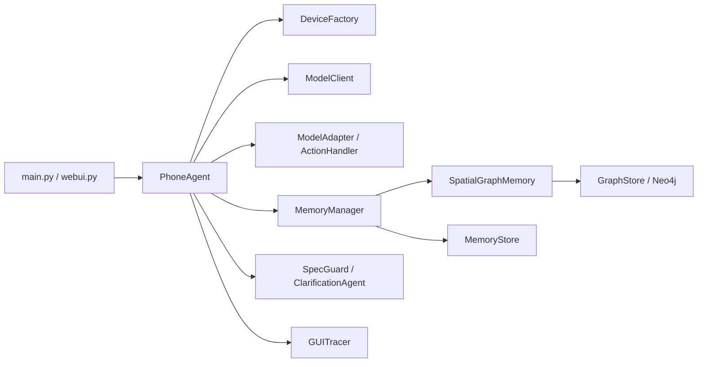
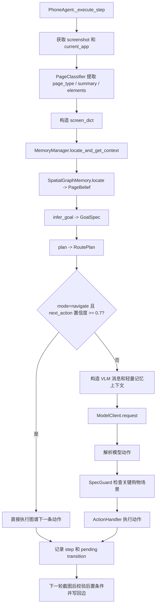
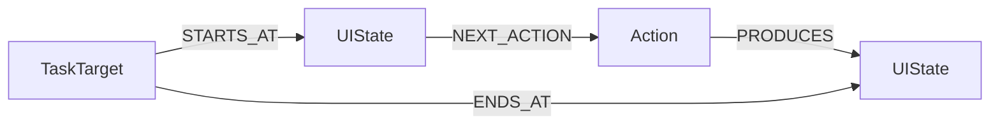

# Phone Agent 架构说明

本文档描述 `phone_agent` 当前实现。重点是两件事：

1. Agent 如何在真实设备上执行 `截图 -> 状态检索 -> 决策 -> 动作 -> 写回` 的闭环。
2. 空间图谱如何在不训练新 GUI/VLM 模型的前提下，为购物 Agent 提供页面定位、路线约束和纠错依据。

当前空间图谱不是一个独立替代 VLM 的导航器，也不是一份人工标注轨迹提示词。它位于 Agent 控制层：先把当前截图抽象成页面状态，再在 Neo4j 中定位页面、规划到目标页面的下一条边；有可信路线时直接驱动下一步动作，没有可信路线时让 VLM 继续基于截图探索。

## 1. 核心模块



| 模块 | 位置 | 当前职责 |
| --- | --- | --- |
| `PhoneAgent` | `phone_agent/agent.py` | 执行循环、截图、模型调用、动作执行、图谱 shortcut 分支 |
| `PageClassifier` | `phone_agent/memory/offline_explorer.py` | 从截图提取购物页面类型、页面摘要和元素语义 |
| `MemoryManager` | `phone_agent/memory/memory_manager.py` | 连接会话记忆与空间图谱，输出 `context_data` |
| `SpatialGraphMemory` | `phone_agent/memory/spatial_graph_memory.py` | 页面抽象、页面定位、目标推断、路径规划、修复判断 |
| `GraphStore` | `phone_agent/memory/graph_store.py` | Neo4j 适配器，读写 `UIState`、`Action`、`TaskTarget` |
| `ModelAdapter` | `phone_agent/model/adapters.py` | 适配 AutoGLM、UI-TARS、Qwen-VL、MAI-UI、GUI-Owl 的消息与输出格式 |
| `ActionHandler` | `phone_agent/actions/` | 解析动作并映射为 ADB、HDC、XCTest 操作 |
| `SpecGuard` | `phone_agent/agent.py` | 在 SKU、商品详情、结算等关键场景约束高风险动作 |

## 2. 当前执行闭环

`PhoneAgent.run(task)` 按步调用 `_execute_step()`。每一步都先观察，再决定图谱还是 VLM 接管动作。



### 2.1 一步执行的顺序

1. `DeviceFactory` 获取截图与当前 App。
2. 如果启用了 memory，Agent 对截图计算 `ui_hash`。
3. `PageClassifier` 尝试提取购物页面语义：
   - `page_type`
   - `summary`
   - `elements`
4. Agent 构造 `screen_dict`：

```python
{
    "ui_hash": ui_hash,
    "semantic_layout": f"{current_app} {page_type}",
    "app": current_app,
    "page_type": page_type,
    "summary": summary,
    "elements": elements,
}
```

5. `MemoryManager.locate_and_get_context()` 先调用空间图谱，再决定返回模式。
6. 如果返回 `navigate` 且下一动作置信度达到阈值，Agent 不请求 VLM，直接执行图谱给出的下一动作。
7. 否则进入普通 VLM 推理路径：
   - 适配器构造消息
   - 注入轻量进度、按需检索结果和关键场景提示
   - 模型输出动作
   - handler 解析并执行
8. 动作执行后，Agent 记录 step、trace 和 transition 的源页面信息。
9. 下一轮观察到新页面后，空间图谱把上一轮 `before -> action -> after` 写成边，并根据后置条件判断成功或失败。

### 2.2 当前三种空间模式

| 模式 | 产生条件 | 对执行的影响 |
| --- | --- | --- |
| `navigate` | 图谱已定位当前页面，并找到到目标页面的可信路径 | `PhoneAgent` 取路径第一条边直接执行 |
| `goal_reached` | 当前页面类型已经满足 `GoalSpec` | 停止继续规划空间边，避免从目标页被旧轨迹带走 |
| `explore` | 当前页未知、无可用边、路线不可信，路线被过滤，且兼容轨迹回退未接管 | 回退到 VLM 基于截图探索 |

`navigate` 是当前最强的图谱接管方式。它只执行路径第一条边，不一次性重放整条轨迹。下一步执行后必须重新截图、重新定位、重新规划。

`goal_reached` 的意义是空间停止条件。以任务“搜索商品并停在搜索结果页”为例，只要当前 `page_type=search_result` 已满足目标，规划器就不应继续沿历史边进入商品详情、SKU 或购物车。

## 3. 空间图谱的数据模型

### 3.1 页面节点 `PageState`

`SpatialGraphMemory` 不把一张截图 hash 直接当成页面。它先构造页面级抽象：

| 字段 | 含义 |
| --- | --- |
| `app` | App 名称，例如淘宝 |
| `page_type` | 页面类型，例如 `home`、`search_input`、`search_result`、`product_detail` |
| `summary` | 页面摘要 |
| `landmarks` | 稳定地标，例如搜索栏、底部导航、商品卡片 |
| `affordances` | 可操作能力，例如 `tap_search`、`open_product`、`choose_spec` |
| `slots` | 与页面或任务有关的槽位，例如 query、product、price |
| `risk_level` | 页面风险级别 |
| `semantic_signature` | 页面语义签名，用于 canonical 定位和去重 |

当前语义签名由 `app + page_type + landmarks + affordances + slots` 组成。导入离线探索数据时使用 semantic state id，运行时观察默认仍保留 observation id，再尝试回落到 canonical 图节点。

### 3.2 转移边 `TransitionEdge`

图谱边不只是 `A -> B`，还保存动作语义和执行统计：

| 字段 | 含义 |
| --- | --- |
| `action_type` | `Tap`、`Swipe`、`Back` 等动作类型 |
| `action_target` | 动作目标语义 |
| `action_params` | 可回放的动作参数 |
| `postcondition` | 预期目标页面类型 |
| `success_count` / `fail_count` | 执行成功与失败统计 |
| `risk` | 目标页面或动作风险 |
| `confidence` | 当前边置信度 |
| `rollback_action` | 偏航时可用的回退动作 |

边的 `weighted_cost` 当前由基础成本、失败率、风险惩罚和置信度共同决定。购物场景里，失败多、高风险、低置信的边会在规划中变贵。

### 3.3 Neo4j schema

当前 `GraphStore` 主要维护以下结构：



`UIState` 保存页面抽象。`Action` 保存动作描述和来源。`NEXT_ACTION`、`PRODUCES` 关系保存成功率、失败次数与置信度。

路径规划时 `get_outgoing_transitions()` 只返回同 App 的转移，避免不同 App 页面之间被旧数据串成假路线。

## 4. 图谱检索过程

空间检索不是“相似任务拿第一步动作”。当前主链路是页面定位后再规划。

### 4.1 从截图定位当前页面

`SpatialGraphMemory.locate(screen, task, previous_action)` 做以下工作：

1. 用当前 `screen_dict` 构造 runtime `PageState`。
2. 先用 `semantic_signature` 在 Neo4j 查精确页面：
   - `GraphStore.get_state_by_semantic()`
3. 精确匹配失败时，按 `app` 和 `page_type` 查候选页面：
   - `GraphStore.find_page_state_candidates()`
4. 用页面相似度重排候选：
   - App 一致性
   - 页面类型一致性
   - landmark 重叠
   - affordance 重叠
5. 相似度达到阈值时，把 canonical 图节点作为当前状态。
6. 返回 `PageBelief`，而不是只返回 screenshot hash。

当前 `PageBelief` 至少包含：

```python
{
    "current_state_id": "...",
    "confidence": 0.92,
    "is_novel": False,
    "candidates": [...]
}
```

这一步是空间感知的起点。Agent 不再只知道“当前截图看起来像什么”，还知道“当前观察更可能落在 App 图谱中的哪个页面节点”。

### 4.2 从任务推断空间目标

`GoalSpec.from_task()` 把自然语言任务转成页面目标。当前购物任务主要使用目标页面类型，例如：

| 用户意图 | 可能目标 |
| --- | --- |
| 搜索商品 | `search_result` |
| 查看详情 | `product_detail` |
| 加入购物车 | `cart` |
| 进入确认订单 | `checkout` |

当前实现会先切分正向目标子句，过滤“不要加购”“不要支付”这类否定约束，避免安全限制反过来变成规划目标。

### 4.3 在页面图上规划路线

`SpatialGraphMemory.plan(belief, goal_spec)` 以当前 `PageBelief.current_state_id` 为起点：

1. 如果当前页面类型已经满足目标，返回 `goal_reached`。
2. 从当前节点加载本地边和 Neo4j 边。
3. 限定路线在同一 App 内。
4. 用加权最短路寻找到目标页面类型的路径。
5. 每条候选边都经过 `_is_plausible_transition()` 过滤。

当前过滤器会拒绝明显不适合当空间 shortcut 的旧轨迹噪声，例如：

- 历史 `Type` 文本边。输入文本是任务槽位，不是可泛化的空间捷径。
- 从搜索结果页直接到购物车、结算、支付的可疑边。
- 动作语义与 SKU、购物车、结算、支付目标不匹配的边。

规划器只把路径第一条边暴露为 `RoutePlan.next_action`。这比整条轨迹重放更稳，因为移动 App 页面会被弹窗、登录、推荐流和活动页扰动。

### 4.4 兼容的任务轨迹回退

`locate_and_get_context()` 仍保留旧任务图谱的兼容逻辑。空间路径没有返回 `navigate` 或 `goal_reached` 时，它还会查询 `TaskTarget`：

1. `GraphStore.find_similar_tasks()` 优先通过 `TaskIndex` 做相似任务召回，失败时退回 n-gram 匹配。
2. 相似度达到高阈值时，旧逻辑仍可能把历史轨迹第一步动作作为 `next_actions` 返回。
3. 相似度处于参考区间时，历史轨迹会被压缩为文本上下文，而不是直接执行。

这条链路是兼容层，不是空间图谱主链路。当前研究和工程优化重点应放在 `PageBelief -> GoalSpec -> RoutePlan`，逐步降低对“相似任务第一步复用”的依赖。

## 5. 图谱如何赋予 Agent 空间感知

### 5.1 空间感知不来自额外训练

当前做法没有训练新模型。空间能力来自运行时结构化中间层：

```text
当前截图
  -> 页面抽象 PageState
  -> 页面定位 PageBelief
  -> 任务目标 GoalSpec
  -> 路线 RoutePlan
  -> 下一步动作或探索回退
```

VLM 仍负责视觉理解和无路线时的探索。图谱负责回答三个空间问题：

1. 我现在大概率在哪个页面？
2. 这个任务应该去哪个页面类型？
3. 当前图中是否存在一条可信、低风险的下一步边？

### 5.2 当前传递通道

| 通道 | 传递内容 | 当前消费者 | 作用 |
| --- | --- | --- | --- |
| `context_data["current_state_id"]` 和 `belief` | 当前页面定位结果 | `MemoryManager`、`PhoneAgent` | 建立当前空间坐标 |
| `context_data["route_plan"]` | 目标、路线、风险、候选边 | `MemoryManager` | 保存规划证据 |
| `context_data["next_actions"]` | 路径第一条动作及后置条件 | `PhoneAgent` | 在 `navigate` 模式直接执行 |
| `semantic_context` 中的 `[SpatialGraph]` 摘要 | 当前页、路线、修复提示 | clarification 和上下文消费者 | 形成可读空间说明 |

`RoutePlan.next_action` 是目前最直接的空间传递方式。它把图谱中的动作模板变成 Agent 可执行动作，并附带预期后置条件：

```python
{
    "type": "Tap",
    "target": "search bar",
    "target_desc": "...",
    "confidence": 0.91,
    "postcondition": "search_input",
}
```

`PhoneAgent` 在 `navigate` 分支把它转换为真实动作，执行后等待下一轮观察校验结果。也就是说，空间图谱不是给 VLM 一段长轨迹让它模仿，而是给执行器一条“此刻在哪、下一步往哪走”的受约束边。

### 5.3 当前实现边界

需要区分“图谱已经参与执行”与“VLM 已经完整读取空间地图”：

- 当前高置信路线会被 Agent 直接执行，这是已打通的空间控制通道。
- `SpatialGraphMemory.context_summary()` 已生成 `[SpatialGraph]`、`[SpatialGraph Route]`、`[SpatialGraph Repair]` 摘要，并放入 `context_data["semantic_context"]`。
- 普通 explore 路径下，`_execute_step()` 的每轮 VLM prompt 主要仍注入截图、任务、轻量进度和关键场景提示；空间摘要还没有稳定成为每轮 VLM prompt 的显式地图段。

因此当前系统更准确的定义是：**图谱先赋予 Agent 控制层空间认知，再在必要时让 VLM 继续视觉探索**。如果后续目标是让 VLM 在无 shortcut 时也显式利用地图，应继续打通空间摘要的 prompt 注入和基于图谱的反思提示。

## 6. 执行后写回与纠错

图谱写回是延迟一拍完成的。

1. 当前动作执行后，`MemoryManager.update_state_and_transition()` 暂存：
   - 动作前页面
   - 当前动作
   - 预期后置条件
2. 下一轮截图定位到新页面后，`locate_and_get_context()` 比较实际页面与预期后置条件。
3. `SpatialGraphMemory.repair()` 给出修复决策：
   - `retry`
   - `rollback`
   - `replan`
   - `ask_user`
   - `fallback_to_vlm`
4. `record_observation()` 把成功或失败边写回本地 edge cache 和 Neo4j。

高风险页面会更保守。例如登录、地址、结算、支付相关页面一旦和预期不符，修复器优先返回 `ask_user`，而不是盲目继续推进。

## 7. 离线数据和在线数据

空间图谱目前有三类来源：

| 来源 | 入口 | 价值 | 风险 |
| --- | --- | --- | --- |
| 人工轨迹 | `manual_trajectory_importer.py` | 动作更接近真实任务路线 | 旧 schema 可能把任务槽位和空间边混在一起 |
| 自动探索 | `offline_explorer.py`、`import_exploration.py` | 覆盖页面和局部转移 | 弹窗、滚动、噪声页面容易扩张 |
| 在线执行 | `record_observation()` | 能根据真实成功/失败更新边 | 需要控制页面合并和写入膨胀 |

`rebuild_spatial_graph.py` 用于把人工轨迹与离线探索产物重建到新的空间图谱中。重建和在线写入都应优先合并页面抽象，避免把每一张推荐流截图都扩成永久节点。

## 8. 设备、模型和动作边界

### 8.1 设备抽象

`DeviceFactory` 屏蔽设备差异：

- Android 使用 ADB
- HarmonyOS 使用 HDC
- iOS 使用 XCTest / WebDriverAgent

Agent 的上层循环只关心截图、当前 App、点击、滑动、输入、返回、启动 App 等操作。

### 8.2 模型适配

当前模型通过 adapter 和 handler 解耦：

| 模型族 | 主要适配点 |
| --- | --- |
| AutoGLM | 通用 `do(...)` / `finish(...)` 解析 |
| UI-TARS | Thought / Action 文本和专用坐标格式 |
| Qwen-VL | tool call JSON 与重建式消息历史 |
| MAI-UI | thinking 与 tool call 混合格式 |
| GUI-Owl | 单图和专用 action 历史 |

空间图谱不依赖某一个 VLM 的训练格式。它只要求 Agent 能把图谱动作恢复成当前 handler 可以执行的动作字典。

## 9. 当前能力与下一步

### 9.1 已具备

- 页面级 `PageState` 抽象，不再只依赖截图 hash。
- Neo4j 页面定位和同 App 路线加载。
- `GoalSpec` 目标页面推断与否定约束过滤。
- 风险感知加权最短路和边 plausibility 过滤。
- 高置信路线第一步 direct navigation。
- 当前页目标满足时 `goal_reached` 停止继续规划。
- 执行后成功边、失败边和修复提示写回。

### 9.2 仍需补强

- 在线页面合并与图谱膨胀控制。
- 人工轨迹、自动探索、在线执行边的来源质量分层。
- 将空间摘要更稳定地注入 explore 路径的 VLM 推理上下文。
- 把失败统计、回退边和重规划做成更完整的购物任务闭环。
- 对搜索、商品详情、SKU、购物车、结算前确认等核心空间链路做持续真机评估。

这套架构的目标不是让 Agent 记住某一次淘宝轨迹，而是让它在高干扰 App 中逐步形成可定位、可规划、可纠错的页面空间认知。
