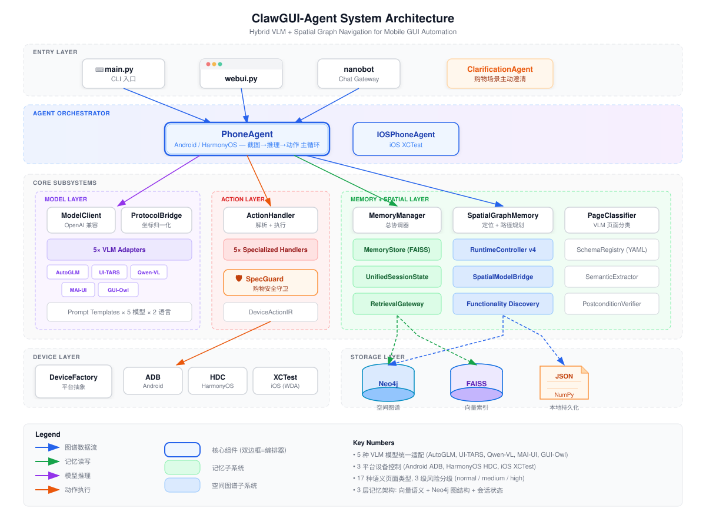
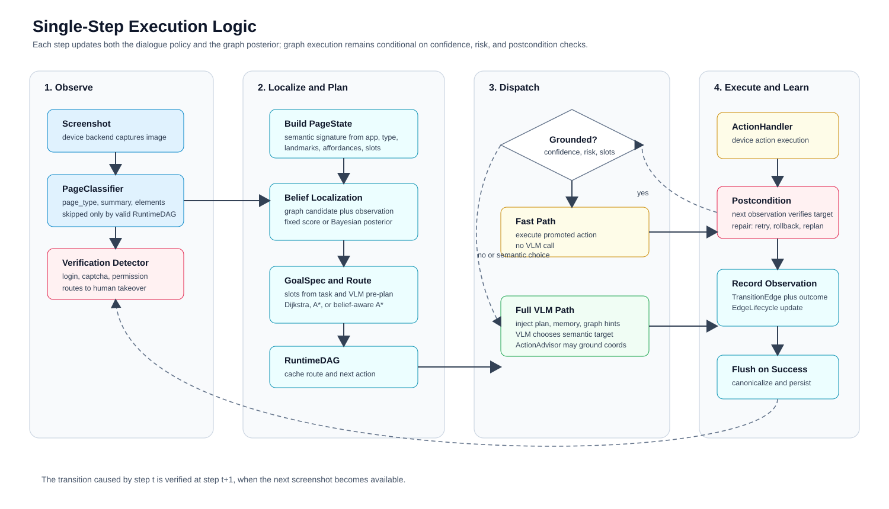
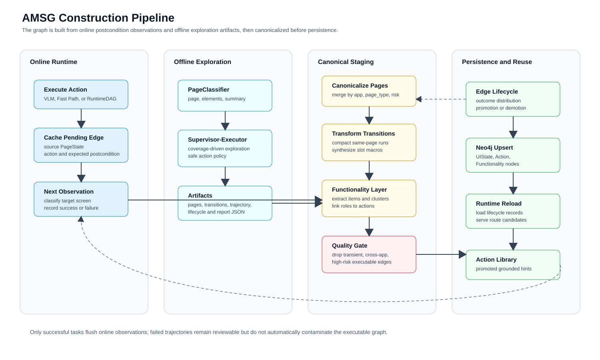
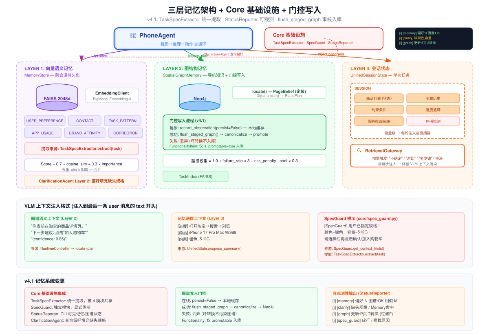

# ClawGUI-Agent 系统架构

> **版本**: v4.1 (AMSG Runtime)  
> **更新**: 2026-05-28

---

## 1. 要解决什么问题

当前 Mobile GUI Agent 的核心瓶颈：

| 瓶颈 | 我们的方案 |
|------|-----------|
| **每步都依赖 VLM**，延迟高、成本大 | 空间图谱导航：已知路径跳过 VLM，毫秒级执行 |
| **跨会话记忆缺失**，每次从零开始 | 三层记忆架构：向量语义 + 图结构 + 会话状态 |
| **购物操作不可逆**，误下单/选错规格 | ClarificationAgent（任务前补全）+ SpecGuard（提交前校验）|

核心理念——**质量可控的自进化闭环**：

```
传统: 截图 → VLM → 动作 → 截图 → VLM → 动作 → ...（每步依赖 VLM）

我们: 截图 → 图谱定位 ─┬→ 已知路径 → 图谱导航 → 直接执行（跳过 VLM）
                       └→ 未知场景 → VLM → 执行 → 本地暂存（成功后审核入库）
```

---

## 2. 系统架构



系统分 6 层，核心模块：

| 层 | 关键模块 | 一句话职责 |
|----|---------|----------|
| Agent 编排 | PhoneAgent, ClarificationAgent | 主循环编排 + 任务前意图补全 |
| Core 基础设施 | TaskSpecExtractor, SpecGuard, StatusReporter | 统一提取 + 购物安全 + 可观测性 |
| 模型 | 5× VLM Adapters, ProtocolBridge | 多模型适配 + 坐标归一化 |
| 记忆 | MemoryStore, SpatialGraphMemory, UnifiedState | 偏好/图谱/会话三层记忆 |
| 空间图谱 | RuntimeController, FunctionalityDiscovery | 路由决策 + 功能发现 |
| 设备 | DeviceFactory (ADB/HDC/XCTest) | Android + HarmonyOS + iOS 三平台 |

---

## 3. Agent 主流程



Agent 每步执行遵循 **感知 → 定位 → 路由 → 执行 → 记录** 的循环：

1. **ClarificationAgent**（首步）：三层短路检测任务歧义——规则提取 → Memory 偏好填充 → VLM 兜底。非购物任务 0ms 跳过。
2. **感知**：截图 → PageClassifier 分类页面类型
3. **定位**：SpatialGraphMemory.locate() 在图谱中定位当前页面
4. **路由**：RuntimeController 根据置信度和风险分级决定三种模式
   - **Navigate**：图谱有高置信度路径 → 跳过 VLM，直接执行
   - **Explore**：未知场景 → VLM 推理，同时本地暂存观测
   - **Verify**：高风险页面（支付/结算）→ 即使有路径也强制 VLM + SpecGuard 验证
5. **记录**：`record_observation(persist=False)` 仅写本地缓存；任务成功后 `flush_staged_graph()` 经去重和过滤才入库

---

## 4. 空间图谱 (AMSG)



AMSG 是一个**语义级的应用导航图谱**——节点是页面状态（home, search_result, product_detail...），边是转换动作（tap_search, add_to_cart...），工作在功能语义层而非像素层。

**建图管线**：截图 → PageClassifier 分类 → 语义提取（landmarks, affordances, slots）→ 节点去重 → 边构建 → 功能发现

**图谱质量门控**（v4.1 关键改进）：

| 写入路径 | 策略 | 门控 |
|---------|------|------|
| 在线执行 | 每步 `persist=False` → 仅本地缓存 | 不直接写 Neo4j |
| 任务成功 | `flush_staged_graph()` → canonicalize → promote | 去重 + 质量过滤 |
| 任务失败 | 丢弃 | 坏转换不入库 |

**功能发现过滤**：只有可操作功能（`open_search`, `add_to_cart`）入库，瞬态数据（具体价格 `¥8999`、商品标题）不入库。

---

## 5. 全局记忆系统



三层架构，各解决不同问题：

| 层 | 存储 | 内容 | 生命周期 |
|----|------|------|---------|
| **向量语义** | FAISS 2048d | 用户偏好、联系人、任务模式 | 跨会话持久化 |
| **图结构** | Neo4j (AMSG) | 页面状态、转换路径、功能簇 | 持久化（门控写入）|
| **会话状态** | 内存 | 商品列表、步骤历史、约束 | 单次任务 |

关键设计决策：
- **按需检索**（RetrievalGateway）：不是每步都注入记忆，只在 VLM 表现出不确定（"忘记了"、"对比"）或停滞时触发
- **ClarificationAgent 接入 Memory**：规格缺失时先查偏好（"用户上次买 512G"），有命中就不打断用户
- **可观测性**（StatusReporter）：CLI 可见记忆系统状态——偏好数量、Neo4j 连接、相似任务命中

---

## 6. ClarificationAgent + SpecGuard 双层购物安全

两者共享 `TaskSpecExtractor` 提取基础设施，但职责互补：

| | ClarificationAgent | SpecGuard |
|--|---|---|
| **时机** | 任务开始前 | 购买提交前 |
| **目的** | 补全缺失信息 → 提高规划精度 | 校验 SKU 匹配 → 防止误操作 |
| **手段** | 规则 → Memory → VLM（三层短路）| 从 task + VLM plan 提取规格 → 与页面选择比对 |
| **结果** | 重组任务文本 | 放行 / Interact 拦截 |

**TaskSpecExtractor** 统一了此前分散在 4 处的规格提取逻辑（color/storage/size/query/contact/app），被 ClarificationAgent、SpecGuard、GoalSpec、MemoryManager 共享。

---

## 7. 创新点总结

| # | 创新 | 解决的问题 |
|---|------|----------|
| 1 | **VLM + 图谱混合导航** | 已知路径零 VLM 推理，延迟从秒级降至毫秒级 |
| 2 | **质量门控的在线图谱进化** | 解决无门控写入导致的节点污染（70 个 unknown 节点 → 去重后 7 个）|
| 3 | **语义级页面表示** | (landmarks, affordances, slots) 三元组，UI 改版后仍有效 |
| 4 | **功能发现 + Promotability** | 自动发现页面功能，瞬态数据不入库（53 → 9 个有效功能节点）|
| 5 | **三层记忆 + 按需检索** | 不全量注入，只在 VLM 不确定时触发，降低上下文污染 |
| 6 | **双层购物安全** | ClarificationAgent（前）+ SpecGuard（后），共享提取基础设施 |

### 与现有工作对比

| 维度 | AppAgent / CogAgent | GUI-TARS | **ClawGUI-Agent** |
|------|-------|---------|---|
| 每步推理 | 必须 VLM | 必须 VLM | **可选**（图谱跳过）|
| 跨会话学习 | 无 | 无 | **三层记忆** |
| 安全机制 | 无 | 无 | **双层防护** |
| 图谱质量 | N/A | N/A | **门控写入 + 过滤** |
| 多模型 | 单模型 | 单模型 | **5 种 VLM** |
| 多平台 | 单平台 | Android | **Android + HarmonyOS + iOS** |

### 值得深挖的方向

1. **图谱预训练**：大规模 App 截图预训练通用 AMSG
2. **自适应置信度**：根据用户风险容忍度动态调节 Navigate 阈值
3. **图谱压缩**：保持导航质量前提下的图谱蒸馏
4. **VLM 微调反馈环**：图谱成功/失败统计作为 RLHF 信号
5. **离线-在线融合**：OfflineExplorer 预探索与在线增量更新的优雅融合
