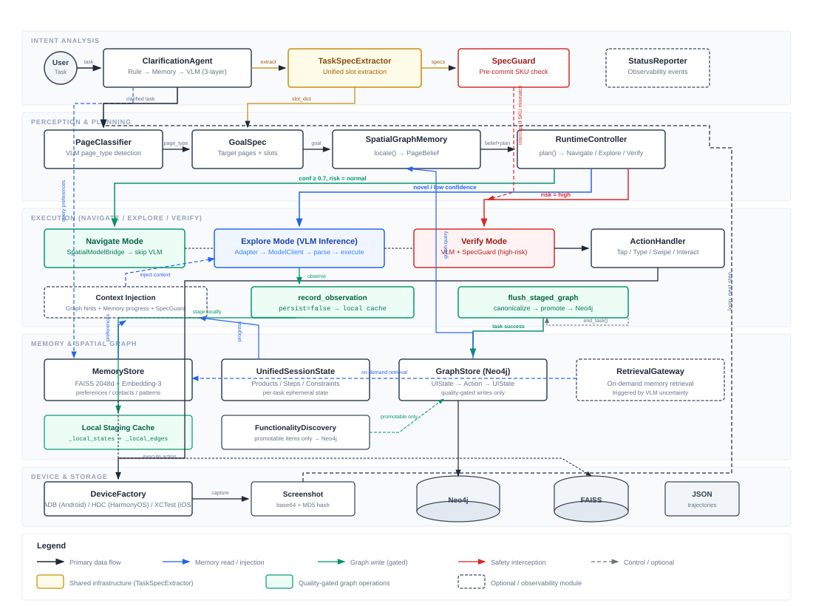

# ClawGUI-Agent 系统架构文档

> **版本**: v4.1 (AMSG Runtime + Unified Core)  
> **最后更新**: 2026-05-28  
> **适用读者**: 不熟悉本项目的研究者、开发者

---

## 目录

1. [项目定位与研究贡献](#1-项目定位与研究贡献)
2. [系统架构总览](#2-系统架构总览)
3. [核心模块设计](#3-核心模块设计)
4. [Agent 主流程](#4-agent-主流程)
5. [空间图谱 (AMSG) 建图管线](#5-空间图谱-amsg-建图管线)
6. [全局记忆系统](#6-全局记忆系统)
7. [运行时协作：Agent × 空间图谱 × 记忆](#7-运行时协作agent--空间图谱--记忆)
8. [创新点与研究价值](#8-创新点与研究价值)

---

## 1. 项目定位与研究贡献

### 1.1 解决的问题

当前 Mobile GUI Agent 研究面临三个核心瓶颈：

| 瓶颈 | 具体表现 | ClawGUI-Agent 的应对 |
|------|---------|---------------------|
| **VLM 推理成本高** | 每一步都需要截图→VLM→动作，单任务 10-50 步，延迟和费用不可忽视 | 空间图谱导航模式：已知路径直接跳过 VLM，0 推理成本执行 |
| **跨会话记忆缺失** | 每次任务从零开始，不学习用户偏好，不复用已探索路径 | 三层记忆架构：向量语义记忆 + Neo4j 图记忆 + 会话状态 |
| **购物安全风险** | Agent 可能误操作付款、下单错误规格 | SpecGuard + ClarificationAgent 双层防护 + 风险分级 |

### 1.2 核心理念

```
传统 Agent:   截图 → VLM推理 → 动作 → 截图 → VLM推理 → 动作 → ...（每步都依赖VLM）

ClawGUI-Agent: 截图 → 图谱定位 ─┬→ [已知路径] → 图谱导航 → 直接执行（跳过VLM）
                               └→ [未知场景] → VLM推理 → 执行 → 本地暂存观测（任务结束后审核入库）
```

这构成了一个**质量可控的自进化闭环**：Agent 执行时收集观测，任务成功后经过去重和质量过滤才写入图谱。

---

## 2. 系统架构总览

### 2.1 架构图



> 补充参考：[分层模块视图](docs/architecture-system-overview.svg)

### 2.2 模块文件映射

| 层级 | 路径 | 核心文件 |
|------|------|---------|
| Agent 编排 | `phone_agent/` | `agent.py`, `agent_ios.py`, `clarify.py`, `device_factory.py` |
| **Core 基础设施** | `phone_agent/core/` | **`task_spec.py`** (统一槽位提取), **`spec_guard.py`** (购物安全), **`status.py`** (可观测性) |
| 模型层 | `phone_agent/model/` | `adapters.py`, `client.py`, `protocol_bridge.py` |
| 动作层 | `phone_agent/actions/` | `handler.py` + 4 个特化 handler |
| 记忆层 | `phone_agent/memory/` | `memory_manager.py`, `graph_store.py`, `spatial_graph_memory.py` |
| 空间层 | `phone_agent/spatial/` | `runtime_controller.py`, `core.py`, `functionality.py` 等 19 模块 |
| 设备层 | `phone_agent/{adb,hdc,xctest}/` | 各含 `connection.py`, `device.py`, `input.py`, `screenshot.py` |
| 配置层 | `phone_agent/config/` | 提示词模板 × 5 模型 × 2 语言，购物配置，应用映射 |

---

## 3. 核心模块设计

### 3.1 Core 基础设施层 (`phone_agent/core/`)

v4.1 新增的基础设施层，为 Agent 编排、记忆系统、空间图谱提供共享能力。**无外部依赖，位于依赖图的叶子层**。

```
core/task_spec.py      ← 无依赖
core/spec_guard.py     ← 依赖 core/task_spec
core/status.py         ← 无依赖
```

#### 3.1.1 TaskSpecExtractor — 统一槽位提取

**解决的问题**：规格/槽位提取逻辑此前分散在 4 处（agent.py、spatial_graph_memory.py、memory_manager.py、clarify.py），正则模式不同、命名不统一（中文 vs 英文）、覆盖范围不一致。

**设计**：

```python
@dataclass(frozen=True)
class TaskSlots:
    query: str = ""        # 搜索关键词
    product: str = ""      # 商品名
    price: str = ""        # 价格
    color: str = ""        # 颜色 (24 种)
    storage: str = ""      # 容量 (TB/GB/G)
    size: str = ""         # 尺码 (S~XXXL)
    contact: str = ""      # 联系人
    app: str = ""          # 应用名
    domain: str = "general"  # shopping / food_delivery / general

    spec_dict → dict[str, str]   # 中文键 {"颜色": "银色"}，兼容 SpecGuard
    slot_dict → dict[str, str]   # 英文键 {"color": "银色"}，兼容 GoalSpec
    missing_shopping_specs → list[str]  # 缺失的购物规格
```

**消费者**：

| 模块 | 使用方式 |
|------|---------|
| ClarificationAgent | `extract(task)` → 判断是否需要澄清 + 识别缺失规格 |
| SpecGuard | `extract(task).spec_dict` → 提交前校验规格匹配 |
| GoalSpec | `extract(task).slot_dict` → 空间图谱路径规划 |
| MemoryManager | `extract(task)` → 偏好/联系人/应用自动提取 |

#### 3.1.2 SpecGuard — 购物安全守卫

**设计初衷**：在购买提交前（add_to_cart、checkout、payment）添加最后一道防线，校验用户期望的 SKU 是否与当前页面选择一致。

**从 agent.py 提取为独立模块**（原 ~310 行内联代码），接口显式传参，不再穿透 PhoneAgent 内部状态：

```python
class SpecGuard:
    def get_context_hints(current_app, page_type, task, vlm_plan) -> list[str]
        """购物关键页面注入 VLM 提示"""

    def check(action, thinking, current_app, page_type, task, vlm_plan) -> dict | None
        """提交前安全校验，返回修改后的 Interact action 或 None（放行）"""
```

**与 ClarificationAgent 的协作**：两者共享 `TaskSpecExtractor` 提取规格，但职责互补：
- ClarificationAgent：**任务开始前**补全缺失信息，提高 VLM 规划精度
- SpecGuard：**购买提交前**校验已选规格，防止误操作

#### 3.1.3 StatusReporter — 可观测性

**解决的问题**：记忆系统、图谱连接、澄清决策此前是黑盒——CLI 用户无法判断子系统是否可用。

```python
class StatusReporter:
    def emit(source: str, level: str, message: str, **details) -> None
```

**关键输出点**：

```
[i] [memory] 记忆系统就绪 | 偏好: 3条 | 图谱: Neo4j 已连接 | 相似任务: 2条
[i] [clarify] 检测到购物任务 | 缺失: 颜色, 容量 | Memory 命中: 容量=512G (历史偏好)
[*] [clarify] 仍缺 颜色 → 向用户询问
[i] [graph]   图谱更新: 6 页面, 8 转换 (过滤 3)
[i] [spec_guard] 规格选择页 | 用户要求: 银色+512G | 当前选中: ✓ 匹配 → 放行
```

### 3.2 ClarificationAgent — 任务意图补全

**设计初衷**：用户提出模糊请求（"买个 iPhone"缺颜色容量）时，主动向用户补充信息。补全后的任务文本影响下游所有环节——GoalSpec 槽位更准确、图谱路由更精确、VLM 规划更高效。

**三层短路设计**：

```
任务文本 "在京东买个 iPhone 17 Pro Max"
  │
  ├→ Layer 1: TaskSpecExtractor.extract(task)          ← 规则 (0ms)
  │   domain=shopping, query="iPhone 17 Pro Max"
  │   缺失: 颜色, 容量, 尺码
  │   → 非购物任务? → 直接返回 CLEAR
  │   → 规格齐全? → 直接返回 CLEAR
  │
  ├→ Layer 2: Memory 偏好查询                            ← 历史偏好
  │   检查 user_preferences 是否能填充缺失槽位
  │   → "容量=512G" 来自历史偏好 → 填充
  │   → 所有缺失填满? → 返回 CLEAR + 偏好注入任务文本
  │
  └→ Layer 3: VLM 歧义检测                              ← 仅购物+仍有缺失
      _detect_ambiguity() → CLARIFY: "请问您想要什么颜色？"
      → 通过 clarification_callback 询问用户
      → _reconstruct_task() → "在京东买 iPhone 17 Pro Max 银色 512G，加入购物车"
```

**相比旧版的改进**：
- 非购物任务（"打开计算器"）不再浪费 VLM 调用
- Memory 偏好主动参与消歧，减少不必要的用户打断
- `skip_reason` 字段提供决策可观测性

### 3.3 Model Layer — 多模型适配

系统支持 5 种 VLM，通过 **Adapter Pattern** 统一接口：

```
           ┌─── AutoGLMAdapter ─── [0, 1000] 归一化坐标
           │
           ├─── UITarsAdapter ──── smart_resize 像素空间
           │
ModelType ─┤─── QwenVLAdapter ──── [0, 999] 归一化 + tool_call JSON
           │
           ├─── MAIUIAdapter ───── [0, 999] + <thinking> 嵌套
           │
           └─── GUIOwlAdapter ──── [0, 999] + 文本操作历史
```

**ProtocolBridge** 将所有模型的原生坐标统一为 `DeviceActionIR`，坐标转换路径：**模型原生空间 → DeviceActionIR → absolute 像素 → 设备执行**。

| 消息构建策略 | 模型 | 特征 |
|------------|------|------|
| 累积式 | AutoGLM | 保留完整对话历史，含多张截图 |
| 窗口式 | Qwen-VL, GUI-Owl | 每次重建，只含当前截图 + 文本操作历史 |
| 混合式 | MAI-UI, UI-TARS | 保留历史但限制图片数 (3/5 张) |

### 3.4 Device Layer — 三平台抽象

`DeviceFactory` 通过工厂模式统一三个平台的设备控制接口：

| 平台 | 后端 | 连接方式 | 截图 | 输入 |
|------|------|---------|------|------|
| Android | ADB | USB/TCP | `screencap` | `input tap/swipe/text` |
| HarmonyOS | HDC | USB | `snapshot` | `uitest click/swipe` |
| iOS | XCTest | WebDriverAgent HTTP | WDA `/screenshot` | WDA `/tap`, `/swipe` |

---

## 4. Agent 主流程

### 4.1 完整执行循环


### 4.2 关键数据流

```
截图 (bytes)
  │
  ├─→ base64 编码 → VLM 输入
  │
  ├─→ MD5 哈希 → state_id (去重键)
  │
  └─→ PageClassifier → page_type + summary
                          │
                          ├─→ ScreenSemanticsExtractor → PageNode
                          │     (landmarks, affordances, slots, risk)
                          │
                          ├─→ SpatialGraphMemory.locate() → PageBelief
                          │     (当前在图谱中的位置)
                          │
                          └─→ SpatialGraphMemory.plan() → RoutePlan
                                (到目标的最短路径)
```

---

## 5. 空间图谱 (AMSG) 建图管线

### 5.1 AMSG (Active Mobile Spatial Graph) 概述

AMSG 是一个**语义级的应用导航图谱**，节点是页面状态，边是页面间的转换动作。与 UI 元素树不同，AMSG 工作在**功能语义层**，关注的是"这个页面能做什么"而非"页面上有哪些像素"。

```
                    AMSG 图谱示例 (淘宝)
                    
    ┌──────────┐  tap_search  ┌──────────────┐
    │   home   │────────────→│ search_input  │
    │ 首页推荐流 │             │ 搜索输入页     │
    └──────────┘             └──────┬───────┘
                                   │ type <query> + submit
                                   ▼
    ┌──────────────┐  tap_product ┌──────────────┐
    │search_result │────────────→│product_detail│
    │ 搜索结果列表  │             │ 商品详情页     │
    └──────────────┘             └──────┬───────┘
                                       │ tap_spec / add_to_cart
                                       ▼
    ┌────────────────┐  confirm  ┌──────────┐
    │spec_selection  │─────────→│   cart    │
    │ 规格选择弹窗    │           │ 购物车     │
    └────────────────┘           └──────────┘
    
    每个节点: PageNode(app, page_type, landmarks, affordances, slots, risk)
    每条边:   AffordanceEdge(intent, semantic_target, confidence, cost)
```

### 5.2 图谱数据结构

**PageNode (节点)**:
```python
@dataclass
class PageNode:
    node_id: str                    # 稳定标识符 (hash)
    app: str                        # 应用名 (taobao, jd, ...)
    domain: str                     # 领域 (shopping, utility, ...)
    page_type: str                  # 语义页面类型 (17 种)
    summary: str                    # 人类可读描述
    landmarks: tuple[str, ...]      # 关键 UI 要素 (搜索框, 商品卡片, ...)
    affordances: tuple[str, ...]    # 可用操作 (tap_search, add_to_cart, ...)
    slots: dict[str, str]           # 动态值 (query, product, price, color, ...)
    risk_level: str                 # normal / medium / high
    semantic_signature: str         # 语义指纹 (用于去重)
```

**风险分级**:

| Risk Level | 页面类型 | 策略 |
|-----------|---------|------|
| `high` | checkout, payment, address, login | 即使图谱有路径也必须 VLM 验证 |
| `medium` | spec_selection, cart, order_list | 图谱导航 + 降低置信度阈值 |
| `normal` | home, search_result, product_detail | 图谱导航可直接执行 |

### 5.3 建图管线 (5 阶段)


### 5.4 在线与离线写入的质量门控

**v4.1 关键变更**：在线执行不再直接写入 Neo4j。

| 路径 | 触发时机 | 写入策略 | 质量门控 |
|------|---------|---------|---------|
| **离线探索** (OfflineExplorer) | 人工触发的预探索 | canonicalize → promote → Neo4j | ✅ 去重 + 边过滤 + 质量报告 |
| **在线执行** (agent.py run) | 每步 record_observation | **本地暂存** (`_local_states` / `_local_edges`) | ✅ 不写 Neo4j |
| **任务结束提交** (end_task) | 成功任务结束时 | `flush_staged_graph()` → canonicalize → promote → Neo4j | ✅ 去重 + 边过滤 |
| **手动导入** (ManualTrajectoryImporter) | 审核后的轨迹导入 | `persist=True` 直接写入 | ✅ 人工审核 |

**`record_observation(persist=False)` 机制**：

```
每步执行 → record_observation(persist=False)
           │
           ├→ _local_states[state_id] = PageState    ← 仅内存
           └→ _local_edges[source_id].append(edge)   ← 仅内存

任务成功 → end_task(success=True)
           │
           └→ flush_staged_graph()
               │
               ├→ canonicalize_state_graph()     ← 合并语义重复节点
               ├→ promote_staging_to_canonical() ← 边质量过滤 + 去重
               └→ graph_store 写入 Neo4j          ← 审核后持久化

任务失败 → end_task(success=False)
           └→ 不写入图谱（避免坏转换污染）
```

**解决的问题**：此前 `record_observation()` 每步直接写入 Neo4j，VLM 提取的 landmarks/affordances 微小差异导致同一语义页面产生大量变体节点（如淘宝首页出现 70 个 `unknown` 类型节点），图谱快速膨胀。

### 5.5 功能发现与过滤

FunctionalityExtractor 从页面元素和转换动作中发现可操作功能项。v4.1 在 Neo4j 持久化层增加了 `is_promotable` 过滤：

| 类型 | `is_promotable` | 示例 | 持久化到 Neo4j |
|------|-----------------|------|----------------|
| **功能项** (functionality) | `True` | `open_search`, `confirm_spec_add_to_cart` | ✅ |
| **数据项** (data) | `False` | 具体价格 `¥8999`、商品标题、店铺名 | ❌ 不写入 |

**解决的问题**：此前所有 FunctionalityItem（包括 `price`、`product_title`、`shop_name` 等瞬态数据）都写入 Neo4j，导致 53 个功能节点中 38 个是无用的数据项。过滤后仅保留有导航复用价值的操作类功能。

### 5.6 Neo4j 存储模型

```
(:UIState) -[:NEXT_ACTION {confidence, frequency, fail_count}]-> (:Action)
(:Action)  -[:PRODUCES {success_rate}]-> (:UIState)

(:TaskTarget) -[:STARTS_AT]-> (:UIState)
(:TaskTarget) -[:ENDS_AT]->   (:UIState)

(:UIState) -[:EXPOSES_FUNCTION]-> (:FunctionalityItem)   ← 仅 is_promotable=true
(:Action)  -[:IMPLEMENTS_FUNCTION]-> (:FunctionalityCluster)
(:FunctionalityCluster) -[:LEADS_TO]-> (:UIState)
```

### 5.7 Schema 注册表

`spatial/schemas/` 下的 YAML 文件定义了领域知识先验：

```yaml
# shopping.yaml 示例
page_types:
  product_detail:
    risk: normal
    landmarks: [商品名, 价格, 图片, 评价数]
    affordances: [open_product, add_to_cart, open_spec]
    aliases: [detail, item, product]

transitions:
  - source: product_detail
    target: spec_selection
    intent: open_spec
    affordance: 规格选择
    risk: normal
```

---

## 6. 全局记忆系统

### 6.1 三层记忆架构


### 6.2 记忆类型

| 类型 | 枚举值 | 示例 | 来源 |
|------|--------|------|------|
| 用户偏好 | `USER_PREFERENCE` | "用户偏好自提而非快递" | 自动提取/用户纠正 |
| 联系人 | `CONTACT` | "张三: 微信好友" | 任务文本提取 (TaskSpecExtractor) |
| 任务模式 | `TASK_PATTERN` | "买手机常搜索淘宝再比价京东" | 历史轨迹学习 |
| 应用习惯 | `APP_USAGE` | "常用应用: 淘宝" | 操作统计 (TaskSpecExtractor) |
| 任务历史 | `TASK_HISTORY` | "在淘宝买了 iPhone, 10步完成" | 任务结束记录 |
| 用户纠正 | `USER_CORRECTION` | "用户说不要选默认地址" | Interact 反馈 |
| 品牌亲和 | `BRAND_AFFINITY` | "用户偏好 Apple 产品" | 长期行为分析 |

### 6.3 RetrievalGateway — 按需检索

不是每一步都注入记忆。RetrievalGateway 监听 VLM 的 thinking 输出，只在检测到以下信号时触发：

| 信号类型 | 触发词 | 检索动作 |
|---------|--------|---------|
| 不确定 | "不确定", "忘记了", "记不清" | 查找相关记忆上下文 |
| 对比 | "对比", "比较", "哪个更便宜" | 格式化已浏览商品价格表 |
| 计算 | "总共", "合计", "多少钱" | 汇总购物车金额 |
| 回溯 | "前面那个", "之前的", "价格是多少" | 检索最近步骤 + 相关商品 |
| 停滞 | 同一页面连续3步相同动作 | 注入近期步骤 + 替代方案 |

### 6.4 记忆生命周期

```
任务开始 → MemoryManager.start_task()
  │
  ├→ 检索相似历史任务 (FAISS + Neo4j)
  ├→ 加载用户偏好记忆
  ├→ 初始化 UnifiedSessionState
  ├→ [StatusReporter] 输出系统就绪状态                   ← v4.1 新增
  │
  ▼
ClarificationAgent.check_and_clarify()                  ← v4.1 重构
  │
  ├→ Layer 1: TaskSpecExtractor 规则提取 (0ms)
  ├→ Layer 2: Memory 偏好填充缺失规格
  └→ Layer 3: VLM 歧义检测 (仅购物+仍有缺失)
  │
  ▼
每一步执行
  │
  ├→ 自动提取记忆 (从 thinking 和 action)
  ├→ record_step() → 更新会话状态
  ├→ RetrievalGateway 检查 → 按需注入
  └→ record_observation(persist=False)                   ← v4.1 改为本地暂存
  
任务结束 → MemoryManager.end_task()
  │
  ├→ 成功任务 → flush_staged_graph()                     ← v4.1 审核后写入
  │             → canonicalize + promote → Neo4j
  ├→ 保存轨迹到 pending_trajectories.json
  ├→ 更新 FAISS 任务索引
  ├→ 提取任务级记忆
  └→ 持久化到磁盘
```

---

## 7. 运行时协作：Agent × 空间图谱 × 记忆

### 7.1 协作全景图

> 三层记忆与 Agent 的运行时交互关系见上图 [Section 6.1](#61-三层记忆架构)。
> Agent 主循环中 Navigate/Explore/Verify 三种模式的详细流程见 [Section 4.1](#41-完整执行循环)。

### 7.2 三种运行模式

| 模式 | 触发条件 | VLM 调用 | 图谱角色 | 记忆角色 |
|------|---------|---------|---------|---------|
| **Navigate** | 图谱有高置信度路径 (≥0.7) + 非高风险 | **跳过** | 提供路径 + 动作 | 提供进度上下文 |
| **Explore** | 图谱无匹配 / 低置信度 / 新场景 | **执行** | 本地暂存观测 | 提供语义上下文 + 按需检索 |
| **Verify** | 高风险页面 (payment/checkout) | **执行** | 提供预期后置条件 | 提供 SpecGuard 校验 |

### 7.3 Navigate 模式 (图谱导航快速路径)

```
当前截图 → PageClassifier → page_type="search_result"
                                    │
    SpatialGraphMemory.locate() ────┘
    → 匹配到 Neo4j 节点: taobao_search_result_xxxx
    → confidence: 0.92
    
    SpatialGraphMemory.plan(goal="spec_selection")
    → Dijkstra 路径: search_result → product_detail → spec_selection
    → 下一步边: click on "商品卡片", region="center"
    → cost: 2.3, confidence: 0.85
    
    RuntimeController 判断:
    → mode = "navigate" ✓
    → confidence ≥ 0.7 ✓
    → risk_level = "normal" ✓
    
    SpatialModelBridge.compile_direct_action()
    → DeviceActionIR(type="click", coordinate=(500, 600), space="normalized_1000")
    
    直接执行 → 跳过 VLM 推理 → 节省 ~2-5 秒延迟 + API 费用
```

### 7.4 Explore 模式 (VLM 推理 + 本地暂存)

```
当前截图 → PageClassifier → page_type="unknown" 或 无图谱匹配
                                    │
    SpatialGraphMemory.locate() ────┘
    → 无候选节点 / confidence < 0.5
    → is_novel = True
    
    回退到 VLM 推理路径:
    ① 构建消息 (Adapter.build_messages)
    ② 注入语义上下文:
       - "你当前在淘宝首页" (图谱描述)
       - "已浏览 3 个商品, 最低价 ¥4999" (记忆进度)
    ③ VLM 推理 → thinking + action
    ④ 执行动作
    
    观测暂存（不写 Neo4j）:
    ⑤ record_observation(persist=False) → _local_states + _local_edges
    ⑥ 任务成功后 flush_staged_graph() → canonicalize → promote → Neo4j
    
    → 下次遇到相同场景时可走 Navigate 模式
```

### 7.5 Verify 模式 (高风险页面)

```
图谱路径到达: checkout (结算页面)
                    │
    RuntimeController 判断:
    → risk_level = "high" → 必须 VLM 验证
    → 即使图谱有路径也不能直接执行
    
    VLM 验证流程:
    ① 截图发给 VLM
    ② 注入 SpecGuard 上下文 (来自 core/spec_guard.py):
       - "用户要求: 银色 512G"（TaskSpecExtractor 提取）
       - "当前页面选择的规格: [待VLM确认]"
    ③ VLM 判断是否匹配
    ④ 匹配 → 执行
       不匹配 → Interact (询问用户)
```

### 7.6 信息注入机制

VLM 接收的上下文注入发生在消息文本的**开头**（不是结尾），结构如下：

```
[注入位置: 最后一条 user 消息的 text 开头]

── 图谱语义上下文 (来自 RuntimeController) ──
"你当前在淘宝的商品详情页。
 下一步建议: 点击"加入购物车"按钮 (confidence: 0.85)"

── 记忆进度上下文 (来自 MemoryManager.get_injection_context) ──
"[进度] 已完成: 打开淘宝 → 搜索 iPhone 17 → 浏览商品
 [商品] 已浏览: iPhone 17 Pro Max ¥8999 (淘宝旗舰店)
 [约束] 用户要求: 银色, 512G"

── SpecGuard 提示 (购物关键页面, 来自 core/spec_guard.py) ──
"[SpecGuard] 用户已明确指定规格：颜色=银色，容量=512G。
 不要再询问用户。请先选择这些规格；只有匹配后才能点击确认。"
```

---

## 8. 创新点与研究价值

### 8.1 核心创新

#### 创新 1: 混合 VLM + 图谱导航架构

**问题**: 现有 Mobile Agent 每步都依赖 VLM 推理，延迟高、成本大。

**方案**: AMSG 空间图谱实现"已知路径零 VLM 推理"。Navigate 模式在置信度足够时直接执行图谱路径，将每步延迟从 2-5 秒降至毫秒级。

#### 创新 2: 质量门控的在线图谱进化

**问题**: 静态知识图谱无法适应 UI 变化；而无门控的在线写入导致节点污染。

**方案**: 在线执行时仅暂存观测到本地缓存，任务成功后经过 `canonicalize_state_graph()` 去重合并 + `promote_staging_to_canonical()` 质量过滤，才写入 Neo4j。失败任务的坏转换不入库。

#### 创新 3: 语义级页面表示

**问题**: 传统方法用 UI 元素树或像素特征表示页面，脆弱且泛化差。

**方案**: PageNode 使用 (landmarks, affordances, slots) 三元组表示页面语义。"搜索框 + 商品卡片 → 搜索结果页" 这个语义在 UI 改版后依然成立。

#### 创新 4: 功能发现与 Promotability 过滤

**问题**: Agent 只知道"怎么走"，不知道"页面还能做什么"；且瞬态数据（具体价格、商品标题）污染图谱。

**方案**: FunctionalityExtractor 自动发现页面功能，按 `is_promotable` 区分操作项和数据项。只有可操作功能（如 `open_search`、`confirm_spec_add_to_cart`）持久化到 Neo4j，瞬态数据不入库。

#### 创新 5: 三层记忆架构 + 按需检索

**问题**: 全量注入记忆会污染 VLM 上下文窗口，降低推理质量。

**方案**: 
- Layer 1 (向量记忆): 跨会话持久化，语义检索
- Layer 2 (图结构记忆): 导航知识，路径规划
- Layer 3 (会话状态): 轻量进度追踪，每步注入
- RetrievalGateway: 只在 VLM 表现出不确定时才触发深度检索

#### 创新 6: ClarificationAgent + SpecGuard 双层购物安全

**问题**: Agent 误操作购物（错误规格、意外下单）的后果严重且不可逆。

**方案**: 
- **ClarificationAgent** (任务前): 三层短路检测缺失规格，主动向用户补全，提高下游规划精度
- **SpecGuard** (提交前): 从任务文本和 VLM plan 提取期望规格，在结算前校验
- 两者共享 `TaskSpecExtractor` 提取基础设施，协作但职责分离
- 风险分级：页面级 (high/medium/normal) 控制是否必须 VLM 验证

### 8.2 与现有工作的差异化定位

| 维度 | AppAgent / CogAgent 类 | GUI-TARS 类 | ClawGUI-Agent |
|------|----------------------|-------------|---------------|
| 每步推理 | 必须 VLM | 必须 VLM | 可选 VLM (图谱导航跳过) |
| 跨会话学习 | 无 | 无 | 三层记忆持久化 |
| 页面理解 | 像素/元素级 | 像素级 | 语义级 (PageNode) |
| 安全机制 | 无 | 无 | ClarificationAgent + SpecGuard 双层 |
| 图谱质量 | N/A | N/A | 门控写入 + canonicalize + promotability 过滤 |
| 导航知识 | 无 | 无 | AMSG 空间图谱 |
| 多模型支持 | 单模型 | 单模型 | 5 种 VLM 统一适配 |
| 平台支持 | 单平台 | Android | Android + HarmonyOS + iOS |

### 8.3 值得进一步研究的方向

1. **图谱预训练**: 能否用大规模 App 截图数据集预训练一个通用 AMSG，让 Agent 在新 App 上也能"一步到位"？

2. **自适应置信度**: 当前 Navigate 模式的置信度阈值是固定的 0.7，能否根据用户的风险容忍度和任务类型动态调整？

3. **图谱压缩与蒸馏**: 随着使用时间增长，Neo4j 图谱会越来越大。如何在保持导航质量的前提下压缩图谱？

4. **多 Agent 协作**: 多个 Agent 实例共享同一个 AMSG，是否可以通过分工（一个探索、一个执行）来加速覆盖？

5. **VLM 微调反馈环**: 图谱中的成功/失败统计能否作为 RLHF 信号，反过来提升 VLM 在 GUI 任务上的表现？

6. **离线-在线图谱融合**: 当前有 OfflineExplorer 进行离线预探索，如何优雅地将离线图谱与在线增量更新融合？

---

## 附录 A: 核心文件索引

| 文件 | 职责 |
|------|------|
| **Core 基础设施** | |
| `core/task_spec.py` | 统一槽位提取 (TaskSlots + TaskSpecExtractor)，被 4 个模块共享 |
| `core/spec_guard.py` | 购物安全守卫，提交前规格校验 |
| `core/status.py` | 可观测性事件分发 (StatusReporter) |
| **Agent 编排** | |
| `agent.py` | Agent 主循环编排，VLM 推理，图谱/记忆集成 |
| `clarify.py` | 三层短路澄清子代理 (规则 → Memory → VLM) |
| **记忆系统** | |
| `memory/memory_manager.py` | 记忆总协调，自动提取，上下文构建，图谱门控写入 |
| `memory/spatial_graph_memory.py` | 图谱建图、定位、路径规划、去重、flush_staged_graph |
| `memory/graph_store.py` | Neo4j 驱动，Cypher 查询，FunctionalityItem promotability 过滤 |
| `memory/offline_explorer.py` | PageClassifier VLM 分类，离线探索循环 |
| **空间图谱** | |
| `spatial/runtime_controller.py` | v4 运行时控制器，路由决策，DAG 管理 |
| `spatial/functionality.py` | 功能发现与分类 (promotable vs data) |
| `spatial/core.py` | PageNode, AffordanceEdge, DeviceActionIR 定义 |
| `spatial/model_bridge.py` | AMSG 语义动作 → 设备动作编译 |
| **模型与设备** | |
| `model/adapters.py` | 5 种 VLM 适配器 |
| `model/protocol_bridge.py` | 坐标系归一化，动作 IR 转换 |
| `actions/handler.py` | 通用动作解析与执行 |

## 附录 B: 环境变量速查

| 变量 | 默认值 | 说明 |
|------|--------|------|
| `PHONE_AGENT_BASE_URL` | `http://localhost:8000/v1` | VLM API 端点 |
| `PHONE_AGENT_MODEL` | `autoglm-phone-9b` | 模型名称 |
| `PHONE_AGENT_API_KEY` | `EMPTY` | API 密钥 |
| `PHONE_AGENT_MAX_STEPS` | `100` | 单任务最大步数 |
| `PHONE_AGENT_DEVICE_TYPE` | `adb` | 设备类型 (adb/hdc/ios) |
| `EMBEDDING_API_KEY` | — | BigModel Embedding-3 API 密钥 |
| `NEO4J_URI` | `bolt://localhost:7687` | Neo4j 连接地址 |
| `NEO4J_DATABASE` | `shopping` | Neo4j 数据库名 |

## 附录 C: 图谱维护

```bash
# 诊断图谱健康状况
python scripts/cleanup_polluted_graph.py

# 执行清理（去重 + 删除孤立节点 + 合并重复 Action）
python scripts/cleanup_polluted_graph.py --fix

# 清理指定数据库
python scripts/cleanup_polluted_graph.py --fix --database shopping-spatial-v4-pipeline-test
```
