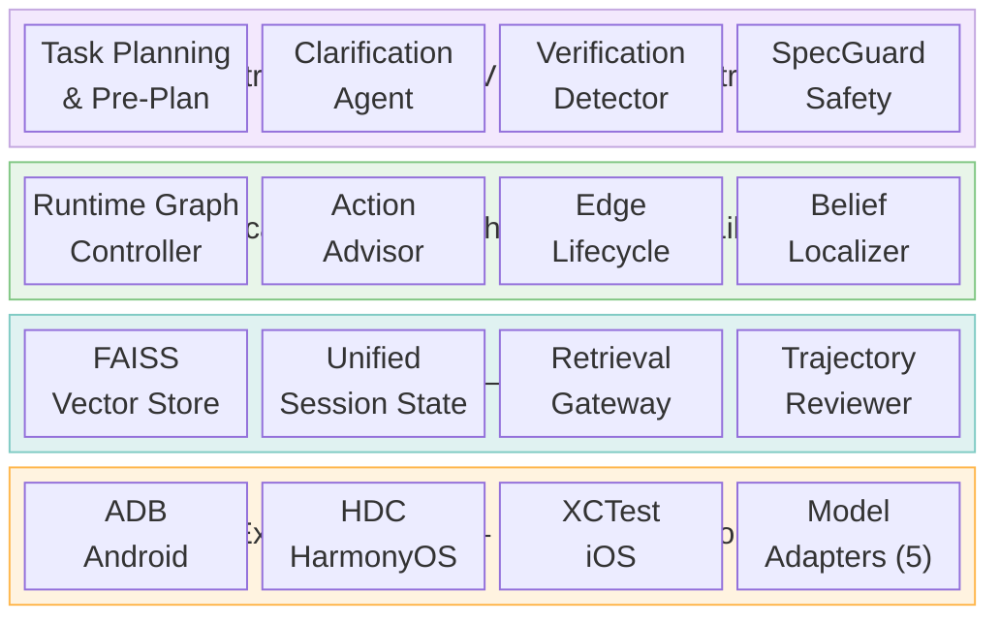
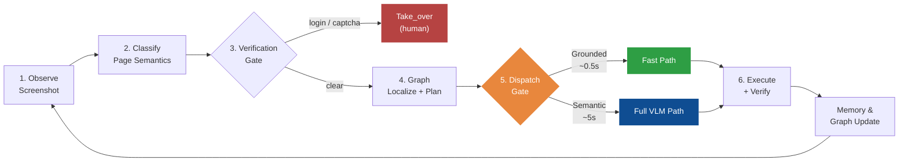
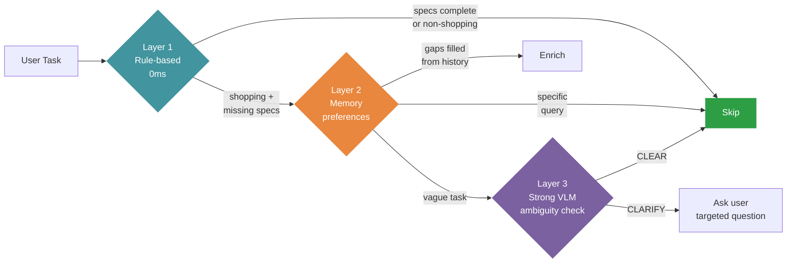
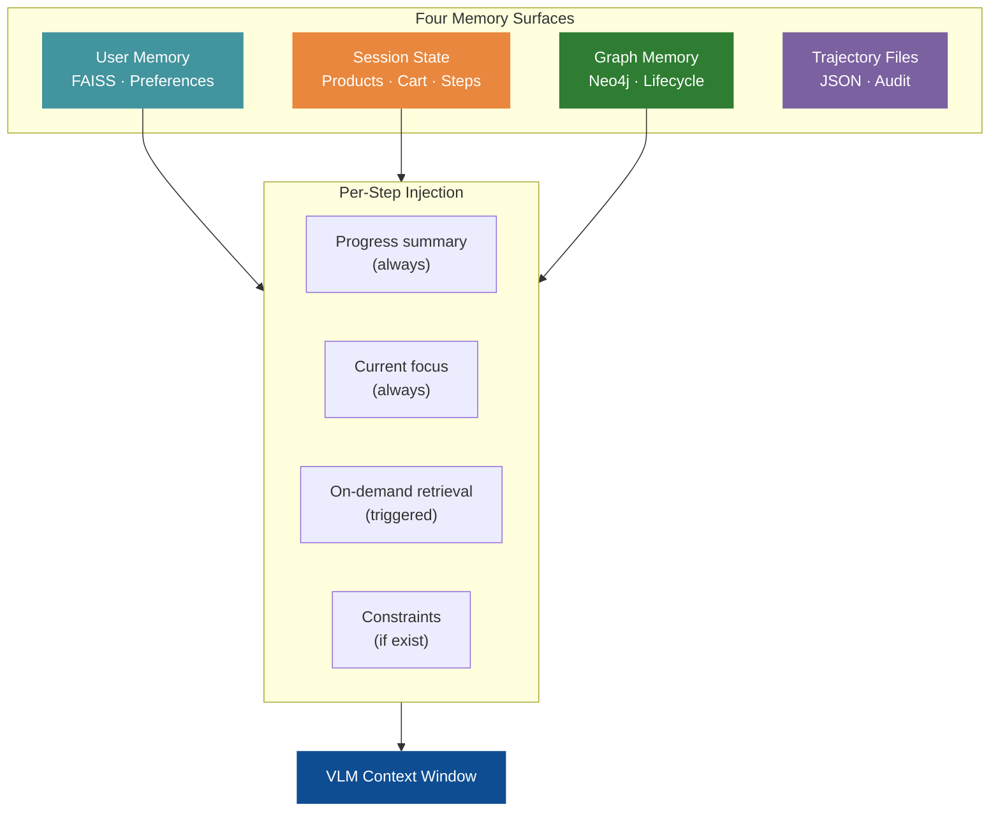
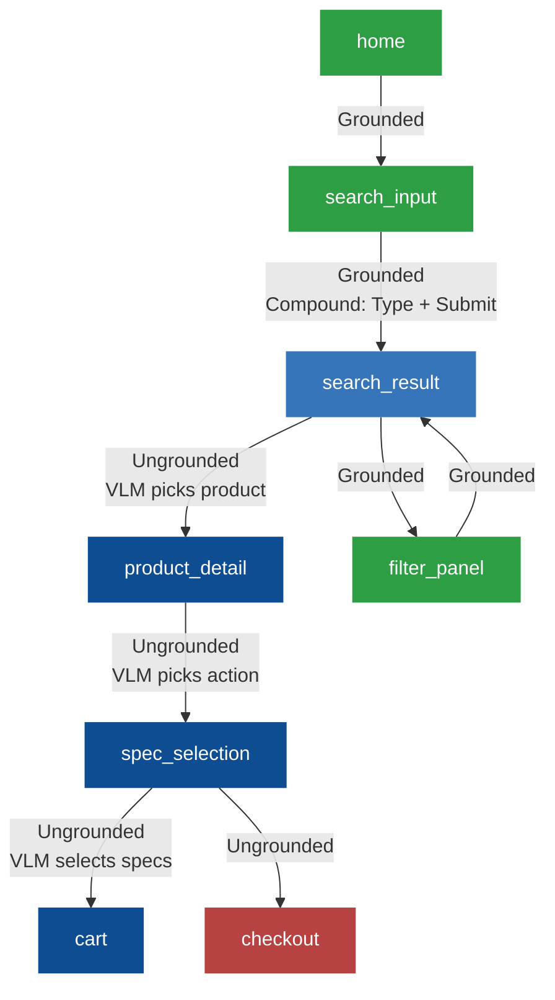
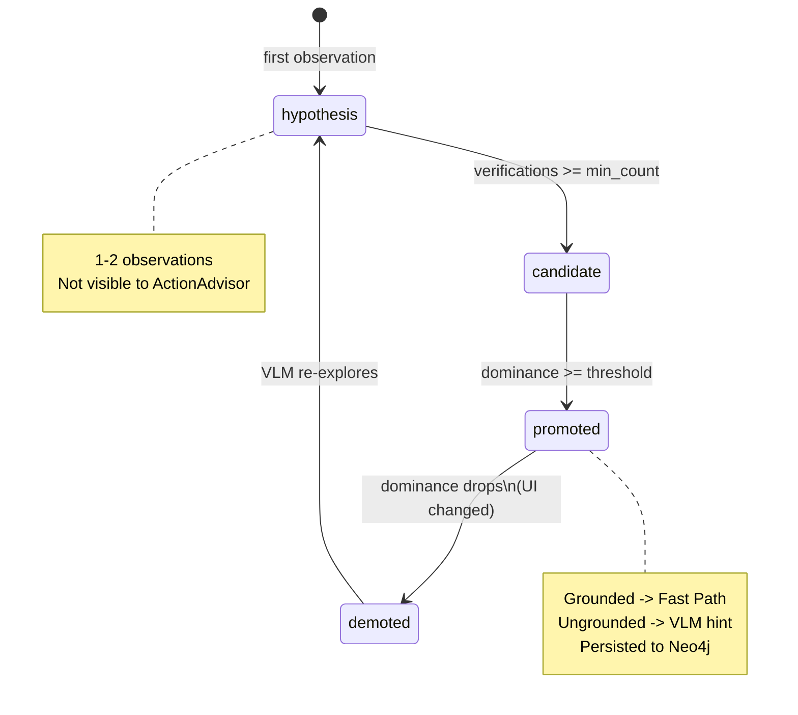
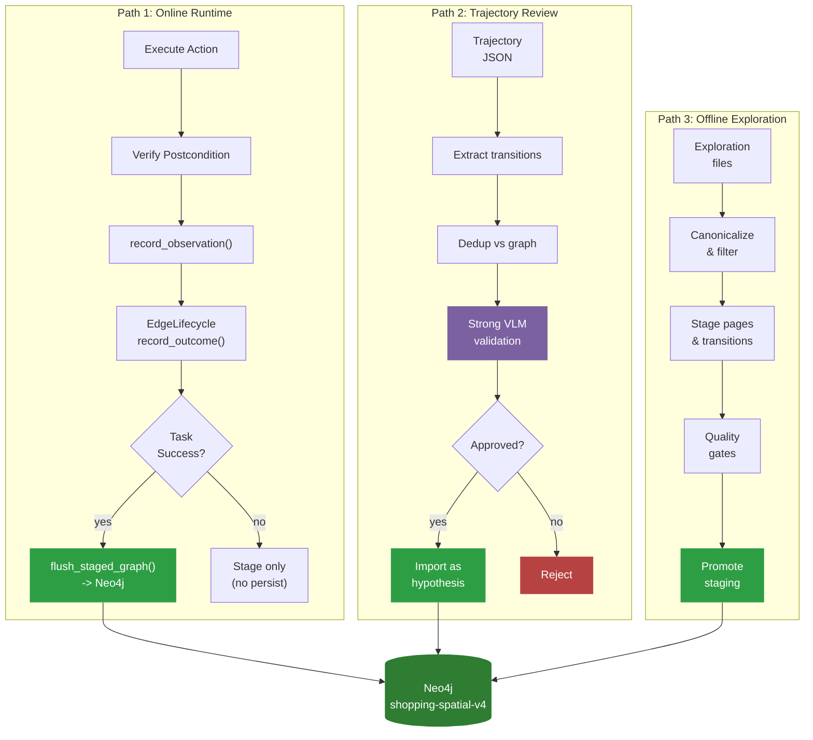

# Shopping-Agent: System Architecture

> **Version**: 2026-06-05 (rewritten)
> **Scope**: Full `phone_agent/` implementation, with emphasis on agent execution, memory orchestration, AMSG graph design, and automatic graph persistence.
> **Purpose**: Paper-ready architecture reference for academic writing.

Shopping-Agent is a **VLM-primary, graph-guided mobile GUI agent** augmented by a self-evolving **Active Mobile Spatial Graph (AMSG)**. The system automates complex shopping tasks on Android, HarmonyOS, and iOS devices through a closed-loop cycle of screenshot observation, page-state localization, graph-informed planning, VLM reasoning, action execution, and verified graph persistence.

The central design principle is *asymmetric authority*: the graph accelerates and constrains the action space while the VLM retains semantic authority over content-dependent decisions. This separation distinguishes Shopping-Agent from both pure VLM agents (which rediscover navigation from scratch every session) and pure graph planners (which cannot handle novel visual content).

---

## 1  Design Philosophy

Mobile GUI automation operates in a visual environment without a stable DOM, where four uncertainty sources drive most failures:

| Uncertainty | Failure mode | Design response |
|---|---|---|
| **Perceptual** | Same page looks different across app versions, devices, ads, popups, scroll positions. | `PageState` abstracts screenshots into reusable states defined by app, page type, landmarks, affordances, slots, risk, and semantic signature. |
| **Semantic** | Historical "tap product card" does not identify which product matches the current task. | Ungrounded transitions are explicitly marked; the VLM must choose the target based on current screen content. |
| **Transition** | Same button may open SKU selection, login, a promotion dialog, checkout, or do nothing. | `EdgeLifecycleManager` tracks empirical outcome distributions, dominance ratios, and entropy per transition. |
| **Context** | Long action histories confuse VLM calls and obscure the current task. | `UnifiedSessionState` plus `RetrievalGateway` inject progress every step and detailed memory only on demand. |

These four responses produce a system best described as **VLM-primary graph-guided control**. AMSG is not an autonomous controller; it is a verified action library, state localizer, route planner, and persistence substrate. The VLM remains the semantic authority whenever a decision depends on current screen content or user intent. This asymmetry is the defining architectural choice: it prevents the graph from replaying stale coordinates on content-sensitive pages (product choice, SKU selection, checkout) while still allowing the graph to shortcut mechanical navigation (home to search, search to results, filter toggling) at near-zero latency.

---

## 2  System Architecture

The system is organized into six functional layers. Each layer addresses a distinct concern, but the layers are not isolated: the Memory Layer feeds context upward to the Strategic Layer, the Tactical Layer reads the Memory Layer for localization and planning evidence, and the Feedback Loop writes verified observations back into both graph and session memory. This closed-loop coupling is what allows the system to self-evolve.

| Layer | Components | Responsibility |
|---|---|---|
| **Strategic** (VLM) | `PhoneAgent`, `TaskPlan`, `ClarificationAgent`, `SpecGuard`, `VerificationDetector` | Interpret the natural-language task, plan subtasks, detect ambiguity, guard purchase safety, and detect login/CAPTCHA pages. |
| **Tactical** (Graph) | `GraphRuntimeController`, `ActionAdvisor`, `EdgeLifecycleManager`, `MultiSignalLocalizer`, `EnhancedPlanner` | Localize the current page in the graph, infer the graph goal, plan routes, expose promoted actions, and decide whether to skip or invoke the VLM. |
| **Memory** | `MemoryManager`, `UnifiedSessionState`, `RetrievalGateway`, `SpatialGraphMemory`, `MemoryStore` | Store user preferences, session state, graph memory, and trajectory files. Inject lightweight context per step and detailed retrieval on demand. |
| **Persistence** | `GraphStore`, `GraphLifecycleStore`, `TrajectoryReviewer` | Persist UIState/Action/TransitionEdge data, lifecycle statistics, and VLM-reviewed trajectory evidence into Neo4j. |
| **Model Protocol** | `ModelClient`, Model Adapters (5 families), `ModelProtocolBridge`, `SpatialModelBridge` | Normalize VLM outputs from AutoGLM, UI-TARS, Qwen-VL, MAI-UI, and GUI-Owl into a unified device action IR. |
| **Device Execution** | `ActionHandler`, platform-specific handlers, `DeviceFactory`, `ADB/HDC/XCTest` backends | Execute Tap, Type, Swipe, Back, Launch, Compound, Interact, and Take_over on Android, HarmonyOS, and iOS. |

**Figure 1** illustrates the inter-layer data flow. The key observation is that information flows in a closed loop: the Feedback Loop (postcondition verification, graph update, lifecycle promotion) feeds back into the Tactical Layer for the next step. This is what transforms AMSG from a static knowledge base into a self-evolving action library.

> Recommended figure: `figures/system-architecture-nature-image2.png`



### 2.1  Cross-Layer Integration

The layers are connected by three primary data flows, each serving a distinct role in the agent's operation:

1. **Downward (task → action)**: The user's natural-language task flows through TaskPlan extraction, ClarificationAgent short-circuit, graph localization, route planning, VLM reasoning, action compilation, and device execution. At each stage, context is narrowed: the full task becomes a plan step, the plan step becomes a graph goal, the goal becomes a route, and the route becomes a device action.

2. **Upward (observation → memory)**: Each device action produces a new screenshot observation. This observation flows upward through page classification, postcondition verification, and outcome recording. Successful task trajectories trigger graph persistence; failed tasks produce trajectory files but do not pollute the graph.

3. **Lateral (graph ↔ VLM)**: The graph provides navigation hints, promoted actions, and route plans to the VLM prompt. The VLM's thinking and action outputs feed back into the graph as transition evidence. This bidirectional coupling allows the VLM to benefit from graph structure while the graph learns from VLM decisions.

---

## 3  Agent Execution Model

### 3.1  Closed-Loop Execution

The main control loop is implemented by `PhoneAgent._execute_step()`, a 729-line method that integrates all subsystems in a six-phase architecture. Each step follows the same closed loop, but the path through the loop varies based on graph confidence, page risk, and semantic requirements.



> Recommended figure: `figures/agent-execution-flow-nature-image2.png`

### 3.2  Task Initialization and Pre-Planning

Before the execution loop begins, `PhoneAgent.run(task)` performs initialization:

1. **State reset**: Clears dialogue context, step counter, graph failure counters, verification counters, step summaries, and model adapter action history.
2. **VLM pre-plan**: Calls `_vlm_pre_plan(task)` using the stronger VLM (via `AMSG_STRONG_VLM_*`) if configured. The pre-plan extracts `search_query`, `product`, `specs`, `target_action`, `target_page`, and ordered steps with target page types.
3. **TaskPlan creation**: `TaskPlan.from_vlm_output()` converts the pre-plan into a step list with goal slots. This plan is a scaffold, not ground truth — the current screenshot and safety gates still decide what can actually be executed.
4. **Memory session start**: The memory manager initializes session state and loads relevant user preferences.

The pre-plan serves two purposes beyond task decomposition: it populates `GoalSpec` for graph routing (so the planner knows what page types to target) and it fills `TaskSlots` for SpecGuard (so the safety system can verify spec selections at checkout).

### 3.3  Verification and Human Takeover

Two verification-detection layers prevent the model from inventing actions on authentication or verification screens:

1. **Before VLM call**: `detect_verification(page_type, summary, elements)` checks PageClassifier output with keyword banks for login (confidence 0.92), CAPTCHA (0.88), SMS (0.85), and dialog+login (0.80).
2. **After VLM call**: `detect_verification_from_vlm(thinking, raw_content)` catches verification pages recognized by the model when the PageClassifier was skipped due to RuntimeDAG optimization.

An adaptive consecutive counter manages recovery: 0-3 consecutive detections trigger auto-takeover; at 4-5, the VLM is allowed one attempt (to recover from a false positive); above 5, the task fails. This design acknowledges that detection is imperfect and provides a graceful degradation path.

### 3.4  Three-Layer Clarification

`ClarificationAgent` runs on the first step for shopping and food-delivery tasks, using a three-layer short-circuit that minimizes unnecessary user interaction:



This layered design connects directly to the memory system: Layer 2 consults `MemoryStore` for user preferences (e.g., "prefers silver color"), which can fill spec gaps without asking the user. Layer 3 uses the stronger VLM for ambiguity judgment, not the task-execution model. The result feeds back into `TaskSlots`, which the SpecGuard later uses to verify purchase safety.

### 3.5  Dual-Speed Dispatch

The dispatch gate is the architectural heart of dual-speed execution. The agent maintains three practical execution paths:

| Path | Trigger | VLM cost | Latency |
|---|---|---:|---|
| **Fast Path** | `ActionAdvisor` returns a grounded promoted action with confidence >= 0.9, aligned with the current plan step. | None | ~0.5s |
| **Graph Co-pilot** | `GraphRuntimeController` returns a high-confidence structural action that needs VLM verification. | 1 call | ~3s |
| **Full VLM Path** | No safe graph action, semantic target choice required, low confidence, failed repair, or safety guard active. | 1 call | ~5s |

The Fast Path executes immediately through `ActionAdvisor.get_fast_action()` with slot substitution (replacing `<query>`, `<color>` placeholders with goal slot values). After execution, a postcondition check takes a new screenshot and verifies the page type. If the postcondition mismatches, the step falls through to the Full VLM Path — the graph shortcut is not blindly trusted.

The Full VLM Path is intentionally broad. In shopping tasks, the graph should not choose a concrete product, store, SKU, or checkout decision unless the transition is known to be grounded and safe. This is the fundamental "graph as advisor, not controller" principle.

### 3.6  SpecGuard and Purchase Safety

`SpecGuard` sits between VLM output and action execution, protecting spec-selection, checkout, and payment-adjacent pages. It has two complementary entry points:

1. **`get_context_hints()`**: Injects constraint reminders into VLM context on spec/checkout/payment pages (preventative).
2. **`check()`**: Intercepts a purchase-commit action before execution and can replace it with `Interact` (reactive).

The guard distinguishes *selection* (choosing a visible option) from *commit* (add-to-cart, buy-now, checkout, payment). Selection is allowed because the VLM may choose options matching explicit user constraints. Commit is guarded: if the VLM cannot prove (in its thinking) that the requested specs were selected, checkout or payment is blocked and the user is prompted.

This connects back to `TaskSlots`: the user's original spec requirements (extracted once by `TaskSpecExtractor` and enriched by ClarificationAgent) are carried as first-class state throughout execution, not as incidental prompt text. The SpecGuard checks these slots against the VLM's reasoning at the exact point of purchase commitment.

---

## 4  Memory Architecture

The memory system separates four surfaces that serve different temporal and semantic roles. The critical design decision is **memory decoupling**: not all memory is injected into every VLM call. Instead, the system injects lightweight context always and triggers detailed retrieval only when the VLM's reasoning signals a need.

### 4.1  Four Memory Surfaces

| Surface | Storage | Temporal scope | Injection strategy |
|---|---|---|---|
| **User memory** | `MemoryStore` (FAISS vector store) under `memory_db/<user>` | Cross-session | Preferences and contacts injected during clarification and slot filling. |
| **Session state** | `UnifiedSessionState` | Per-task | Progress summary and current focus injected every step. |
| **Graph memory** | `SpatialGraphMemory` + Neo4j | Cross-session (persistent graph) + per-session (staged observations) | Graph context injected when route exists; action hints injected on matching pages. |
| **Trajectory files** | JSON per task under `memory_db/<user>/trajectories/` | Per-task, retained for review | Not injected. Used by `TrajectoryReviewer` for offline graph evolution. |



### 4.2  Lightweight Context Injection

`MemoryManager.get_injection_context()` implements the decoupling strategy:

1. **Always inject**: A short progress summary (task plan status, step count, recent actions).
2. **Always inject**: The current focus (what the agent is trying to do right now).
3. **Triggered injection**: `RetrievalGateway` activates only when the previous VLM thinking indicates recall, comparison, calculation, product lookup, or stagnation. It uses heuristic intent detection over model thinking text and queries `UnifiedSessionState`.
4. **Conditional injection**: Task constraints (price range, color, storage) injected only when they exist and the current page is decision-relevant.

This strategy keeps the VLM context window lean. In a typical 30-step shopping task, full retrieval might trigger on 3-5 steps (when the VLM's thinking mentions "I saw a product earlier" or "comparing prices"). The remaining 25+ steps receive only the 2-3 line progress summary. This is critical for VLM performance: long histories confuse reasoning and increase latency.

### 4.3  Session State as Single Write Path

`UnifiedSessionState` merges the older KnowledgeBase, SessionMemory, and StateManager roles into a single state object. Each step writes once through `record_step()`, then optional product and constraint extraction updates the same state. This eliminates state drift across components — there is no scenario where the memory manager and the session state disagree about what happened.

The session state also serves as the anchor for the Tactical Layer: `GraphRuntimeController.locate_and_get_context()` reads the current session state to determine task progress, and the graph's `GoalSpec` is derived from the session's task slots.

### 4.4  Memory Surfaces Working Together

The four surfaces are not independent databases — they form a coordinated memory architecture:

- **User memory → Clarification**: User preferences fill spec gaps in Layer 2, reducing unnecessary questions.
- **Session state → Graph routing**: Task slots from session state populate `GoalSpec`, which drives route planning.
- **Graph memory → VLM context**: Promoted actions and route plans from graph memory appear as action hints in the VLM prompt.
- **Trajectory files → Graph evolution**: Saved trajectories feed `TrajectoryReviewer`, which validates new transitions and imports them as graph hypotheses.
- **Session state → Trajectory files**: At task end, the session state is serialized into a trajectory JSON file for audit and review.

This coordination means that a user preference learned from a past task (stored in FAISS) can influence the current task's graph routing (via GoalSpec) and safety checking (via SpecGuard) — all without the user repeating themselves.

---

## 5  Active Mobile Spatial Graph (AMSG)

AMSG is the core research contribution. It is a typed directed graph that represents the mobile UI as a network of page states connected by action transitions, annotated with lifecycle metadata, outcome distributions, and localization evidence.

### 5.1  Formal Definition

The core persisted motif is a three-node, two-relationship pattern in Neo4j:

```
(UIState) -[NEXT_ACTION]-> (Action) -[PRODUCES]-> (UIState)
```

UIState nodes store page-state abstractions (app, page_type, landmarks, affordances, risk). Action nodes store semantic actions (intent, semantic_target, postcondition, lifecycle_stage). Relationships track `frequency` (success count), `fail_count`, and `confidence` (= frequency / total), which form the data basis for the edge lifecycle system.

### 5.2  UIState / PageState

`PageState` abstracts a screenshot into a reusable page identity. This is not pixel-level identity — it is a *semantic* identity that allows the system to recognize "this is a product detail page in Taobao" regardless of which product is displayed.

| Field | Role in the system |
|---|---|
| `state_id` | Stable hash from `(app, page_type, landmarks, affordances, risk)`. |
| `app` | Current application name, canonicalized via schema aliases. |
| `page_type` | Categorical: `home`, `search_input`, `search_result`, `product_detail`, `spec_selection`, `cart`, `checkout`, `filter_panel`, etc. |
| `landmarks` | Stable visual anchors (e.g., "search bar", "price tag", "add to cart button"). |
| `affordances` | Possible interactions (e.g., "tap product", "swipe down", "type query"). |
| `slots` | Runtime slots detected from task and page text (e.g., `{query: "iPhone 16"}`). |
| `risk_level` | `normal`, `medium`, or `high`. Payment and login pages are always `high`. |
| `semantic_signature` | Deterministic string: `app|domain|page_type|landmarks|affordances|slots`. |

The page-state abstraction is what makes the graph reusable across tasks. A product detail page learned from one shopping session can inform navigation in a completely different session with a different product, because the graph stores the page *type* and *structure*, not the specific content.

### 5.3  Action Nodes

`Action` nodes represent semantic transition affordances, not raw coordinates. `GraphStore._semantic_action_key()` intentionally ignores coordinate jitter — coordinates are treated as grounding *evidence*, not identity.

| Field | Purpose |
|---|---|
| `type` | Action verb: `tap`, `type`, `swipe`, `back`, `launch`, `compound`. |
| `intent` | Semantic description: "tap search button", "type product query". |
| `semantic_target` | Human-readable target: "search box", "add to cart". |
| `target_locator` | Coordinates, region, or element descriptor for grounding. |
| `expected_postcondition` | Target page type after action. |
| `risk_level` | Inherited from source/target page risk. |
| `lifecycle_stage` | `hypothesis`, `candidate`, `promoted`, or `demoted`. |
| `outcome_entropy` | Shannon entropy of empirical outcome distribution. |

The canonical persisted motif is:


> Recommended figure: `figures/amsg-graph-schema-nature-image2.png`

### 5.4  Grounded vs. Ungrounded Transitions

This distinction is the operational core of "graph as advisor, not controller":

| Transition | Grounded? | Graph behavior | VLM role |
|---|---|---|---|
| `home → search_input` | Yes | Fast Path with coordinates | None |
| `search_input → search_result` | Yes | Compound: Type + Submit | None (slot substitution) |
| `search_result → product_detail` | **No** | Hint only (no coordinates) | Must choose the product matching the current task |
| `product_detail → spec_selection` | **No** | Hint only | Must judge product page and target action |
| `spec_selection → cart/checkout` | **No** | Hint only | Must select the user's SKU safely |
| `search_result → filter_panel` | Yes | Fast Path | None |

Grounded transitions have stable coordinates and deterministic outcomes. Ungrounded transitions require semantic judgment about *which* element to interact with — the graph knows the transition exists, but only the VLM can decide the specific target on the current screen.



---

## 6  Graph Self-Evolution

The graph does not grow by recording every observed action. It evolves through a staging-first pipeline with three independent paths, all converging on the same quality-gated persistence layer.

### 6.1  Edge Lifecycle State Machine

Every transition in AMSG passes through a lifecycle that determines its runtime authority:



`EdgeLifecycleManager` tracks both individual edge lifecycle records and aggregate `OutcomeDistribution` for `(source_page_type, action_key)` pairs.

**Promotion criteria** (configurable via `AMSGOptimConfig`):
- `verification_count >= min_verification_count` (default: 1, strict: 3)
- `dominance_ratio >= outcome_dominance_threshold` (default: 0.6, strict: 0.8)
- `risk_level != "high"`

**Demotion**: A promoted edge is demoted when its dominance ratio falls below 40%. This handles UI changes: if an app update changes the target of a button, the outcome distribution shifts, dominance drops, and the edge is automatically demoted.

**Outcome Entropy** (Shannon entropy):

$$H = -\sum_i p_i \ln(p_i)$$

When `H > outcome_entropy_vlm_threshold` (default: 0.8), the transition is flagged for VLM verification instead of direct execution. In practice, a hardcoded set of semantic transitions (`search_result → product_detail`, `product_detail → spec_selection`) is the primary VLM-verification trigger; the entropy threshold serves as a supplementary data-driven mechanism.

### 6.2  Three Persistence Paths



> Recommended figure: `figures/graph-persistence-pipeline-nature-image2.png`

**Path 1 (Online Runtime)**: During task execution, each action produces a postcondition observation. `SpatialGraphMemory.record_observation()` stages the transition locally. At task end, `flush_staged_graph()` canonicalizes states and edges, promotes valid transitions, and writes to Neo4j. Failed tasks do not flush — this is the first quality gate.

**Path 2 (Trajectory Review)**: `TrajectoryReviewer` processes saved trajectory files. It extracts page transitions, deduplicates against existing graph edges, and asks a strong VLM to validate new candidates. Only VLM-approved transitions are imported as `hypothesis` edges. This is the second quality gate — it prevents graph pollution from dialogs, ads, classifier mistakes, and transient screens.

**Path 3 (Offline Exploration)**: `import_exploration_staging()` processes pre-collected exploration data through canonicalization, transient-page filtering, app-mismatch filtering, search-macro synthesis, same-page compaction, and edge-quality filtering. Only after all gates pass does `promote_staging_to_canonical()` merge into the graph.

The key insight is that **no raw action writes directly to Neo4j**. Every persistence path passes through at least one quality gate (task success, VLM validation, or canonicalization filtering). This is what makes AMSG a "verified action library" rather than a noisy trajectory dump.

### 6.3  Lifecycle Persistence

`GraphLifecycleStore.persist_lifecycle_batch()` writes lifecycle records and outcome distributions to Neo4j:

- `lifecycle_stage`, `verification_count`, `dominance_ratio`
- `outcome_distribution_json`, `outcome_entropy`
- Timestamps for creation, last update, last verification

`GraphLifecycleStore.demote_stale_edges()` runs periodically to demote promoted edges whose dominance ratio has dropped below threshold. This ensures the graph self-corrects when app UIs change.

---

## 7  Localization and Planning

### 7.1  Page Localization

The default localization mechanism is straightforward: match the current `(app, page_type)` against UIState nodes in Neo4j. When a match is found, the graph candidate gets a fixed score of 0.92; the current observation gets 0.82. This simple approach works because `PageClassifier` already provides an accurate page_type, and the `(app, page_type)` pair uniquely identifies a page state in the vast majority of cases.

An optional multi-signal Bayesian localizer (`MultiSignalLocalizer`) is implemented but not enabled by default (`use_multi_signal_belief=False`). It adds visual embedding, semantic embedding, and temporal transition channels, but the marginal improvement over `(app, page_type)` matching has not been validated through ablation experiments.

### 7.2  Goal Inference

`GoalSpec.from_task()` extracts target page types and slots. `GraphRuntimeController._infer_goal_spec()` enriches this with VLM pre-plan fields:

- `search_query` → `query` slot
- `product` → `product` slot
- `specs` → slot values (color, storage, size)
- `target_page` → prioritized target page type

For search-first tasks, `_search_first_targets()` forces the route to progress through `home → search_input → search_result → original targets`. This prevents the graph from taking a historical shortcut from home directly to a random product detail page — a shortcut that would bypass the user's actual search intent.

### 7.3  Route Planning

The default planner is **Dijkstra** on the weighted graph:

$$\text{cost}(e) = 1.0 + 3.0 \cdot \text{fail\_rate} + \text{risk\_penalty} - 0.3 \cdot \text{confidence}$$

Risk penalties: normal=0, medium=0.8, high=2.0. This cost function prefers edges with high success rates, low risk, and high confidence — edges that have been verified to work.

On typical shopping app graphs (< 50 nodes), Dijkstra finds optimal paths efficiently. An enhanced planner (`EnhancedPlanner` with A* and Belief-A* backends) is implemented but not enabled by default — its additional cost adjustments (temporal decay, exploration bonus, information gain, entropy penalty) contribute < 0.1 on current graph sizes and do not change path selection in practice.

### 7.4  RuntimeDAG: Cached Route Execution

When Dijkstra finds a route, it is materialized into a `RuntimeDAG` — an in-memory array of edges with a cursor. Subsequent steps advance the cursor (`current_index += 1`) instead of re-querying Neo4j and re-running Dijkstra. This is the actual performance mechanism: on a 5-step navigation sequence, only the first step runs the full localization-planning pipeline; the remaining 4 steps read `route[current_index]` in < 1ms.

RuntimeDAG is invalidated when: postcondition mismatch (arrived at unexpected page), app switch, consecutive graph failures exceed threshold, or next edge is high-risk. After invalidation, the next `locate_and_get_context()` call runs the full pipeline and creates a new DAG if planning succeeds.

RuntimeDAG also controls PageClassifier skipping: when the DAG is valid and the next edge is not high-risk, `should_use_page_classifier()` returns `False`, and the agent uses the DAG's expected page_type instead of calling the classifier. This saves one VLM call per step but risks acting on a stale page_type if a popup appeared. The delayed postcondition verification at the next step catches such mismatches.

### 7.5  Action Compilation

Graph-native actions are compiled through a two-stage IR pipeline:

```
SemanticActionIR (intent, semantic_target, locator, postcondition)
    → DeviceActionIR (action_type, coordinate, coordinate_space, screen_size)
    → Canonical action dict for ActionHandler
```

`SpatialModelBridge` handles the first stage (semantic to device IR), and `ModelProtocolBridge` handles coordinate normalization across model families. This keeps AMSG model-agnostic: the graph stores semantic intent and locator evidence, while adapters handle model-native syntax and coordinate systems.

---

## 8  Model and Device Abstraction

### 8.1  Multi-Model Support

Shopping-Agent supports five VLM families through a unified adapter architecture:

| Model family | Coordinate space | Context strategy | Response format |
|---|---|---|---|
| AutoGLM | [0, 1000] normalized | Cumulative (append each turn) | `<answer>` XML |
| UI-TARS | Absolute pixels (smart_resize) | Max 5 images, prune oldest | "Thought: ... Action: ..." |
| Qwen-VL | [0, 999] normalized | Fresh rebuild each turn | `<tool_call>` JSON |
| MAI-UI | [0, 999] normalized | Max 3 images | `<thinking>` + `<tool_call>` |
| GUI-Owl | [0, 1.0] decimal | Max 1 image (current only) | Action + `<tool_call>` |

`ModelProtocolBridge._scale_coord()` is the coordinate transformation hub, converting between all coordinate spaces through a normalized (0, 1) intermediate representation. This means the graph can store coordinates in any space and they will be correctly converted for the current model at runtime.

### 8.2  Device Abstraction

`DeviceFactory` provides a unified interface across three platforms:

- **ADB** (Android): Full automation via `adb shell input` and `screencap`.
- **HDC** (HarmonyOS): Equivalent automation via `hdc` command-line tools.
- **XCTest** (iOS): WebDriverAgent-based control via HTTP API.

`ActionHandler` converts canonical action dicts to device calls. The handler manages keyboard setup for text input (switching to ADB keyboard, clearing fields, typing text, and restoring the original IME), timing delays between operations, and compound action sequences for multi-step same-page operations.

---

## 9  Configuration Presets

`AMSGOptimConfig` provides configuration presets via the `AMSG_CONFIG` environment variable. The default is `legacy` (fixed-score localization, Dijkstra planning, no lifecycle). The production-recommended preset is `sava` (Dijkstra, strict lifecycle with 3x verification and 80% dominance threshold).

Additional presets (`belief_only`, `planner_only`, `full`) exist as experimental infrastructure for future ablation studies — they are not validated contributions.

---

## 10  Comparative Analysis

### 10.1  Positioning in the Literature

Shopping-Agent addresses three specific gaps in the current GUI agent landscape:

**Gap 1: Stateless re-exploration.** Most GUI agents (including strong systems like ColorAgent [Li et al., 2025], MobiAgent [Zhang et al., 2025]) treat each task session as independent. They may learn within a session through reflection or self-correction, but structural knowledge about app navigation does not persist across sessions. Shopping-Agent's AMSG persists verified transitions in Neo4j, allowing the agent to build cumulative knowledge about app navigation patterns.

**Gap 2: Graph without lifecycle.** Systems that do build navigation graphs — PG-Agent [Chen et al., 2025] constructs page graphs from episodes, KG-RAG [Guan et al., 2025] transforms UTGs into vector databases, WebNavigator [Zhang et al., 2025] builds interaction graphs via heuristic exploration — treat the graph as a static artifact. Once built, edges do not evolve. Shopping-Agent introduces a full lifecycle: hypothesis → candidate → promoted → demoted, with data-driven promotion criteria and automatic demotion when UI changes.

**Gap 3: Binary graph/VLM control.** Existing graph-augmented agents use the graph either as a static RAG source (PG-Agent, KG-RAG) or as a deterministic controller that bypasses the VLM entirely (WebNavigator's Teleport). Shopping-Agent introduces a continuous spectrum: Fast Path (graph alone, ~0.5s), Graph Co-pilot (graph hints + VLM verification, ~3s), and Full VLM Path (VLM alone, ~5s). The dispatch decision is data-driven, based on edge lifecycle stage, outcome entropy, and grounding status.

### 10.2  Detailed Comparison

| Dimension | ColorAgent | PG-Agent | KG-RAG | WebNavigator | MobiAgent (AgentRR) | **Shopping-Agent** |
|---|---|---|---|---|---|---|
| **Graph structure** | None (multi-agent framework) | Page graph from episodes | UTG → vector DB | Interaction graph (BFS) | Multi-level experience tree | AMSG (typed directed graph with lifecycle) |
| **Graph evolution** | N/A | Static after construction | Static after extraction | Static after offline BFS | Record-replay (static) | Self-evolving: online staging → postcondition verification → lifecycle promotion → demotion |
| **Persistence** | None | In-memory per session | Vector DB (static) | Vector DB (static) | Latent memory model | Neo4j with lifecycle metadata and outcome distributions |
| **VLM/Graph boundary** | VLM-only (no graph) | RAG retrieval → VLM | RAG retrieval → VLM | Deterministic teleport (no VLM for navigation) | Experience → skip VLM (binary) | Per-edge grounded/ungrounded classification with postcondition fallback |
| **Localization** | VLM perception | BFS similarity search | Embedding retrieval | Multimodal retrieval (ColQwen) | Page matching | (app, page_type) matching + optional Bayesian extension |
| **Planning** | Multi-agent decomposition | BFS on page graph | BFS on UTG | Shortest path on interaction graph | Prefix reusability | Dijkstra on weighted graph (success rate + risk penalty) |
| **Safety** | None reported | None reported | None reported | None reported | None reported | SpecGuard: task-slot-aware purchase interception |
| **Transition verification** | Self-evolving training (model-level) | None (edges from episodes) | None | None | None | Postcondition verification + outcome distribution + entropy threshold |
| **Quality gate** | Trajectory filtering (training) | None | None | None | Manual correction of traces | Three gates: task success, VLM trajectory review, canonicalization |
| **Multi-model support** | Proprietary model | GPT-4o | MobileAgent-v2, UI-TARS | GPT-4o, Gemini, Claude | MobiMind (custom) | 5 families: AutoGLM, UI-TARS, Qwen-VL, MAI-UI, GUI-Owl |
| **Cross-platform** | Android only | Android (evaluation) | Android + HarmonyOS | Web only | Android only | Android + HarmonyOS + iOS |

### 10.3  Core Contributions (Default-Enabled, Reproducible)

1. **Self-updating page-state graph**. The first cross-session persistent navigation knowledge graph for mobile GUI agents. The graph grows with successful tasks and shrinks when edge reliability drops. Unlike static graphs (PG-Agent, KG-RAG, WebNavigator), AMSG evolves automatically.

2. **Success-rate-driven edge lifecycle**. Each transition tracks postcondition success/failure counts and progresses through hypothesis → candidate → promoted → demoted stages. Only statistically reliable transitions enter the executable action library. This solves the real problem of online observation noise (popups, login interceptions, classifier errors).

3. **Grounded/ungrounded classification with three-speed dispatch**. Each edge is independently classified as grounded (graph executes directly, ~0.5s) or ungrounded (VLM decides, ~5s). Fast Path has postcondition protection — mismatch falls back to VLM. This is the only known per-edge control boundary for GUI agent graphs.

4. **Delayed postcondition verification**. Action outcomes are recorded at step t+1 when the actual result can be observed, not at step t when only the intent is known. This ensures the lifecycle system receives ground-truth observations.

5. **Staging-first persistence with three quality gates**. Failed tasks do not write to the graph. New transitions require VLM review. All paths pass through canonicalization. No raw action writes to Neo4j.

6. **Structured task constraints as first-class state**. Task specs (color, storage, size, price) are extracted once and enforced by SpecGuard at purchase commit. This makes shopping safety a system property, not prompt engineering.

### 10.4  Experimental Extensions (Not Default-Enabled)

The following are implemented but require ablation experiments to validate as contributions:

- Multi-channel Bayesian belief localization (default: off; `(app, page_type)` matching suffices for most cases)
- Belief-A* enhanced planner (default: Dijkstra; enhancement terms contribute < 0.1 on typical graph sizes)
- Entropy-driven VLM verification boundary (implemented but hardcoded transition set is the primary mechanism)

---

## 11  Implementation Map

| Concept | File |
|---|---|
| Main loop | `phone_agent/agent.py` (1,785 lines) |
| Task plan | `phone_agent/task_plan.py` (133 lines) |
| Slot extraction | `phone_agent/core/task_spec.py` (323 lines) |
| Clarification | `phone_agent/clarify.py` (400 lines) |
| Purchase safety | `phone_agent/core/spec_guard.py` (252 lines) |
| Verification detection | `phone_agent/verification_detector.py` (177 lines) |
| Memory manager | `phone_agent/memory/memory_manager.py` |
| Unified session state | `phone_agent/memory/core/unified_state.py` |
| On-demand retrieval | `phone_agent/memory/retrieval_gateway.py` |
| Spatial graph memory | `phone_agent/memory/spatial_graph_memory.py` |
| Neo4j store | `phone_agent/memory/graph_store.py` |
| Lifecycle persistence | `phone_agent/memory/graph_lifecycle_store.py` |
| Runtime graph controller | `phone_agent/spatial/runtime_controller.py` |
| Action advisor | `phone_agent/spatial/action_advisor.py` |
| Edge lifecycle | `phone_agent/spatial/edge_lifecycle.py` |
| AMSG config presets | `phone_agent/spatial/amsg_config.py` |
| Belief localizer | `phone_agent/spatial/belief_localizer.py` |
| Enhanced planner | `phone_agent/spatial/enhanced_planner.py` |
| Schema registry | `phone_agent/spatial/schema_registry.py` |
| Spatial model bridge | `phone_agent/spatial/model_bridge.py` |
| Model protocol bridge | `phone_agent/model/protocol_bridge.py` |
| Model client | `phone_agent/model/client.py` |
| Model adapters | `phone_agent/model/adapters.py` |
| Action execution | `phone_agent/actions/handler.py` |
| Device abstraction | `phone_agent/device_factory.py` |
| Trajectory reviewer | `phone_agent/spatial/trajectory_reviewer.py` |

---

## 12  Recommended Paper Figures

1. **System architecture**: `figures/system-architecture-nature-image2.png` — Six-layer architecture with inter-layer data flows.
2. **Agent execution flow**: `figures/agent-execution-flow-nature-image2.png` — Five-phase closed-loop execution with dual-speed dispatch.
3. **AMSG graph schema**: `figures/amsg-graph-schema-nature-image2.png` — UIState-Action-UIState motif, lifecycle evidence, outcome distributions.
4. **Graph persistence pipeline**: `figures/graph-persistence-pipeline-nature-image2.png` — Three persistence paths converging on quality-gated Neo4j writes.

---

## 13  Paper Method Summary

> Shopping-Agent is a VLM-primary mobile GUI agent augmented by a self-evolving Active Mobile Spatial Graph (AMSG). The system abstracts screenshots into semantic page states and persists verified navigation transitions in Neo4j. Each step locates the current page via `(app, page_type)` matching, plans a route with Dijkstra on the weighted graph, and caches the route as a RuntimeDAG for subsequent steps to advance directly. Grounded, promoted transitions execute via Fast Path (~0.5s, no VLM call); ungrounded transitions require VLM to choose the specific target (~5s), with postcondition protection — mismatch triggers automatic fallback. Delayed postcondition verification at step t+1 confirms step t's outcome, ensuring edge success-rate tracking is based on ground-truth observations. Online observations are staged in memory; only successful tasks trigger Neo4j writes, and new transitions require VLM trajectory review — no raw actions write directly to the graph. User constraints are extracted as first-class task slots and enforced by SpecGuard at the point of purchase commitment.
