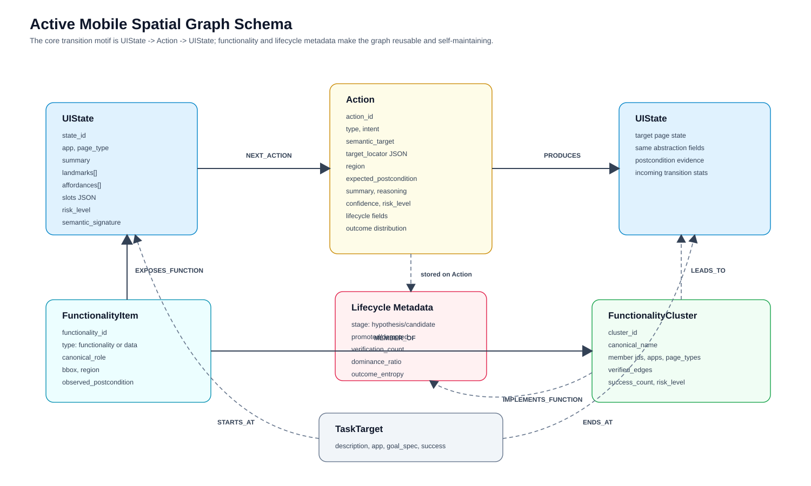

# ClawGUI-Agent Architecture

> Version: 2026-06-04
> Scope: `phone_agent/agent.py`, `phone_agent/memory/`, `phone_agent/spatial/`, `phone_agent/model/`, `phone_agent/actions/`

ClawGUI-Agent is a VLM-primary mobile GUI agent augmented by an Active Mobile Spatial Graph (AMSG). The core design is deliberately asymmetric:

- The VLM is responsible for semantic decisions: choosing a product, interpreting a screenshot, matching user constraints, deciding whether an item satisfies a task, and handling ambiguous or novel screens.
- The graph is responsible for reusable spatial and procedural knowledge: locating the current page state, proposing verified navigation actions, compiling safe grounded actions, tracking transition reliability, and injecting concise context into the VLM prompt.
- The memory system separates personalized memory, session state, graph memory, and trace history so that the prompt carries only task-relevant evidence instead of the entire execution log.

This document rewrites the architecture from the current codebase rather than from the older graph-as-controller design. It is intended to be usable as source material for a paper method section.


## 1. Research-Level Design Problem

Mobile GUI agents face three coupled uncertainties:

1. **Perceptual uncertainty**: the screenshot must be mapped to a stable page abstraction despite dynamic layouts, popups, ad slots, device resolution changes, and app version drift.
2. **Semantic uncertainty**: the same action class may require a different concrete target for each user task. For example, tapping a product card is a navigation pattern, but choosing which card is a semantic decision.
3. **Transition uncertainty**: the same control can lead to several outcomes. A product detail "add to cart" button may open a spec selector, a login page, a promotion popup, or do nothing.

The architecture addresses these uncertainties with a division of labor:

| Problem | Primary module | Mechanism |
|---|---|---|
| Page identity | `SpatialGraphMemory.locate()` | `PageState` abstraction, graph candidate lookup, optional Bayesian belief localization |
| Task decomposition | `PhoneAgent._vlm_pre_plan()` and `TaskPlan` | VLM extracts query, product, specs, target pages, ordered steps |
| Navigation reuse | `GraphRuntimeController`, `ActionAdvisor` | Route planning, RuntimeDAG, promoted Action hints |
| Semantic selection | VLM full path | Current screenshot plus task constraints and graph hints |
| Transition reliability | `EdgeLifecycleManager` | Outcome distribution, promotion/demotion, entropy-based verification |
| User/session context | `MemoryManager`, `UnifiedSessionState`, `RetrievalGateway` | Lightweight progress/focus/constraints plus on-demand retrieval |

The resulting agent is not a pure reactive VLM loop and not a pure graph planner. It is a closed-loop policy where the graph narrows the action space and the VLM remains the final authority whenever the action requires semantic understanding.

## 2. Runtime Architecture

The runtime contains five interacting layers.

| Layer | Main code | Responsibility |
|---|---|---|
| Task and VLM reasoning | `PhoneAgent`, `ModelClient`, model adapters | Build prompts, call VLM, parse model-native actions, maintain compressed dialogue |
| Runtime graph guidance | `GraphRuntimeController`, `ActionAdvisor` | Locate state, infer goal, plan route, propose safe next actions |
| Memory | `MemoryManager`, `MemoryStore`, `UnifiedSessionState`, `RetrievalGateway` | User preferences, task history, session facts, on-demand retrieval |
| AMSG graph | `SpatialGraphMemory`, `GraphStore`, `GraphLifecycleStore` | Page states, transitions, lifecycle metadata, functionality graph, Neo4j persistence |
| Device execution | `ActionHandler`, device factories, ADB/HDC/XCTest backends | Convert canonical actions to real device operations and collect screenshots |

The execution loop is implemented in `PhoneAgent._execute_step()`. The graph runtime is entered through `MemoryManager.locate_and_get_context()`, which delegates to `GraphRuntimeController.locate_and_get_context()`. The graph controller owns the v4 runtime contract and returns:

- `mode`: `navigate`, `verify_with_vlm`, `explore`, or `goal_reached`
- `belief`: current state posterior
- `goal_spec`: target page types and runtime slots
- `route_plan`: selected route and cost
- `next_actions`: graph-proposed next action
- `semantic_context`: text injected into the VLM prompt
- `repair_hint`: result of pending postcondition verification

## 3. Single-Step Agent Execution


A single step follows this sequence:

```text
Input: user task T, dialogue context C, current device D

1. Observe
   screenshot <- D.get_screenshot()
   app <- D.get_current_app()
   page semantics <- PageClassifier(screenshot), unless RuntimeDAG can provide a valid hint

2. Detect interruptions
   if page is login/captcha/permission:
       execute Take_over and wait for user

3. Localize graph state
   page_state <- build PageState(app, page_type, summary, elements, slots)
   belief <- locate page_state against local state and Neo4j candidates

4. Verify previous transition
   if pending source/action exists:
       compare current page against expected postcondition
       record success/failure in SpatialGraphMemory and EdgeLifecycleManager
       repair if needed

5. Infer goal and plan
   goal_spec <- GoalSpec(task) enriched by VLM pre-plan
   route_plan <- shortest path from belief to target page types
   runtime_dag <- cached route if route is usable

6. Dispatch
   if ActionAdvisor finds a promoted grounded action matching current plan:
       execute Fast Path
   else if graph runtime has a safe next action:
       execute graph shortcut or inject VLM verification hint
   else:
       build VLM prompt and call model

7. Execute
   action <- canonical action from VLM or graph
   action <- SpecGuard / ActionAdvisor grounding if applicable
   result <- ActionHandler.execute(action)

8. Record
   MemoryManager.add_step(thinking, action, app)
   MemoryManager.update_state_and_transition(...)
   compress history and append step summary
```

### 3.1 Task Initialization

At `PhoneAgent.run(task)`:

1. The agent clears the dialogue context, graph failure counters, verification counters, step summaries, and task plan state.
2. `MemoryManager.start_task(task)` resets session memory and initializes task-level tracking.
3. `_vlm_pre_plan(task)` asks a VLM to extract a structured plan:
   - `search_query`
   - `product`
   - `specs`
   - `target_action`
   - `target_page`
   - ordered `steps`
4. `TaskPlan.from_vlm_output()` turns the VLM plan into a runtime plan used by `ActionAdvisor` and prompt construction.
5. The first `_execute_step()` begins with the original user task.

This pre-plan is not treated as ground truth. It is a high-level scaffold for search-first routing, slot filling, and constraint reminders. The current screenshot still controls what the agent may safely execute.

### 3.2 Observation and Page Semantics

The observation stage creates a structured `screen_dict`:

| Field | Source | Use |
|---|---|---|
| `ui_hash` | MD5 of screenshot base64 | observation identity and fallback state id |
| `app` | device backend | app consistency and graph filtering |
| `page_type` | `PageClassifier` or RuntimeDAG hint | graph node type and risk policy |
| `summary` | `PageClassifier` | node metadata and prompt context |
| `elements` | `PageClassifier` | landmarks, affordances, functionality extraction |
| `semantic_layout` | `app + page_type` | legacy compatibility and memory search |

`GraphRuntimeController.should_use_page_classifier()` can skip the classifier only when a valid `RuntimeDAG` is active, no pending postcondition requires verification, the next edge is not high-risk, and the current app still matches the DAG app. This is a latency optimization, not a semantic replacement for perception.

### 3.3 Dispatch Modes

The agent dispatches along three practical paths.

| Path | Trigger | VLM call | Safety boundary |
|---|---|---:|---|
| Fast Path | `ActionAdvisor` returns a promoted grounded hint with confidence >= 0.9 and matching current plan step | No | Must pass postcondition check |
| Graph shortcut | `GraphRuntimeController` returns `mode=navigate` and compilable action with confidence >= 0.7 | No | Blocked on high-risk or VLM-required transitions |
| Full VLM Path | Missing graph route, low confidence, ungrounded transition, semantic choice, failed postcondition, or explicit safety guard | Yes | VLM sees graph hints but must ground on current screenshot |

The Full VLM Path is intentionally broad. It prevents historical graph actions from being over-applied to new task content.

## 4. Memory System and Context Injection

The memory system has four distinct storage surfaces.

| Surface | Code | Persistence | Role |
|---|---|---|---|
| User memory | `MemoryStore` | local FAISS-like store under `memory_db/<user>` | preferences, corrections, task history, app/contact bindings |
| Session state | `UnifiedSessionState` | in-memory during task | current progress, constraints, product observations, cart status |
| Graph memory | `SpatialGraphMemory` + `GraphStore` | local staging plus Neo4j | page graph, transition reliability, functionality graph |
| Trace history | `GUITracer` and dialogue summaries | optional trace files and compressed messages | debug/replay without bloating prompt |

### 4.1 Lightweight Prompt Memory

`MemoryManager.get_injection_context()` follows a memory-decoupled design:

1. Always inject a short progress summary from `UnifiedSessionState`.
2. Always inject the current focus if available.
3. Trigger `RetrievalGateway.check_and_retrieve()` only when the previous VLM thinking indicates a need for recall, comparison, calculation, or product details.
4. Inject constraints when session slots exist.

This avoids pushing all memory into every prompt. User preferences and task history are still available through `get_relevant_context(task)`, but they are formatted as bounded contextual evidence rather than raw logs.

### 4.2 Graph Context Injection

Graph context enters the prompt through two routes:

- `GraphRuntimeController` injects `[SpatialGraph]`, `[SpatialGraph Route]`, `[Task Plan]`, and `[V4 Knowledge]` summaries.
- `ActionAdvisor.format_for_vlm()` injects a compact list of currently available promoted actions.

For semantically underdetermined transitions, `sanitize_action_for_context()` removes product-specific targets and locators. For example, a historical product card coordinate is not shown to the VLM when the current task asks for a different product.

### 4.3 Pending Transition Memory

After action execution, `MemoryManager.update_state_and_transition()` does not immediately know the target page. It caches:

- source `PageState`
- executed action
- expected postcondition

At the next observation, `GraphRuntimeController._verify_pending_transition()` compares the actual page type against the expectation, records the outcome, and chooses a repair action if the route deviated. This delayed verification is essential: transition truth is defined by the next screen, not by the model's predicted action.

## 5. Active Mobile Spatial Graph Design



The graph is a typed directed multigraph:

```text
G = (V, E_c, E_h, F, C, T)

V   : UIState nodes
E_c : committed/promoted transition edges represented by UIState -> Action -> UIState
E_h : hypothesis/candidate transition observations tracked by lifecycle metadata
F   : FunctionalityItem nodes discovered from pages and transitions
C   : FunctionalityCluster nodes grouping reusable roles
T   : TaskTarget nodes for task-level trajectory retrieval
```

The graph is stored in Neo4j, but `SpatialGraphMemory` also keeps local staging dictionaries:

- `_local_states: dict[state_id, PageState]`
- `_local_edges: dict[source_id, list[TransitionEdge]]`
- `_edge_lifecycle: EdgeLifecycleManager`

### 5.1 UIState Node

`UIState` represents a page-level abstraction, not a pixel-perfect screenshot. Its identity is produced from app, page type, risk bucket, landmarks, affordances, and optional slots.

| Field | Meaning |
|---|---|
| `state_id` | stable id; online observations may include screenshot hash, canonical graph nodes use semantic identity |
| `app` | app identifier or alias-normalized app name |
| `page_type` | page category such as `home`, `search_result`, `product_detail`, `spec_selection` |
| `summary` | concise page description |
| `landmarks` | stable visual anchors such as search bar, product cards, spec options |
| `affordances` | possible interactions such as `tap_search`, `open_product`, `confirm_spec` |
| `slots` | runtime task slots extracted from text, stored as JSON |
| `risk_level` | `normal`, `medium`, or `high` |
| `semantic_signature` | deterministic signature for localization |
| `screenshot_hash` | raw screenshot evidence when available |

The canonical page key is currently `(app, page_type, risk_level)`. Landmarks and affordances are merged as metadata rather than used to split every layout variant into a separate node.

### 5.2 Action Node

An `Action` is the reusable transition affordance between two page states. It is not merely a low-level tap coordinate.

| Field | Meaning |
|---|---|
| `action_id` | deterministic id from source, target, and semantic edge key |
| `type` | action type: `Tap`, `Type`, `Swipe`, `Back`, `Compound`, etc. |
| `intent` | normalized action intent, such as `tap`, `type_text`, `compound`, `go_back` |
| `semantic_target` | reusable target label, such as `open_search`, `submit_search`, `open_spec_selector` |
| `target_locator` | coordinate or bbox evidence, stored as JSON |
| `region` | normalized UI region, e.g. `top_center`, `bottom_right` |
| `expected_postcondition` | target page type expected after execution |
| `source_page_type`, `target_page_type` | denormalized page type metadata |
| `confidence` | relation-level execution confidence |
| `summary`, `reasoning` | natural-language evidence for prompt injection and debugging |
| `lifecycle_stage` | `hypothesis`, `candidate`, `promoted`, or `demoted` |
| `verification_count` | number of verified observations |
| `dominance_ratio` | empirical probability of dominant outcome |
| `outcome_distribution_json` | serialized outcome counts |
| `outcome_entropy` | Shannon entropy of the outcome distribution |

The persisted motif is:

```text
(source:UIState)-[:NEXT_ACTION]->(action:Action)-[:PRODUCES]->(target:UIState)
```

`NEXT_ACTION` tracks frequency, fail count, and confidence. `PRODUCES` tracks success/failure counts and success rate for the action's postcondition.

### 5.3 Functionality Nodes

AMSG v4 adds a functionality layer so the graph can represent what a page exposes, not only where it can navigate.

| Node | Role |
|---|---|
| `FunctionalityItem` | one discovered UI function or data item from page elements, VLM extraction, or verified transitions |
| `FunctionalityCluster` | cluster of semantically equivalent functionality items across screenshots/pages/apps |

Relationships:

| Relationship | Meaning |
|---|---|
| `UIState -[:EXPOSES_FUNCTION]-> FunctionalityItem` | page exposes a function or data field |
| `FunctionalityItem -[:MEMBER_OF]-> FunctionalityCluster` | item belongs to reusable role cluster |
| `Action -[:IMPLEMENTS_FUNCTION]-> FunctionalityItem/Cluster` | verified action implements a function |
| `FunctionalityCluster -[:LEADS_TO]-> UIState` | cluster tends to produce a postcondition page |

`FunctionalityExtractor` separates actionable controls from data fields. `FunctionalityClusterer` groups promotable items using canonical role, source page type, region, and observed postcondition; `EmbeddingFunctionalityClusterer` can use embeddings with deterministic fallback.

### 5.4 TaskTarget Nodes

`TaskTarget` nodes are used for task-level retrieval and trajectory replay. They link a completed task to start and end states:

```text
(TaskTarget)-[:STARTS_AT]->(UIState)
(TaskTarget)-[:ENDS_AT]->(UIState)
```

This is a GraphRAG surface for similar-task references. It is separate from the runtime AMSG route planner, which uses page-state transitions.

## 6. State Localization and Action Navigation

### 6.1 Page Abstraction

`SpatialGraphMemory.build_page_state()` maps an observation into:

```text
PageState = (
  state_id,
  app,
  page_type,
  summary,
  landmarks,
  affordances,
  slots,
  risk_level,
  screenshot_hash,
  semantic_signature
)
```

The abstraction uses both VLM/PageClassifier output and deterministic page-type priors. If the classifier fails, the system can fall back to heuristic page inference, but those states are often `unknown` and receive limited routing trust.

### 6.2 Belief Localization

The localizer first tries exact/semantic graph lookup:

1. Query `GraphStore.get_state_by_semantic()`.
2. Query `find_v4_page_candidates(app, page_type, semantic_signature)`.
3. Score candidates using app match, page type match, landmark Jaccard, and affordance Jaccard.
4. Accept the best graph candidate when similarity is at least 0.65.

When `AMSG_CONFIG` enables multi-signal belief, `MultiSignalLocalizer` maintains a posterior:

```text
P(o | v) = sum_c w_c * phi_c(o, v)

B_t(v) = eta * P(o_t | v) * sum_{v'} P(v | v', a_{t-1}) * B_{t-1}(v')
```

Channels:

| Channel | Signal | Availability |
|---|---|---|
| Visual | screenshot embedding cosine similarity | optional |
| Semantic | text embedding cosine similarity | optional |
| Structural | app, page type, landmarks, affordances | always |
| Temporal | frequency-estimated transition probability | optional after previous action |

Unavailable channels are dropped and their weights are redistributed across available channels. This lets the same implementation run in lightweight environments while supporting richer experiments.

### 6.3 Goal Inference

`GoalSpec.from_task()` extracts target page types and slots from the user task. `GraphRuntimeController._infer_goal_spec()` then enriches it with VLM pre-plan fields:

- `search_query` becomes `query`
- `product` becomes `product`
- explicit `specs` become slots such as `color`, `storage`, `size`, `price`
- `target_page` is inserted ahead of inferred targets when useful

For search tasks, `_search_first_targets()` forces progressive routing:

| Current page | Forced target |
|---|---|
| `home`, `unknown`, empty | `search_input` |
| `search_input` | `search_result` |
| later pages | original target list |

This prevents the planner from taking a historical shortcut from home to a random product detail page when the user actually asked to search for a new product.

### 6.4 Route Planning

`SpatialGraphMemory.plan()` chooses one of four modes:

| Mode | Condition | Agent behavior |
|---|---|---|
| `goal_reached` | current page type already satisfies target | no graph action needed |
| `navigate` | graph route exists | propose `next_action` and cache RuntimeDAG |
| `explore` | no usable route | VLM explores with graph/functionality context |
| `verify_with_vlm` | next transition is semantically underdetermined | VLM must inspect screenshot and decide concrete target |

The default planner is Dijkstra over `TransitionEdge.weighted_cost`:

```text
cost = base + 3 * fail_rate + risk_penalty - 0.3 * confidence
```

When `planner_backend` is `astar` or `belief_astar`, `EnhancedPlanner` adds:

- schema-distance heuristic
- temporal decay for stale edges
- exploration bonus for under-visited states
- outcome entropy penalty for unpredictable transitions
- belief entropy term for information gain

### 6.5 From Route to Executable Action

A route edge is converted to `next_action` through `TransitionEdge.to_next_action()`. If a locator exists, `SpatialModelBridge` compiles it into a model-agnostic `DeviceActionIR`, then `ModelProtocolBridge` converts it into the canonical AutoGLM-style action consumed by `ActionHandler`.

Coordinates are treated as evidence, not truth. A graph action can execute directly only when:

- it is not high-risk
- it does not require semantic target selection
- its confidence is high enough
- slots are resolved
- it can be compiled into a valid device action

Otherwise the graph provides a grounding instruction or structural hint for the VLM.

## 7. Grounded and Ungrounded Transitions

`ActionAdvisor` explicitly separates grounded and ungrounded transitions.

Grounded transitions can be reused mechanically, for example:

- open search bar from home
- submit a search from a known search input template
- tap a stable back button
- execute a slot-filled `Compound` search macro

Ungrounded transitions require VLM semantics:

| Source | Target | Why VLM is required |
|---|---|---|
| `search_result` | `product_detail` | must choose the product matching current task |
| `search_result` | `store` | must choose the relevant store |
| `product_detail` | `spec_selection` | must judge product page and target action |
| `spec_selection` | `cart` or `checkout` | must select current user's specified SKU |

For these transitions, the graph may provide direction such as "the next page should be product_detail", but it must not reuse historical product names, prices, SKU values, or coordinates.

## 8. Edge Lifecycle and Self-Evolution

Mobile GUI graphs become unsafe if every observed transition is immediately promoted. AMSG therefore uses an empirical lifecycle.

```text
hypothesis -> candidate -> promoted -> demoted
```

The central object is an outcome distribution:

```text
O(source_page_type, action_key) = {target_page_type_i: count_i}
H(O) = - sum_i p_i log p_i
```

`EdgeLifecycleManager.record_outcome()` updates both:

- the lifecycle record for the concrete observed edge
- the outcome distribution for the `(source, action)` pair

Promotion requires:

- enough postcondition verifications
- dominant outcome ratio above threshold
- non-high-risk target

Demotion occurs when a promoted edge's dominance ratio drops below the demotion threshold after more evidence arrives. High entropy transitions trigger VLM verification rather than direct graph execution.

Configuration presets:

| `AMSG_CONFIG` | Belief | Planner | Edge policy | Heuristic injection | Intended use |
|---|---|---|---|---|---|
| `legacy` | fixed | Dijkstra | legacy | on | regression compatibility |
| `edge_only` | fixed | Dijkstra | verified | off | edge lifecycle ablation |
| `belief_only` | Bayesian | Dijkstra | legacy | on | localization ablation |
| `planner_only` | fixed | belief-aware A* | legacy | on | planning ablation |
| `full` | Bayesian | belief-aware A* | verified | off | paper-style full system |
| `sava` | fixed by default | Dijkstra by default | verified with stricter thresholds | off | VLM-primary action-library mode |

`sava()` uses `min_verification_count=3`, `outcome_dominance_threshold=0.8`, and `outcome_entropy_vlm_threshold=0.5`. This is the strict setting for promoted grounded actions.

## 9. Graph Construction Pipeline


AMSG construction has two input channels: online runtime learning and offline exploration.

### 9.1 Online Runtime Learning

During normal task execution:

1. The agent observes the current page and builds a `PageState`.
2. After executing an action, `MemoryManager.update_state_and_transition()` caches source/action/expected postcondition.
3. On the next step, `GraphRuntimeController._verify_pending_transition()` compares the actual page against the expectation.
4. `SpatialGraphMemory.record_observation()` stages a `TransitionEdge`.
5. `EdgeLifecycleManager.record_outcome()` updates empirical outcome counts.
6. At successful task completion, `MemoryManager.end_task(success=True)` calls `flush_staged_graph()`.
7. `flush_staged_graph()` canonicalizes states and transitions, promotes safe edges, persists to Neo4j, and writes lifecycle metadata.

Failed tasks are still saved as pending trajectories for review, but they do not automatically flush executable graph edges.

### 9.2 Offline Exploration

The codebase provides two exploration modes.

| Tool | Role |
|---|---|
| `offline_explorer.py` | VLM-autonomous exploration with page classification and optional active frontier hints |
| `autonomous_explorer.py` | supervisor-executor exploration that plans around graph coverage gaps |

The autonomous explorer uses:

- `PageClassifier` to identify pages and visible elements
- `ExplorationSupervisor` to choose coverage-improving plans
- `ActionHandler` to execute one atomic action at a time
- safety filters to avoid payment, login, destructive account actions, and unsafe checkout operations
- `FunctionalityExtractor` and `FunctionalityClusterer` to construct v4 functionality evidence
- `EdgeLifecycleManager` to record transition outcomes

It saves page, transition, trajectory, lifecycle, and report artifacts. With `--auto-import-graph`, those artifacts are passed into `SpatialGraphMemory.import_exploration_files()`.

### 9.3 Canonical Staging

`SpatialGraphMemory.import_exploration_staging()` is the correct staging entry point. It performs:

1. Page conversion from raw JSON to `PageState`.
2. Page canonicalization by app, page type, and risk.
3. Filtering of transient `unknown` pages and app-mismatch pages.
4. Transition mapping from raw `from/to/action` keys into canonical states.
5. Search macro synthesis: reconstructs reusable `Compound` actions such as `Type <query> -> submit`.
6. Same-page action compaction: folds multiple self-loop operations into one transition that exits the page.
7. Edge quality filtering using risk, confidence, app consistency, page plausibility, and lifecycle policy.
8. Coverage reporting, including missing core shopping flow edges.

The output is a staging graph, not yet the final executable graph.

### 9.4 Promotion and Persistence

`promote_staging_to_canonical()` merges staging states into local memory and optionally persists them:

- existing Neo4j page candidates are merged by page type
- slot-aware compound edges are preferred over coordinate-only submit taps
- generic "affordance" edges are filtered when explicit semantic edges exist
- action metadata is enriched with `intent`, `semantic_target`, `target_locator`, page types, region, and risk
- `GraphStore.add_state_transition()` upserts `UIState`, `Action`, `NEXT_ACTION`, and `PRODUCES`
- `_flush_lifecycle_to_graph()` persists lifecycle fields through `GraphLifecycleStore`

`rebuild_spatial_graph.py` provides a reproducible rebuild pipeline. In canonical mode, it can stage manual and exploration data, run quality gates, and write a target Neo4j database only when the graph passes safety checks.

### 9.5 Functionality Graph Build

The v4 functionality report and persistence path is:

1. `FunctionalityExtractor.from_page()` extracts page elements and data fields.
2. `FunctionalityExtractor.from_transition()` creates verified functionality items from observed transitions.
3. `FunctionalityClusterer.cluster()` groups promotable items.
4. `build_amsg_v4_functionality_report()` summarizes coverage and quality.
5. `GraphStore.upsert_functionality_graph()` writes `FunctionalityItem`, `FunctionalityCluster`, `EXPOSES_FUNCTION`, `MEMBER_OF`, `IMPLEMENTS_FUNCTION`, and `LEADS_TO` relationships.

At runtime, `GraphRuntimeController._load_functionality_context()` queries this layer and injects available roles, observable data fields, verified clusters, and implemented actions.

## 10. Safety Boundaries

The graph may accelerate navigation, but it is constrained by explicit safety policies.

| Boundary | Implementation | Effect |
|---|---|---|
| High-risk pages | risk inference and route checks | payment, login, address, and confirmation pages are not promoted as direct shortcuts |
| Verification pages | `detect_verification()` and `detect_verification_from_vlm()` | triggers `Take_over` and waits for user |
| SKU/spec constraints | `SpecGuard` | prevents skipping user-specified specs on spec, checkout, or payment-adjacent pages |
| Ungrounded transitions | `ActionAdvisor` and graph runtime | VLM must choose concrete product/spec targets |
| Historical data leakage | `sanitize_action_for_context()` | strips content-specific targets and locators from graph hints |
| Failed graph actions | graph fail counters and repair decisions | after repeated failures, RuntimeDAG is cleared and VLM explores |
| Failed tasks | `end_task(success=False)` | do not flush staged executable graph observations |

These boundaries are central to the architecture. Without them, a spatial graph would quickly become brittle or unsafe in dynamic shopping apps.

## 11. Model and Action Protocols

The graph layer is model-agnostic. Model-specific action formats are normalized through `ModelProtocolBridge`:

| Model type | Native coordinate/action convention | Runtime bridge |
|---|---|---|
| AutoGLM | normalized `[0, 1000]` element coordinates | AutoGLM action dict |
| UI-TARS | absolute / smart-resize coordinates | normalized `DeviceActionIR` |
| Qwen-VL | tool-call style, usually `[0, 999]` | `mobile_use` normalization |
| MAI-UI | tool-call style, usually `[0, 999]` | `mobile_use` normalization |
| GUI-Owl | normalized `[0, 1]`, with `coordinate` and `coordinate2` for swipe | `DeviceActionIR` conversion |

`SpatialModelBridge` compiles graph-native `SemanticActionIR` into `DeviceActionIR`, and `ModelProtocolBridge.to_autoglm_action()` converts the result into the canonical action dictionary used by `ActionHandler`.

This separation is important for paper claims: the graph stores semantic actions and locator evidence, not model-specific syntax.

## 12. Implementation Map

| Concept | File |
|---|---|
| Main execution loop | `phone_agent/agent.py` |
| VLM pre-plan and prompt construction | `phone_agent/agent.py`, `phone_agent/task_plan.py` |
| Model adapters and protocol bridge | `phone_agent/model/adapters.py`, `phone_agent/model/protocol_bridge.py` |
| Action execution | `phone_agent/actions/handler*.py` |
| Memory manager | `phone_agent/memory/memory_manager.py` |
| Session memory | `phone_agent/memory/core/unified_state.py` |
| Retrieval gateway | `phone_agent/memory/retrieval_gateway.py` |
| Page classifier and offline explorer | `phone_agent/memory/offline_explorer.py` |
| Autonomous explorer | `phone_agent/memory/autonomous_explorer.py` |
| Spatial graph memory | `phone_agent/memory/spatial_graph_memory.py` |
| Neo4j graph store | `phone_agent/memory/graph_store.py` |
| Lifecycle persistence | `phone_agent/memory/graph_lifecycle_store.py` |
| Runtime graph controller | `phone_agent/spatial/runtime_controller.py` |
| Action advisor | `phone_agent/spatial/action_advisor.py` |
| Edge lifecycle | `phone_agent/spatial/edge_lifecycle.py` |
| Belief localizer | `phone_agent/spatial/belief_localizer.py` |
| Enhanced planner | `phone_agent/spatial/enhanced_planner.py` |
| Functionality graph | `phone_agent/spatial/functionality.py`, `phone_agent/spatial/functionality_cluster.py` |
| Schema and hypotheses | `phone_agent/spatial/schema_registry.py`, `phone_agent/spatial/hypothesis.py`, `phone_agent/spatial/active_builder.py` |
| Rebuild/import pipeline | `phone_agent/memory/import_exploration.py`, `phone_agent/memory/rebuild_spatial_graph.py` |

## 13. Paper-Oriented Summary

The current ClawGUI-Agent can be summarized as:

> A VLM-primary mobile GUI agent that augments closed-loop screenshot reasoning with a self-maintaining Active Mobile Spatial Graph. The graph abstracts screenshots into page states, records action-conditioned transitions with empirical outcome distributions, promotes only verified low-risk transitions, and provides graph-grounded navigation hints or direct actions when confidence and safety constraints permit. Personalized memory and session state are injected through a lightweight, on-demand mechanism, while semantic target selection remains delegated to the VLM.

The main methodological contributions implied by the implementation are:

1. **VLM-primary graph guidance**: the graph narrows and grounds actions but does not replace semantic reasoning.
2. **Page-state abstraction**: dynamic screenshots are collapsed into reusable page nodes using app, page type, landmarks, affordances, slots, and risk.
3. **Belief-aware localization and planning**: the system can use multi-signal Bayesian localization and enhanced A* while retaining legacy deterministic behavior for ablation.
4. **Lifecycle-verified graph construction**: transition promotion is based on postcondition verification and outcome distributions rather than raw trajectory replay.
5. **Functionality-level graph semantics**: the v4 graph links pages and actions to discovered functionality roles, enabling richer runtime context than page transitions alone.
6. **Safety-bounded shortcut execution**: direct graph execution is limited to promoted, grounded, low-risk, slot-resolved actions; semantic or high-risk transitions return control to the VLM or user.

Known limitations to state explicitly in a paper:

- The page classifier remains a source of upstream error; RuntimeDAG skipping reduces latency but can amplify stale route assumptions if not verified.
- Functionality extraction is partly deterministic and partly VLM-dependent; embedding-based role classification is available but not always enabled.
- The graph is strongest for stable navigational affordances and weaker for content-specific decisions.
- The default `legacy` configuration is optimized for backward compatibility; paper experiments should report the exact `AMSG_CONFIG` preset.
