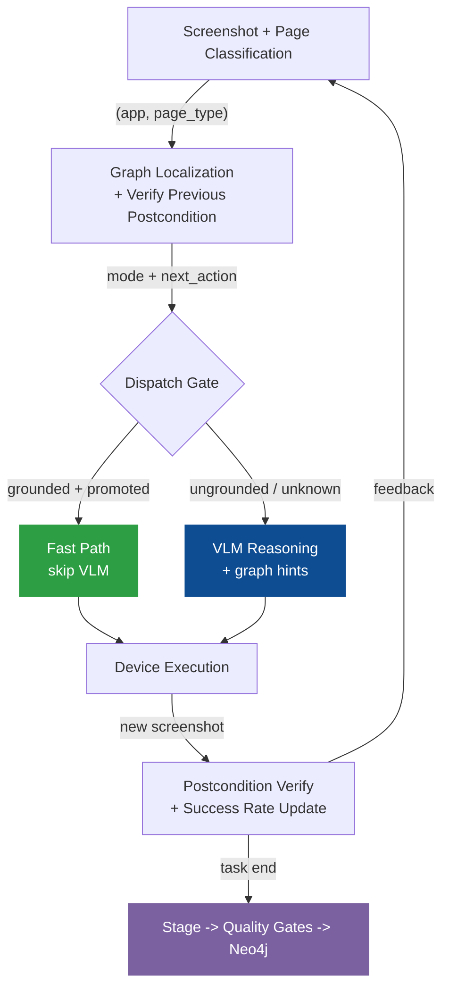

# Shopping-Agent: System Architecture

> **Version**: 2026-06-05 (rewritten)
> **Scope**: Full `phone_agent/` implementation, with emphasis on agent execution, memory orchestration, AMSG graph design, and automatic graph persistence.
> **Purpose**: Paper-ready architecture reference for academic writing.

Shopping-Agent is a **VLM-primary, graph-guided mobile GUI agent** augmented by a self-evolving **Active Mobile Spatial Graph (AMSG)**. The system automates complex shopping tasks on Android, HarmonyOS, and iOS devices through a closed-loop cycle of screenshot observation, page-state localization, graph-informed planning, VLM reasoning, action execution, and verified graph persistence.

The central design principle is *asymmetric authority*: the graph accelerates and constrains the action space while the VLM retains semantic authority over content-dependent decisions. This separation distinguishes Shopping-Agent from both pure VLM agents (which rediscover navigation from scratch every session) and pure graph planners (which cannot handle novel visual content).

---

## 1  Design Philosophy

Mobile GUI automation operates in a visual environment without a stable DOM, where four uncertainty sources drive most failures:

| Uncertainty | Failure mode | Design response |
|---|---|---|
| **Perceptual** | Same page looks different across app versions, devices, ads, popups, scroll positions. | `PageState` abstracts screenshots into reusable states defined by app, page type, landmarks, affordances, slots, risk, and semantic signature. |
| **Semantic** | Historical "tap product card" does not identify which product matches the current task. | Ungrounded transitions are explicitly marked; the VLM must choose the target based on current screen content. |
| **Transition** | Same button may open SKU selection, login, a promotion dialog, checkout, or do nothing. | `EdgeLifecycleManager` tracks empirical outcome distributions, dominance ratios, and entropy per transition. |
| **Context** | Long action histories confuse VLM calls and obscure the current task. | `UnifiedSessionState` plus `RetrievalGateway` inject progress every step and detailed memory only on demand. |

These four responses produce a system best described as **VLM-primary graph-guided control**. AMSG is not an autonomous controller; it is a verified action library, state localizer, route planner, and persistence substrate. The VLM remains the semantic authority whenever a decision depends on current screen content or user intent. This asymmetry is the defining architectural choice: it prevents the graph from replaying stale coordinates on content-sensitive pages (product choice, SKU selection, checkout) while still allowing the graph to shortcut mechanical navigation (home to search, search to results, filter toggling) at near-zero latency.

---

## 2  System Architecture

The system has three logical areas connected by a closed-loop data flow. The key to understanding the architecture is not "what layers exist" but **how data flows and who decides what**.

### 2.1  Three Areas and Their Responsibilities

**Decision Area** — answers "what to do". `PhoneAgent._execute_step()` is the sole orchestration entry point. Each step, it calls the Graph Area for localization and action suggestions, then selects Fast Path or VLM Path for execution. Components: `TaskPlan`, `ClarificationAgent`, `VerificationDetector`, `SpecGuard`.

**Graph Area** — answers "where am I, where to go". `GraphRuntimeController.locate_and_get_context()` performs localization, postcondition verification, route planning, and RuntimeDAG caching in a single call. It returns a `mode` field (`navigate` / `explore` / `verify_with_vlm` / `goal_reached`) that directly drives the Decision Area's dispatch. The Graph Area does not make semantic judgments (which product, which SKU) — only structural navigation. Components: `SpatialGraphMemory`, `ActionAdvisor`, `EdgeLifecycleManager`, Neo4j, FAISS.

**Execution Area** — answers "how to operate the device". `ModelProtocolBridge` normalizes semantic actions or VLM outputs into `DeviceActionIR` across five coordinate systems. `ActionHandler` compiles device commands. After execution, the new screenshot and page classification **feed back** into the Graph Area: postcondition verification updates edge success/failure counts, and successful task completion triggers graph persistence. Components: `ModelClient`, 5 model adapters, `ActionHandler`, `DeviceFactory` (ADB/HDC/XCTest).

### 2.2  Closed-Loop Data Flow

The three areas connect through a single closed loop. Each step, data flows in this order:



Key properties of this loop:

- **Per-step feedback**: Edge success rates update in memory after every step, not just at task end
- **Deferred persistence**: In-memory `EdgeLifecycleManager` counters update in real time; Neo4j writes only on successful task completion
- **Fast Path protection**: Postcondition mismatch triggers automatic fallback to VLM Path — worst case is one extra VLM call, not a wrong action

---

## 3  Agent Design

This section describes a task's complete lifecycle in chronological order: from receiving user input to graph persistence after completion. Entry point: `PhoneAgent.run(task)`. Main loop: `_execute_step()`. Exit: `MemoryManager.end_task()`.

### 3.1  Task Reception: From Natural Language to Executable State

When the user inputs `"Search iPhone 16 silver 256G on Taobao, add to cart"`, `run()` performs four steps:

**① State reset.** Clears previous task's dialogue context, step counter, RuntimeDAG cache, verification counters, and model adapter history. Tasks are fully isolated.

**② Task slot extraction.** `TaskSpecExtractor.extract(task)` uses regex to extract structured constraints: `query="iPhone 16"`, `color="silver"`, `storage="256G"`, `domain="shopping"`. These slots feed three downstream consumers: `GoalSpec` (graph routing target), `SpecGuard` (purchase safety checks), and `ClarificationAgent` (whether to ask the user).

**③ VLM pre-plan.** `_vlm_pre_plan(task)` asks a VLM to decompose the task into ordered steps (e.g., "open Taobao → search → select product → select specs → add to cart"), each annotated with a target page_type. The pre-plan is scaffolding — each step is still governed by the current screenshot and safety gates.

**④ Memory session start.** `MemoryManager.start_task()` resets `UnifiedSessionState`, loads relevant user preferences from FAISS (e.g., "prefers silver"), and clears the RuntimeDAG cache.

### 3.2  Step Loop: The Complete _execute_step() Flow

`run()` calls `_execute_step()` in a loop. Each step, in actual code order:

**Phase 1 — Perception.** Capture screenshot via `DeviceFactory.get_screenshot()`, get current app, compute `ui_hash` (MD5). Classify page via `PageClassifier` → `page_type`, or use RuntimeDAG hint (skip classifier, save one VLM call).

**Phase 2 — Safety gate.** `detect_verification(page_type, summary)` checks for login/CAPTCHA/SMS pages. Hit → `Take_over` (pause for human). Miss → continue. Adaptive counter: 0-3 consecutive hits → auto-takeover; 4-5 → let VLM try once; >5 → task fails.

**Phase 3 — Graph coordination + clarification.** `memory_manager.locate_and_get_context()` delegates to `GraphRuntimeController`:
- If RuntimeDAG exists and valid → advance cursor, return next action (~10ms)
- Otherwise → `(app, page_type)` match in Neo4j → verify previous pending transition → Dijkstra route → cache as new RuntimeDAG
- Returns `mode` + `next_actions` + `semantic_context`

On the first step only, `ClarificationAgent.check_and_clarify()` runs a three-layer short-circuit: Layer 1 (rule check — specs already complete? skip), Layer 2 (fill gaps from FAISS user preferences), Layer 3 (only if still vague — ask strong VLM whether to clarify with user).

**Phase 4 — Context assembly.** `memory_manager.get_injection_context()` builds layered VLM context:
- Always: progress summary (1-2 lines) + current focus
- On demand: `RetrievalGateway` detects recall/comparison/stagnation signals in VLM thinking → inject product list or history steps
- Conditional: price/color/storage constraints on decision pages
- Graph context, TaskPlan progress markers, SpecGuard constraint reminders, ActionAdvisor action hints

**Phase 5 — Dispatch and execution.**
- If `mode=navigate` and graph returns grounded action → **Fast Path**: `ActionAdvisor.get_fast_action()` with slot substitution (`<query>` → "iPhone 16"), `ActionHandler.execute()` (~0.5s). Take new screenshot, check page_type matches expected postcondition. Mismatch → fall through to VLM Path.
- Otherwise → **VLM Path**: `ModelClient.request(messages)`, parse response, `ModelProtocolBridge.normalize_action()` → `DeviceActionIR`. `SpecGuard.check()` intercepts purchase-commit actions (replaces with user prompt if specs unverified). `ActionHandler.execute()` (~5s including inference).

**Phase 6 — State update.** `memory_manager.update_state_and_transition()` builds current `PageState`, caches `(current_page, action, expected_postcondition)` as pending transition for next step's verification. `add_step()` records to `UnifiedSessionState`, detects stagnation (3+ identical actions), extracts product info. Context history compressed: keep last 2 full VLM conversations, summarize the rest.

### 3.3  Context Management: What Gets Injected Per Step

| Priority | Content | Source | When injected |
|---|---|---|---|
| 1 (highest) | System prompt + task + screenshot | Agent config | Every step |
| 2 | Task plan progress markers | `TaskPlan.status_text()` | Step 2 onward |
| 3 | Graph navigation context | `GraphRuntimeController` | mode != explore |
| 4 | Critical constraints (price/color/storage) | `TaskSlots` + `SpecGuard` | Decision pages |
| 5 | Last 8 step summaries | History compression | Every step |
| 6 | On-demand memory retrieval | `RetrievalGateway` | VLM thinking shows recall/compare/stall |
| 7 (lowest) | ActionAdvisor action hints | Graph promoted edges | mode = navigate |

Key design: **not all memory enters every call.** Progress summary is always injected (2-3 lines). Detailed product comparisons, cart calculations, etc. are triggered only when the VLM's thinking text signals a need. In a typical 30-step task, full retrieval triggers 3-5 times.

### 3.4  Task End: Result Handling and Graph Persistence

Loop terminates when VLM outputs `terminate`/`answer`, or `max_steps` is reached.

`MemoryManager.end_task(success, result)` performs:

1. **Save trajectory** (always): Full step sequence → `trajectories/{timestamp}_{ok|fail}_{slug}.json`
2. **Learn patterns** (success only): Contact-app bindings, app usage frequency → FAISS
3. **Flush graph** (success only): `flush_staged_graph()` → canonicalization → quality filter → Neo4j
4. **VLM trajectory review** (success only): `TrajectoryReviewer` extracts new transitions → VLM validates → import as hypothesis

Failed tasks save trajectory files only — no graph writes. This is the first gate against noise pollution.

---

## 4  Memory System: What It Provides to the Agent Loop

Recall the agent loop (Section 3.2): Phase 3 needs graph localization and routing, Phase 4 needs VLM context assembly, Phase 6 needs step recording. These three needs have different time scales and data granularities — that is why the memory system is split into multiple surfaces.

### 4.1  What Each Surface Solves in the Agent Loop

**User memory (FAISS, cross-session)** → serves Phase 3 clarification and Phase 4 slot filling. Problem: user says "buy me a phone" without specifying color. Asking every time is bad UX. Solution: FAISS stores "user prefers silver" from a past task. `ClarificationAgent` Layer 2 fills the gap silently.

**Session state (UnifiedSessionState, per-task)** → serves Phase 4 progress injection and Phase 6 step recording. Problem: VLM needs to know "where I am in the task" but not every step's full reasoning. Solution: single write path via `record_step()` with truncated thinking (150 chars). `progress_summary()` generates one line per step for injection. Full thinking stored in `_reasoning_archive`, queried only on demand.

**Graph memory (SpatialGraphMemory + Neo4j, cross-session)** → serves Phase 3 localization/planning and Phase 5 Fast Path. Problem: VLM costs ~5s per step, but "home → search" is identical across all tasks. Solution: graph caches verified transitions. Phase 3 queries the graph; if a route exists, Phase 5 executes via Fast Path (~0.5s).

**Trajectory files (JSON, per-task artifact)** → does not serve the agent loop; serves post-task graph evolution. Problem: how to discover new transitions after a successful task? Solution: `TrajectoryReviewer` reads trajectory files, extracts new transitions, VLM-validates, imports as hypothesis edges.

### 4.2  On-Demand Retrieval: Why Not Inject Everything

If Phase 4 injected all history, all products, and all preferences into every VLM call: (1) token waste — 30 steps of full history is 3000+ tokens, but VLM only needs history on 3-5 steps; (2) attention dilution — irrelevant context hurts current-step reasoning.

`RetrievalGateway` monitors VLM thinking text and triggers retrieval only on specific signals:

| Signal in VLM thinking | Retrieval type | Injected content |
|---|---|---|
| "saw earlier", "forgot", "which one" | Recall | Last 5 step summaries + relevant thinking |
| "cheaper", "compare", "better value" | Product comparison | Browsed products table (name/price/specs) |
| "total", "how much altogether" | Cart calculation | Cart items + total price |
| 3+ identical actions (stagnation) | Auto-recall | Recent steps + "may need to select specs first" |

Cooldown: no retrieval within 3 steps of last trigger. Result: in a 30-step task, 25+ steps get 2-3 lines of progress summary; only 3-5 steps get detailed retrieval.

### 4.3  Cross-Surface Data Flow

The four surfaces coordinate through the agent lifecycle. Concrete example:

Task N: "Buy silver iPhone 16 on Taobao" → succeeds → FAISS learns "prefers silver" + Neo4j gets new edges + trajectory saved.

Task N+1: "Buy me a phone" (no color specified) → ClarificationAgent Layer 2 queries FAISS → finds "prefers silver" → fills slot silently → graph already has edges from Task N → Fast Path hits more steps → task completes faster without asking the user.

---

## 5  Spatial Graph (AMSG): Why It Is Designed This Way

### 5.1  What Problem It Solves in the Agent Loop

Without the graph, every step takes the VLM Path: screenshot → VLM reasoning (~5s) → execute. A 20-step shopping task costs ~100s of VLM inference. But most steps are mechanical navigation: tap search, type query, submit, scroll. These are identical across all shopping tasks. The graph caches verified navigation paths so Phase 5 can take the Fast Path (~0.5s), reserving VLM calls for steps that require semantic judgment (which product, which SKU).

This is not a general graph planning problem. The graph is small (~8-12 page types, 15-25 edges), and Dijkstra completes in microseconds. The real design challenges are: (1) what to store so it reuses across tasks, (2) how to separate what the graph can do from what only VLM can do, (3) how to prevent noise from polluting the graph, and (4) how to avoid re-planning every step.

### 5.2  Page-State Abstraction: What to Store for Reuse

Graph nodes are not screenshots — they are semantic descriptions: `PageState = (app, page_type, landmarks, affordances, slots, risk)`. Searching "iPhone" and "headphones" produce different screenshots but the same page structure (search bar, product cards, filter buttons). Storing screenshot hashes would create a new node per search query; storing `(app, page_type)` with semantic signature enables cross-task reuse.

In the agent loop: Phase 3's `locate_and_get_context()` matches `(app, page_type)` against Neo4j nodes. When found, the node's outgoing edges (NEXT_ACTION) are the verified actions available on this page. Phase 5's `ActionAdvisor.query()` returns promoted edges as Fast Path candidates.

### 5.3  Grounded vs. Ungrounded: Who Controls What

The most critical design decision. In a shopping flow:

| Step | Nature | Who decides |
|---|---|---|
| home → search_input | Button position is fixed | Graph (Fast Path) |
| search_input → search_result | Type + submit, mechanical | Graph (slot substitution) |
| search_result → product_detail | Which product? Depends on task | VLM only |
| product_detail → spec_selection | Which specs? Depends on user | VLM only |

Grounded transitions have stable coordinates and deterministic outcomes → Fast Path. Ungrounded transitions require seeing the current screen to choose the target → VLM Path with graph hints.

This classification happens per-edge via `ActionAdvisor.is_fast_executable()`: `grounded=True` AND `confidence >= 0.9` AND has coordinates → Fast Path. Otherwise → VLM.

### 5.4  Edge Lifecycle: Preventing Noise

Online observations include popups, login interceptions, classifier errors. If written directly to the graph, the planner might route through a popup dialog. The lifecycle system only promotes statistically reliable transitions:

```
hypothesis → candidate → promoted → demoted
(first seen)  (verified N times)  (success rate >= θ)  (rate dropped)
```

Only `promoted` edges are visible to `ActionAdvisor`. Default thresholds: N=1, θ=0.6. Strict mode: N=3, θ=0.8. Demotion triggers automatically when success rate drops below 40% (e.g., app UI changed).

The delayed postcondition verification from Phase 6 (Section 3.2) is the data source: step t caches `(page, action, expected_target)`, step t+1 compares actual page_type → records success or failure → feeds lifecycle counters.

### 5.5  Staging-First Persistence: Three Quality Gates

Even with lifecycle, directly writing to Neo4j is risky — a failed task's entire trajectory may be wrong navigation. Three gates:

**Gate 1 (task success)**: `flush_staged_graph()` only runs on `end_task(success=True)`. Failed tasks stage in memory only.

**Gate 2 (VLM trajectory review)**: `TrajectoryReviewer` uses a strong VLM to validate each new transition — "is this real navigation or a popup/classifier error?" Only approved transitions import as `hypothesis`.

**Gate 3 (canonicalization)**: Semantic signature dedup, transient page filtering (`unknown` removed), app consistency check.

No raw action writes directly to Neo4j. Every path passes at least one gate.

### 5.6  RuntimeDAG: Avoid Re-Planning Every Step

The full Phase 3 pipeline (Neo4j query + Dijkstra + context assembly) takes 50-200ms including network round-trip. RuntimeDAG caches the planning result as an in-memory edge array + cursor. Consecutive steps read `route[current_index]` in <1ms, skipping the entire pipeline.

DAG invalidation is passive: postcondition mismatch, app switch, high-risk edge, or route exhaustion. After invalidation, next Phase 3 rebuilds automatically.

Side effect: when DAG is valid, `should_use_page_classifier()` returns `False` — Phase 1 skips the classifier, saving one VLM call. If a popup appears, the agent acts on stale page_type, but delayed postcondition verification catches the mismatch at the next step.

### 5.7  Action Compilation: Semantic to Device

Graph stores `SemanticActionIR` (intent + target + locator + postcondition). Phase 5 compiles through two stages: `SpatialModelBridge` (semantic → device IR) then `ModelProtocolBridge` (coordinate normalization across 5 VLM coordinate systems via (0,1) intermediate). This keeps the graph model-agnostic — the same Neo4j graph serves different VLMs.

---

## 6  Model and Device Abstraction

### 6.1  Multi-Model Support

Shopping-Agent supports five VLM families through a unified adapter architecture:

| Model family | Coordinate space | Context strategy | Response format |
|---|---|---|---|
| AutoGLM | [0, 1000] normalized | Cumulative (append each turn) | `<answer>` XML |
| UI-TARS | Absolute pixels (smart_resize) | Max 5 images, prune oldest | "Thought: ... Action: ..." |
| Qwen-VL | [0, 999] normalized | Fresh rebuild each turn | `<tool_call>` JSON |
| MAI-UI | [0, 999] normalized | Max 3 images | `<thinking>` + `<tool_call>` |
| GUI-Owl | [0, 1.0] decimal | Max 1 image (current only) | Action + `<tool_call>` |

`ModelProtocolBridge._scale_coord()` is the coordinate transformation hub, converting between all coordinate spaces through a normalized (0, 1) intermediate representation. This means the graph can store coordinates in any space and they will be correctly converted for the current model at runtime.

### 6.2  Device Abstraction

`DeviceFactory` provides a unified interface across three platforms:

- **ADB** (Android): Full automation via `adb shell input` and `screencap`.
- **HDC** (HarmonyOS): Equivalent automation via `hdc` command-line tools.
- **XCTest** (iOS): WebDriverAgent-based control via HTTP API.

`ActionHandler` converts canonical action dicts to device calls. The handler manages keyboard setup for text input (switching to ADB keyboard, clearing fields, typing text, and restoring the original IME), timing delays between operations, and compound action sequences for multi-step same-page operations.

---

## 7  Configuration Presets

`AMSGOptimConfig` provides configuration presets via the `AMSG_CONFIG` environment variable. The default is `legacy` (fixed-score localization, Dijkstra planning, no lifecycle). The production-recommended preset is `sava` (Dijkstra, strict lifecycle with 3x verification and 80% dominance threshold).

Additional presets (`belief_only`, `planner_only`, `full`) exist as experimental infrastructure for future ablation studies — they are not validated contributions.

---

## 8  Comparative Analysis

### 8.1  Positioning in the Literature

Shopping-Agent addresses three specific gaps in the current GUI agent landscape:

**Gap 1: Stateless re-exploration.** Most GUI agents (including strong systems like ColorAgent [Li et al., 2025], MobiAgent [Zhang et al., 2025]) treat each task session as independent. They may learn within a session through reflection or self-correction, but structural knowledge about app navigation does not persist across sessions. Shopping-Agent's AMSG persists verified transitions in Neo4j, allowing the agent to build cumulative knowledge about app navigation patterns.

**Gap 2: Graph without lifecycle.** Systems that do build navigation graphs — PG-Agent [Chen et al., 2025] constructs page graphs from episodes, KG-RAG [Guan et al., 2025] transforms UTGs into vector databases, WebNavigator [Zhang et al., 2025] builds interaction graphs via heuristic exploration — treat the graph as a static artifact. Once built, edges do not evolve. Shopping-Agent introduces a full lifecycle: hypothesis → candidate → promoted → demoted, with data-driven promotion criteria and automatic demotion when UI changes.

**Gap 3: Binary graph/VLM control.** Existing graph-augmented agents use the graph either as a static RAG source (PG-Agent, KG-RAG) or as a deterministic controller that bypasses the VLM entirely (WebNavigator's Teleport). Shopping-Agent introduces a continuous spectrum: Fast Path (graph alone, ~0.5s), Graph Co-pilot (graph hints + VLM verification, ~3s), and Full VLM Path (VLM alone, ~5s). The dispatch decision is data-driven, based on edge lifecycle stage, outcome entropy, and grounding status.

### 8.2  Detailed Comparison

| Dimension | ColorAgent | PG-Agent | KG-RAG | WebNavigator | MobiAgent (AgentRR) | **Shopping-Agent** |
|---|---|---|---|---|---|---|
| **Graph structure** | None (multi-agent framework) | Page graph from episodes | UTG → vector DB | Interaction graph (BFS) | Multi-level experience tree | AMSG (typed directed graph with lifecycle) |
| **Graph evolution** | N/A | Static after construction | Static after extraction | Static after offline BFS | Record-replay (static) | Self-evolving: online staging → postcondition verification → lifecycle promotion → demotion |
| **Persistence** | None | In-memory per session | Vector DB (static) | Vector DB (static) | Latent memory model | Neo4j with lifecycle metadata and outcome distributions |
| **VLM/Graph boundary** | VLM-only (no graph) | RAG retrieval → VLM | RAG retrieval → VLM | Deterministic teleport (no VLM for navigation) | Experience → skip VLM (binary) | Per-edge grounded/ungrounded classification with postcondition fallback |
| **Localization** | VLM perception | BFS similarity search | Embedding retrieval | Multimodal retrieval (ColQwen) | Page matching | (app, page_type) matching + optional Bayesian extension |
| **Planning** | Multi-agent decomposition | BFS on page graph | BFS on UTG | Shortest path on interaction graph | Prefix reusability | Dijkstra on weighted graph (success rate + risk penalty) |
| **Safety** | None reported | None reported | None reported | None reported | None reported | SpecGuard: task-slot-aware purchase interception |
| **Transition verification** | Self-evolving training (model-level) | None (edges from episodes) | None | None | None | Postcondition verification + outcome distribution + entropy threshold |
| **Quality gate** | Trajectory filtering (training) | None | None | None | Manual correction of traces | Three gates: task success, VLM trajectory review, canonicalization |
| **Multi-model support** | Proprietary model | GPT-4o | MobileAgent-v2, UI-TARS | GPT-4o, Gemini, Claude | MobiMind (custom) | 5 families: AutoGLM, UI-TARS, Qwen-VL, MAI-UI, GUI-Owl |
| **Cross-platform** | Android only | Android (evaluation) | Android + HarmonyOS | Web only | Android only | Android + HarmonyOS + iOS |

### 8.3  Core Contributions (Default-Enabled, Reproducible)

1. **Self-updating page-state graph**. The first cross-session persistent navigation knowledge graph for mobile GUI agents. The graph grows with successful tasks and shrinks when edge reliability drops. Unlike static graphs (PG-Agent, KG-RAG, WebNavigator), AMSG evolves automatically.

2. **Success-rate-driven edge lifecycle**. Each transition tracks postcondition success/failure counts and progresses through hypothesis → candidate → promoted → demoted stages. Only statistically reliable transitions enter the executable action library. This solves the real problem of online observation noise (popups, login interceptions, classifier errors).

3. **Grounded/ungrounded classification with three-speed dispatch**. Each edge is independently classified as grounded (graph executes directly, ~0.5s) or ungrounded (VLM decides, ~5s). Fast Path has postcondition protection — mismatch falls back to VLM. This is the only known per-edge control boundary for GUI agent graphs.

4. **Delayed postcondition verification**. Action outcomes are recorded at step t+1 when the actual result can be observed, not at step t when only the intent is known. This ensures the lifecycle system receives ground-truth observations.

5. **Staging-first persistence with three quality gates**. Failed tasks do not write to the graph. New transitions require VLM review. All paths pass through canonicalization. No raw action writes to Neo4j.

6. **Structured task constraints as first-class state**. Task specs (color, storage, size, price) are extracted once and enforced by SpecGuard at purchase commit. This makes shopping safety a system property, not prompt engineering.

### 8.4  Experimental Extensions (Not Default-Enabled)

The following are implemented but require ablation experiments to validate as contributions:

- Multi-channel Bayesian belief localization (default: off; `(app, page_type)` matching suffices for most cases)
- Belief-A* enhanced planner (default: Dijkstra; enhancement terms contribute < 0.1 on typical graph sizes)
- Entropy-driven VLM verification boundary (implemented but hardcoded transition set is the primary mechanism)

---

## 9  Implementation Map

| Concept | File |
|---|---|
| Main loop | `phone_agent/agent.py` (1,785 lines) |
| Task plan | `phone_agent/task_plan.py` (133 lines) |
| Slot extraction | `phone_agent/core/task_spec.py` (323 lines) |
| Clarification | `phone_agent/clarify.py` (400 lines) |
| Purchase safety | `phone_agent/core/spec_guard.py` (252 lines) |
| Verification detection | `phone_agent/verification_detector.py` (177 lines) |
| Memory manager | `phone_agent/memory/memory_manager.py` |
| Unified session state | `phone_agent/memory/core/unified_state.py` |
| On-demand retrieval | `phone_agent/memory/retrieval_gateway.py` |
| Spatial graph memory | `phone_agent/memory/spatial_graph_memory.py` |
| Neo4j store | `phone_agent/memory/graph_store.py` |
| Lifecycle persistence | `phone_agent/memory/graph_lifecycle_store.py` |
| Runtime graph controller | `phone_agent/spatial/runtime_controller.py` |
| Action advisor | `phone_agent/spatial/action_advisor.py` |
| Edge lifecycle | `phone_agent/spatial/edge_lifecycle.py` |
| AMSG config presets | `phone_agent/spatial/amsg_config.py` |
| Belief localizer | `phone_agent/spatial/belief_localizer.py` |
| Enhanced planner | `phone_agent/spatial/enhanced_planner.py` |
| Schema registry | `phone_agent/spatial/schema_registry.py` |
| Spatial model bridge | `phone_agent/spatial/model_bridge.py` |
| Model protocol bridge | `phone_agent/model/protocol_bridge.py` |
| Model client | `phone_agent/model/client.py` |
| Model adapters | `phone_agent/model/adapters.py` |
| Action execution | `phone_agent/actions/handler.py` |
| Device abstraction | `phone_agent/device_factory.py` |
| Trajectory reviewer | `phone_agent/spatial/trajectory_reviewer.py` |


---

## 10  Paper Method Summary

> Shopping-Agent is a VLM-primary mobile GUI agent augmented by a self-evolving Active Mobile Spatial Graph (AMSG). The system abstracts screenshots into semantic page states and persists verified navigation transitions in Neo4j. Each step locates the current page via `(app, page_type)` matching, plans a route with Dijkstra on the weighted graph, and caches the route as a RuntimeDAG for subsequent steps to advance directly. Grounded, promoted transitions execute via Fast Path (~0.5s, no VLM call); ungrounded transitions require VLM to choose the specific target (~5s), with postcondition protection — mismatch triggers automatic fallback. Delayed postcondition verification at step t+1 confirms step t's outcome, ensuring edge success-rate tracking is based on ground-truth observations. Online observations are staged in memory; only successful tasks trigger Neo4j writes, and new transitions require VLM trajectory review — no raw actions write directly to the graph. User constraints are extracted as first-class task slots and enforced by SpecGuard at the point of purchase commitment.
