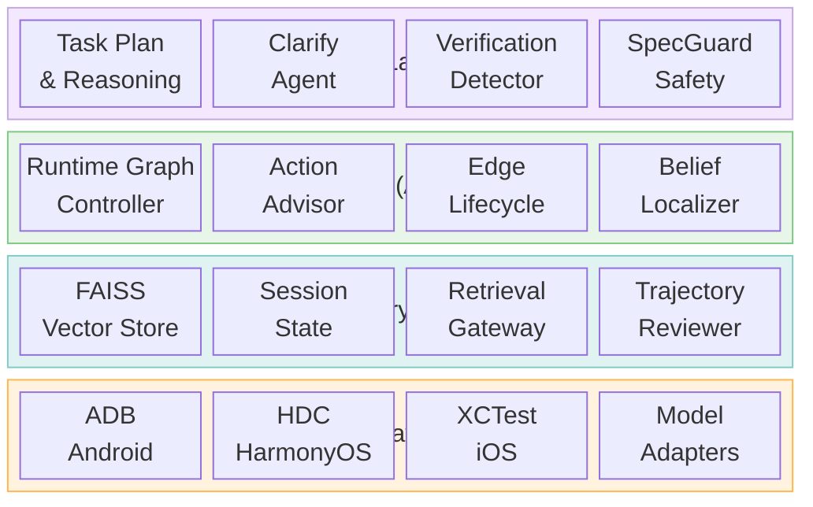
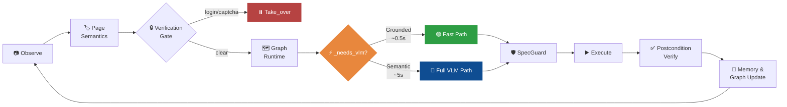
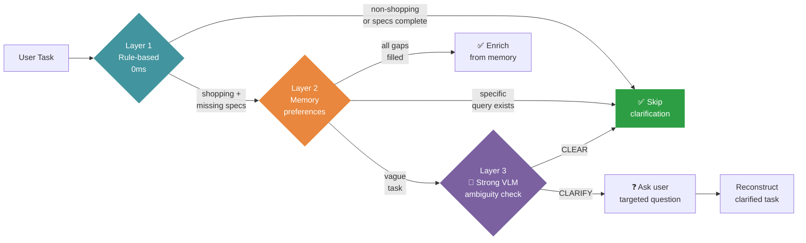
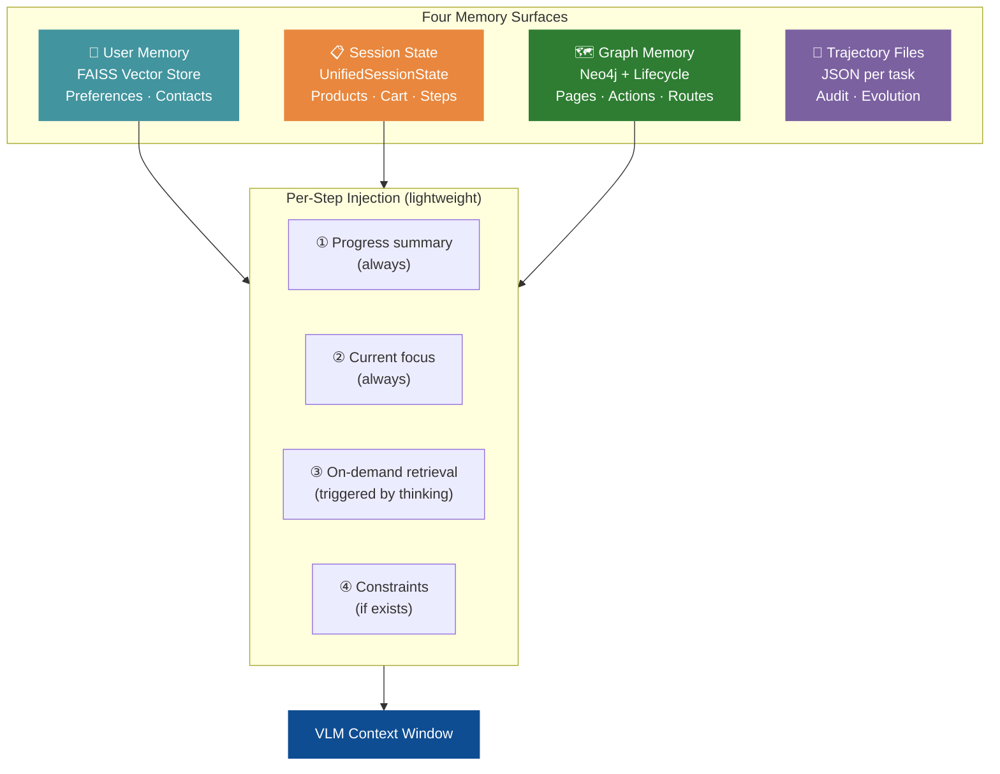
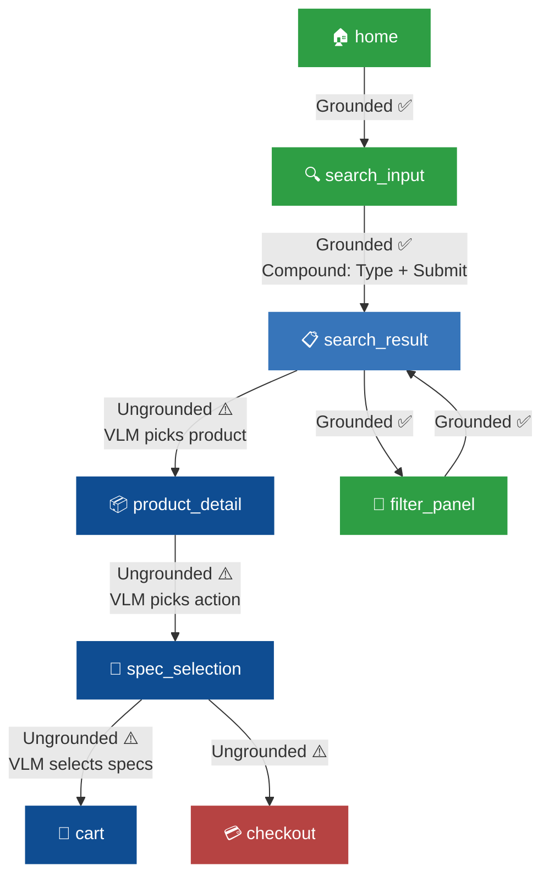
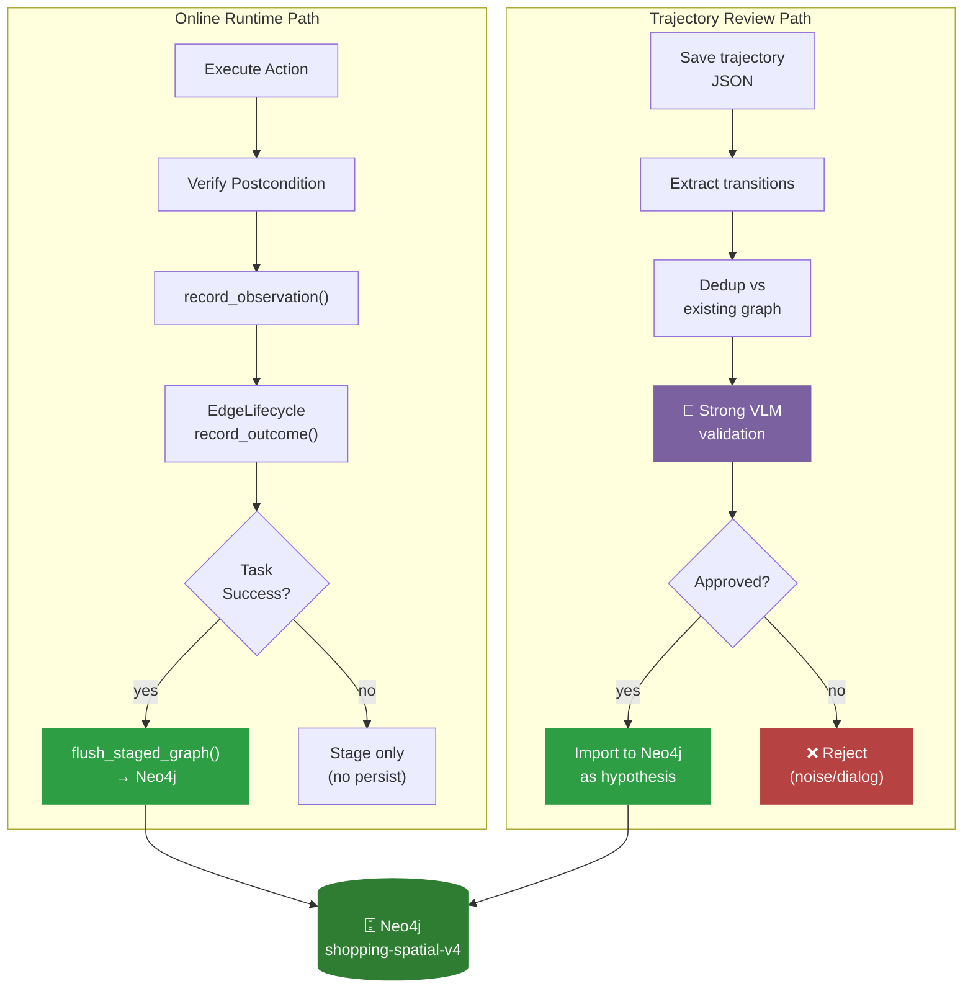

# Shopping-Agent Architecture

> Version: 2026-06-05 (revised)  
> Scope: current checkout under `phone_agent/`, with emphasis on `agent.py`, `core/`, `memory/`, `spatial/`, `model/`, `actions/`, `device_factory.py`, and the AMSG v4 Neo4j runtime contract.  
> Purpose: provide a paper-ready architecture and method reference for later academic writing.

Shopping-Agent is a VLM-primary mobile GUI agent with a self-evolving Active Mobile Spatial Graph, abbreviated as AMSG. The central design is not "replace the VLM with a graph planner". The design is:

1. Let the VLM handle semantic judgement, such as product choice, task constraint interpretation, visual ambiguity, dialog understanding, and user-facing decisions.
2. Let AMSG handle reusable structure, such as page localization, safe navigation priors, verified transitions, postcondition statistics, action grounding evidence, and graph-based context.
3. Let the memory system inject only the evidence needed at the current step, rather than pushing the entire history into every prompt.
4. Let graph persistence be earned by verification, not by raw trajectory replay.

This creates an asymmetric agent: the graph accelerates and constrains the loop, while the VLM remains the semantic authority whenever a decision depends on current screen content or user intent.

## 1. Design Philosophy

Mobile GUI automation is difficult because the agent must control a changing visual system without a stable DOM. The codebase addresses four uncertainty sources:

| Uncertainty | Concrete failure mode | Design response | User impact |
|---|---|---|---|
| Perceptual uncertainty | The same page looks different across app versions, devices, ads, popups, and scroll positions. | Convert screenshots into `PageState` using app, page type, landmarks, affordances, slots, risk, and semantic signature. | The agent can reuse knowledge across layouts without blindly replaying pixels. |
| Semantic uncertainty | Historical "tap product card" does not say which product is correct for the current task. | Mark ungrounded transitions as VLM-required; strip content-specific targets from graph hints. | The agent avoids buying or selecting the wrong item because of stale history. |
| Transition uncertainty | The same button may open SKU selection, login, a promotion dialog, checkout, or do nothing. | `EdgeLifecycleManager` tracks outcome distributions, dominance ratio, entropy, and lifecycle stage. | Shortcuts are only used when they are empirically predictable. |
| Context uncertainty | Long histories confuse VLM calls and hide the current task. | `UnifiedSessionState` plus `RetrievalGateway` inject progress every step and detailed memory only on demand. | The agent stays focused without losing prior observations when it needs them. |

The resulting system is best described as **VLM-primary graph-guided control**. AMSG is not an autonomous controller. It is a verified action library, state localizer, route planner, and persistence substrate.

## 2. System Layers

| Layer | Main files | Responsibility |
|---|---|---|
| Task and reasoning | `phone_agent/agent.py`, `phone_agent/task_plan.py`, `phone_agent/core/task_spec.py` | Interpret the natural-language task, create a VLM pre-plan, keep task progress visible, and decide the current control mode. |
| User-facing safety | `phone_agent/clarify.py`, `phone_agent/core/spec_guard.py`, `phone_agent/verification_detector.py`, `phone_agent/core/status.py` | Ask only when the task is genuinely ambiguous, block unsafe SKU/payment commits, detect login/CAPTCHA/SMS pages, and expose structured status events. |
| Runtime graph guidance | `phone_agent/spatial/runtime_controller.py`, `phone_agent/spatial/action_advisor.py` | Locate the current page, infer graph goal, plan routes, expose promoted actions, and decide whether to skip or call the VLM. |
| AMSG memory | `phone_agent/memory/spatial_graph_memory.py`, `phone_agent/spatial/edge_lifecycle.py`, `phone_agent/spatial/belief_localizer.py`, `phone_agent/spatial/enhanced_planner.py` | Maintain page states, transition edges, lifecycle metadata, Bayesian belief localization, and enhanced planning. |
| Persistence | `phone_agent/memory/graph_store.py`, `phone_agent/memory/graph_lifecycle_store.py`, `phone_agent/spatial/trajectory_reviewer.py` | Persist UIState/Action/TaskTarget graph data, lifecycle statistics, and reviewed transition evidence into Neo4j. |
| Session memory | `phone_agent/memory/memory_manager.py`, `phone_agent/memory/core/unified_state.py`, `phone_agent/memory/retrieval_gateway.py`, `phone_agent/memory/memory_store.py` | Store preferences, contacts, task history, products, cart state, current focus, trajectory JSON, and on-demand retrieval results. |
| Model protocol | `phone_agent/model/client.py`, `phone_agent/model/adapters.py`, `phone_agent/model/protocol_bridge.py`, `phone_agent/spatial/model_bridge.py` | Support AutoGLM, UI-TARS, Qwen-VL, MAI-UI, and GUI-Owl while normalizing model outputs into device actions. |
| Device execution | `phone_agent/actions/handler.py`, `phone_agent/actions/handler_*.py`, `phone_agent/device_factory.py`, `phone_agent/{adb,hdc,xctest}/` | Execute Launch, Tap, Type, Swipe, Back, Compound, Interact, and Take_over on Android, HarmonyOS, and iOS-style backends. |



The runtime database defaults to `shopping-spatial-v4` through `AMSG_RUNTIME_GRAPH_DATABASE`. `GraphRuntimeController` advertises the runtime contract as `amsg-v4-runtime` and disables legacy fallback by default in `MemoryManager._ensure_graph_runtime_controller()`.

## 3. Agent Execution Model

The main control loop is implemented by `PhoneAgent._execute_step()`. Each step follows the same closed loop:



### 3.1 Task Initialization

`PhoneAgent.run(task)` resets per-task state:

- dialogue context
- step count
- graph failure counters
- verification counters
- step summaries
- `TaskPlan`
- model adapter action history
- memory manager session state

The agent then calls `_vlm_pre_plan(task)`, preferably through `AMSG_STRONG_VLM_*` if configured, otherwise through the normal model client. The pre-plan extracts:

- `search_query`
- `product`
- `specs`
- `target_action`
- `target_page`
- ordered steps with target page types

`TaskPlan.from_vlm_output()` turns this into a step list and goal slots. This is a scaffold, not ground truth. The current screenshot and safety gates still decide what can actually be executed.

### 3.2 Observation and Page Semantics

The observation stage reads:

- screenshot from `DeviceFactory.get_screenshot()`
- current app from `DeviceFactory.get_current_app()`
- screenshot hash as `ui_hash`
- page semantics from `PageClassifier`, unless `RuntimeDAG` can safely provide a hint

The resulting `screen_dict` contains:

| Field | Meaning |
|---|---|
| `ui_hash` | MD5 identity of the current screenshot payload. |
| `semantic_layout` | Lightweight app and page-type description for legacy compatibility. |
| `app` | Current app name from the backend. |
| `page_type` | Classifier or RuntimeDAG page type. |
| `summary` | Short page description. |
| `elements` | Structured visible-element metadata when available. |
| `_runtime_hint` | Whether the page semantics came from a RuntimeDAG hint. |

`GraphRuntimeController.should_use_page_classifier()` skips the classifier only when all of the following are true:

- an active `RuntimeDAG` exists and is usable
- no pending postcondition needs verification
- the next edge is not high-risk
- the current app still matches the DAG app

This is a latency optimization. It is not a replacement for perception.

### 3.3 Verification and Human Takeover

There are two verification-detection layers:

1. Before the VLM call, `detect_verification(page_type, summary, elements)` checks PageClassifier output.
2. After the VLM call, `detect_verification_from_vlm(thinking, raw_content)` catches verification pages recognized by the model when PageClassifier was skipped.

When login, CAPTCHA, SMS code, slider verification, or similar user-owned pages are detected, the agent executes a `Take_over` action through `ActionHandler._handle_takeover()`. This prevents the model from inventing actions on authentication or verification screens.

### 3.4 Clarification Before Action

`ClarificationAgent` runs on the first step for shopping and food-delivery tasks. It uses a three-layer short-circuit:

1. `TaskSpecExtractor` checks whether the task already has enough slots.
2. Memory preferences fill missing slots when possible.
3. A VLM ambiguity check asks a targeted user question only when the task is still underspecified.



This is important for user experience. The system should not ask users for every missing field. It should ask only when the missing field blocks safe execution.

### 3.5 Runtime Graph Contract

`MemoryManager.locate_and_get_context()` delegates to `GraphRuntimeController.locate_and_get_context()`. The controller owns the v4 graph contract and returns:

| Key | Meaning |
|---|---|
| `mode` | `navigate`, `verify_with_vlm`, `explore`, or `goal_reached`. |
| `belief` | Current page posterior or deterministic fallback belief. |
| `goal_spec` | Target page types and runtime slots. |
| `route_plan` | Planned graph route and confidence. |
| `next_actions` | Candidate graph action for the current step. |
| `semantic_context` | Prompt context with graph, task-plan, and optional v4 knowledge hints. |
| `repair_hint` | Decision after pending postcondition verification. |
| `runtime_metrics` | Classifier calls, DAG skips, DAG hits/misses, and coverage gaps. |

The controller also caches `RuntimeDAG` when a route exists. RuntimeDAG allows cheap page hints and next planned action lookup across consecutive steps, but it is invalidated by risk, app mismatch, postcondition requirements, or repeated graph failure.

### 3.6 Three Dispatch Paths

The agent has three practical execution paths:

| Path | Trigger | VLM call | Safety boundary |
|---|:---|---:|---|
| Fast Path | `ActionAdvisor` returns a grounded promoted action with confidence at least `0.9` and aligned with the current plan step. | No | Must pass postcondition check; otherwise falls through to Full VLM Path. |
| Graph shortcut | `GraphRuntimeController` returns a high-confidence compilable structural action. | No | Disabled for high-risk, low-confidence, ungrounded, or uncompiled actions. |
| Full VLM Path | No safe graph action, semantic target choice required, low confidence, failed repair, or safety guard active. | Yes | VLM sees graph hints but must ground on current screenshot. |

The Full VLM Path is intentionally broad. In shopping tasks, the graph should not choose a concrete product, store, SKU, or checkout decision unless the transition is known to be grounded and safe.

## 4. Structured Task Constraints

`phone_agent/core/task_spec.py` is the single source of truth for extracting task slots. The extracted `TaskSlots` include:

- `query`
- `product`
- `price`
- `color`
- `storage`
- `size`
- `contact`
- `app`
- `domain`

These slots are consumed by:

- `ClarificationAgent`, to decide whether to ask before execution
- `SpecGuard`, to block unsafe purchase commits
- `GoalSpec`, to guide graph routing
- `MemoryManager`, to learn preferences and constraints
- `TaskPlan`, to fill runtime placeholders such as `<query>`

The key decision is to treat task constraints as first-class state, not as incidental prompt text. This makes the shopping flow safer: a requested color, storage size, clothing size, or price range can be checked again at the exact point where the model tries to commit an action.

## 5. SpecGuard and Purchase Safety

`SpecGuard` protects spec-selection, checkout, and payment-adjacent pages. It has two entry points:

- `get_context_hints()`: injects constraint reminders on spec, checkout, and payment pages.
- `check()`: intercepts a purchase-commit action before execution and can replace it with `Interact`.

The guard activates only on shopping apps and only for commit-like actions, such as add-to-cart, buy-now, checkout, submit-order, or payment. It does not block selection actions that are still choosing a SKU.

The design distinction is:

- **Selection is allowed**: the VLM may choose visible options matching explicit user constraints.
- **Commit is guarded**: if the VLM cannot prove the requested specs were selected, checkout or payment is stopped.

This is a UX decision as much as a safety decision. The user should not be asked again when their original task already specified the required SKU. The system should carry that constraint forward automatically.

## 6. Memory System

`MemoryManager` separates four memory surfaces:

| Surface | Storage | Role |
|---|---|---|
| User memory | `MemoryStore` under `memory_db/<user>` | Preferences, contacts, app usage, corrections, task history. |
| Session state | `UnifiedSessionState` | Current task, products, cart state, constraints, current focus, state IDs, reasoning archive. |
| Graph memory | `SpatialGraphMemory` plus Neo4j | Page-state graph, action-transition graph, lifecycle metadata, staged observations, and route-planning evidence. |
| Trajectory files | `memory_db/<user>/trajectories/*.json` | Per-task step details for review, audit, and graph evolution. |



### 6.1 Lightweight Context Injection

`MemoryManager.get_injection_context()` implements memory decoupling:

1. Always inject a short progress summary.
2. Always inject the current focus.
3. Trigger retrieval only when the previous thinking indicates recall, comparison, calculation, product lookup, or stagnation.
4. Inject constraints only when they exist.

`RetrievalGateway` is the inference-time equivalent of a retriever tool. It uses heuristic intent detection over model thinking and queries `UnifiedSessionState`. This avoids stuffing full task history into every VLM call.

### 6.2 Session State as One Write Path

`UnifiedSessionState` merges the older KnowledgeBase, SessionMemory, and StateManager roles. Each step writes once through `record_step()`, then optional product and constraint extraction updates the same state object. This reduces state drift across components.

### 6.3 Task Trajectory Persistence

At task end, `MemoryManager._save_pending_trajectory()` writes a named trajectory JSON file with:

- task text
- success/failure
- result
- app list
- step count
- step details: action type, action params, thinking snippet, page type, app
- start and end state IDs
- saved timestamp

This file is both a debug artifact and a graph-evolution input.

## 7. AMSG Graph Design

AMSG is a typed directed graph:

```text
G = (V, A, E_c, E_h, T, Sigma, B, Pi, L, O)

V      UIState nodes, implemented by PageState
A      Action nodes, storing semantic intent and grounding evidence
E_c    committed/promoted UIState-Action-UIState transitions
E_h    hypothesis/candidate transitions staged before promotion
T      TaskTarget nodes for trajectory-level retrieval only
Sigma  domain schema over page types and plausible transitions
B      belief distribution over UIState
Pi     planner over weighted transition edges
L      lifecycle records for edge promotion and demotion
O      outcome distributions for postcondition statistics
```

The canonical persisted motif is:


### 7.1 UIState

`PageState` in `spatial_graph_memory.py` maps to Neo4j `UIState`. It is a page abstraction, not a screenshot identity.

| Field | Meaning |
|---|---|
| `state_id` | Observation or semantic state identifier. |
| `app` | App name or canonical alias. |
| `page_type` | Examples: `home`, `search_input`, `search_result`, `product_detail`, `spec_selection`, `cart`, `checkout`, `filter_panel`. |
| `summary` | Short page summary. |
| `landmarks` | Stable visual anchors. |
| `affordances` | Possible interactions. |
| `slots` | Runtime slots detected from task and page text. |
| `risk_level` | `normal`, `medium`, or `high`. |
| `screenshot_hash` | Raw screenshot evidence. |
| `semantic_signature` | Deterministic semantic signature. |

`SpatialGraphMemory.build_page_state()` derives these fields from the screen dict, task text, page classifier output, and element metadata.

### 7.2 Action

`Action` nodes are semantic transition affordances, not just coordinates. `GraphStore.add_state_transition()` enriches actions with:

- `type`
- `intent`
- `semantic_target`
- `semantic_edge_key`
- `expected_postcondition`
- `source_page_type`
- `target_page_type`
- `region`
- `risk_level`
- `target_locator`
- `summary`
- `reasoning`
- lifecycle fields

`GraphStore._semantic_action_key()` intentionally ignores tiny coordinate jitter. Coordinates are treated as evidence for grounding, not identity.

### 7.3 Transition Reliability

The edge lifecycle is:


`EdgeLifecycleManager.record_outcome()` tracks both concrete edge records and outcome distributions for `(source_page_type, action_key)`.

Promotion is based on:

- enough postcondition verifications
- dominant outcome ratio above threshold
- low enough risk
- lifecycle configuration from `AMSGOptimConfig`

Demotion occurs when a promoted edge later loses dominance. High outcome entropy causes VLM verification instead of direct shortcut execution.

### 7.4 TaskTarget

`TaskTarget` nodes support trajectory-level retrieval:

```text
(TaskTarget)-[:STARTS_AT]->(UIState)
(TaskTarget)-[:ENDS_AT]->(UIState)
```

This is separate from runtime route planning. TaskTarget is a GraphRAG surface for similar-task context. Runtime localization and routing operate over UIState, Action, TransitionEdge, lifecycle evidence, and outcome statistics.

## 8. Localization and Planning

### 8.1 Page Localization

`SpatialGraphMemory.locate()` builds a current `PageState`, searches for graph candidates, and returns a `PageBelief`.

In legacy mode, localization uses fixed scores:

- graph candidate: `0.92`
- current observation signature: `0.82`
- novel observation: `1.0`

When `AMSG_CONFIG` enables multi-signal belief, `MultiSignalLocalizer` uses:

```text
P(o | v) = sum_c w_c * phi_c(o, v)
B_t(v) = eta * P(o_t | v) * sum_v' P(v | v', a_t-1) * B_t-1(v')
```

Signals include:

- visual similarity, optional
- semantic similarity, optional
- structural similarity, always available
- temporal transition prior, optional after action history

Unavailable signals are dropped and weights are redistributed.

### 8.2 Goal Inference

`GoalSpec.from_task()` extracts target page types and slots. `GraphRuntimeController._infer_goal_spec()` enriches this with VLM pre-plan fields:

- `search_query` -> `query`
- `product` -> `product`
- `specs` -> slot values
- `target_page` -> prioritized target when useful

For search-first tasks, `_search_first_targets()` forces the route to progress through:

```text
home or unknown -> search_input
search_input    -> search_result
later pages     -> original targets
```

This prevents the graph from taking a historical shortcut from home to a random product detail page.



### 8.3 Route Planning

`SpatialGraphMemory.plan()` returns:

| Mode | Condition | Runtime behavior |
|---|---|---|
| `goal_reached` | Current page type satisfies target. | No navigation action needed. |
| `navigate` | A graph route exists. | Return next action and cache RuntimeDAG. |
| `explore` | No route exists. | Full VLM Path explores, while graph records new observations. |
| `verify_with_vlm` | Runtime controller marks next action as semantic or uncertain. | VLM must inspect screenshot and choose concrete target. |

Default planning is Dijkstra over `TransitionEdge.weighted_cost`:

```text
cost = base + 3 * fail_rate + risk_penalty - 0.3 * confidence
```

When `AMSG_CONFIG` selects `astar` or `belief_astar`, `EnhancedPlanner` adds:

- schema-distance heuristic
- temporal decay
- exploration bonus
- outcome entropy penalty
- belief entropy term

### 8.4 Action Compilation

Graph-native actions are compiled through:

```text
next_action -> SemanticActionIR -> DeviceActionIR -> AutoGLM-style action dict
```

The bridge files are:

- `phone_agent/spatial/model_bridge.py`
- `phone_agent/model/protocol_bridge.py`

This keeps AMSG model-agnostic. The graph stores semantic intent and locator evidence, while adapters handle model-native syntax and coordinate systems.

## 9. Grounded and Ungrounded Actions

`ActionAdvisor` reads promoted actions from:

1. Neo4j persisted edges
2. current-session lifecycle-promoted records

It returns `ActionHint` objects. An action is fast-executable only when:

- it is grounded
- confidence is at least `0.9`
- it has coordinates, compound steps, or a safe non-coordinate action type

Ungrounded transitions require VLM semantics:

| Source | Target | Reason |
|---|---|---|
| `search_result` | `product_detail` | Must choose the product matching the current task. |
| `search_result` | `store` | Must choose the correct store. |
| `product_detail` | `spec_selection` | Must judge product page and target action. |
| `spec_selection` | `cart` or `checkout` | Must select the user's current SKU safely. |

This is the core "graph as advisor, not controller" decision.

## 10. Automatic Graph Persistence

The graph persistence pipeline is staging-first. The graph does not immediately persist every observed action as an executable edge.



### 10.1 Online Runtime Path

During task execution:

1. `PhoneAgent` observes a page and executes an action.
2. `MemoryManager.update_state_and_transition()` caches source `PageState`, action, and expected postcondition.
3. On the next observation, `GraphRuntimeController._verify_pending_transition()` compares actual page type to expected postcondition.
4. `SpatialGraphMemory.record_observation()` records success or failure locally.
5. `EdgeLifecycleManager.record_outcome()` updates lifecycle and outcome distribution.
6. If the task succeeds, `MemoryManager.end_task(success=True)` calls `flush_staged_graph()`.
7. `SpatialGraphMemory.flush_staged_graph()` canonicalizes states and edges, promotes valid transitions, writes Neo4j, and flushes lifecycle metadata.

Failed tasks still produce trajectory files but do not automatically promote executable graph edges.

### 10.2 Offline Exploration Path

`SpatialGraphMemory.import_exploration_files()` imports pages and transitions through `import_exploration_staging()`. Staging performs:

- conversion from raw page JSON to `PageState`
- canonicalization by app, page type, and risk
- transient `unknown` page filtering
- app mismatch filtering
- transition mapping from raw keys into canonical states
- search macro synthesis from trajectories
- same-page action compaction
- edge quality filtering
- coverage reporting for core shopping-flow edges

Only after staging passes does `promote_staging_to_canonical()` merge local memory and optionally persist to Neo4j.

### 10.3 TrajectoryReviewer Path

`TrajectoryReviewer` is a second self-evolution path triggered after successful tasks:

1. Read the saved trajectory JSON.
2. Extract page transitions from consecutive step details.
3. Drop same-page, unknown, finish, and wait pseudo-transitions.
4. Check whether equivalent transitions already exist in Neo4j.
5. Ask a strong VLM to validate new candidates.
6. Import approved transitions as Neo4j `UIState -> Action -> UIState` motifs.
7. Write review counts back into the trajectory file.

This is a quality gate against graph pollution from dialogs, ads, classifier mistakes, and transient screens.

### 10.4 Lifecycle Persistence

`SpatialGraphMemory._flush_lifecycle_to_graph()` exports lifecycle records and outcome distributions, then `GraphLifecycleStore.persist_lifecycle_batch()` writes:

- `lifecycle_stage`
- `verification_count`
- `dominance_ratio`
- `outcome_distribution_json`
- `outcome_entropy`
- timestamps

`GraphLifecycleStore.demote_stale_edges()` demotes promoted edges whose dominance ratio drops below threshold.

## 11. Model and Action Protocols

`ModelClient` streams OpenAI-compatible VLM responses and records:

- time to first token
- time to thinking end
- total inference time
- parsed `thinking`
- parsed `action`
- optional `<summary>`

The parser supports:

- `<tool_call>...</tool_call>`
- `<answer>...</answer>`
- `finish(message=...)`
- `do(action=...)`
- bare action calls such as `Tap(...)`, `Type(...)`, `Swipe(...)`

Adapters support:

| Model family | Runtime handling |
|---|---|
| AutoGLM | Native canonical action format. |
| UI-TARS | Absolute or smart-resize action parsing. |
| Qwen-VL | Tool-call style `mobile_use` actions and compact action history. |
| MAI-UI | Tool-call style actions and limited recent image context. |
| GUI-Owl | Tool-call style actions with normalized coordinate conventions. |

`ModelProtocolBridge` normalizes these into `DeviceActionIR`, then compiles canonical actions for `ActionHandler`.

## 12. Device and UI Surfaces

`DeviceFactory` abstracts device operations:

- screenshot
- current app
- tap
- double tap
- long press
- swipe
- back
- home
- launch app
- type text
- clear text
- keyboard setup
- device listing

Backends include:

- `phone_agent/adb/` for Android
- `phone_agent/hdc/` for HarmonyOS
- `phone_agent/xctest/` and `phone_agent/agent_ios.py` for iOS-style control

`webui.py` wraps the loop as a Gradio streaming UI with memory inspection, Neo4j status, pending trajectory listing, manual commit, and task execution controls.

`nanobot/` is a separate chat-platform gateway. Its `gui-mobile` and `shopping-eval` skills can bridge chat channels and evaluation workflows into the phone agent, but they are not part of the core `PhoneAgent._execute_step()` loop.

## 13. Innovation Claims for a Paper

The implementation supports the following method claims:

1. **VLM-primary graph guidance**  
   The graph narrows and grounds action space but does not replace visual semantic reasoning.

2. **Page-state abstraction for mobile GUI agents**  
   Screenshots are collapsed into reusable page states based on page type, landmarks, affordances, slots, risk, and semantic signature.

3. **Dual-speed execution**  
   Mechanical, grounded, high-confidence actions use Fast Path. Semantic or risky actions use Full VLM Path.

4. **Lifecycle-verified graph self-evolution**  
   Transitions are promoted only after postcondition verification and outcome dominance, then demoted when reliability decays.

5. **Outcome-entropy decision boundary**  
   High-entropy transitions automatically require VLM verification, replacing purely hardcoded graph/VLM boundaries.

6. **Staging-first graph persistence**  
   Online execution and offline exploration both pass through canonicalization and quality gates before Neo4j persistence.

7. **Trajectory-review quality gate**  
   Successful task trajectories are reviewed by a strong VLM before new transitions are imported.

8. **Structured task constraints as runtime state**  
   Task specs are extracted once and reused by clarification, graph routing, prompt construction, SpecGuard, and runtime slot filling.

9. **Memory-decoupled prompt injection**  
   Progress and focus are always injected; costly retrieval occurs only when reasoning signals show need.

10. **Model-agnostic action IR**  
    The graph stores semantic actions and locator evidence, while model-specific adapters normalize coordinates and syntax.

## 14. Ablation Knobs

`AMSGOptimConfig` exposes paper-ready presets through `AMSG_CONFIG`:

| Preset | Belief | Planner | Edge policy | Heuristic injection | Use |
|---|---|---|---|---|---|
| `legacy` | fixed | Dijkstra | legacy | on | Backward compatibility. |
| `edge_only` | fixed | Dijkstra | verified | off | Edge lifecycle ablation. |
| `belief_only` | Bayesian | Dijkstra | legacy | on | Localization ablation. |
| `planner_only` | fixed | belief-aware A* | legacy | on | Planning ablation. |
| `full` | Bayesian | belief-aware A* | verified | off | Full method setting. |
| `sava` | fixed by default | Dijkstra by default | verified with stricter thresholds | off | VLM-primary action-library mode. |

The strict `sava()` preset requires at least three verifications and a dominance ratio of at least `0.8` before an edge is promoted, with entropy threshold `0.5` for VLM verification.

## 15. Implementation Map

| Concept | Current file |
|---|---|
| Main loop | `phone_agent/agent.py` |
| Task plan | `phone_agent/task_plan.py` |
| Slot extraction | `phone_agent/core/task_spec.py` |
| Clarification | `phone_agent/clarify.py` |
| SKU and purchase safety | `phone_agent/core/spec_guard.py` |
| Verification detection | `phone_agent/verification_detector.py` |
| Status events | `phone_agent/core/status.py` |
| Memory manager | `phone_agent/memory/memory_manager.py` |
| Unified session state | `phone_agent/memory/core/unified_state.py` |
| On-demand retrieval | `phone_agent/memory/retrieval_gateway.py` |
| Spatial graph memory | `phone_agent/memory/spatial_graph_memory.py` |
| Neo4j store | `phone_agent/memory/graph_store.py` |
| Lifecycle persistence | `phone_agent/memory/graph_lifecycle_store.py` |
| Runtime graph controller | `phone_agent/spatial/runtime_controller.py` |
| Action library/advisor | `phone_agent/spatial/action_advisor.py` |
| Edge lifecycle | `phone_agent/spatial/edge_lifecycle.py` |
| AMSG config presets | `phone_agent/spatial/amsg_config.py` |
| Belief localization | `phone_agent/spatial/belief_localizer.py` |
| Enhanced planning | `phone_agent/spatial/enhanced_planner.py` |
| Schema registry | `phone_agent/spatial/schema_registry.py` |
| Spatial model bridge | `phone_agent/spatial/model_bridge.py` |
| Model protocol bridge | `phone_agent/model/protocol_bridge.py` |
| Model client | `phone_agent/model/client.py` |
| Model adapters | `phone_agent/model/adapters.py` |
| Action execution | `phone_agent/actions/handler.py`, `phone_agent/actions/handler_*.py` |
| Device abstraction | `phone_agent/device_factory.py` |
| Trajectory review | `phone_agent/spatial/trajectory_reviewer.py` |

## 16. Paper Method Summary

A compact method description:

> Shopping-Agent is a VLM-primary mobile GUI agent augmented by a self-maintaining Active Mobile Spatial Graph. Each step observes the current screen, classifies page semantics, localizes a page-state belief, verifies the previous transition, and chooses between a fast graph-grounded action and a full VLM reasoning path. The graph stores page abstractions, semantic action nodes, verified transition edges, empirical outcome distributions, lifecycle metadata, and trajectory-level TaskTarget anchors in Neo4j. Online observations and offline exploration artifacts are staged, canonicalized, filtered, and persisted only after postcondition verification or VLM trajectory review. User constraints and session memory are injected through a lightweight, on-demand mechanism, while high-risk or semantically underdetermined transitions remain under VLM or human control.

Recommended paper figures:

1. System architecture: `figures/system-architecture-nature-image2.png`
2. Agent execution flow: `figures/agent-execution-flow-nature-image2.png`
3. AMSG graph schema: `figures/amsg-graph-schema-nature-image2.png`
4. Automatic graph persistence pipeline: `figures/graph-persistence-pipeline-nature-image2.png`

## 17. Current Implementation Boundaries

These points should be handled before making final paper claims:

1. Several source files contain mojibake in Chinese comments, prompts, and log strings. The architecture is still understandable, but camera-ready code and paper artifacts should normalize UTF-8 text before release.
2. Price constraint enforcement relies on a prompt-level reminder on decision pages such as `search_result`, `product_detail`, and `spec_selection`. It is not yet a fully programmatic price verifier, so VLM compliance should be measured explicitly.
3. Some tests still target old APIs. For example, `tests/test_agent_graph_runtime.py` calls removed `PhoneAgent._spec_guard_check`, while the current implementation routes through `agent._spec_guard.check(...)`.
4. Page classification remains an upstream dependency. RuntimeDAG skipping improves latency, but any paper evaluation should report classifier usage, skip count, and failure recovery metrics.
5. Graph shortcuts are strongest for stable navigation affordances. Product, store, SKU, and checkout choices should be measured separately because they require VLM semantics.
6. Some legacy graph helper APIs remain in the codebase for compatibility, but they are outside the current method claim and are intentionally omitted from the AMSG figures.
7. Paper experiments must report the exact `AMSG_CONFIG`, Neo4j database name, strong VLM configuration, and whether trajectory review was enabled.

These limitations do not weaken the core architecture. They define the honest boundary between implemented method, experimental configuration, and future graph-memory extensions.
