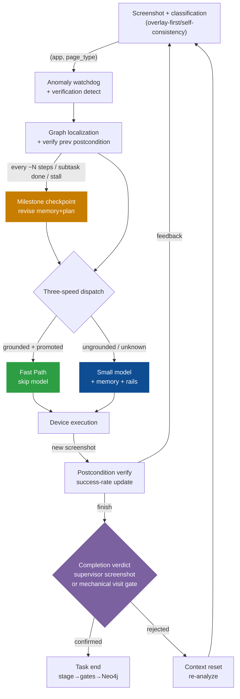

# Shopping-Agent: System Architecture

> **Version**: 2026-06-11 (Strong-VLM Milestone Supervision, validated over six real-device iterations)
> **Scope**: Full `phone_agent/` implementation, with emphasis on: the hybrid agent architecture with a small model as primary executor, the strong-VLM milestone supervision mechanism, the session memory file, the mechanical anti-hallucination rails, the AMSG spatial graph with three-speed dispatch, the anomaly/recovery machinery, and (in AMSG_DESIGN.md) the multi-app graph organization and offline unfamiliar-app mapping pipeline.
> **Purpose**: Paper-ready architecture reference, validated line-by-line against the code. Verified end-to-end on Taobao (full shopping flow) and JD (including the 秒送 instant-retail/takeout chain).

Shopping-Agent is a mobile GUI agent built around **a small GUI model as the primary executor, low-frequency strong-VLM supervision, and spatial-graph-guided navigation**. It automates complex shopping tasks on Android, HarmonyOS, and iOS through a closed loop of screenshot observation, page localization, graph route planning, model inference, action execution, milestone supervision, and verified graph persistence.

The central design thesis is: **how can a capability-limited small model — one that can be quantized and deployed on the phone itself — reach near-large-model reliability on long-horizon tasks?** The answer is *not* to hand decisions to a cloud large model (per-step strong-VLM planning was measured to triple latency and contradicts the on-device goal). It is to constrain the small model with three layers of deterministic structure: the spatial graph accelerates mechanical navigation, mechanical rails take over the judgments small models are bad at (numeric comparison, completion verdicts), and the strong VLM intervenes only at milestones to revise the plan and verify progress.

---

## 1  Design Philosophy

### 1.1  Two Classes of Uncertainty

Mobile GUI automation operates in a visual environment without a stable DOM; combined with the small model's capability ceiling, the system faces two classes of uncertainty:

**Environment uncertainty** — the same page looks different across app versions, devices, ads, popups, and scroll positions; the same button may open SKU selection, login, a promotion dialog, checkout, or nothing; long action histories confuse reasoning and obscure the current task.

**Model uncertainty** (specific to small models, the real-device failure modes) — long-task focus loss (re-reciting the whole plan, looping in place); numeric hallucination (declaring ¥1424/¥172/¥201 "within 500-1000元" three runs in a row); fabricated completion (treating "compress 5 history steps" as the task and declaring done; reporting "added to cart" when nothing was added); empty responses (emitting contentless answers at critical steps).

### 1.2  Design Responses

| Uncertainty | Failure mode | Design response |
|---|---|---|
| **Perceptual** | Page appearance varies with version/ads/popups | `PageState` abstracts screenshots into semantic states (app, page type, landmarks, affordances, slots, risk); the classifier uses an "overlay-first + self-consistency" principle for layered pages |
| **Transition** | Same action, uncertain outcome | `EdgeLifecycleManager` tracks per-transition outcome distribution, dominance ratio, entropy; only statistically reliable transitions enter the executable action library |
| **Context** | Long history confuses reasoning | Session memory file as an anti-drift anchor (original task never rewritten); on-demand retrieval; history compression |
| **Focus loss** | Small model drifts off task | Strong-VLM milestone supervision revises the plan every few steps, feeding a single 【current objective】 to the small model |
| **Numeric hallucination** | Wrong price judgment | Mechanical price verdict — code computes the budget comparison and injects a ⛔/✅ conclusion; SpecGuard hard-intercepts out-of-budget items at the commit point |
| **Fabricated completion** | False success claim | Mechanical finish gate (visitation evidence) + strong-VLM final_confirm (screenshot verdict), forming a single completion authority |
| **Empty response** | No valid output | Empty/unparseable output no longer becomes finish; triggers dialogue reset and re-analysis |

### 1.3  Asymmetric Authority

A principle of **asymmetric authority** runs through the system: every class of decision goes to the agent best suited for it and least costly when it fails.

- **The graph** accelerates and constrains mechanical navigation (home→search, search→results, filter toggling) but never replays stale coordinates on content-sensitive pages (product/SKU/checkout), and never auto-replays any undo action (Back/Home) — because the graph cannot tell "off-route" from "the model's intentional detour."
- **The small model** keeps grounding authority over current screen content (where this element is, what to tap).
- **Mechanical rails** (pure code) take over deterministic judgments: numeric comparison, constraint verification, completion evidence.
- **The strong VLM** intervenes only at task start (decomposition) and milestones (revision/verification); it is the task-end authority and the plan-revision authority.

The key property of this division: **all rails are rule-based code, cloud-independent**. Once the small model is quantized onto the phone, the entire constraint structure holds unchanged.

---

## 2  System Architecture

The system has three logical areas plus a supervision layer, connected by one closed-loop data flow. The key is not "what layers exist" but **how data flows and who decides what**.

### 2.1  Three Areas and the Supervision Layer

```
                    User task (natural language)
                          │
                          ▼
        ┌─────────────────────────────────────────┐
        │  Supervision layer: strong-VLM (low freq) │
        │    MilestoneSupervisor                    │
        │    ├── initialize: decompose once at start │
        │    ├── checkpoint: revise plan + verify    │
        │    └── final_confirm: verify via screenshot │
        │    SessionMemoryFile (anti-drift anchor)   │
        └──────────────────┬──────────────────────┘
                           │ subtasks + session memory
                           ▼
┌─────────────────────────────────────────────────┐
│  Decision Area: "what to do"                       │
│    PhoneAgent._execute_step_impl ← orchestrator     │
│    ├── TaskPlan        tracking + milestone revision │
│    ├── Mechanical rails  price / finish gate / watchdog │
│    ├── SpecGuard       purchase safety               │
│    └── Three-speed dispatch: Fast / shortcut / model  │
└──────────────┬───────────────────────┬────────────┘
               │ "where? where to?"     │ "outcome of this step?"
               ▼                        │
┌──────────────────────────┐           │
│  Graph Area: accelerate   │           │
│    GraphRuntimeController  │           │
│    ├── locate (app,page)   │           │
│    ├── Dijkstra plan        │           │
│    ├── RuntimeDAG cache      │           │
│    ├── ActionAdvisor edges   │           │
│    └── EdgeLifecycle rates   │           │
│  Stores: Neo4j / FAISS / JSON│          │
└──────────────────────────┘           │
               │ compiled device action  │
               ▼                        │
┌──────────────────────────┐           │
│  Execution Area: device   │           │
│    ModelClient (small model)│         │
│    ModelProtocolBridge      │           │
│    ActionHandler            │           │
│    DeviceFactory ADB/HDC/XCTest        │
│  After execution: new shot ─┼───────────┘
│    → postcondition verify (t+1 confirms t)
│    → success-rate update → lifecycle
│    → on success: stage → quality gates → Neo4j
└──────────────────────────┘
```


### 2.2  Responsibility Boundaries

**Decision Area** answers "what to do". `PhoneAgent._execute_step_impl()` is the sole orchestration entry point. Each step it queries the Graph Area for localization and action suggestions, invokes the supervision layer at milestones to revise the plan, applies the mechanical rails and SpecGuard, then selects an execution path in the three-speed dispatch.

**Graph Area** answers "where am I, where to go". `GraphRuntimeController.locate_and_get_context()` performs localization, previous-postcondition verification, route planning, and RuntimeDAG caching in one call. It returns a `mode` field (`navigate`/`explore`/`verify_with_vlm`/`goal_reached`) that drives dispatch, and places graph guidance in a dedicated `graph_hint` key (kept separate from personalized memory). It makes no semantic judgments — only structural navigation.

**Execution Area** answers "how to operate the device". `ModelClient` drives small-model inference; `ModelProtocolBridge` normalizes native output into `DeviceActionIR`; `ActionHandler` compiles device commands. The new screenshot and page classification **feed back** into the Graph Area: postcondition verification updates edge success/failure counts; successful task completion triggers graph persistence.

**Supervision layer** is this version's core addition (§4). Independent of the runtime areas, it intervenes at low frequency (~`1 + steps/5` strong-VLM calls per task) for task decomposition, milestone revision, and completion verification. It is decoupled from the Decision Area through the session memory file and TaskPlan — the supervisor revises them, the Decision Area reads and executes.

### 2.3  Closed-Loop Data Flow



Key properties:

- **Per-step feedback**: edge success rates update in memory every step, not at task end.
- **Deferred persistence**: in-memory `EdgeLifecycleManager` counters update live; Neo4j writes only on successful task completion.
- **Fast Path protection**: postcondition mismatch falls back to model inference — worst case one extra model call.
- **Dual completion authority**: the supervisor's screenshot verdict decides when present; the mechanical visit gate is the fallback.
- **Recoverable failure**: when completion is rejected or the model emits empty output, the poisoned dialogue is dropped and analysis restarts from the session memory.

---

## 3  Agent Execution Model

This section walks a task's full lifecycle chronologically. Entry: `PhoneAgent.run(task)`. Main loop: `_execute_step_impl()`. Exit: `MemoryManager.end_task()` and `SessionMemoryFile.finalize()`.


### 3.1  Task Reception: From Language to Executable State

For input `"Buy a Bluetooth headset on Taobao, within 500-1000元"`, `run()` performs:

**① Full state reset.** Clears dialogue context, step count, `abort_requested`, `_last_thinking`, the visited-pages set `_visited_pages`, the counters (verification, anomaly, unparseable-output, finish-rejection), `_last_user_reply`, `TaskPlan`, `_step_summaries`, and adapter histories. Tasks are fully isolated.

**② Strong-VLM task decomposition.** When the milestone supervisor is available, `MilestoneSupervisor.initialize(task)` uses the strong VLM (provider chain `AMSG_STRONG_VLM_*` → `OFFLINE_VLM_*` → `PHONE_AGENT_*`) to decompose the task into ordered subtasks and extract `search_query`, `product`, `specs`, `target_action`, `target_page`. The output passes `_sanitize_search_query` (deterministically stripping price ranges and feature words — the search box gets only the bare product noun). Without the supervisor it falls back to `_vlm_pre_plan` (same prompt, small-model fallback built in).

**③ Build the session memory file.** `SessionMemoryFile.create(task, vlm_plan)` produces the session memory file (§5), persisted to `memory_db/{user}/sessions/{session_id}.json`. It also builds the `TaskPlan` (subtasks with stable `step_id`) and the `MilestoneTrigger` (debounce state).

**④ Memory session start.** `MemoryManager.start_task()` resets `UnifiedSessionState`, `RetrievalGateway`, clears the RuntimeDAG cache, and extracts/writes new preferences from the task text.

### 3.2  Step Loop: The Full _execute_step_impl Flow

`run()` repeatedly calls `_execute_step` (telemetry wrapper) → `_execute_step_impl` (body). The wrapper emits exactly one event per step to `step_observer` (mode/dispatch/graph_hint/postcondition/screenshot) for the WebUI graph panel. The body's flow, in code order:

**Phase 1 — Perception.** `DeviceFactory.get_screenshot()` (broken captures return an `is_sensitive=True` fallback frame), current app, `ui_hash`. `PageClassifier.classify()` yields `page_type` (prompt generated from the domain schema, with the "overlay-first + self-consistency" principle, §8); a RuntimeDAG hint can skip the classifier to save a call. The visited page type is recorded in `_visited_pages`.

**Phase 2 — Anomaly watchdog.** `is_sensitive` captures or consecutive `unknown`/`None` pages accumulate; two in a row → `Take_over` human handover (warning of possible CAPTCHA/SMS/security popup). A mechanical backstop — it does not depend on the model recognizing the CAPTCHA; the black frame is the evidence.

**Phase 3 — Verification detection (Layer 1).** `detect_verification(page_type, summary, elements)` detects login/CAPTCHA/SMS pages. Staircase handover: 1-3 consecutive hits auto-takeover, 4-5 let the model try once, >5 fail the task.

**Phase 4 — Graph coordination + clarification.** `memory_manager.locate_and_get_context()` delegates to `GraphRuntimeController`: a usable RuntimeDAG advances its cursor and returns the next action (no Neo4j query); otherwise `(app, page_type)` matches Neo4j → verify the pending transition → Dijkstra → cache the RuntimeDAG. Returns `mode` + `next_actions` + `graph_hint`. Only step 1 runs the three-layer `ClarificationAgent` short-circuit (rule check → FAISS preference fill → strong-VLM clarify decision).

**Phase 5 — Plan sync + milestone trigger.** If the current page matches a future TaskPlan step (Fast Path jumped ahead), intermediate steps are advanced and `milestone_subtask_done` is flagged. The milestone trigger then evaluates (§4): on a hit (interval/subtask-done/stagnation) it runs `_run_milestone_checkpoint` — the strong VLM revises the session memory and plan from the screenshot. The checkpoint call is defensively wrapped; a crash never kills the task.

**Phase 6 — Dispatch + context assembly.**
- **Fast Path**: `_needs_vlm` checks whether an ActionAdvisor hint matches the *effective plan target* and is fast-executable (grounded, conf≥0.9, has coordinates or Compound). On a hit, `_execute_fast_path` executes, captures a fresh screenshot, classifies it for a **synchronous postcondition check** — match → success, mismatch → fall back to the model path and record the failure observation. Search has a synthesized `Type <query> + Tap` Compound edge.
- **Graph shortcut** (fallback): when ActionAdvisor has no hint, the legacy `_try_graph_shortcut` is tried; `verify_with_vlm` transitions are handed to the model.
- **Model path**: otherwise. Message assembly (identical on both model paths): 【session memory】digest (replacing the old plain plan block) → 【current objective】(the pre-plan's current step, single focus) → key constraints → execution history → 【graph navigation】(graph_hint) → available actions → SpecGuard hints → **mechanical price verdict** (code computes the budget comparison, injects ⛔/✅) → price red line → on-demand retrieval.

**Phase 7 — Execution + safety interception.** Specialized-handler paths (UI-TARS/Qwen-VL/MAI-UI/GUI-Owl) compute the canonical action **then pass SpecGuard**; the AutoGLM path parses → `try_ground` (graph coordinate enhancement) → SpecGuard → execute. SpecGuard guards `product_detail`/`spec_selection`/`checkout`/`payment` (product_detail included, since spec popups are often classified as it), with a price-bound hard interception (session-tracked product price vs budget, out-of-range → Interact). Execution exceptions build a failed `StepResult` — **never laundered through finish**.

**Phase 8 — Completion verdict + recovery** (only on finish). See §3.4.

**Phase 9 — State update.** The Interact answer is folded back into the task text (visible to SpecGuard next step); the pending transition is cached for next-step verification; `add_step` records session state, extracts product info, detects stagnation; history compression keeps the last 2 full dialogues.

### 3.3  Empty-Output Recovery

The small model may emit an empty response at a critical step (observed on device). On parse failure:

- **No longer becomes finish** — this was the last finish-laundering path.
- `_unparseable_count` increments; two in a row → `_reset_dialogue_context` (drop the poisoned dialogue; the next step rebuilds from system prompt + session memory digest + revised objective + fresh screenshot); four in a row → explicit failure.

This recovery is feasible precisely because of the milestone architecture: **all durable state lives in the session memory file; the dialogue context is disposable.**

### 3.4  Task End: Completion Verdict and Persistence

The loop terminates on `terminate`/`answer` (finish), `max_steps`, user abort, or deterministic failure.

**Completion uses a single-authority principle**:

- When `supervisor_can_confirm` (supervisor mounted, not disabled by consecutive failures, call budget remaining) → the `final_confirm` checkpoint has the strong VLM verify from the screenshot. Three outcomes: `task_complete=true` passes; `task_blocked=true` becomes explicit failure; rejection → context reset + re-analysis, and three consecutive rejections → deterministic failure.
- Without the supervisor → the mechanical finish gate is the fallback: a success finish requires the pre-plan's `target_page` to have been visited at least once (`_completion_evidence`); otherwise it is blocked and a corrective note is appended to history.

**Why single authority**: the mechanical visit gate depends on page classification, which is noisy (spec popups are often classified product_detail, so spec_selection looks "unvisited"). The supervisor can read the screenshot and verify "added to cart" directly, strictly stronger than visit evidence. Running both lets the earlier mechanical gate wrongly block a genuine completion the supervisor would pass — so the mechanical gate yields when the supervisor is present.

`MemoryManager.end_task(success, result)` performs: ① trajectory save (always, to `trajectories/`); ② preference learning (success only, to FAISS); ③ graph flush (success only, canonicalize → quality filter → Neo4j); ④ VLM trajectory review (success only, new transitions imported as hypothesis). `SessionMemoryFile.finalize()` persists the memory file's terminal state.

---

## 4  Strong-VLM Milestone Supervision

This is the version's core answer to the "small-model long-horizon reliability" thesis. Motivation: a pure small model is insufficient on long tasks (forgetting, hallucination, fabricated completion), while per-step strong-VLM planning is too expensive (3× latency) and contradicts the on-device goal. The middle path: **the strong VLM decomposes once at task start, then intervenes only at milestones** — a budget of ~`1 + steps/5` strong-VLM calls per task.

### 4.1  Supervisor Responsibilities (`milestone_supervisor.py`)

**`initialize(task)`**: the one-time decomposition at start, output in the same schema as `_vlm_pre_plan` (compatible with `set_vlm_plan`/`TaskPlan.from_vlm_output`). The strong VLM reads the task text to decompose subtasks and extract product info.

**`checkpoint(...)`**: milestone revision and re-planning. Inputs: screenshot (cropped/compressed) + session memory render + last 8 step summaries + current page type + trigger reason + a mechanical fact snapshot (session-tracked product count and price). The system prompt stresses "the executor's self-report is untrusted; trust the screenshot and verified facts; the original task never changes." Output `CheckpointResult`: completed subtask ids, new verified facts, re-planned remaining subtasks (full replacement of the unfinished tail), complete/blocked verdicts.

The supervisor reuses `PageClassifier`'s provider chain and screenshot compression — the same infrastructure as the classifier and the offline exploration planner.

### 4.2  Milestone Triggers (`MilestoneTrigger`, pure debounce logic)

Four triggers, evaluated after the plan-sync block in `_execute_step_impl`, at most one per step:

| Trigger | Condition | Debounce |
|---|---|---|
| T1 interval | `step - last ≥ INTERVAL` (default 5, min 2) | inherent |
| T2 subtask done | plan-sync marked a step done and `step - last ≥ MIN_GAP` (default 2) | otherwise deferred to T1 |
| T3 stagnation | `state.is_stagnating()` (2 consecutive identical action+page) and ≥ MIN_GAP | no re-fire within the same stall streak |
| T4 finish-gate | the mechanical finish gate blocked a finish → fires at the next evaluation | ≤ 2 per task |

**Priority** T4 > T3 > T2 > T1. After a checkpoint, `last_checkpoint_step` advances; all triggers share that baseline. After the budget `MAX_CALLS` (default `2 + max_steps/INTERVAL`) is exhausted, all triggers go silent.

### 4.3  Atomic Revision (`TaskPlan.apply_revision`)

The supervisor's revision is applied atomically via `apply_revision(completed_step_ids, revised_subtasks)`: done/skipped steps keep their original objects, immutable; the pending tail is rebuilt entirely from the revision (empty revision = keep the original tail); `current_index` re-points to the first unfinished step; validation (drop empty descriptions, ≤12-step cap, reject malformed revisions wholesale); atomic assignment then returns a change summary. The revision mirrors back into the session memory file's subtasks (`sync_subtasks_from_plan`).

### 4.4  Degradation Semantics (failure = status quo)

A failed checkpoint (network/parse/timeout) → keep the old plan, log `RevisionEntry("checkpoint_failed")`, advance the baseline (no retry storm); two consecutive failures → disable the supervisor for the task; the strong VLM entirely unavailable → no supervisor mounted, the system degrades to mechanical rails + pure small-model behavior. All checkpoint call sites are defensively wrapped — a crash neither kills the task nor blocks a finish.

### 4.5  Mutual Exclusion with the Per-Step Planner

`step_planner.py` offers a more aggressive route — per-step strong-VLM planning (`PHONE_AGENT_STRONG_PLANNER=1`, off by default, kept as an ablation upper bound). It is **mutually exclusive** with milestone supervision: when per-step planning is on, milestones auto-disable (the strong VLM is already in every step). This yields a three-way ablation matrix: pure small model (`PHONE_AGENT_MILESTONE=0`) / milestone supervision (default) / per-step planning (`STRONG_PLANNER=1`).

---

## 5  The Session Memory File

The session memory file (`session_memory_file.py`) is the durable anti-drift anchor and the interface decoupling supervisor from executor. A pure data module, no VLM dependency.

### 5.1  Data Structure

```
SessionMemoryFile = {
  session_id, original_task (never rewritten), platform,
  product:{name, target_action}, constraints:{price/color/...},
  subtasks:[SubTask{step_id, description, target_page, status, completed_at_step, evidence}],
  verified_facts:[VerifiedFact{fact, kind, step, source}],
  revisions:[RevisionEntry{step, trigger, summary, changes}],
  vlm_call_count, status:active|completed|failed
}
```

`original_task` is never rewritten — it is the anchor the executor re-reads when it drifts. `verified_facts` record screenshot-verified facts (selected product and price, applied filter, added to cart), with `kind` in `product_selected`/`price_confirmed`/`cart_added`/`filter_applied`. `revisions` is a complete revision audit log (one entry per checkpoint, an interpretability asset for the paper), capped at 30.

### 5.2  Persistence and Rendering

- **Atomic write**: `save()` writes `.json.tmp` then `os.replace`; a crash loses at most one interval's revision; the in-memory object is always the source of truth, IO failure only logs.
- **`render_injection()`**: ~12 lines (original task / target product + constraints / up to 5 verified facts / subtask progress), injected into the small model's context each step, replacing the old plain plan block.
- **`brief_line()`**: a one-line progress string ("completed X/Y subtasks; current: …") written to `state.overall_progress` — replacing the deprecated compression text that once made the small model treat "compress history" as the task (`compress_session_history` is now a no-op).

---

## 6  Mechanical Anti-Hallucination Rails

The mechanical rails are pure-code deterministic judgments that take over the steps small models are bad at. Zero extra cloud calls per step; they hold unchanged after quantized deployment.

| Rail | Judgment taken over | Implementation |
|---|---|---|
| **Mechanical price verdict** | "Is this price within budget?" | `SpecGuard._extract_price_bounds` parses the budget, compares to the session-tracked price, injects a ⛔/✅ conclusion on decision pages. Never asks a 9B model to compare numbers |
| **SpecGuard price interception** | Out-of-budget add-to-cart | hard intercept at the commit action: out-of-range → replace with Interact |
| **Mechanical finish gate** | "Is the task really done?" (fallback) | a success finish requires the pre-plan target_page to have been visited; else blocked + corrective note |
| **Anomaly watchdog** | "Is the screen dead?" | two consecutive sensitive/unknown frames → human takeover. A mechanical signal, no model recognition needed |
| **Empty-output recovery** | "Is the model stuck?" | unparseable output is not a finish; 2× → reset context, 4× → fail |
| **Query sanitization** | "Is the query polluted?" | `_sanitize_search_query` deterministically strips price/feature words |
| **Finish anti-laundering** | "Is a failure disguised as success?" | execution exceptions always build a failed StepResult, never go through finish |

Design principle: **whatever code can judge deterministically is never handed to the small model.** These rails complement strong-VLM supervision — supervision is the semantic layer (understanding progress, revising plans), the rails are the symbolic layer (numbers, evidence, state).

---

## 7  Spatial Graph (AMSG) and Three-Speed Dispatch

The graph caches verified mechanical navigation paths so repetitive work skips model inference. Full graph design, lifecycle, multi-app organization, and the offline mapping pipeline are in **AMSG_DESIGN.md**; this section summarizes the interface with the execution loop.


### 7.1  Page-State Abstraction

Graph nodes are semantic descriptions, not screenshots: `PageState = (app, page_type, landmarks, affordances, slots, risk)`. Searching "headset" and "phone" produce different screenshots but the same page structure; storing `(app, page_type)` with a semantic signature enables cross-task reuse. Phase 4 matches `(app, page_type)` against Neo4j; a node's outgoing edges are the verified actions available on that page.

### 7.2  Groundedness and Three-Speed Dispatch

Each edge is independently classified grounded or ungrounded. `ActionHint.is_fast_executable()`: `grounded` AND `confidence ≥ 0.9` AND (has coordinates OR Compound OR action_type ∈ {Launch, Wait}). **Back/Home are never fast-executable** — undo is repair territory, and auto-replay fights the model's intentional detours.

`_UNGROUNDED_TRANSITIONS` (9 pairs, the model must pick the element):

```
search_result→product_detail   which product
search_result→store            which store
product_detail→spec_selection  which spec
spec_selection→cart/checkout   purchase-commit point
cart→checkout                  purchase-commit point
search_input→search_result     bare Tap would submit stale text (only synthesized Compound is grounded)
filter_panel→search_result     leaving the filter needs content decisions
spec_selection→product_detail  popup close/cancel decision
```

Three speeds:
- **Fast Path** (~0.5s, skip model): grounded promoted transitions, with a synchronous postcondition check.
- **Graph Co-pilot** (graph gives direction, model grounds): `verify_with_vlm` transitions inject a `graph_hint`.
- **Model path** (~5s): ungrounded or no graph route.

### 7.3  Search Compound Edge Synthesis

The documented `search_input→search_result` is a "type + submit" compound mechanical action, but online trajectories only record a bare Tap. `ActionAdvisor._append_search_compound` synthesizes a grounded Compound hint (`Type <query>` + `Tap coordinates`) from the verified Tap coordinates; the `<query>` slot is filled from the plan at execution. This makes the search step truly take the Fast Path.

### 7.4  Delayed Postcondition Verification and Lifecycle

Step t caches `(page, action, expected_target)`; step t+1 compares the actual page_type and records success/failure into the edge lifecycle counters (single-channel, no double counting). `EdgeLifecycleManager` runs the state machine `hypothesis → candidate → promoted → demoted`; only promoted edges are visible to ActionAdvisor. Coordinates come only from real execution (imported edges no longer fabricate a screen-center default). Neo4j writes occur only on successful task completion via flush.

### 7.5  RuntimeDAG

`GraphRuntimeController` caches the Dijkstra result as an in-memory edge array + cursor; consecutive steps read `route[current_index]` and skip the localize-plan pipeline. `should_use_page_classifier` returns False when the DAG is usable, has no pending postcondition, the next edge is not high-risk, and the app matches — saving a classification call. Invalidation is passive (postcondition mismatch / app switch / high-risk / route exhaustion); rebuilt automatically next time.

---

## 8  Page Classifier

The classifier (`PageClassifier` + the `schemas/shopping.yaml` domain schema) is the ground truth for postcondition verification; its independence underpins the statistical integrity of the edge lifecycle.

**Overlay-first + self-consistency** (prompt header, shared by full/fast templates):

- **Overlay-first**: when a popup/half-sheet/overlay is present, the page_type follows the topmost layer, not the background (a half-sheet may lack an obvious dim mask).
- **Self-consistency**: page_type must agree with the summary — if the summary describes overlay content (spec selection, login dialog), page_type must be that overlay's type.

These target the real-device failure mode: spec popups were classified product_detail every time (the background detail page was clearly visible, the bottom sheet had no mask, and the model described "color/package options" in its summary while still answering detail). `spec_selection` gets its own discriminative vlm_hint (option blocks + confirm button → must be spec_selection even with the detail page behind), and product_detail's hint is rephrased symmetrically.

**Architectural red line**: never feed the runtime's expected postcondition to the classifier as a bias. The classifier output is the ground truth for postcondition verification; an expectation bias would turn verification into self-confirmation and destroy the statistical integrity of the edge lifecycle. This is a deliberately *un-made* "improvement" worth noting in the methods section.

The schema also supports an open vocabulary (out-of-vocabulary pages yield `new:<type>` proposals, consumed by offline exploration) and schema-configured `vlm_verify_transitions`.

---

## 9  Memory System

The memory system provides several data surfaces for the agent loop's differing needs, at different time scales and granularities.

| Surface | Store | Serves | Problem solved |
|---|---|---|---|
| **User memory** | FAISS (cross-session) | Phase 4 clarification / slot fill | "buy a phone" missing specs — fill from history, don't re-ask |
| **Session state** | UnifiedSessionState (per task) | Phase 6 progress / Phase 9 recording | progress tracking, product extraction, stagnation |
| **Session memory file** | JSON (per task, atomic) | anti-drift anchor + supervision interface | long-task focus loss (§5) |
| **Graph memory** | Neo4j (cross-session) | Phase 4 localization / Phase 6 Fast Path | repetitive mechanical navigation |
| **Trajectory files** | JSON (per-task artifact) | post-task graph evolution | discover new transitions for VLM review |

**On-demand retrieval**: `RetrievalGateway` monitors model thinking text and triggers retrieval only on recall/compare/calculate/stall signals (injecting a product list / cart calculation / history steps), with a 3-step cooldown. A typical 30-step task triggers detailed retrieval on only 3-5 steps.

`get_injection_context` is layered: progress summary (always) + current focus + on-demand retrieval + constraint reminder. `compress_session_history` is now a no-op (its leak bug is superseded by the session memory file). `end_task` has four steps: trajectory save (always), preference learning (success only), graph flush (success only), VLM trajectory review (success only).

---

## 10  Model and Device Abstraction

### 10.1  Multi-Model Support

Five GUI model families through a unified adapter architecture (coordinate spaces per the code):

| Model family | Coordinate space | Context strategy | Response format |
|---|---|---|---|
| AutoGLM | `[0,1000]` normalized | Cumulative (text appended, image current only) | `<answer>` / `do()`+`finish()` |
| UI-TARS | Absolute pixels (smart_resize) | Max 5 images, prune oldest | `Thought: … Action: …` |
| Qwen-VL | `[0,999]` normalized | Rebuilt each turn | `<tool_call>` JSON |
| MAI-UI | `[0,999]` normalized | Max 3 images | `<thinking>` + `<tool_call>` |
| GUI-Owl | `[0,1.0]` decimal (model native 0-999, parsed to 0-1) | Max 1 image (current only) | Action + `<tool_call>` |

`ModelProtocolBridge._scale_coord()` is the coordinate hub, converting between all spaces via a normalized (0,1) intermediate. This keeps the graph model-agnostic — the same Neo4j graph serves different models with runtime coordinate conversion.

### 10.2  Device Abstraction

`DeviceFactory` unifies ADB (Android) and HDC (HarmonyOS); iOS uses a separate `IOSPhoneAgent` + `IOSActionHandler` (XCTest/WebDriverAgent HTTP), not via DeviceFactory. `ActionHandler` converts canonical action dicts to device calls, managing keyboard setup (switch to ADB keyboard, clear, type, restore the original IME), inter-operation timing, and same-page compound sequences.

---

## 11  WebUI Visualization

`webui.py`'s `StreamingAgent` wraps the real `PhoneAgent.run()` (worker thread + event queue), so WebUI and CLI share the single orchestration entry point. Three streaming hooks: `ModelClient.stream_callback` (token-level thinking stream), `PhoneAgent.step_observer` (per-step telemetry: mode/dispatch/graph_hint/postcondition/runtime_metrics/screenshot), `takeover_callback` (human takeover + Interact reply box).

The **graph co-pilot panel** (`format_graph_panel`, a pure function) visualizes each step: page type and mode (navigate/verify_with_vlm/explore/goal_reached), dispatch tier (⚡Fast Path / 🤝Co-pilot / 🧠Model), the Fast Path postcondition "expected→actual" verdict, the graph hint text injected to the model, and cumulative stats (per-tier counts / DAG hit rate / classifier skips). iOS uses IOSPhoneAgent — no graph stack, no telemetry.

---

## 12  Configuration and Ablation

| Environment variable | Default | Purpose |
|---|---|---|
| `PHONE_AGENT_MILESTONE` | `1` (on) | Milestone supervision switch |
| `PHONE_AGENT_MILESTONE_INTERVAL` | `5` | Interval trigger N |
| `PHONE_AGENT_MILESTONE_MIN_GAP` | `2` | Min gap for subtask/stall triggers |
| `PHONE_AGENT_MILESTONE_MAX_CALLS` | `0` (auto=2+steps/N) | Per-task checkpoint cap |
| `PHONE_AGENT_STRONG_PLANNER` | `0` (off) | Per-step strong-VLM planning (ablation upper bound, mutually exclusive with milestones) |
| `AMSG_STRONG_VLM_*` | — | Strong-VLM provider chain (shared by supervision/classification/planning) |
| `AMSG_CONFIG` | `sava` (recommended) | Graph lifecycle policy preset (see AMSG_DESIGN.md) |

**Three-way ablation matrix** (core of the experiments):
1. **Pure small-model baseline** (`MILESTONE=0`): mechanical rails + graph only, no runtime strong-VLM intervention.
2. **Milestone supervision** (default): low-frequency strong VLM, ~1+steps/5 calls.
3. **Per-step planning upper bound** (`STRONG_PLANNER=1`): strong VLM every step, 3× latency.

The three tiers form an accuracy–latency–cloud-call-count curve supporting the core claim: **low-frequency supervision reaches near per-step reliability** while remaining on-device friendly.

---

## 13  Comparative Analysis and Core Contributions

### 13.1  Positioning in the Literature

**Gap 1: the capability–cost dilemma of pure-model approaches.** Strong-model systems (GPT-4o multi-agent) are accurate but expensive and not on-device deployable; small-model systems (quantizable) forget and hallucinate on long tasks. Shopping-Agent's hybrid of "small executor + low-frequency strong-VLM supervision + mechanical rails" reaches near-large-model long-horizon reliability at on-device-friendly cost.

**Gap 2: stateless re-exploration.** Most GUI agents treat each session as independent; structural navigation knowledge does not persist across sessions. AMSG persists verified transitions in Neo4j, building cumulative knowledge.

**Gap 3: graph without lifecycle.** Systems that build navigation graphs treat them as static. AMSG adds a full lifecycle (hypothesis→candidate→promoted→demoted) with data-driven promotion and automatic demotion.

**Gap 4: binary graph/model control.** Existing approaches use the graph either as static RAG or as a deterministic controller that bypasses the model. Shopping-Agent introduces a continuous three-speed dispatch (Fast / Co-pilot / Model), chosen data-drivenly by edge groundedness and lifecycle stage.

### 13.2  Core Contributions (Default-Enabled, Reproducible)

1. **Strong-VLM milestone supervision.** A small model executes; the strong VLM intervenes only at task start and milestones, reaching near per-step reliability at ~1+steps/5 calls and remaining on-device friendly. Task decomposition, plan revision, and completion verification are the strong VLM's; grounding is the small model's.

2. **The session memory file as an anti-drift anchor.** A never-rewritten original task plus persisted verified facts and subtask progress keep focus on long tasks; its disposable dialogue context enables the "reject → reset → re-analyze" recovery loop.

3. **A mechanical anti-hallucination rail system.** Numeric comparison, constraint verification, and completion evidence are taken over by deterministic code at zero extra cloud cost, holding unchanged after quantized deployment. This symbolic layer complements the strong VLM's semantic layer.

4. **Single completion authority.** The supervisor's screenshot verdict and the mechanical visit gate form a mutually exclusive completion decision, preventing dual authorities from wrongly blocking each other; fabricated finishes (the GUI model's most damaging hallucination) are systematically closed off.

5. **A self-updating page-state graph with three-speed dispatch.** A cross-session persistent navigation knowledge graph, a success-rate-driven edge lifecycle, groundedness-based three-speed dispatch, and search Compound edge synthesis that makes mechanical navigation truly fast.

6. **Structured task constraints as first-class state.** Price ranges and specs are extracted as task slots and mechanically enforced by SpecGuard at the purchase-commit point — shopping safety as a system property, not prompt engineering, for all five model families.

7. **Overlay-first page classification.** Layered pages (spec popups, login dialogs) are classified by the topmost layer with a self-consistency constraint, improving the ground-truth quality of postcondition verification; deliberately refusing to bias the classifier with expected postconditions to protect lifecycle statistical integrity.

8. **A reproducible on-device–cloud collaboration ablation.** Three configurations (pure small model / milestone / per-step planning) provide an accuracy–latency–cost curve supporting "system design, not model scale, lifts on-device reliability."

### 13.3  Experimental Extensions (Not Default-Enabled)

- Per-step strong-VLM planning (`PHONE_AGENT_STRONG_PLANNER=1`, ablation upper bound).
- Multi-channel Bayesian belief localization, Belief-A* enhanced planner (graph experimental extensions, see AMSG_DESIGN.md).

---

## 14  Implementation Map

| Concept | File |
|---|---|
| Main loop | `phone_agent/agent.py` |
| Milestone supervision | `phone_agent/milestone_supervisor.py` |
| Session memory file | `phone_agent/session_memory_file.py` |
| Per-step planner (ablation) | `phone_agent/step_planner.py` |
| Task plan | `phone_agent/task_plan.py` |
| Purchase safety guard | `phone_agent/core/spec_guard.py` |
| Verification detection | `phone_agent/verification_detector.py` |
| Memory manager | `phone_agent/memory/memory_manager.py` |
| Session state | `phone_agent/memory/core/unified_state.py` |
| On-demand retrieval | `phone_agent/memory/retrieval_gateway.py` |
| Runtime graph controller | `phone_agent/spatial/runtime_controller.py` |
| Action advisor | `phone_agent/spatial/action_advisor.py` |
| Edge lifecycle | `phone_agent/spatial/edge_lifecycle.py` |
| Page classifier | `phone_agent/memory/exploration/classifier.py` + `classifier_prompts.py` |
| Domain schema | `phone_agent/spatial/schemas/shopping.yaml` |
| Model protocol bridge | `phone_agent/model/protocol_bridge.py` |
| Model adapters | `phone_agent/model/adapters.py` |
| Device abstraction | `phone_agent/device_factory.py` |
| Graph cleanup tool | `scripts/purge_invalid_graph_entries.py` |
| WebUI | `webui.py` |
| AMSG graph detailed design | `phone_agent/docs/AMSG_DESIGN.md` |


---

## 15  Paper Method Summary

> Shopping-Agent is a mobile GUI agent with a small GUI model as the primary executor, low-frequency strong-VLM supervision, and spatial-graph-guided navigation, designed so that a quantizable on-device small model reaches near-large-model reliability on long-horizon tasks. At task start the strong VLM decomposes the task into ordered subtasks and extracts product information, producing a session memory file — whose original task is never rewritten — that is handed to the small model. Thereafter the strong VLM intervenes only at milestones (every few steps, on subtask completion, on stagnation, or when a completion claim is blocked), reading the screenshot to revise the memory file, re-plan the remaining subtasks, and verify whether the task is truly complete, at a budget of ~1+steps/5 calls. At runtime, pure-code mechanical rails take over the deterministic judgments the small model is bad at — budget comparison, constraint verification, completion evidence — at zero extra cloud cost; the spatial graph caches verified mechanical transitions and dispatches by edge groundedness across three speeds (Fast Path skips the model / Co-pilot lets the graph give direction and the model ground / full model inference), with delayed postcondition verification driving the edge lifecycle. Completion uses a single authority: the supervisor's screenshot verdict when present, the mechanical visit gate otherwise, preventing fabricated completions from polluting the graph quality gates. When the task cannot progress or the model emits an empty response, the poisoned dialogue context is discarded and analysis restarts from the session memory. The system supports five GUI model families and three device platforms, and provides an on-device–cloud accuracy–latency–cost trade-off analysis through a pure-small-model / milestone / per-step-planning three-way ablation.
