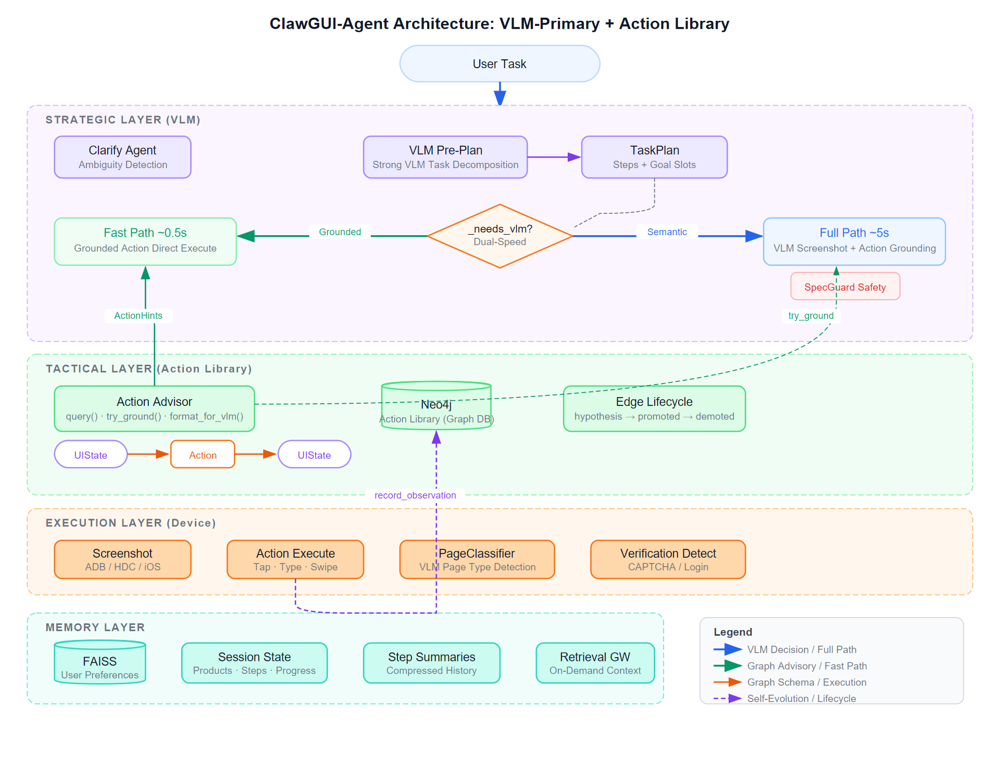
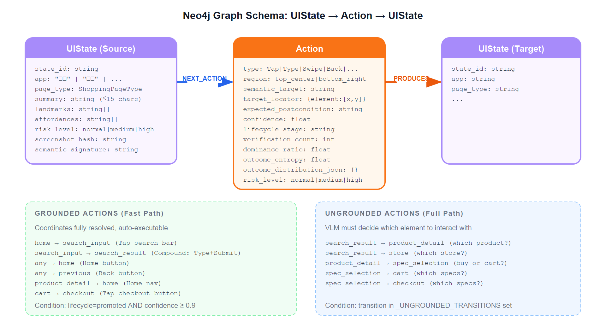
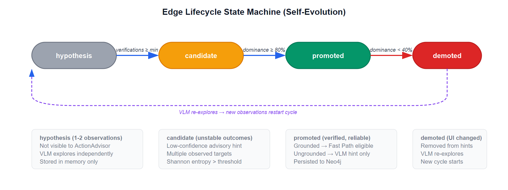

# ClawGUI-Agent System Architecture

> VLM-Primary + Action Library Self-Evolution

## 1. Design Philosophy

ClawGUI-Agent 采用 **"VLM 主导 + 图谱辅助"** 的混合执行架构。VLM（Vision-Language Model）是所有语义决策的唯一决策者；空间导航图谱（Action Library）从控制器降级为**导航建议者**和**坐标定位服务**，并通过记录 VLM 的执行结果实现自进化。

**核心原则：**
- VLM 负责所有需要语义理解的决策（选哪个商品、填什么规格、判断价格是否合适）
- 图谱负责已验证的机械导航（点搜索栏、按返回、提交搜索）——这些操作不需要理解页面内容
- 每个转换经过生命周期验证（hypothesis → promoted）才能被图谱加速
- 当 App 界面改版时，图谱自动降级（demoted），VLM 重新探索



---

## 2. Three-Layer + Dual-Speed Architecture

### 2.1 Strategic Layer (VLM)

VLM 在以下场景被调用：

| 场景 | 示例 | 为什么需要 VLM |
|------|------|---------------|
| 商品选择 | 从搜索结果中选一个降噪耳机 | 需要理解截图内容 + 用户需求 |
| 规格选择 | 选择颜色/尺码/容量 | 需要视觉识别 + 约束匹配 |
| 价格判断 | 商品是否在预算内 | 需要读取截图中的价格 |
| 异常处理 | 遇到弹窗/错误页面 | 需要理解非预期状态 |
| 搜索词输入 | 在 search_input 页面输入查询 | 查询词来自任务分解 |

**VLM 每步看到的上下文：**

```
【任务计划】
任务: 买无线耳机，500-1000元，降噪
  1. [done] 搜索"无线耳机"
  2. [current] 从搜索结果选择降噪耳机(500-1000元)
  3. [pending] 确认商品详情
  4. [pending] 加入购物车

【关键约束】⚠️ 价格要求: 500-1000元
请严格按照约束选择商品，不符合价格要求的商品不要加入购物车

【执行历史】
Step 1: [Fast] 点击搜索栏
Step 2: 输入"无线耳机"并搜索

【可用操作】(当前: search_result)
- 点击商品卡片 → product_detail [需要你选择具体目标]
- 点击筛选按钮 → filter_panel

** Screen Info **
当前应用: 淘宝
[截图]
```

### 2.2 Tactical Layer (Action Library)

图谱以 **Action Library** 的角色提供两种服务：

1. **ActionHint 导航建议**：告诉 VLM 当前页面有哪些已知的页面跳转
2. **Grounded Action 快速执行**：对于机械导航，直接用图谱存储的坐标执行

```
ActionAdvisor
├── query(page_type, app) → list[ActionHint]     # 查询可用操作
├── try_ground(vlm_action, hints) → dict          # VLM 决策后坐标增强
├── get_fast_action(hint) → dict                  # Fast Path 动作编译
└── format_for_vlm(hints) → str                   # 格式化为 VLM 上下文
```

### 2.3 Execution Layer (Device)

设备抽象层支持三种后端：

| 后端 | 平台 | 截图 | 输入 |
|------|------|------|------|
| ADB | Android | `adb screencap` | `adb input tap/swipe` |
| HDC | HarmonyOS | `hdc screenshot` | `hdc input` |
| XCTest | iOS | WebDriverAgent | XCTest API |

### 2.4 Dual-Speed Dispatch

```
                 ┌─ _needs_vlm()? ─┐
                 │                  │
              No (Grounded)     Yes (Semantic)
                 │                  │
          Fast Path ~0.5s    Full Path ~5s
          图谱直接执行        VLM 看截图决策
          + postcondition     + 坐标增强
            验证                + SpecGuard
```

**_needs_vlm() 返回 True 的条件：**
- 没有 TaskPlan 或没有可用 ActionHint
- 没有匹配当前计划步骤目标的 Grounded Action
- 当前在 search_input 页面且有待输入的搜索词
- 匹配的 Grounded Action 置信度 < 0.9

---

## 3. Graph Schema



### 3.1 Neo4j 节点与关系

```
(UIState) ──[NEXT_ACTION]──> (Action) ──[PRODUCES]──> (UIState)
```

**UIState 节点**（页面状态）：

| 属性 | 类型 | 说明 |
|------|------|------|
| `state_id` | string | `state_{app}_{page_type}_{hash}` |
| `app` | string | "淘宝" / "京东" / ... |
| `page_type` | ShoppingPageType | home / search_result / product_detail / ... |
| `summary` | string | ≤15 字功能概括 |
| `landmarks` | string[] | 页面标志性元素 |
| `affordances` | string[] | 可交互元素 |
| `risk_level` | enum | normal / medium / high |

**Action 节点**（转换操作）：

| 属性 | 类型 | 说明 |
|------|------|------|
| `type` | string | Tap / Type / Swipe / Back / Compound |
| `region` | string | top_center / bottom_right / ... |
| `semantic_target` | string | 操作目标描述 |
| `target_locator` | JSON | `{"element": [x, y], "coordinate_space": "normalized_1000"}` |
| `expected_postcondition` | string | 预期目标页面类型 |
| `lifecycle_stage` | string | hypothesis / candidate / promoted / demoted |
| `verification_count` | int | 验证通过次数 |
| `dominance_ratio` | float | 主导结果占比 |
| `outcome_entropy` | float | Shannon 熵 |
| `outcome_distribution_json` | JSON | `{"outcomes": {"search_result": 8, "login": 1}}` |

### 3.2 Grounded vs Ungrounded Actions

| 类型 | 定义 | Fast Path | VLM 角色 |
|------|------|-----------|---------|
| **Grounded** | 坐标完全确定，不涉及语义选择 | 可直接执行 | 不参与 |
| **Ungrounded** | 知道方向但具体元素取决于页面内容 | 不可执行 | 必须决策 |

**Ungrounded 转换集合**（VLM 必须参与）：
- `search_result → product_detail`（选哪个商品）
- `search_result → store`（选哪个店铺）
- `product_detail → spec_selection`（点加购还是立即购买）
- `spec_selection → cart/checkout`（选哪个规格）

### 3.3 页面类型枚举

```
ShoppingPageType:
  home, search_input, search_result, product_detail,
  spec_selection, cart, checkout, payment, address,
  filter_panel, category, my_account, settings,
  store, login, dialog, permission, unknown
```

---

## 4. Agent Execution Flow

### 4.1 Task Lifecycle

```python
PhoneAgent.run(task)
├── 1. _vlm_pre_plan(task)        # Strong VLM 分解任务为有序步骤
│   └── → TaskPlan(steps, goal_slots)
├── 2. _execute_step() loop       # 循环直到 finish 或 max_steps
│   ├── Observe: screenshot + PageClassifier
│   ├── Plan Sync: 对齐计划进度与实际页面
│   ├── Query: ActionAdvisor.query(page_type)
│   ├── Dispatch: _needs_vlm() → Fast/Full Path
│   ├── Execute: device action
│   └── Record: memory + lifecycle + tracer
└── 3. end_task()                 # 持久化图谱 + 记忆
    └── flush_staged_graph() → Neo4j
```

### 4.2 Single Step Detail

```
_execute_step()
│
├── ① OBSERVE
│   ├── device.get_screenshot()
│   ├── PageClassifier.classify() → (page_type, summary, elements)
│   └── [Fallback] RuntimeDAG hint → force PageClassifier if hint=None
│
├── ② INTERRUPT CHECK
│   └── detect_verification(page_type, summary)
│       → 登录/验证码 → Take_over → 暂停等用户
│
├── ③ PLAN SYNC
│   └── 对比当前 page_type 与计划步骤
│       → 跳过已完成的中间步骤
│
├── ④ QUERY ACTION LIBRARY
│   └── ActionAdvisor.query(page_type, app)
│       → list[ActionHint] (top 8, sorted by confidence)
│
├── ⑤ DUAL-SPEED DISPATCH
│   ├── _needs_vlm() == False → Fast Path
│   │   ├── get_fast_action(hint)
│   │   ├── fill_slots(<query> → "无线耳机")
│   │   ├── action_handler.execute()
│   │   ├── PageClassifier postcondition verify
│   │   ├── 失败 → clear RuntimeDAG → fallthrough to Full Path
│   │   └── 成功 → record summary → return
│   │
│   └── _needs_vlm() == True → Full Path
│       ├── Build VLM context (plan + constraints + history + hints)
│       ├── ModelClient.request() → think + action + summary
│       ├── ActionAdvisor.try_ground(action, hints) → coord enhancement
│       ├── SpecGuard.check() → safety intercept
│       └── action_handler.execute()
│
├── ⑥ RECORD
│   ├── memory_manager.add_step()
│   ├── update_state_and_transition() → record_observation()
│   │   └── EdgeLifecycleManager.record_outcome()
│   ├── _step_summaries.append(summary)
│   └── _compress_history()
│
└── ⑦ RETURN StepResult
```

---

## 5. Edge Lifecycle Self-Evolution



### 5.1 State Machine

```
hypothesis (1-2 obs)  →  candidate (unstable)  →  promoted (verified)  →  demoted (UI changed)
                                                        ↑                        │
                                                        └── VLM re-explores ─────┘
```

### 5.2 Promotion Criteria (SAVA Config)

| 参数 | 值 | 含义 |
|------|-----|------|
| `min_verification_count` | 3 | 至少 3 次验证通过 |
| `outcome_dominance_threshold` | 0.8 | 主导结果占比 ≥ 80% |
| `outcome_entropy_vlm_threshold` | 0.5 | 熵 > 0.5 时 VLM 必须验证 |
| `demotion_threshold` | 0.4 | 主导占比跌破 40% 时降级 |

### 5.3 Self-Evolution Data Flow

```
VLM 执行 Tap(450,350)
    ↓
Device 执行 → 截图 → PageClassifier → actual_page_type
    ↓
record_observation(source=search_result, action=Tap, target=product_detail)
    ↓
EdgeLifecycleManager.record_outcome()
    ├── 首次 → hypothesis (verification_count=1)
    ├── 第 3 次 + dominance≥80% → promoted ✓
    └── dominance 跌破 40% → demoted
    ↓
Session 结束 → flush_lifecycle_to_graph() → Neo4j Action 节点更新
    ↓
下次 Session → reload_lifecycle_from_graph() → ActionAdvisor 可用
```

---

## 6. Memory System

### 6.1 Components

| 组件 | 存储 | 用途 |
|------|------|------|
| **FAISS Vector Store** | 本地磁盘 | 用户偏好、联系人、任务历史 |
| **Neo4j Graph** | 图数据库 | 页面状态、转换 Action、生命周期 |
| **UnifiedSessionState** | 内存 | 当前 session 的商品/步骤/进度 |
| **Step Summaries** | 内存 | 每步压缩摘要（替代全量历史） |
| **Retrieval Gateway** | 内存 | 按需检索触发器 |

### 6.2 History Compression (Memory Decoupling)

受 UI-Copilot 启发，详细推理过程存储在 Tracer 中，VLM 对话历史只保留**摘要**：

```
对话历史（10 步后）:
  [system] 系统提示词
  [user/assistant] Step 1: [执行摘要] 打开淘宝搜索框     ← 压缩
  [user/assistant] Step 2: [执行摘要] 输入"无线耳机"搜索  ← 压缩
  ...
  [user/assistant] Step 8: [执行摘要] 选择银色规格        ← 压缩
  [user] 【任务计划】... 【截图】                         ← 完整
  [assistant] <think>...</think><answer>...</answer>       ← 完整
```

最近 2 步保留完整，其余折叠为 1 行摘要。效果：10 步后历史约 1400 tokens（vs 原来 ~4000 tokens）。

### 6.3 Context Injection

```python
get_injection_context(thinking, current_app, step)
├── Layer 1: 进度摘要 (always)     "[进度] 已查看3件商品，加入购物车1件"
├── Layer 2: 当前焦点 (always)     "[当前] Taobao 搜索结果页"
├── Layer 3: 按需检索 (triggered)  Product details / recall info
└── Layer 4: 约束提醒 (if exists)  "[约束] 颜色=银色, 容量=512G"
```

---

## 7. Subsystem Interactions

### 7.1 Clarification Agent

三层短路设计，在任务执行前检测歧义：

```
Layer 1: 规则过滤 (0ms)     — 非购物任务 → 跳过
Layer 2: 记忆补全           — 历史偏好填充缺失规格
Layer 3: VLM 歧义判断       — 模糊任务 → 提问用户
```

使用 Strong VLM (qwen3-vl-plus) 而非 AutoGLM，确保判断质量。

### 7.2 Verification Detection

双层检测机制，防止 VLM 在验证码/登录页面死循环：

```
Layer 1: PageClassifier (before VLM)
  → page_type=login + keywords → auto Take_over

Layer 2: VLM Output (after VLM)
  → thinking contains "未登录" → auto Take_over
```

### 7.3 SpecGuard

在 spec_selection / checkout / payment 页面拦截 VLM 动作：
- 检查用户是否指定了规格（颜色/尺码/容量）
- 如果指定了但 VLM 没有选择 → 覆盖为 Interact（询问用户）
- 防止错误规格进入购物车

---

## 8. Graph Building Pipeline

### 8.1 Online Learning (Runtime)

每次任务执行时，agent 的每个动作都被记录：

```
_execute_step()
  └── memory_manager.update_state_and_transition()
        └── spatial_graph_memory.record_observation(before, action, after)
              ├── Create/update local TransitionEdge
              └── EdgeLifecycleManager.record_outcome()
                    → hypothesis/candidate/promoted staging
```

### 8.2 Graph Persistence

Session 结束时：

```
end_task(success=True)
  └── spatial_graph_memory.flush_staged_graph()
        ├── Canonicalize page states → normalized state_id
        ├── Promote transitions meeting lifecycle criteria
        ├── _flush_lifecycle_to_graph() → Neo4j batch update
        │   └── Update Action nodes: lifecycle_stage, verification_count,
        │       dominance_ratio, outcome_distribution_json
        └── Write UIState nodes with updated metadata
```

### 8.3 Offline Exploration

`run_autonomous_explorer.py` 执行无任务导向的界面探索：

```
Explorer Loop:
  1. Screenshot → PageClassifier → page_type
  2. Identify unexplored affordances
  3. Execute random/heuristic actions
  4. Record transitions → staging area
  5. After N steps: promote_staging_to_canonical() → Neo4j
```

### 8.4 Graph Reload

Session 启动时：

```
SpatialGraphMemory.__init__()
  └── _reload_lifecycle_from_graph()
        └── GraphLifecycleStore.load_lifecycle_records()
              → EdgeLifecycleManager.bulk_load(records, outcomes)
              → ActionAdvisor 立即可用
```

---

## 9. File Structure

```
phone_agent/
├── agent.py                     # PhoneAgent: 执行循环 + 双速分流
├── task_plan.py                 # TaskPlan: 任务分解 + 进度追踪
├── clarify.py                   # ClarificationAgent: 歧义检测
├── verification_detector.py     # 验证码/登录检测
├── device_factory.py            # 设备抽象 (ADB/HDC/iOS)
│
├── spatial/
│   ├── action_advisor.py        # ActionAdvisor + ActionHint
│   ├── edge_lifecycle.py        # EdgeLifecycleManager (自进化)
│   ├── amsg_config.py           # 配置预设 (legacy/sava/full)
│   ├── runtime_controller.py    # GraphRuntimeController (图谱路由)
│   ├── enhanced_planner.py      # Dijkstra/A*/Belief-A* 规划器
│   └── belief_localizer.py      # 贝叶斯状态定位
│
├── memory/
│   ├── memory_manager.py        # MemoryManager (总控)
│   ├── memory_store.py          # FAISS 向量存储
│   ├── graph_store.py           # Neo4j 接口
│   ├── spatial_graph_memory.py  # 空间图谱 (定位/规划/记录)
│   ├── offline_explorer.py      # PageClassifier + 离线探索
│   └── core/                    # Session 状态 + 产品追踪
│
├── model/
│   ├── client.py                # ModelClient (API 调用 + 响应解析)
│   └── adapters.py              # 5 种 VLM 适配器
│
├── actions/
│   ├── handler.py               # ActionHandler (默认)
│   └── handler_{uitars,qwenvl,maiui,guiowl}.py  # 专用处理器
│
├── config/
│   ├── prompts.py               # 系统提示词
│   └── shopping_config.py       # 购物安全配置
│
└── adb/ | hdc/ | xctest/        # 设备驱动
```

---

## 10. Configuration

| 环境变量 | 默认值 | 说明 |
|----------|--------|------|
| `AMSG_CONFIG` | `legacy` | 图谱优化策略 (`legacy`/`sava`/`full`) |
| `AMSG_STRONG_VLM_*` | — | Strong VLM (Pre-Plan + Clarify + PageClassifier) |
| `PHONE_AGENT_MODEL` | `autoglm-phone` | 手机操作 VLM |
| `PHONE_AGENT_BASE_URL` | — | VLM API 端点 |
| `NEO4J_*` | — | Neo4j 连接 |
| `AMSG_RUNTIME_GRAPH_DATABASE` | `shopping-spatial-v4` | 运行时图谱数据库 |

**启用自进化模式：** `AMSG_CONFIG=sava`
