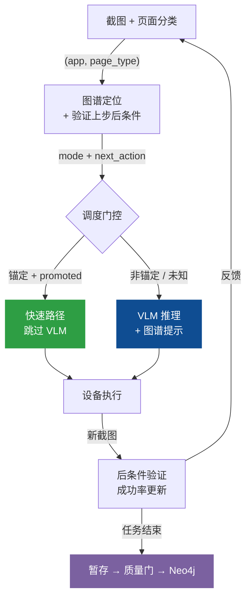
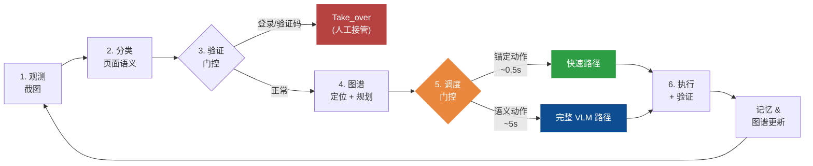

# Shopping-Agent：系统架构文档

> **版本**: 2026-06-05（重写版）
> **范围**: 完整 `phone_agent/` 实现，重点覆盖 Agent 执行模型、记忆系统协同、AMSG 图谱设计与自动持久化管线。
> **用途**: 作为学术论文写作的架构参考文档。

Shopping-Agent 是一个**以 VLM 为主、图谱引导的移动 GUI 智能体**，通过自演进的**主动移动空间图谱（Active Mobile Spatial Graph, AMSG）**增强。系统在 Android、HarmonyOS 和 iOS 设备上自动化执行复杂购物任务，通过截图观测、页面状态定位、图谱路径规划、VLM 推理、动作执行和验证后图谱持久化的闭环循环实现。

核心设计原则是**非对称权威**：图谱负责加速和约束动作空间，VLM 保留对内容相关决策的语义权威。这一分离将 Shopping-Agent 与纯 VLM 智能体（每次重新探索导航）和纯图谱规划器（无法处理新视觉内容）区分开来。

---

## 1  设计哲学

移动 GUI 自动化在一个没有稳定 DOM 的视觉环境中运行，四类不确定性来源导致了大部分失败：

| 不确定性 | 失败模式 | 设计应对 |
|---|---|---|
| **感知不确定性** | 同一页面在不同应用版本、设备、广告、弹窗、滚动位置下外观不同 | `PageState` 将截图抽象为基于应用、页面类型、地标、可操作项、槽位、风险和语义签名的可复用状态 |
| **语义不确定性** | 历史记录中的"点击商品卡片"不能表明哪个商品符合当前任务 | 非锚定转移被显式标记；VLM 必须根据当前屏幕内容选择目标 |
| **转移不确定性** | 同一按钮可能打开 SKU 选择、登录、促销弹窗、结算或无反应 | `EdgeLifecycleManager` 追踪每个转移的经验结果分布、优势比和熵 |
| **上下文不确定性** | 过长的操作历史混淆 VLM 推理并遮蔽当前任务 | `UnifiedSessionState` + `RetrievalGateway` 每步注入进度，仅按需注入详细记忆 |

这四种应对产生了一个最准确的描述为**以 VLM 为主、图谱引导控制**的系统。AMSG 不是自主控制器；它是经过验证的动作库、状态定位器、路径规划器和持久化基底。每当决策依赖于当前屏幕内容或用户意图时，VLM 保持语义权威。这种非对称性是定义性的架构选择：它阻止图谱在内容敏感页面（商品选择、SKU 选择、结算）上重播过期坐标，同时允许图谱以近零延迟快捷执行机械式导航（首页到搜索、搜索到结果、筛选切换）。

---

## 2  系统架构

系统由三个逻辑区域组成，通过一条闭环数据流连接。理解架构的关键不是"有哪些层"，而是**数据怎么流动、谁决定什么**。

```
用户任务 (自然语言)
    │
    ▼
┌─────────────────────────────────────────────────────┐
│  决策区域：决定"做什么"                                │
│                                                     │
│  PhoneAgent ← 闭环主控，每步编排所有子系统              │
│    ├── TaskPlan          任务分解 + 进度追踪           │
│    ├── ClarificationAgent 三层短路澄清（规则→记忆→VLM）│
│    ├── VerificationDetector 登录/验证码检测 → 人工接管  │
│    └── SpecGuard          购买安全守卫                 │
│                                                     │
│  两条决策路径：                                       │
│    快速路径 ← 图谱提供锚定动作，跳过 VLM (~0.5s)       │
│    VLM 路径 ← 图谱提供提示，VLM 做语义决策 (~5s)       │
└──────────────┬──────────────────────────┬────────────┘
               │ "在哪？走哪？"           │ "这步结果如何？"
               ▼                         │
┌──────────────────────────┐             │
│  图谱区域：加速导航         │             │
│                          │             │
│  GraphRuntimeController  │             │
│    ├── 定位：(app, page_type) 匹配 Neo4j │
│    ├── 规划：Dijkstra 加权最短路径        │
│    ├── RuntimeDAG 缓存路径，后续步免重规划 │
│    ├── ActionAdvisor 返回已提升的动作     │
│    └── EdgeLifecycle 追踪成功率 + 提升/降级│
│                          │             │
│  数据存储：                │             │
│    Neo4j (UIState→Action→UIState)      │
│    FAISS (用户偏好/联系人)  │             │
│    JSON (任务轨迹)         │             │
└──────────────────────────┘             │
               │ 编译后的设备动作           │
               ▼                         │
┌──────────────────────────┐             │
│  执行区域：操作设备         │             │
│                          │             │
│  ModelProtocolBridge      │             │
│    坐标归一化 (5种VLM坐标系) │            │
│  ActionHandler            │             │
│    Tap / Type / Swipe / Compound       │
│  DeviceFactory            │             │
│    ADB(Android) HDC(鸿蒙) XCTest(iOS)  │
│                          │             │
│  执行后：截取新截图 ────────┼─────────────┘
│    → 后条件验证（t+1步确认t步结果）
│    → 成功率更新 → 边生命周期推进
│    → 任务结束时：暂存 → 质量门 → Neo4j
└──────────────────────────┘
```

### 2.1  三个区域的职责边界

**决策区域**回答"做什么"。`PhoneAgent._execute_step()` 是唯一的编排入口，每步调用图谱区域获取定位和动作建议，然后选择快速路径或 VLM 路径执行。决策区域不直接操作图谱或设备。

**图谱区域**回答"在哪、走哪"。`GraphRuntimeController.locate_and_get_context()` 在一次调用中完成定位、验证上步后条件、规划路径、缓存 RuntimeDAG。它返回的 `mode` 字段（`navigate` / `explore` / `verify_with_vlm` / `goal_reached`）直接驱动决策区域的调度选择。图谱区域不做语义判断（哪个商品、哪个 SKU），只做结构性导航。

**执行区域**回答"怎么操作设备"。`ModelProtocolBridge` 将图谱的语义动作或 VLM 的模型原生输出归一化为 `DeviceActionIR`，`ActionHandler` 编译为设备指令。执行后的新截图和页面分类结果**反馈**到图谱区域，形成闭环：后条件验证更新边的成功/失败计数，成功任务结束时触发图谱持久化。

### 2.2  闭环数据流

三个区域通过一条闭环连接，每步数据按以下顺序流动：



这条闭环的关键特性：

- **每步都有反馈**：不是任务结束才更新图谱，而是每步的后条件验证结果都实时更新边的成功率
- **持久化是延迟的**：实时更新的是内存中的 `EdgeLifecycleManager` 计数器，Neo4j 写入只在任务成功结束时触发
- **快速路径有保护**：后条件不匹配时自动回退到 VLM 路径，最坏情况是多花一次 VLM 调用

---

## 3  Agent 执行模型

### 3.1  闭环执行

主控制循环由 `PhoneAgent._execute_step()` 实现，这是一个 729 行的方法，在六阶段架构中集成了所有子系统。每步遵循相同的闭环，但通过循环的路径根据图谱置信度、页面风险和语义需求而变化。



> 推荐图例：`figures/agent-execution-flow-nature-image2.png`

### 3.2  任务初始化与预规划

在执行循环开始之前，`PhoneAgent.run(task)` 执行初始化：

1. **状态重置**：清除对话上下文、步数计数器、图谱失败计数器、验证计数器、步骤摘要和模型适配器动作历史。
2. **VLM 预规划**：调用 `_vlm_pre_plan(task)` 使用更强的 VLM（通过 `AMSG_STRONG_VLM_*`）。预规划提取 `search_query`、`product`、`specs`、`target_action`、`target_page` 和带目标页面类型的有序步骤。
3. **TaskPlan 创建**：`TaskPlan.from_vlm_output()` 将预规划转换为带目标槽位的步骤列表。此计划是脚手架而非事实——当前截图和安全门控仍然决定实际可执行的内容。
4. **记忆会话启动**：记忆管理器初始化会话状态并加载相关用户偏好。

预规划有两个超越任务分解的作用：它为图谱路由填充 `GoalSpec`（让规划器知道目标页面类型），并为 SpecGuard 填充 `TaskSlots`（让安全系统在结算时验证规格选择）。

### 3.3  双速调度

调度门控是双速执行的架构核心。Agent 维护三条实际执行路径：

| 路径 | 触发条件 | VLM 开销 | 延迟 |
|---|---|---:|---|
| **快速路径** | `ActionAdvisor` 返回置信度 >= 0.9 的锚定已提升动作，且与当前计划步骤对齐 | 无 | ~0.5s |
| **图谱协助** | `GraphRuntimeController` 返回需要 VLM 验证的高置信度结构性动作 | 1 次调用 | ~3s |
| **完整 VLM 路径** | 无安全图谱动作、需要语义目标选择、低置信度、修复失败或安全守卫激活 | 1 次调用 | ~5s |

快速路径通过 `ActionAdvisor.get_fast_action()` 立即执行，并进行槽位替换（用目标槽位值替换 `<query>`、`<color>` 占位符）。执行后，后条件检查会截取新截图并验证页面类型。如果后条件不匹配，该步回退到完整 VLM 路径——图谱快捷方式不会被盲目信任。

完整 VLM 路径是刻意宽泛的。在购物任务中，图谱不应选择具体的商品、店铺、SKU 或结算决策，除非该转移已知为锚定且安全。这是根本性的"图谱作为顾问而非控制器"原则。

### 3.4  三层澄清机制

`ClarificationAgent` 在购物和外卖任务的第一步运行，使用三层短路设计最小化不必要的用户交互：

- **第一层（规则，0ms）**：`TaskSpecExtractor.extract()` 检查任务规格完整性。非购物域或规格已完整时直接跳过。
- **第二层（记忆偏好）**：查询 `MemoryStore` 中的用户偏好（如"喜欢银色"），填补缺失的规格。
- **第三层（强 VLM 歧义判断）**：仅当仍有空缺且查询模糊时运行。VLM 输出"CLEAR"或"CLARIFY: [问题]"。

这种分层设计直接连接到记忆系统：第二层查询用户偏好可填补规格缺口而无需提问。结果反馈到 `TaskSlots`，SpecGuard 后续用于验证购买安全。

### 3.5  SpecGuard 与购买安全

`SpecGuard` 位于 VLM 输出和动作执行之间，保护规格选择、结算和支付相邻页面：

- **`get_context_hints()`**：在规格/结算/支付页面注入约束提醒（预防性）。
- **`check()`**：在执行前拦截购买提交动作，可替换为 `Interact`（反应性）。

区分*选择*（选择可见选项）和*提交*（加购、立即购买、结算、支付）。选择被允许；提交被守护：如果 VLM 不能在其思考中证明请求的规格已被选择，结算或支付将被阻止。

这连接回 `TaskSlots`：用户的原始规格需求（由 `TaskSpecExtractor` 提取一次并由 ClarificationAgent 丰富）作为一等状态贯穿整个执行过程，而非偶然的提示文本。

---

## 4  记忆架构

记忆系统分离了四个服务于不同时间和语义角色的面。关键设计决策是**记忆解耦**：并非所有记忆都注入每次 VLM 调用。系统始终注入轻量上下文，仅当 VLM 推理信号表明需要时才触发详细检索。

### 4.1  四个记忆面

| 记忆面 | 存储 | 时间范围 | 注入策略 |
|---|---|---|---|
| **用户记忆** | `MemoryStore`（FAISS 向量存储） | 跨会话 | 偏好和联系人在澄清和槽位填充时注入 |
| **会话状态** | `UnifiedSessionState` | 单任务 | 进度摘要和当前焦点每步注入 |
| **图谱记忆** | `SpatialGraphMemory` + Neo4j | 跨会话（持久化图谱）+ 会话内（暂存观测） | 路径存在时注入图谱上下文；匹配页面时注入动作提示 |
| **轨迹文件** | 每任务 JSON | 单任务，保留供审核 | 不注入。由 `TrajectoryReviewer` 用于离线图谱演进 |

### 4.2  轻量上下文注入

`MemoryManager.get_injection_context()` 实现解耦策略：

1. **始终注入**：简短的进度摘要（任务计划状态、步数、最近动作）。
2. **始终注入**：当前焦点（Agent 当前正在做什么）。
3. **触发式注入**：`RetrievalGateway` 仅当上一次 VLM 思考表明回忆、比较、计算、商品查询或停滞时才激活。
4. **条件注入**：任务约束（价格范围、颜色、存储）仅在存在且当前页面与决策相关时注入。

在典型的 30 步购物任务中，完整检索可能在 3-5 步触发。其余 25+ 步仅接收 2-3 行进度摘要。这对 VLM 性能至关重要：过长的历史混淆推理并增加延迟。

### 4.3  四面协同

四个记忆面不是独立数据库——它们形成协调的记忆架构：

- **用户记忆 → 澄清**：用户偏好在第二层填补规格缺口，减少不必要的提问。
- **会话状态 → 图谱路由**：会话状态中的任务槽位填充 `GoalSpec`，驱动路径规划。
- **图谱记忆 → VLM 上下文**：图谱记忆中的已提升动作和路径计划作为动作提示出现在 VLM 提示中。
- **轨迹文件 → 图谱演进**：保存的轨迹喂入 `TrajectoryReviewer`，验证新转移并作为图谱假设导入。
- **会话状态 → 轨迹文件**：任务结束时，会话状态序列化为轨迹 JSON 文件供审计和审核。

这种协调意味着从过去任务中学到的用户偏好（存储在 FAISS 中）可以影响当前任务的图谱路由（通过 GoalSpec）和安全检查（通过 SpecGuard）——用户无需重复表述。

---

## 5  主动移动空间图谱（AMSG）

AMSG 是核心研究贡献。它是一个有类型的有向图，将移动 UI 表示为由动作转移连接的页面状态网络，标注了生命周期元数据、结果分布和定位证据。

### 5.1  形式化定义

图谱的核心持久化模式是三节点两关系：

```
(UIState) -[NEXT_ACTION]-> (Action) -[PRODUCES]-> (UIState)
```

UIState 节点存储页面状态抽象（app, page_type, landmarks, affordances, risk）。Action 节点存储语义动作（intent, semantic_target, postcondition, lifecycle_stage）。关系上记录 `frequency`（成功次数）、`fail_count`（失败次数）和 `confidence`（成功率），作为边生命周期的数据基础。

### 5.2  UIState / PageState

`PageState` 将截图抽象为可复用的页面身份。这不是像素级身份——它是*语义*身份，使系统能够识别"这是淘宝的商品详情页"而不管显示的是哪个商品。

| 字段 | 系统中的角色 |
|---|---|
| `state_id` | 来自 `(app, page_type, landmarks, affordances, risk)` 的稳定哈希 |
| `app` | 当前应用名，通过模式别名规范化 |
| `page_type` | 分类：`home`、`search_input`、`search_result`、`product_detail`、`spec_selection`、`cart`、`checkout`、`filter_panel` 等 |
| `landmarks` | 稳定的视觉锚点（如"搜索栏"、"价格标签"、"加购按钮"） |
| `affordances` | 可能的交互（如"点击商品"、"下滑"、"输入查询"） |
| `slots` | 从任务和页面文本检测的运行时槽位（如 `{query: "iPhone 16"}`） |
| `risk_level` | `normal`、`medium` 或 `high`。支付和登录页面始终为 `high` |
| `semantic_signature` | 确定性字符串：`app|domain|page_type|landmarks|affordances|slots` |

页面状态抽象使图谱可跨任务复用。从一次购物会话学到的商品详情页可以指导完全不同会话中的导航，因为图谱存储的是页面*类型*和*结构*，而非具体内容。

### 5.3  锚定与非锚定转移

这一区分是"图谱作为顾问而非控制器"的操作核心：

| 转移 | 锚定？ | 图谱行为 | VLM 角色 |
|---|---|---|---|
| `home → search_input` | 是 | 快速路径，带坐标 | 无 |
| `search_input → search_result` | 是 | 复合动作：输入 + 提交 | 无（槽位替换） |
| `search_result → product_detail` | **否** | 仅提示（无坐标） | 必须选择匹配当前任务的商品 |
| `product_detail → spec_selection` | **否** | 仅提示 | 必须判断商品页面和目标动作 |
| `spec_selection → cart/checkout` | **否** | 仅提示 | 必须安全选择用户的 SKU |

锚定转移具有稳定的坐标和确定性结果。非锚定转移需要关于*与哪个*元素交互的语义判断——图谱知道转移存在，但只有 VLM 能在当前屏幕上决定具体目标。

---

## 6  图谱自演进

图谱不是通过记录每个观测到的动作来增长的。它通过一个暂存优先的管线和三条独立路径演进，全部收敛到同一个质量门控的持久化层。

### 6.1  边生命周期状态机

AMSG 中的每个转移都经历一个决定其运行时权限的生命周期：

```
hypothesis（假设）→ candidate（候选）→ promoted（已提升）→ demoted（已降级）
```

- **提升条件**：`verification_count >= min_verification_count`（默认 1，严格 3）AND `dominance_ratio >= threshold`（默认 0.6，严格 0.8）AND `risk_level != "high"`
- **降级条件**：已提升边的优势比降至 40% 以下时自动降级。这处理了 UI 变更：如果应用更新改变了按钮的目标，结果分布偏移，优势度下降，边自动降级。

**结果熵**（Shannon 熵）：$H = -\sum_i p_i \ln(p_i)$

当 $H >$ 结果熵 VLM 阈值（默认 0.8）时，转移被标记为需要 VLM 验证而非直接执行。这用数据驱动的决策边界替代了硬编码的"风险转移"列表。

### 6.2  三条持久化路径

**路径 1（在线运行时）**：任务执行期间，每个动作产生后条件观测。`SpatialGraphMemory.record_observation()` 在本地暂存转移。任务结束时，`flush_staged_graph()` 规范化状态和边，提升有效转移，写入 Neo4j。**失败的任务不会刷新**——这是第一道质量门。

**路径 2（轨迹审核）**：`TrajectoryReviewer` 处理保存的轨迹文件。提取页面转移，对比现有图谱边去重，并请求强 VLM 验证新候选。仅 VLM 批准的转移以 `hypothesis` 边导入。这是第二道质量门——防止对话框、广告、分类器错误和瞬态屏幕污染图谱。

**路径 3（离线探索）**：`import_exploration_staging()` 通过规范化、瞬态页面过滤、应用不匹配过滤、搜索宏合成、同页压缩和边质量过滤处理预采集的探索数据。

关键洞察是**没有原始动作直接写入 Neo4j**。每条持久化路径都通过至少一道质量门（任务成功、VLM 验证或规范化过滤）。这使 AMSG 成为"经过验证的动作库"而非嘈杂的轨迹堆积。

> 推荐图例：`figures/graph-persistence-pipeline-nature-image2.png`

---

## 7  定位与规划

### 7.1  页面定位

默认的定位机制很直接：用当前 `(app, page_type)` 在 Neo4j 中匹配 UIState 节点。匹配到图谱候选时给固定评分 0.92，当前观测给 0.82。这个简单方法有效，因为 `PageClassifier` 已经提供了准确的 page_type，`(app, page_type)` 二元组在绝大多数场景下足以唯一标识页面状态。

一个可选的多通道贝叶斯定位器（`MultiSignalLocalizer`）已实现但默认未启用（`use_multi_signal_belief=False`）。它增加了视觉嵌入、语义嵌入和时序转移通道，但相对于 `(app, page_type)` 匹配的边际改进尚未通过消融实验验证。

### 7.2  路径规划

默认规划器是 **Dijkstra**，边权为：

$$\text{cost}(e) = 1.0 + 3.0 \times \text{fail\_rate} + R(\text{risk}) - 0.3 \times \text{confidence}$$

风险惩罚：normal=0, medium=0.8, high=2.0。这个成本函数偏好高成功率、低风险、高置信度的边——即经过验证的可靠路径。

在典型购物应用图谱（< 50 节点）上，Dijkstra 已能高效找到最优路径。增强规划器（A* 和 Belief-A* 后端）已实现但默认未启用——其额外的成本调整项（过期衰减、探索奖励、信息增益、熵惩罚）在当前图谱规模下贡献 < 0.1，不影响路径选择。

### 7.3  RuntimeDAG：缓存路径执行

当 Dijkstra 找到路径时，路径被物化为 `RuntimeDAG`——内存中的边数组加游标。后续步骤直接推进游标（`current_index += 1`），不再查询 Neo4j 和重跑 Dijkstra。在一个 5 步连续导航序列中，仅第一步跑完整的定位-规划管线，后续 4 步读 `route[current_index]`，开销 < 1ms。

RuntimeDAG 失效条件：后条件不匹配（到达非预期页面）、应用切换、连续图谱失败超阈值、下一条边是高风险。失效后，下一次 `locate_and_get_context()` 调用跑完整管线，规划成功则创建新 DAG。

RuntimeDAG 还控制 PageClassifier 跳过：当 DAG 可用且下一步非高风险时，`should_use_page_classifier()` 返回 `False`，Agent 使用 DAG 预期的 page_type 代替分类器输出，节省一次 VLM 调用。但如果弹窗出现导致实际页面与预期不符，延迟后条件验证会在下一步发现并修复。

### 7.4  动作编译

图谱原生动作通过两阶段 IR 管线编译：

```
SemanticActionIR（意图、语义目标、定位器、后条件）
    → DeviceActionIR（动作类型、坐标、坐标空间、屏幕尺寸）
    → ActionHandler 的标准动作字典
```

`SpatialModelBridge` 处理第一阶段（语义到设备 IR），`ModelProtocolBridge` 处理跨模型家族的坐标归一化。这保持 AMSG 模型无关：图谱存储语义意图和定位器证据，而适配器处理模型原生语法和坐标系统。

---

## 8  模型与设备抽象

### 8.1  多模型支持

Shopping-Agent 通过统一的适配器架构支持五个 VLM 家族：

| 模型家族 | 坐标空间 | 上下文策略 | 响应格式 |
|---|---|---|---|
| AutoGLM | [0, 1000] 归一化 | 累积（每轮追加） | `<answer>` XML |
| UI-TARS | 绝对像素（smart_resize） | 最多 5 张图，裁剪最旧的 | "Thought: ... Action: ..." |
| Qwen-VL | [0, 999] 归一化 | 每轮重新构建 | `<tool_call>` JSON |
| MAI-UI | [0, 999] 归一化 | 最多 3 张图 | `<thinking>` + `<tool_call>` |
| GUI-Owl | [0, 1.0] 小数 | 最多 1 张图（仅当前） | Action + `<tool_call>` |

`ModelProtocolBridge._scale_coord()` 是坐标转换枢纽，通过归一化的 (0, 1) 中间表示在所有坐标空间之间转换。

---

## 9  对比分析

### 9.1  在文献中的定位

Shopping-Agent 解决了当前 GUI 智能体领域的三个具体缺口：

**缺口 1：无状态的重复探索。** 大多数 GUI 智能体（包括 ColorAgent [Li et al., 2025]、MobiAgent [Zhang et al., 2025] 等强系统）将每个任务会话视为独立。它们可能通过反思或自纠正在会话内学习，但关于应用导航的结构性知识不会跨会话持久化。Shopping-Agent 的 AMSG 在 Neo4j 中持久化经过验证的转移，使 Agent 能够构建关于应用导航模式的累积知识。

**缺口 2：无生命周期的图谱。** 构建导航图谱的系统——PG-Agent [Chen et al., 2025] 从 episode 构建页面图，KG-RAG [Guan et al., 2025] 将 UTG 转换为向量数据库，WebNavigator [Zhang et al., 2025] 通过启发式探索构建交互图——将图谱视为静态产物。一旦构建，边不会演进。Shopping-Agent 引入完整的生命周期：hypothesis → candidate → promoted → demoted，具有数据驱动的提升标准和 UI 变更时的自动降级。

**缺口 3：二元的图谱/VLM 控制。** 现有图谱增强的 Agent 将图谱用作静态 RAG 源（PG-Agent、KG-RAG）或完全绕过 VLM 的确定性控制器（WebNavigator 的 Teleport）。Shopping-Agent 引入三档调度：锚定且已提升的转移走快速路径（~0.5s，不调用 VLM），非锚定转移由 VLM 决策（~5s），带后条件保护。调度依据是每条边的锚定性（是否有稳定坐标和确定性目标）和生命周期阶段（是否经过验证和提升）。

### 9.2  详细对比

| 维度 | ColorAgent | PG-Agent | KG-RAG | WebNavigator | MobiAgent (AgentRR) | **Shopping-Agent** |
|---|---|---|---|---|---|---|
| **图谱结构** | 无 | 页面图 | UTG → 向量库 | 交互图（BFS） | ActTree（前缀复用） | AMSG（带生命周期的类型化有向图） |
| **图谱演进** | N/A | 构建后静态 | 提取后静态 | 离线 BFS 后静态 | 记录-重放（静态） | 自演进：在线暂存 → 后条件验证 → 生命周期提升 → 降级 |
| **持久化** | 无 | 会话内内存 | 向量库（静态） | 向量库（静态） | 潜在记忆模型 | Neo4j + 生命周期元数据 + 结果分布 |
| **VLM/图谱边界** | 仅 VLM | RAG → VLM | RAG → VLM | 确定性传送（无 VLM） | 经验 → 跳过 VLM（二元） | 基于锚定性分类的三档调度 |
| **定位** | VLM 感知 | BFS 相似搜索 | 嵌入检索 | 多模态检索 | 页面匹配 | (app, page_type) 匹配 + 可选贝叶斯扩展 |
| **规划** | 多 Agent 分解 | 页面图 BFS | UTG BFS | 交互图最短路径 | 前缀可复用性 | Dijkstra 加权图（成功率 + 风险惩罚） |
| **安全机制** | 未报告 | 未报告 | 未报告 | 未报告 | 未报告 | SpecGuard：任务槽位感知的购买拦截 |
| **转移验证** | 自演进训练 | 无 | 无 | 无 | 无 | 后条件验证 + 结果分布 + 熵阈值 |
| **质量门控** | 轨迹过滤 | 无 | 无 | 无 | 手动纠正 | 三道门：任务成功、VLM 轨迹审核、规范化 |
| **多模型支持** | 专有模型 | GPT-4o | MobileAgent-v2 | GPT-4o, Gemini, Claude | MobiMind（自定义） | 5 族：AutoGLM, UI-TARS, Qwen-VL, MAI-UI, GUI-Owl |
| **跨平台** | 仅 Android | Android | Android + HarmonyOS | 仅 Web | 仅 Android | Android + HarmonyOS + iOS |

### 9.3  创新点总结

### 核心贡献（默认启用、可复现）

1. **自更新的页面状态图谱**：移动 GUI 智能体领域首个跨会话持久化的导航知识图谱，随成功任务自动增长，随边可靠性下降自动收缩。
2. **基于成功率的边生命周期**：转移边经历 hypothesis → candidate → promoted → demoted 四阶段状态机，由后条件验证通过率和提升阈值驱动，解决在线观测噪声污染图谱的问题。
3. **锚定性分类与三档调度**：在每条边上独立判断图谱/VLM 的控制强度。锚定转移直接执行（~0.5s），非锚定转移由 VLM 决策（~5s），带后条件保护。
4. **延迟后条件验证**：在 t+1 步验证 t 步的动作结果，使成功率追踪基于真实观测。
5. **暂存优先持久化与三道质量门**：失败任务不写图谱、新转移需 VLM 审核、所有路径经过规范化。
6. **结构化任务约束作为一等运行时状态**：任务规格提取一次后被 SpecGuard 在购买提交点强制执行。

### 实验性扩展（未默认启用）

- 多通道贝叶斯信念定位（默认关闭；`(app, page_type)` 匹配已覆盖大多数场景）
- Belief-A* 增强规划器（默认 Dijkstra；增强项在当前图谱规模下贡献 < 0.1）
- 熵驱动的 VLM 验证边界（已实现但硬编码转移集合仍为主要机制）


---

## 10  论文方法摘要

> Shopping-Agent 是一个以 VLM 为主的移动 GUI 智能体，通过自演进的主动移动空间图谱（AMSG）增强。系统将截图抽象为语义页面状态，在 Neo4j 中持久化经过验证的导航转移。每个执行步骤通过 `(app, page_type)` 匹配定位当前页面，用 Dijkstra 在加权图上规划路径，路径缓存为 RuntimeDAG 供后续步骤直接推进。锚定且已提升的转移走快速路径（~0.5s，跳过 VLM），非锚定转移由 VLM 选择具体目标（~5s），带后条件保护——不匹配时自动回退。延迟后条件验证在 t+1 步确认 t 步的动作结果，使边的成功率追踪基于真实观测。在线观测暂存在内存中，仅成功任务触发 Neo4j 写入，新转移需经 VLM 轨迹审核——没有原始动作直接写入图谱。用户约束作为一等任务槽位提取，由 SpecGuard 在购买提交点强制执行。
