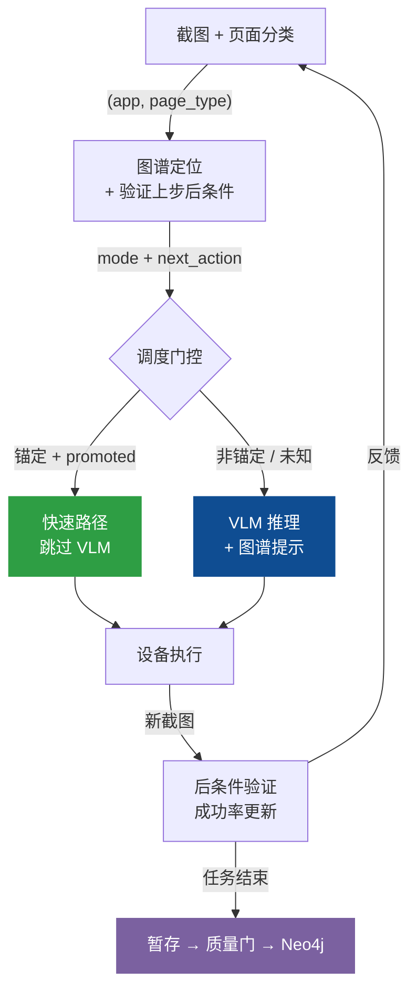

# Shopping-Agent：系统架构文档

> **版本**: 2026-06-10（多 App 泛化版）
> **范围**: 完整 `phone_agent/` 实现，重点覆盖 Agent 执行模型、记忆系统协同、AMSG 图谱设计与自动持久化管线，以及多 App 图谱组织与陌生 App 离线建图管线（5.8 节，详述见 AMSG_DESIGN.md）。
> **用途**: 作为学术论文写作的架构参考文档。已在淘宝与京东（含秒送外卖链路）两个真实 App 上端到端验证。

Shopping-Agent 是一个**以 VLM 为主、图谱引导的移动 GUI 智能体**，通过自演进的**主动移动空间图谱（Active Mobile Spatial Graph, AMSG）**增强。系统在 Android、HarmonyOS 和 iOS 设备上自动化执行复杂购物任务，通过截图观测、页面状态定位、图谱路径规划、VLM 推理、动作执行和验证后图谱持久化的闭环循环实现。

核心设计原则是**非对称权威**：图谱负责加速和约束动作空间，VLM 保留对内容相关决策的语义权威。这一分离将 Shopping-Agent 与纯 VLM 智能体（每次重新探索导航）和纯图谱规划器（无法处理新视觉内容）区分开来。

---

## 1  设计哲学

移动 GUI 自动化在一个没有稳定 DOM 的视觉环境中运行，四类不确定性来源导致了大部分失败：

| 不确定性 | 失败模式 | 设计应对 |
|---|---|---|
| **感知不确定性** | 同一页面在不同应用版本、设备、广告、弹窗、滚动位置下外观不同 | `PageState` 将截图抽象为基于应用、页面类型、地标、可操作项、槽位、风险和语义签名的可复用状态 |
| **语义不确定性** | 历史记录中的"点击商品卡片"不能表明哪个商品符合当前任务 | 非锚定转移被显式标记；VLM 必须根据当前屏幕内容选择目标 |
| **转移不确定性** | 同一按钮可能打开 SKU 选择、登录、促销弹窗、结算或无反应 | `EdgeLifecycleManager` 追踪每个转移的经验结果分布、优势比和熵 |
| **上下文不确定性** | 过长的操作历史混淆 VLM 推理并遮蔽当前任务 | `UnifiedSessionState` + `RetrievalGateway` 每步注入进度，仅按需注入详细记忆 |

这四种应对产生了一个最准确的描述为**以 VLM 为主、图谱引导控制**的系统。AMSG 不是自主控制器；它是经过验证的动作库、状态定位器、路径规划器和持久化基底。每当决策依赖于当前屏幕内容或用户意图时，VLM 保持语义权威。这种非对称性是定义性的架构选择：它阻止图谱在内容敏感页面（商品选择、SKU 选择、结算）上重播过期坐标，同时允许图谱以近零延迟快捷执行机械式导航（首页到搜索、搜索到结果、筛选切换）。

---

## 2  系统架构

系统由三个逻辑区域组成，通过一条闭环数据流连接。理解架构的关键不是"有哪些层"，而是**数据怎么流动、谁决定什么**。

```
用户任务 (自然语言)
    │
    ▼
┌─────────────────────────────────────────────────────┐
│  决策区域：决定"做什么"                                │
│                                                     │
│  PhoneAgent ← 闭环主控，每步编排所有子系统              │
│    ├── TaskPlan          任务分解 + 进度追踪           │
│    ├── ClarificationAgent 三层短路澄清（规则→记忆→VLM）│
│    ├── VerificationDetector 登录/验证码检测 → 人工接管  │
│    └── SpecGuard          购买安全守卫                 │
│                                                     │
│  两条决策路径：                                       │
│    快速路径 ← 图谱提供锚定动作，跳过 VLM (~0.5s)       │
│    VLM 路径 ← 图谱提供提示，VLM 做语义决策 (~5s)       │
└──────────────┬──────────────────────────┬────────────┘
               │ "在哪？走哪？"           │ "这步结果如何？"
               ▼                         │
┌──────────────────────────┐             │
│  图谱区域：加速导航         │             │
│                          │             │
│  GraphRuntimeController  │             │
│    ├── 定位：(app, page_type) 匹配 Neo4j │
│    ├── 规划：Dijkstra 加权最短路径        │
│    ├── RuntimeDAG 缓存路径，后续步免重规划 │
│    ├── ActionAdvisor 返回已提升的动作     │
│    └── EdgeLifecycle 追踪成功率 + 提升/降级│
│                          │             │
│  数据存储：                │             │
│    Neo4j (UIState→Action→UIState)      │
│    FAISS (用户偏好/联系人)  │             │
│    JSON (任务轨迹/探索产物/  │             │
│          staging 审核批次)  │             │
└──────────────────────────┘             │
               │ 编译后的设备动作           │
               ▼                         │
┌──────────────────────────┐             │
│  执行区域：操作设备         │             │
│                          │             │
│  ModelProtocolBridge      │             │
│    坐标归一化 (5种VLM坐标系) │            │
│  ActionHandler            │             │
│    Tap / Type / Swipe / Compound       │
│  DeviceFactory            │             │
│    ADB(Android) HDC(鸿蒙) XCTest(iOS)  │
│                          │             │
│  执行后：截取新截图 ────────┼─────────────┘
│    → 后条件验证（t+1步确认t步结果）
│    → 成功率更新 → 边生命周期推进
│    → 任务结束时：暂存 → 质量门 → Neo4j
└──────────────────────────┘
```


### 2.1  三个区域的职责边界

**决策区域**回答"做什么"。`PhoneAgent._execute_step()` 是唯一的编排入口，每步调用图谱区域获取定位和动作建议，然后选择快速路径或 VLM 路径执行。决策区域不直接操作图谱或设备。

**图谱区域**回答"在哪、走哪"。`GraphRuntimeController.locate_and_get_context()` 在一次调用中完成定位、验证上步后条件、规划路径、缓存 RuntimeDAG。它返回的 `mode` 字段（`navigate` / `explore` / `verify_with_vlm` / `goal_reached`）直接驱动决策区域的调度选择。图谱区域不做语义判断（哪个商品、哪个 SKU），只做结构性导航。

**执行区域**回答"怎么操作设备"。`ModelProtocolBridge` 将图谱的语义动作或 VLM 的模型原生输出归一化为 `DeviceActionIR`，`ActionHandler` 编译为设备指令。执行后的新截图和页面分类结果**反馈**到图谱区域，形成闭环：后条件验证更新边的成功/失败计数，成功任务结束时触发图谱持久化。

### 2.2  闭环数据流

三个区域通过一条闭环连接，每步数据按以下顺序流动：



这条闭环的关键特性：

- **每步都有反馈**：不是任务结束才更新图谱，而是每步的后条件验证结果都实时更新边的成功率
- **持久化是延迟的**：实时更新的是内存中的 `EdgeLifecycleManager` 计数器，Neo4j 写入只在任务成功结束时触发
- **快速路径有保护**：后条件不匹配时自动回退到 VLM 路径，最坏情况是多花一次 VLM 调用

以上是**运行时**闭环。运行时之外还有一条**离线建图管线**（onboarding → 强 VLM 规划的焦点探索 → staging → 人工审核 → hypothesis 入图，见 5.8 节）负责陌生 App 的冷启动——两条管线在 Neo4j 中汇合：离线管线播种 hypothesis 边，运行时的后条件验证将其提升为可执行的 promoted 边。

---

## 3  Agent 设计

本节按时间顺序描述一个任务从接收到完成的完整过程。入口是 `PhoneAgent.run(task)`，主循环是 `_execute_step()`，出口是 `MemoryManager.end_task()`。


### 3.1  任务接收：从自然语言到可执行状态

用户输入 `"帮我在淘宝搜索 iPhone 16 银色 256G，加入购物车"` 后，`run()` 依次做四件事：

**① 状态重置**。清空上一个任务的对话上下文、步数计数器、RuntimeDAG 缓存、验证计数器和模型适配器历史。这确保任务之间完全隔离。

**② 任务槽位提取**。`TaskSpecExtractor.extract(task)` 用正则从任务文本中提取结构化约束：`query="iPhone 16"`, `color="银色"`, `storage="256G"`, `domain="shopping"`。这些槽位被三个下游模块消费：
- `GoalSpec`：告诉图谱规划器目标是 `spec_selection` 或 `cart`
- `SpecGuard`：在结算页面验证颜色和存储是否被正确选择
- `ClarificationAgent`：判断是否需要追问用户

**③ VLM 预规划**。调用 `_vlm_pre_plan(task)` 让 VLM 将任务分解为有序步骤（如 "打开淘宝 → 搜索 → 选商品 → 选规格 → 加购"），每步标注目标 page_type。预规划是脚手架——后续每步仍由当前截图和安全门控决定实际行为。

**④ 记忆会话启动**。`MemoryManager.start_task()` 重置 `UnifiedSessionState`，从 FAISS 加载相关用户偏好（如"历史偏好银色"），清空 RuntimeDAG 缓存。

### 3.2  步骤循环：_execute_step() 的完整流程

`run()` 在循环中反复调用 `_execute_step()`，每次执行一步操作。以下是一步的完整流程，按实际代码顺序：

```
用户任务: "帮我在淘宝搜索 iPhone 16 银色 256G，加入购物车"
当前步骤: 第 3 步（已完成搜索，正在看搜索结果）

─── Phase 1: 感知 ───────────────────────────────────
│
│  DeviceFactory.get_screenshot()    → 截图 base64
│  DeviceFactory.get_current_app()   → "taobao"
│  MD5(截图)                         → ui_hash
│  PageClassifier.classify(截图)     → page_type="search_result"
│    提示词由域模式生成（开放词表：词表外页面产出 new:<type> 提案）
│    或 RuntimeDAG 提供 hint（跳过分类器，省一次 VLM 调用）
│
─── Phase 2: 安全门控 ──────────────────────────────
│
│  detect_verification(page_type, summary)
│    → 检测登录/验证码/短信验证页面
│    → 命中 → Take_over（暂停，等人工处理）
│    → 未命中 → 继续
│
─── Phase 3: 图谱协同 + 澄清 ─────────────────────
│
│  memory_manager.locate_and_get_context(ui_hash, layout, task)
│    → GraphRuntimeController.locate_and_get_context()
│      ① 如果 RuntimeDAG 可用 → 直接取下一步（~10ms）
│      ② 否则：(app, page_type) 匹配 Neo4j → 定位
│      ③ 验证上一步的 pending transition（成功/失败）
│      ④ Dijkstra 规划路径 → 缓存为新 RuntimeDAG
│      ⑤ 返回 mode + next_actions + semantic_context
│
│  [仅第 1 步] ClarificationAgent.check_and_clarify()
│    第一层：规则检查，槽位已完整 → 跳过
│    第二层：记忆偏好填充缺失槽位
│    第三层：仅在模糊时调用强 VLM 追问用户
│
─── Phase 4: 上下文组装 ────────────────────────────
│
│  memory_manager.get_injection_context(thinking, app, step)
│    → 始终注入：进度摘要（1-2 行）+ 当前焦点
│    → 按需注入：RetrievalGateway 检测到 VLM 思考中的
│      回忆/比较/计算信号时，注入商品列表或历史步骤
│    → 条件注入：价格/颜色/存储约束（在决策页面）
│
│  组装 VLM 消息：
│    系统提示 + 任务 + 截图 + 图谱上下文 + 记忆注入
│    + TaskPlan 进度标记 + SpecGuard 约束提醒
│    + ActionAdvisor 的动作提示（如果 mode=navigate）
│
─── Phase 5: 调度与执行 ────────────────────────────
│
│  if mode == "navigate" 且图谱返回锚定动作:
│    → 快速路径：ActionAdvisor.get_fast_action()
│      槽位替换（<query> → "iPhone 16"）
│      ActionHandler.execute() → 设备操作（~0.5s）
│      截取新截图 → 检查 page_type 是否匹配预期
│      不匹配 → 回退到 VLM 路径
│
│  else（explore / verify_with_vlm / 快速路径回退）:
│    → VLM 路径：ModelClient.request(messages)
│      模型返回 thinking + action
│      ModelProtocolBridge.normalize_action() → DeviceActionIR
│      SpecGuard.check()：购买提交动作被拦截？
│        → 是：替换为 Interact（问用户）
│        → 否：放行
│      ActionHandler.execute() → 设备操作（~5s 含推理）
│
─── Phase 6: 状态更新 ──────────────────────────────
│
│  memory_manager.update_state_and_transition()
│    → 构建当前 PageState
│    → 暂存 pending transition:
│      (当前页面, 执行的动作, 预期目标页面)
│    → 下一步的 Phase 3 会验证这个 pending
│
│  memory_manager.add_step(thinking, action)
│    → UnifiedSessionState.record_step()
│    → 检测停滞（连续 3 次相同动作+页面+目标 → 触发检索）
│    → 提取商品信息（价格、规格）存入会话状态
│
│  历史压缩：保留最近 2 条完整 VLM 对话，其余压缩为摘要
│
└── 返回 StepResult → run() 判断是否继续循环
```

### 3.3  上下文管理：每步注入什么

VLM 的上下文窗口是稀缺资源。系统按优先级分层注入：

| 优先级 | 内容 | 来源 | 注入条件 |
|---|---|---|---|
| 1（最高） | 系统提示 + 任务描述 + 当前截图 | Agent 配置 | 每步 |
| 2 | 任务计划进度标记 | `TaskPlan.status_text()` | 第 2 步起 |
| 3 | 图谱导航上下文 | `GraphRuntimeController` | mode != explore |
| 4 | 关键约束（⚠️价格/颜色/存储） | `TaskSlots` + `SpecGuard` | 决策页面 |
| 5 | 最近 8 步操作摘要 | 历史压缩 | 每步 |
| 6 | 按需记忆检索 | `RetrievalGateway` | VLM 思考中出现回忆/比较/停滞信号 |
| 7（最低） | ActionAdvisor 动作提示 | 图谱 promoted 边 | mode = navigate |

关键设计：**不是所有记忆都注入每次调用**。进度摘要始终注入（2-3 行），但详细的商品对比、购物车计算等只在 VLM 的思考文本表现出需要时才触发。典型 30 步任务中，完整检索触发 3-5 次。

### 3.4  任务结束：结果处理与图谱持久化

循环结束条件：VLM 输出 `terminate`/`answer` 动作，或达到 `max_steps`。

`MemoryManager.end_task(success, result)` 执行：

1. **轨迹保存**（无论成败）：完整步骤序列写入 `trajectories/{timestamp}_{ok|fail}_{slug}.json`
2. **学习模式**（仅成功）：记录联系人-应用绑定、应用使用频率等偏好到 FAISS
3. **图谱刷新**（仅成功）：`flush_staged_graph()` 执行规范化 → 质量过滤 → Neo4j 写入
4. **VLM 轨迹审核**（仅成功）：`TrajectoryReviewer` 提取新转移 → VLM 验证 → 以 hypothesis 导入

失败任务只保存轨迹文件，不触发图谱写入——这是防止噪声污染图谱的第一道门。

---

## 4  记忆系统：为 Agent 循环提供什么

回顾第 3 节的 Agent 循环：Phase 3 需要图谱定位和路径规划，Phase 4 需要组装 VLM 上下文，Phase 6 需要记录步骤状态。这三个需求的时间尺度和数据粒度完全不同——这就是记忆系统分成多个面的原因。

### 4.1  每个记忆面解决 Agent 循环中的哪个问题

**用户记忆（FAISS 向量存储，跨会话持久）** → 服务于 Phase 3 的澄清和 Phase 4 的槽位填充。

问题：用户说"帮我买个手机"，缺少颜色/存储等规格。每次都追问用户体验很差。
解决：FAISS 中存储了"用户偏好银色"、"联系人张三常用微信"等历史偏好。ClarificationAgent 的第二层直接从 FAISS 填充缺失槽位，不需要追问。下次用户再说"买手机"，系统直接带上"银色"偏好进行搜索。

**会话状态（UnifiedSessionState，单任务生命周期）** → 服务于 Phase 4 的进度注入和 Phase 6 的步骤记录。

问题：VLM 需要知道"我做到哪了"，但不需要知道每步的完整推理过程。
解决：`UnifiedSessionState` 是单次写入路径——每步通过 `record_step()` 写入动作类型和截断的思考摘要（150 字）。`progress_summary()` 生成一行进度文本（如 "Step 3 → 已搜索 → 找到 12 件 | 当前: iPhone 15 ¥6999"），每步注入 VLM 上下文。完整思考存入 `_reasoning_archive`，仅在 `RetrievalGateway` 触发检索时才被查询。

**图谱记忆（SpatialGraphMemory + Neo4j，跨会话持久）** → 服务于 Phase 3 的定位/规划和 Phase 5 的快速路径。

问题：VLM 每次推理 ~5s，但 "首页→搜索" 这种机械导航每次都相同。
解决：图谱存储经过验证的页面转移。Phase 3 中 `locate_and_get_context()` 查询图谱，如果找到路径，Phase 5 直接走快速路径（~0.5s）。图谱解决的不是"理解"问题，而是"重复劳动"问题。

**轨迹文件（JSON，单任务产物）** → 不服务于 Agent 循环，服务于任务结束后的图谱演进。

问题：任务成功后，如何发现图谱中尚未记录的新转移？
解决：`TrajectoryReviewer` 在任务结束后（3.4 节）读取轨迹文件，提取新转移，VLM 验证后以 hypothesis 导入图谱。轨迹文件是图谱自演进的输入数据。

### 4.2  按需检索：为什么不把所有记忆都塞给 VLM

Agent 循环的 Phase 4 组装 VLM 上下文时，如果把所有历史步骤、所有商品信息、所有用户偏好全部注入，会出现两个问题：
1. **token 浪费**：30 步任务的完整历史可能占 3000+ token，但 VLM 真正需要参考历史的步骤只有 3-5 步
2. **注意力稀释**：大量无关历史会干扰 VLM 对当前步骤的推理

`RetrievalGateway` 的设计是：**监听 VLM 的思考文本，只在检测到特定信号时触发检索**。

| VLM 思考中的信号 | 触发的检索类型 | 注入内容 |
|---|---|---|
| "之前看过"、"忘记了"、"记不清" | 回忆检索 | 最近 5 步操作摘要 + 相关思考片段 |
| "哪个更便宜"、"对比"、"性价比" | 商品对比 | 已浏览商品表格（名称/价格/规格） |
| "总共"、"合计"、"一共" | 购物车计算 | 购物车商品列表 + 总价 |
| 连续 3 步相同动作（停滞检测） | 自动回忆 | 最近步骤 + "当前可能需要先选择规格" |

冷却机制：上次检索后 3 步内不再触发，防止每步都检索。

这个设计使得典型 30 步任务中，25+ 步的记忆注入只有 2-3 行进度摘要，仅 3-5 步有详细检索。VLM 的上下文窗口被高效利用。

### 4.3  记忆面之间的数据流

四个面不是独立存在的。用一个具体例子说明它们如何在 Agent 循环中协同：

```
任务 N："帮我在淘宝买银色 iPhone 16"
│
├── [3.1 任务接收] TaskSpecExtractor 提取 color="银色"
│     → 存入 TaskSlots → GoalSpec（图谱路由目标）+ SpecGuard（购买安全）
│
├── [3.2 Phase 3] 图谱规划：GoalSpec 指定目标 page_type = spec_selection
│     → Dijkstra 找到路径 home → search_input → search_result → ...
│
├── [3.2 Phase 6] 每步记录到 UnifiedSessionState
│     → 检测到商品 "iPhone 16 ¥6999 银色 256G" → 存入 session.products
│
├── [3.4 任务结束] 成功
│     → 轨迹写入 JSON
│     → flush_staged_graph() → Neo4j 新增 home→search_input 等边
│     → 学习偏好 "银色" → 写入 FAISS
│     → TrajectoryReviewer → VLM 审核新转移
│
任务 N+1："买个手机"（没指定颜色）
│
├── [3.1 任务接收] TaskSpecExtractor: color 为空
│
├── [3.2 Phase 3 - 澄清] ClarificationAgent Layer 2:
│     → 查询 FAISS: 找到 "用户偏好银色" (任务 N 学到的)
│     → 自动填充 color="银色"，不追问用户
│
├── [3.2 Phase 3 - 图谱] 图谱已有任务 N 写入的边
│     → 快速路径命中 home→search_input（~0.5s，跳过 VLM）
│
└── 任务 N 的记忆同时影响了任务 N+1 的澄清和导航
```

---

## 5  空间图谱（AMSG）：为什么要这样设计


### 5.1  图谱解决 Agent 循环中的什么问题

回到 3.2 节的步骤循环。如果没有图谱，每步都走 VLM 路径：截图 → VLM 推理（~5s）→ 执行。一个 20 步购物任务需要 ~100s 的 VLM 推理时间。

但其中大部分步骤是机械导航：首页点搜索、输入关键词、点提交、滚动浏览。这些操作在所有购物任务中完全相同。图谱的作用就是**把这些已验证的导航路径缓存下来**，让 Phase 5 走快速路径（~0.5s），只在需要语义判断的步骤（选哪个商品、选哪个 SKU）才调用 VLM。

这不是一个通用的图规划问题。图谱规模小（~8-12 种页面类型，15-25 条常用边），Dijkstra 在微秒级完成。真正的设计挑战是：

1. **存什么才能跨任务复用？** → 页面状态抽象（5.2 节）
2. **怎么区分图谱能做和 VLM 必须做的？** → 锚定性分类（5.3 节）
3. **怎么防止噪声污染图谱？** → 生命周期 + 暂存持久化（5.4-5.5 节）
4. **怎么避免每步都重新规划？** → RuntimeDAG 缓存（5.6 节）

### 5.2  页面状态抽象：存什么才能跨任务复用

图谱的节点不是截图，是语义描述：

```
PageState = (app, page_type, landmarks, affordances, slots, risk)
```

**为什么不存截图哈希？** 同一个搜索结果页，搜索"iPhone"和搜索"耳机"的截图完全不同，但页面结构相同——都有搜索栏、商品卡片列表、筛选按钮。存截图哈希意味着每次搜索不同关键词都产生一个新节点，图谱膨胀但不复用。

**为什么不存 DOM？** 移动应用不一定提供 accessibility tree。即使提供，DOM 结构在 app 版本更新后经常变化。

**存 (app, page_type) 二元组就够了吗？** 对于定位（Phase 3）确实够了。但对于去重（同一 page_type 的不同观测要合并为一个节点），需要更细粒度的 `semantic_signature`：`app|domain|page_type|landmarks|affordances|slots`。签名相同的观测合并到同一节点。

**这如何服务 Agent 循环？** Phase 3 中 `locate_and_get_context()` 用 `(app, page_type)` 在 Neo4j 查找匹配节点。找到后，该节点的出边（NEXT_ACTION）就是当前页面可用的已验证动作。Phase 5 中 `ActionAdvisor.query()` 返回这些出边中已提升的动作作为快速路径候选。

### 5.3  锚定性分类：图谱和 VLM 各管什么

这是图谱设计中最关键的决策。观察购物流程中每步的性质：

```
home → search_input          谁都知道搜索按钮在哪   → 图谱能做
search_input → search_result  输入+提交，机械操作     → 图谱能做（槽位替换）
search_result → product_detail 选哪个商品？取决于任务 → 只有 VLM 能做
product_detail → spec_selection 选什么规格？取决于用户 → 只有 VLM 能做
spec_selection → cart          确认购买？需要安全检查  → VLM + SpecGuard
```

前两步是**锚定的**——按钮位置固定，点击结果确定，图谱可以直接执行。后三步是**非锚定的**——目标元素取决于当前屏幕内容和用户意图，图谱只能提供"这个转移存在"的提示，具体点哪里必须 VLM 看截图决定。

**这如何影响 Phase 5 的调度？** `ActionAdvisor.is_fast_executable()` 检查三个条件：`grounded=True`（有坐标）、`confidence >= 0.9`（高置信度）、有坐标或复合步骤。全部满足 → 快速路径。任一不满足 → VLM 路径。

**为什么不让图谱也学习非锚定转移的坐标？** 因为坐标是内容相关的。搜索"iPhone"和搜索"耳机"后，第一个商品卡片的坐标不同。存储旧坐标会导致点击错误的商品。

### 5.4  边生命周期：怎么防止噪声进入图谱

在线执行中，以下噪声观测频繁出现：

| 噪声来源 | 产生的虚假转移 | 如果写入图谱的后果 |
|---|---|---|
| 广告弹窗 | `product_detail → dialog` | 规划器可能走"经过弹窗"的路径 |
| 登录拦截 | `product_detail → login` | 快速路径尝试绕过登录，失败 |
| 分类器误判 | `search_result → unknown` | 图谱出现无意义的 unknown 节点 |
| 网络延迟 | 页面加载不完整 → 错误分类 | 同上 |

生命周期系统的作用是**只提升统计上可靠的转移**。每条边追踪成功/失败次数：

```
hypothesis → candidate → promoted → demoted
  (首次观测)   (验证过N次)  (成功率>=θ)   (成功率下降)
```

只有 `promoted` 边对 `ActionAdvisor` 可见——这意味着 Phase 5 的快速路径只使用经过验证的动作。`hypothesis` 和 `candidate` 边是图谱的"暂存区"，不影响 Agent 执行。

**延迟后条件验证**（3.2 节 Phase 6）是生命周期系统正确工作的前提：步骤 t 执行动作后，暂存 `(当前页, 动作, 预期目标)`。步骤 t+1 的 Phase 3 对比实际页面和预期——匹配则记录 success，不匹配记录 failure。这确保成功率基于真实观测。

### 5.5  暂存持久化：三道质量门

即使有生命周期系统，直接将在线观测写入 Neo4j 仍然有风险——失败任务的整条轨迹可能都是错误导航。因此增加两道额外的门：

**门 1：任务成功**。`flush_staged_graph()` 只在 `end_task(success=True)` 时调用。失败任务的观测暂存在内存中，不写入 Neo4j。

**门 2：VLM 轨迹审核**。成功任务的轨迹文件由 `TrajectoryReviewer` 处理。它用强 VLM 逐条验证新发现的转移——"从 `product_detail` 到 `spec_selection` 是真实导航还是弹窗干扰？"。只有 VLM 批准的转移以 `hypothesis` 身份导入。

**门 3：规范化过滤**。`canonicalize_state_graph()` 执行语义签名去重、瞬态页面过滤（移除 `unknown`）、应用一致性检查。

三道门确保图谱只包含**经过验证的、稳定的、规范化的**导航知识。

以上三道门作用于**在线学习**。离线探索数据另有第四道门——**人工审核**（5.8 节）：探索产物先进 staging 批次，人工在 Gradio 审核页逐条核对前后截图后才以 hypothesis 入图。

### 5.6  RuntimeDAG：避免每步重新规划

Dijkstra 规划在微秒级完成，但 Phase 3 的完整流程（Neo4j 查询 + 定位 + 规划 + 上下文组装）需要 50-200ms（含网络往返）。如果每步都跑完整流程，20 步任务累积 1-4s 的开销。

RuntimeDAG 是一个简单的优化：规划结果缓存为内存中的边数组 + 游标。连续步骤中，Phase 3 直接检查 DAG 是否可用——可用则取 `route[current_index]` 返回，跳过整个定位-规划管线。

```
步骤 1: 完整管线 → Dijkstra 找到 5 步路径 → 缓存为 DAG
步骤 2: DAG 可用 → route[1] → 跳过 Neo4j (~10ms)
步骤 3: DAG 可用 → route[2] → 跳过 Neo4j (~10ms)
步骤 4: DAG 可用 → route[3] → 跳过 Neo4j (~10ms)
步骤 5: 非锚定边 → VLM 接管 → DAG 使命结束
```

DAG 的失效是被动的：后条件不匹配、应用切换或高风险边时，DAG 不再被使用，下次 Phase 3 自动重建。

**副作用**：DAG 可用时，`should_use_page_classifier()` 返回 `False`，Phase 1 跳过 PageClassifier。这省了一次 VLM 调用，但代价是如果弹窗出现，Agent 会带着错误的 page_type 进入 Phase 5。延迟后条件验证在下一步发现不匹配，触发 DAG 失效和 VLM 回退——最坏情况是浪费一步，不会执行危险动作。

### 5.7  动作编译：从语义到设备指令

图谱存储的是 `SemanticActionIR`（意图 + 语义目标 + 定位器 + 后条件），不是设备指令。Phase 5 执行前需要两阶段编译：

```
SemanticActionIR → DeviceActionIR → 设备指令
   (图谱存储)        (坐标归一化)      (ActionHandler 执行)
```

`SpatialModelBridge` 处理第一阶段：将语义动作转换为带坐标的设备动作 IR。`ModelProtocolBridge` 处理坐标归一化：5 种 VLM 家族使用不同坐标系（AutoGLM [0,1000]、Qwen-VL [0,999]、GUI-Owl [0,1.0]、UI-TARS 绝对像素），通过归一化 (0,1) 中间表示统一转换。

这使图谱模型无关——同一个 Neo4j 图谱可以服务不同的 VLM，只需在编译时转换坐标系。


### 5.8  多 App 组织与陌生 App 建图管线

**多 App 组织**：所有 App 共享单个 Neo4j 库，按 `app` 属性逻辑分区（跨 App 结构聚合查询在单库内是一条 Cypher）。App 身份由 `spatial/app_registry.py` 的 AppRegistry 统一（包名/中文名/历史变体 → 规范 id → 领域 → 模式）；节点携带 `app`（检索键）/`app_raw`（显示名）/`domain` 三字段，`(app, page_type)` 与 `(domain, page_type)` 复合索引保证查询命中。所有 App 一致性比较必须使用别名感知的 `_same_app()`——规范合并后边的两端可能一端是规范 id 一端是原始值，精确比较会静默丢边。

**分层检索**：① App 专属子图是唯一的可执行动作来源；② App 子图过冷且 `mode=explore` 时注入同域结构先验（schema 转移 + 跨 App promoted 边聚合，仅作文本提示、绝不携带坐标，`spatial/domain_priors.py`）；③ common_mobile 兜底干扰页处置。

**陌生 App 建图**走五阶段闭环管线（`phone_agent/memory/exploration/`，详见 AMSG_DESIGN.md 第 4 节）：

```
onboarding（安全采样 → 强 VLM 生成 draft profile → 人工确认）
  → 分轮焦点探索（强 VLM 规划器逐步发指令，GUI 模型只做 grounding；
     防御栈：感知哈希看门狗 / 弹窗消解 / captcha 人工接力 / 落页稳定性 / 三信号置信度）
  → staging 批次（默认自动打包，不碰 Neo4j）
  → Gradio 人工审核（前后截图对 + VLM 预判 + 双盲重分类）
  → 批准入图（lifecycle=hypothesis + 溯源，人工批准不豁免在线验证）
```

两条设计原则贯穿管线：逃逸机制不依赖 VLM 分类正确（机械信号兜底）；离线探索产物一律不直写正式图谱（人工审核是离线数据的质量门）。京东（核心链路 + 秒送外卖链路）按此流程从零完成建图。

---

## 6  模型与设备抽象

### 6.1  多模型支持

Shopping-Agent 通过统一的适配器架构支持五个 VLM 家族：

| 模型家族 | 坐标空间 | 上下文策略 | 响应格式 |
|---|---|---|---|
| AutoGLM | [0, 1000] 归一化 | 累积（每轮追加） | `<answer>` XML |
| UI-TARS | 绝对像素（smart_resize） | 最多 5 张图，裁剪最旧的 | "Thought: ... Action: ..." |
| Qwen-VL | [0, 999] 归一化 | 每轮重新构建 | `<tool_call>` JSON |
| MAI-UI | [0, 999] 归一化 | 最多 3 张图 | `<thinking>` + `<tool_call>` |
| GUI-Owl | [0, 1.0] 小数 | 最多 1 张图（仅当前） | Action + `<tool_call>` |

`ModelProtocolBridge._scale_coord()` 是坐标转换枢纽，通过归一化的 (0, 1) 中间表示在所有坐标空间之间转换。

---

## 7  对比分析

### 7.1  在文献中的定位

Shopping-Agent 解决了当前 GUI 智能体领域的三个具体缺口：

**缺口 1：无状态的重复探索。** 大多数 GUI 智能体（包括 ColorAgent [Li et al., 2025]、MobiAgent [Zhang et al., 2025] 等强系统）将每个任务会话视为独立。它们可能通过反思或自纠正在会话内学习，但关于应用导航的结构性知识不会跨会话持久化。Shopping-Agent 的 AMSG 在 Neo4j 中持久化经过验证的转移，使 Agent 能够构建关于应用导航模式的累积知识。

**缺口 2：无生命周期的图谱。** 构建导航图谱的系统——PG-Agent [Chen et al., 2025] 从 episode 构建页面图，KG-RAG [Guan et al., 2025] 将 UTG 转换为向量数据库，WebNavigator [Zhang et al., 2025] 通过启发式探索构建交互图——将图谱视为静态产物。一旦构建，边不会演进。Shopping-Agent 引入完整的生命周期：hypothesis → candidate → promoted → demoted，具有数据驱动的提升标准和 UI 变更时的自动降级。

**缺口 3：二元的图谱/VLM 控制。** 现有图谱增强的 Agent 将图谱用作静态 RAG 源（PG-Agent、KG-RAG）或完全绕过 VLM 的确定性控制器（WebNavigator 的 Teleport）。Shopping-Agent 引入三档调度：锚定且已提升的转移走快速路径（~0.5s，不调用 VLM），非锚定转移由 VLM 决策（~5s），带后条件保护。调度依据是每条边的锚定性（是否有稳定坐标和确定性目标）和生命周期阶段（是否经过验证和提升）。

### 7.2  详细对比

| 维度 | ColorAgent | PG-Agent | KG-RAG | WebNavigator | MobiAgent (AgentRR) | **Shopping-Agent** |
|---|---|---|---|---|---|---|
| **图谱结构** | 无 | 页面图 | UTG → 向量库 | 交互图（BFS） | ActTree（前缀复用） | AMSG（带生命周期的类型化有向图） |
| **图谱演进** | N/A | 构建后静态 | 提取后静态 | 离线 BFS 后静态 | 记录-重放（静态） | 自演进：在线暂存 → 后条件验证 → 生命周期提升 → 降级 |
| **持久化** | 无 | 会话内内存 | 向量库（静态） | 向量库（静态） | 潜在记忆模型 | Neo4j + 生命周期元数据 + 结果分布 |
| **VLM/图谱边界** | 仅 VLM | RAG → VLM | RAG → VLM | 确定性传送（无 VLM） | 经验 → 跳过 VLM（二元） | 基于锚定性分类的三档调度 |
| **定位** | VLM 感知 | BFS 相似搜索 | 嵌入检索 | 多模态检索 | 页面匹配 | (app, page_type) 匹配 + 可选贝叶斯扩展 |
| **规划** | 多 Agent 分解 | 页面图 BFS | UTG BFS | 交互图最短路径 | 前缀可复用性 | Dijkstra 加权图（成功率 + 风险惩罚） |
| **安全机制** | 未报告 | 未报告 | 未报告 | 未报告 | 未报告 | SpecGuard：任务槽位感知的购买拦截 |
| **转移验证** | 自演进训练 | 无 | 无 | 无 | 无 | 后条件验证 + 结果分布 + 熵阈值 |
| **质量门控** | 轨迹过滤 | 无 | 无 | 无 | 手动纠正 | 四道门：任务成功、VLM 轨迹审核、规范化、离线人工审核 |
| **陌生 App 建图** | 无 | 一次性数据集 | 离线爬取 | 离线 BFS | 人工录制 | 可复制五阶段管线（引导→规划-执行分离探索→staging→人工审核→hypothesis） |
| **跨 App 泛化** | 无 | 单 App | 单 App | 单站点 | 单 App | 单库分区 + 域模式复用 + 同域结构先验（仅方向提示） |
| **多模型支持** | 专有模型 | GPT-4o | MobileAgent-v2 | GPT-4o, Gemini, Claude | MobiMind（自定义） | 5 族：AutoGLM, UI-TARS, Qwen-VL, MAI-UI, GUI-Owl |
| **跨平台** | 仅 Android | Android | Android + HarmonyOS | 仅 Web | 仅 Android | Android + HarmonyOS + iOS |

### 7.3  创新点总结

### 核心贡献（默认启用、可复现）

1. **自更新的页面状态图谱**：移动 GUI 智能体领域首个跨会话持久化的导航知识图谱，随成功任务自动增长，随边可靠性下降自动收缩。
2. **基于成功率的边生命周期**：转移边经历 hypothesis → candidate → promoted → demoted 四阶段状态机，由后条件验证通过率和提升阈值驱动，解决在线观测噪声污染图谱的问题。
3. **锚定性分类与三档调度**：在每条边上独立判断图谱/VLM 的控制强度。锚定转移直接执行（~0.5s），非锚定转移由 VLM 决策（~5s），带后条件保护。
4. **延迟后条件验证**：在 t+1 步验证 t 步的动作结果，使成功率追踪基于真实观测。
5. **暂存优先持久化与三道质量门**：失败任务不写图谱、新转移需 VLM 审核、所有路径经过规范化。
6. **结构化任务约束作为一等运行时状态**：任务规格提取一次后被 SpecGuard 在购买提交点强制执行。
7. **跨 App 泛化机制**：AppRegistry 单库逻辑分区、域模式复用（含开放词表 `new:<type>` 进化）、同域结构先验分层检索——新 App 冷启动可借同域结构方向感，但绝不执行跨 App 坐标。
8. **陌生 App 的可复制建图管线**：onboarding → 强 VLM 规划/GUI 执行分离的分轮焦点探索 → staging → 人工审核门 → hypothesis 入图；已在京东（含秒送外卖链路）端到端验证。

### 实验性扩展（未默认启用）

- 多通道贝叶斯信念定位（默认关闭；`(app, page_type)` 匹配已覆盖大多数场景）
- Belief-A* 增强规划器（默认 Dijkstra；增强项在当前图谱规模下贡献 < 0.1）
- 熵驱动的 VLM 验证边界（已实现；转移集合由域模式 `vlm_verify_transitions` 配置）

建图管线的全部新机制均有独立消融开关：强 VLM 规划器（`AMSG_STRONG_PLANNER=0`）、开放词表分类（`open_vocab=False`）、同域结构先验（`AMSG_DOMAIN_PRIORS=0`）、staging 自动打包（`--no-staging`）、人工接力（`--no-human`）、转移校验强度（`--transition-policy`）。


---

## 8  论文方法摘要

> Shopping-Agent 是一个以 VLM 为主的移动 GUI 智能体，通过自演进的主动移动空间图谱（AMSG）增强。系统将截图抽象为语义页面状态，在 Neo4j 中持久化经过验证的导航转移。每个执行步骤通过 `(app, page_type)` 匹配定位当前页面，用 Dijkstra 在加权图上规划路径，路径缓存为 RuntimeDAG 供后续步骤直接推进。锚定且已提升的转移走快速路径（~0.5s，跳过 VLM），非锚定转移由 VLM 选择具体目标（~5s），带后条件保护——不匹配时自动回退。延迟后条件验证在 t+1 步确认 t 步的动作结果，使边的成功率追踪基于真实观测。在线观测暂存在内存中，仅成功任务触发 Neo4j 写入，新转移需经 VLM 轨迹审核——没有原始动作直接写入图谱。用户约束作为一等任务槽位提取，由 SpecGuard 在购买提交点强制执行。多 App 在单库内按规范化 App 身份逻辑分区；陌生 App 经由「引导 → 强 VLM 规划的分轮焦点探索 → 人工审核门」的可复制管线冷启动建图，运行时分层检索允许新 App 借用同域结构先验（仅方向提示，不含坐标）。
