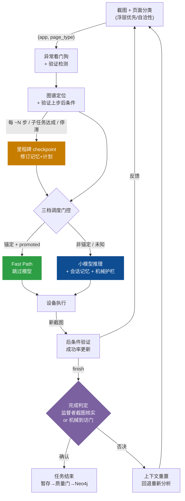
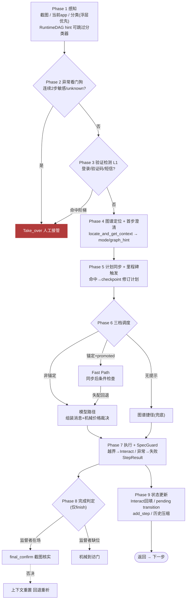
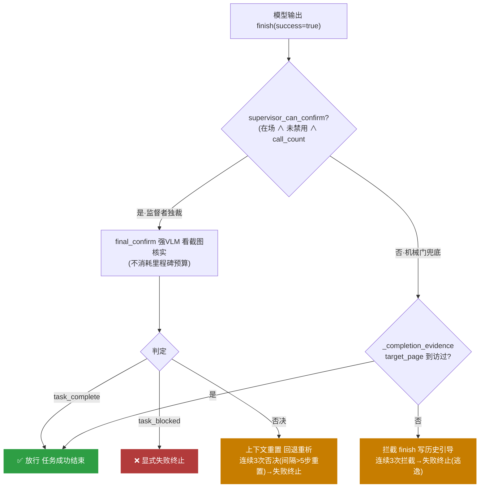
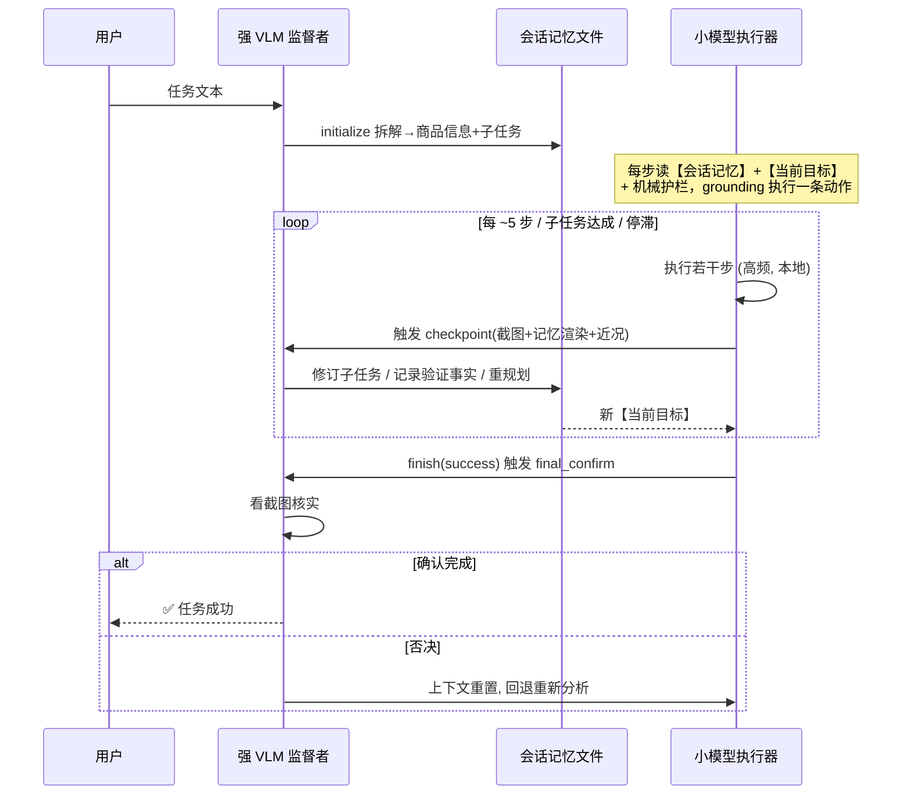

# Shopping-Agent：系统架构文档

> **版本**: 2026-06-12（强 VLM 里程碑监督版 + 系统性缺陷审计与鲁棒性强化）
> **范围**: 完整 `phone_agent/` 实现，重点覆盖：以小模型为主执行器的混合智能体架构、强 VLM 里程碑监督机制（含 provider 链鉴别）、会话记忆文件、机械反幻觉护栏体系、故障模式确定性恢复、AMSG 空间图谱与三档调度，以及多 App 图谱组织与陌生 App 离线建图管线（详述见 AMSG_DESIGN.md）。
> **用途**: 作为学术论文写作的架构基石文档，内容已逐项对照代码核验，并经三维度并行审计与六项运行时缺陷修复。已在淘宝（核心购物链路端到端）与京东（含秒送外卖链路）两个真实 App 上验证。

Shopping-Agent 是一个**以小型 GUI 模型为主执行器、强 VLM 低频监督、空间图谱引导**的移动 GUI 智能体。系统在 Android、HarmonyOS 与 iOS 设备上自动化执行复杂购物任务，通过截图观测、页面定位、图谱路径规划、模型推理、动作执行、里程碑监督与验证后图谱持久化的闭环循环实现。

系统的核心设计命题是：**如何让一个能力有限、可量化部署到手机本地的小模型，在长程任务上达到接近大模型的可靠性**。答案不是把决策权交给云端大模型（已验证会使每步延迟翻三倍，且违背端侧部署理念），而是通过三层确定性结构约束小模型——空间图谱加速机械导航、机械护栏接管小模型不擅长的判断（数字比较、完成判定）、强 VLM 仅在里程碑处低频介入修订计划与核实进度。

---

## 1  设计哲学

### 1.1  两类不确定性

移动 GUI 自动化在一个没有稳定 DOM 的视觉环境中运行，叠加小模型的能力上限，系统面临两类不确定性：

**环境不确定性**——同一页面在不同应用版本、设备、广告、弹窗、滚动位置下外观不同；同一按钮可能打开 SKU 选择、登录、促销弹窗、结算或无反应；过长的操作历史混淆推理并遮蔽当前任务。

**模型不确定性**（小模型特有，真机实测的失败模式）——长任务焦点丢失（反复重述全部计划、原地打转）；数字判断幻觉（连续三次把 ¥1424/¥172/¥201 称为"在 500-1000 元内"）；伪完成（把"压缩 5 步历史"当成任务宣布完成；在未真正加购时输出"已成功加入购物车"）；空响应（在关键步输出无内容的回答）。

### 1.2  设计应对

| 不确定性 | 失败模式 | 设计应对 |
|---|---|---|
| **感知** | 页面外观随版本/广告/弹窗变化 | `PageState` 将截图抽象为基于 app、页面类型、地标、可操作项、槽位、风险的语义状态；分类器采用"浮层优先 + 自洽性"原则区分叠加态页面 |
| **转移** | 同一动作结果不确定 | `EdgeLifecycleManager` 追踪每条转移的经验结果分布、优势比与熵；只有统计可靠的转移才进入可执行动作库 |
| **上下文** | 长历史混淆推理 | 会话记忆文件作为抗遗忘锚（原始任务永不改写）；按需检索；历史压缩 |
| **焦点丢失** | 小模型偏离任务 | 强 VLM 里程碑监督每隔数步修订计划，将单一【当前目标】喂给小模型 |
| **数字幻觉** | 价格判断错误 | 机械价格裁决——代码计算预算对比并注入 ⛔/✅ 结论，不让模型比数字；SpecGuard 在购买提交点硬拦截越界商品 |
| **伪完成** | 虚报任务成功 | 机械完成门（到访证据）+ 强 VLM final_confirm（截图核实），二者构成单一完成权威 |
| **空响应** | 无有效输出 | 空/不可解析输出不再转 finish；触发对话上下文重置与回退重新分析 |

### 1.3  非对称权威

系统贯穿一条**非对称权威**原则：每一类决策都交给最适合它、且失败代价最小的主体。

- **图谱**负责加速与约束机械导航（首页→搜索、搜索→结果、筛选切换），但绝不在内容敏感页（商品选择、SKU 选择、结算）重放过期坐标，也绝不自动重放任何撤销类动作（Back/Home）——因为图谱无法区分"偏离路线"与"模型有意绕路"。
- **小模型**保留对当前屏幕内容的 grounding 权威（这个元素在哪、点哪里）。
- **机械护栏**（纯代码）接管确定性判断：数字比较、约束核实、完成证据。
- **强 VLM** 仅在任务开始（拆解）与里程碑（修订/核实）低频介入，是任务结束权威与计划修订权威。

这套分工的关键性质是：**所有护栏都是规则代码，不依赖云**。小模型量化部署到手机本地后，整套约束结构原样成立。

**决策路由——每类问题交给谁**（绘图建议：四象限矩阵，纵轴"确定性 vs 语义性"，横轴"本地 vs 云端"）：

```
                  本地 (on-device)          │   云端 (cloud)
   ┌──────────────────────────────────────┼──────────────────────────┐
确 │  图谱 (AMSG)                           │                          │
定 │  · 机械导航复用 (首页→搜索)             │   ——（确定性判断不上云）  │
性 │  机械护栏 (纯代码)                      │                          │
   │  · 数字比较 / 约束核实 / 完成证据        │                          │
   ├──────────────────────────────────────┼──────────────────────────┤
语 │  小模型 (GUI model)                    │  强 VLM (监督者)          │
义 │  · grounding：元素在哪、点哪里          │  · 任务拆解 (initialize)  │
性 │  · 每步执行一条动作                     │  · 里程碑修订 (checkpoint)│
   │                                        │  · 完成核实 (final_confirm)│
   └──────────────────────────────────────┴──────────────────────────┘
   高频 (每步)                                低频 (~1+步数/5 次/任务)
```

每类决策交给"最适合且失败代价最小"的主体：确定性判断绝不上云、也绝不交给小模型推理；语义监督低频上云，执行高频留本地。

---

## 2  系统架构

系统由三个逻辑区域与一个监督层组成，通过一条闭环数据流连接。理解架构的关键不是"有哪些层"，而是**数据怎么流动、谁决定什么**。

### 2.1  三区域与监督层

```
                    用户任务 (自然语言)
                          │
                          ▼
        ┌─────────────────────────────────────────┐
        │  监督层：强 VLM 里程碑监督 (低频)            │
        │    MilestoneSupervisor                    │
        │    ├── initialize: 任务开始拆解一次          │
        │    ├── checkpoint: 每 ~N 步修订计划+核实进度  │
        │    └── final_confirm: 截图核实任务完成        │
        │    SessionMemoryFile (会话记忆文件，抗遗忘锚) │
        └──────────────────┬──────────────────────┘
                           │ 子任务 + 会话记忆
                           ▼
┌─────────────────────────────────────────────────┐
│  决策区域：决定"做什么"                              │
│    PhoneAgent._execute_step_impl ← 闭环主控          │
│    ├── TaskPlan           计划追踪 + 里程碑修订        │
│    ├── 机械护栏            价格裁决 / 完成门 / 看门狗   │
│    ├── SpecGuard          购买安全守卫                │
│    └── 三档调度：Fast Path / 图谱捷径 / 模型推理       │
└──────────────┬───────────────────────┬────────────┘
               │ "在哪？走哪？"          │ "这步结果如何？"
               ▼                        │
┌──────────────────────────┐           │
│  图谱区域：加速导航          │           │
│    GraphRuntimeController  │           │
│    ├── 定位 (app,page_type)│           │
│    ├── Dijkstra 规划        │           │
│    ├── RuntimeDAG 缓存       │           │
│    ├── ActionAdvisor 提升边  │           │
│    └── EdgeLifecycle 成功率  │           │
│  存储: Neo4j / FAISS / JSON │           │
└──────────────────────────┘           │
               │ 编译后的设备动作          │
               ▼                        │
┌──────────────────────────┐           │
│  执行区域：操作设备          │           │
│    ModelClient (小模型推理) │           │
│    ModelProtocolBridge      │           │
│    ActionHandler            │           │
│    DeviceFactory ADB/HDC/XCTest        │
│  执行后：新截图 ─────────────┼───────────┘
│    → 后条件验证 (t+1 步确认 t 步)
│    → 成功率更新 → 边生命周期推进
│    → 任务成功结束：暂存 → 质量门 → Neo4j
└──────────────────────────┘
```

### 2.2  三区域的职责边界

**决策区域**回答"做什么"。`PhoneAgent._execute_step_impl()` 是唯一的编排入口，每步调用图谱区域获取定位与动作建议、调用监督层在里程碑处修订计划、应用机械护栏与 SpecGuard，然后在三档调度中选择执行路径。

**图谱区域**回答"在哪、走哪"。`GraphRuntimeController.locate_and_get_context()` 在一次调用中完成定位、验证上步后条件、规划路径、缓存 RuntimeDAG。它返回的 `mode` 字段（`navigate`/`explore`/`verify_with_vlm`/`goal_reached`）直接驱动决策区域的调度选择，并把图谱导航提示放在独立的 `graph_hint` 键中（不污染个性化记忆）。图谱区域不做语义判断，只做结构性导航。

**执行区域**回答"怎么操作设备"。`ModelClient` 驱动小模型推理；`ModelProtocolBridge` 将模型原生输出归一化为 `DeviceActionIR`；`ActionHandler` 编译为设备指令。执行后的新截图与页面分类结果**反馈**到图谱区域，形成闭环：后条件验证更新边的成功/失败计数，成功任务结束时触发图谱持久化。

**监督层**是本版本的核心新增（第 4 节详述）。它独立于运行时三区域，以低频（每任务约 `1 + 步数/5` 次强 VLM 调用）介入，负责任务拆解、里程碑修订与完成核实。监督层与决策区域通过会话记忆文件与 TaskPlan 解耦——监督层修订记忆文件与计划，决策区域读取并执行。

### 2.3  闭环数据流



这条闭环的关键特性：

- **每步都有反馈**：每步的后条件验证结果实时更新边的成功率，不是任务结束才更新
- **持久化是延迟的**：实时更新的是内存中的 `EdgeLifecycleManager` 计数器，Neo4j 写入只在任务成功结束时触发
- **快速路径有保护**：后条件不匹配时自动回退模型推理，最坏多花一次模型调用
- **完成有双权威**：监督者在场时由其截图核实独裁，缺位时由机械到访门兜底
- **失败可恢复**：完成被否决或模型空输出时，丢弃被污染的对话上下文，基于会话记忆回退重新分析

---

## 3  Agent 执行模型

本节按时间顺序描述一个任务从接收到完成的完整过程。入口是 `PhoneAgent.run(task)`，主循环是 `_execute_step_impl()`，出口是 `MemoryManager.end_task()` 与 `SessionMemoryFile.finalize()`。

### 3.1  任务接收：从自然语言到可执行状态

用户输入 `"去淘宝帮我买一个蓝牙耳机，要求500-1000元内"` 后，`run()` 依次执行：

**① 状态全量重置**。清空对话上下文、步数、`abort_requested`、`_last_thinking`、到访页面集 `_visited_pages`、各类计数器（验证 `_verification_consecutive`、异常 `_anomaly_consecutive`、空输出 `_unparseable_count`、完成否决 `_finish_rejected_count`）、`_last_user_reply`、`TaskPlan`、`_step_summaries`、模型适配器历史。任务间完全隔离。

**② 强 VLM 任务拆解**。若里程碑监督者可用，`MilestoneSupervisor.initialize(task)` 用强 VLM（provider 链 `AMSG_STRONG_VLM_*` → `OFFLINE_VLM_*` → `PHONE_AGENT_*`）将任务拆解为有序子任务，并提取 `search_query`、`product`、`specs`、`target_action`、`target_page`。输出经 `_sanitize_search_query` 净化（确定性剥离价格区间与特征词，搜索框只输入裸商品名）。监督者不可用时回退到 `_vlm_pre_plan`（同一 prompt，自带小模型降级）。

**③ 构建会话记忆文件**。`SessionMemoryFile.create(task, vlm_plan)` 生成会话记忆文件（第 5 节），落盘 `memory_db/{user}/sessions/{session_id}.json`。同时构建 `TaskPlan`（子任务带稳定 `step_id`）与 `MilestoneTrigger`（触发器去抖状态）。

**④ 记忆会话启动**。`MemoryManager.start_task()` 重置 `UnifiedSessionState`、`RetrievalGateway`，清空 RuntimeDAG 缓存，从任务文本提取并写入新偏好。

### 3.2  步骤循环：_execute_step_impl 的完整流程

`run()` 在循环中反复调用 `_execute_step`（遥测包装层）→ `_execute_step_impl`（主体）。遥测包装层确保每步恰好向 `step_observer` 发出一个事件（mode/调度路径/graph_hint/后条件/截图），供 WebUI 图谱协同面板消费。以下是 `_execute_step_impl` 一步的完整流程，按实际代码顺序：

**九阶段执行流**（绘图建议：纵向泳道流程图，左侧标注 Phase 序号，菱形为分支，红色块为提前返回）：



**Phase 1 — 感知**。`DeviceFactory.get_screenshot()`（截图损坏时返回 `is_sensitive=True` 的兜底图），获取当前 app，计算 `ui_hash`。`PageClassifier.classify()` 输出 `page_type`（提示词由域模式生成，含"浮层优先 + 自洽性"原则，第 8 节）；若 RuntimeDAG hint 可用则跳过分类器省一次调用。到访的页面类型记入 `_visited_pages`。

**Phase 2 — 异常看门狗**。`is_sensitive` 截图或连续 `unknown`/`None` 页面累计计数，连续 2 次 → `Take_over` 人工接管（提示可能出现验证码/短信验证/安全弹窗）。这是机械信号兜底——不依赖模型认出验证码，黑屏本身就是证据。

**Phase 3 — 验证检测 Layer 1**。`detect_verification(page_type, summary, elements)` 检测登录/验证码/短信页。阶梯接管：连续命中 1-3 次自动接管、4-5 次让模型试一次、>5 次任务失败。

**Phase 4 — 图谱协同 + 澄清**。`memory_manager.locate_and_get_context()` 委托 `GraphRuntimeController`：RuntimeDAG 可用则直接推进游标返回下一动作（不查 Neo4j）；否则 `(app, page_type)` 匹配 Neo4j → 验证上一步 pending transition → Dijkstra 规划 → 缓存 RuntimeDAG。返回 `mode` + `next_actions` + `graph_hint`。仅第 1 步运行 `ClarificationAgent` 三层短路澄清（规则检查 → FAISS 偏好填充 → 强 VLM 判断是否追问）。

**Phase 5 — 计划同步 + 里程碑触发**。若当前页面匹配 TaskPlan 的未来步（Fast Path 超前），批量推进中间步并标记 `milestone_subtask_done`。随后里程碑触发器评估（第 4 节）：命中（每 N 步间隔/子任务达成/停滞）则运行 `_run_milestone_checkpoint`——强 VLM 看截图修订会话记忆与计划。checkpoint 调用以防御包装隔离，崩溃不杀任务。

**Phase 6 — 调度与上下文组装**。
- **Fast Path**：`_needs_vlm` 检查 ActionAdvisor 提示是否含匹配 effective plan target 的可快执行动作（grounded、conf≥0.9、有坐标或 Compound）。命中 → `_execute_fast_path`：执行动作、立即截新图分类做**同步后条件检查**，匹配则成功、失配则回退模型路径并记失败观测。搜索场景有合成的 `Type <query> + Tap` Compound 边。
- **图谱捷径**（兜底）：ActionAdvisor 无提示时尝试 legacy `_try_graph_shortcut`，`verify_with_vlm` 转移自动转交模型。
- **模型路径**：以上未命中。组装消息（双模型路径同构）：`【会话记忆】`摘要（取代旧任务计划块）→ `【当前目标】`（预规划当前步，单焦点）→ 关键约束 → 执行历史 → `【图谱导航】`（graph_hint）→ 可用操作 → SpecGuard 提示 → **机械价格裁决**（代码算预算对比注入 ⛔/✅）→ 价格红线 → 按需记忆检索。

**Phase 7 — 执行与安全拦截**。专用 handler 路径（UI-TARS/Qwen-VL/MAI-UI/GUI-Owl）先算 canonical action **再过 SpecGuard**，AutoGLM 路径 parse → `try_ground` 图谱坐标增强 → SpecGuard → 执行。SpecGuard 守卫 `product_detail`/`spec_selection`/`checkout`/`payment` 页（含 product_detail，因规格弹窗常被分类为它），含价格边界硬拦截（会话态商品价 vs 预算，越界→Interact）。执行异常构造失败 `StepResult`，**绝不借道 finish 洗白**。

**Phase 8 — 完成判定与恢复**（仅 finish 时）。见 3.4。

**Phase 9 — 状态更新**。Interact 回答回填任务文本（SpecGuard 下步可见）；缓存 pending transition 供下步验证；`add_step` 记录会话态、提取商品信息、停滞检测；历史压缩保留最近 2 条完整对话。

### 3.3  空输出恢复

小模型在关键步可能输出空响应（真机实测）。解析失败时：

- **不再转 finish**——这曾是最后一条 finish 洗白通道。
- 计数 `_unparseable_count`；连续 2 次 → `_reset_dialogue_context`（丢弃被污染的对话上下文，下步由 system prompt + 会话记忆摘要 + 修订目标 + 新截图重建）；连续 4 次 → 显式失败终止。

这套恢复机制的可行性正来自里程碑架构：**持久状态全在会话记忆文件里，对话上下文是可丢弃的**。

### 3.4  任务结束：完成判定与持久化

循环终止于模型输出 `terminate`/`answer`（finish），或 `max_steps`，或用户 abort，或确定性失败。

**完成判定采用单一权威原则**（绘图建议：判定树，强调"机械门让位"的互斥关系）：



- **监督者在场**（`supervisor_can_confirm` = 在场 ∧ 未因连续失败禁用 ∧ `call_count < max_calls`）→ `final_confirm` checkpoint 用强 VLM 看截图核实。三态：`task_complete` 放行；`task_blocked` 转显式失败；否决 → 上下文重置回退重新分析。**否决采用连续计数**（`_finish_rejected_count`，距上次否决 >5 步则重置为 1，避免相隔几十步的三次否决被误判为"连续"）；连续 3 次否决 → 确定性失败终止。**`final_confirm` 不消耗里程碑调用预算**——否则反复的 finish 尝试会快速耗尽 `max_calls`，使判定权悄悄从监督者切到更弱的机械门。
- **监督者缺位**（或预算耗尽）→ 机械完成门兜底：success finish 须满足预规划 `target_page` 到访过至少一次（`_completion_evidence`），否则拦截并写入历史引导纠偏。**机械门同样有逃逸计数**（`_finish_gate_blocked_count`）：连续 3 次拦截 → 确定性失败终止——因为 `target_page` 可能因分类噪声永远判不到访，否则会陷入 finish→拦截→finish 的慢速死循环直到 `max_steps`。

**为什么用单一权威**：机械到访门依赖页面分类，而分类有噪声（规格弹窗常被判成 product_detail，导致 spec_selection"未到访"）。监督者能看截图直接核实"加购成功"，严格强于到访证据。两者同时运行会让先跑的机械门误拦监督者本可放行的真完成——因此监督者在场时机械门让位。**两条路径都有确定性失败逃逸**（各自连续 3 次），杜绝任何"既不结束也不推进"的死循环。

`MemoryManager.end_task(success, result)` 执行：① 轨迹保存（无论成败，写 `trajectories/`）；② 学习偏好（仅成功，写 FAISS）；③ 图谱刷新（仅成功，规范化→质量过滤→Neo4j）；④ VLM 轨迹审核（仅成功，新转移以 hypothesis 导入）。`SessionMemoryFile.finalize()` 落盘记忆文件终态。

---

## 4  强 VLM 里程碑监督机制

这是本版本对"小模型长程可靠性"命题的核心回答。设计动机：纯小模型在长任务上能力不足（遗忘、幻觉、伪完成），而每步强 VLM 规划已验证太贵（延迟翻三倍）且违背端侧理念。中间路径是——**强 VLM 任务开始拆解一次、之后只在里程碑处低频介入**，预算约 `1 + 步数/5` 次强 VLM 调用/任务。

**强 VLM 与小模型的交替时序**（绘图建议：泳道时序图，突出强 VLM 介入点稀疏、小模型高频执行）：



### 4.1  监督者职责（`milestone_supervisor.py`）

**`initialize(task)`**：任务开始的一次性拆解，输出与 `_vlm_pre_plan` 同 schema（兼容 `set_vlm_plan`/`TaskPlan.from_vlm_output`）。强 VLM 看任务文本拆解子任务、提取商品信息。

**`checkpoint(...)`**：里程碑处的修订与重规划。输入截图（裁剪压缩）+ 会话记忆渲染 + 近 8 步摘要 + 当前页面类型 + 触发原因 + 机械事实快照（会话追踪的商品数与价格）。系统提示强调"执行模型自述不可信，以截图与已验证事实为准；原始任务永不改变"。输出 `CheckpointResult`：已完成子任务 id、新验证事实、重新规划的剩余子任务（全量替换未完成部分）、完成/阻塞判定。

监督者复用 `PageClassifier` 的 provider 链与截图压缩基建，与分类器、离线探索规划器同源。

### 4.2  里程碑触发器（`MilestoneTrigger`，纯逻辑去抖）

四个触发器，判定点在 `_execute_step_impl` 的计划同步块之后，每步至多触发一个：

| 触发器 | 条件 | 去抖 |
|---|---|---|
| T1 步数间隔 | `step - last ≥ INTERVAL`（默认 5，最小 2） | 天然去抖 |
| T2 子任务达成 | 计划同步标记 done 且 `step - last ≥ MIN_GAP`（默认 2） | 不满足则推迟到 T1 |
| T3 停滞 | `state.is_stagnating()`（连续 2 次同动作同页）且 ≥ MIN_GAP | 同一停滞段不重复触发 |
| T4 完成门拦截 | 机械完成门拦截 finish 后下一判定点立即触发 | 每任务 ≤ 2 次 |

**优先级** T4 > T3 > T2 > T1。checkpoint 后 `last_checkpoint_step` 前移，所有触发器共享该基准。总预算 `MAX_CALLS`（默认 `2 + max_steps/INTERVAL`）耗尽后全部静默——但**完成核实 `final_confirm` 不计入此预算**（它是完成判定的一部分，有自己的连续 3 次否决上限），否则反复的 finish 尝试会与常规里程碑共享预算并快速耗尽它。

### 4.3  原子修订（`TaskPlan.apply_revision`）

监督者的修订经 `apply_revision(completed_step_ids, revised_subtasks)` 原子应用：done/skipped 步保留原对象不可改写；pending 尾部用修订全量重建（空修订=保留原尾部）；current_index 重定位到首个未完成步；校验（空描述丢弃、≤12 步上限、非法修订整体拒绝）；原子赋值后返回变更摘要。修订同步镜像回会话记忆文件的子任务（`sync_subtasks_from_plan`）。

### 4.4  降级语义与强 VLM 鉴别（失败=维持现状）

**运行期降级**：checkpoint 失败（网络/解析/超时）→ 保留旧计划、记 `RevisionEntry("checkpoint_failed")`、基准前移（防重试风暴）；连续 2 次失败 → 本任务内禁用监督者；强 VLM 完全不可用 → 不挂载监督者，整体退化为机械护栏 + 纯小模型行为。所有 checkpoint 调用点以 try/except 防御包装，崩溃既不杀任务也不堵 finish。

**强 VLM 静默回退鉴别**（关键正确性保障）：监督者、分类器、规划器共用同一条 `PageClassifier` 三级 provider 链——`AMSG_STRONG_VLM_*` → `OFFLINE_VLM_*` → `PHONE_AGENT_*`(autoglm 小模型)。链尾的 `phone_agent` 级默认值齐全（永远存在），因此**若未配置强 VLM，链会静默退化到小模型**——此时"监督者"就是执行器自己的模型，无法纠正同源幻觉，里程碑机制名存实亡。系统通过 `MilestoneSupervisor.is_strong_vlm()` / `provider_label` 鉴别实际 provider：挂载时打印**真实监督模型**（如 `监督模型: amsg_strong_vlm:qwen3-vl-plus`），并在退化到小模型时**大声告警**"监督已退化为小模型自监督，无法纠正幻觉，请配置 AMSG_STRONG_VLM_*"。`_vlm_pre_plan` 降级路径也对齐同一三级链。这道鉴别确保论文实验中"强 VLM 监督"的配置不会被静默掏空。

### 4.5  与每步规划器的互斥

`step_planner.py` 提供另一条更激进的路线——每步强 VLM 规划（`PHONE_AGENT_STRONG_PLANNER=1`，默认关闭，留作消融上界）。它与里程碑监督**互斥**：启用每步规划时里程碑自动停用（每步已有强 VLM 介入，里程碑纯属冗余）。这构成三档消融矩阵：纯小模型（`PHONE_AGENT_MILESTONE=0`）/ 里程碑监督（默认）/ 每步规划（`STRONG_PLANNER=1`）。

---

## 5  会话记忆文件

会话记忆文件（`session_memory_file.py`）是抗遗忘的持久锚，也是监督者与执行器解耦的接口。纯数据模块，无 VLM 依赖。

### 5.1  数据结构

```
SessionMemoryFile = {
  session_id, original_task(永不改写), platform,
  product:{name, target_action}, constraints:{price/color/...},
  subtasks:[SubTask{step_id, description, target_page, status, completed_at_step, evidence}],
  verified_facts:[VerifiedFact{fact, kind, step, source}],
  revisions:[RevisionEntry{step, trigger, summary, changes}],
  vlm_call_count, status:active|completed|failed
}
```

`original_task` 永不改写——它是执行器偏离时重新校准的锚。`verified_facts` 记录截图核实过的事实（已选商品与价格、已应用筛选、已加购），`kind` 分类为 `product_selected`/`price_confirmed`/`cart_added`/`filter_applied`。`revisions` 是完整的修订审计日志（每次 checkpoint 留痕，论文的可解释性素材），最多保留 30 条。

### 5.2  持久化与渲染

- **原子落盘**：`save()` 先写 `.json.tmp` 再 `os.replace`，崩溃最多丢一个间隔的修订；内存对象始终是事实源，IO 失败仅日志。
- **`render_injection()`**：渲染 ~12 行注入文本（原始任务 / 目标商品+约束 / 已验证事实最多 5 条 / 子任务进度清单），每步注入小模型上下文，取代旧的纯任务计划块。
- **`brief_line()`**：单行进度（"已完成 X/Y 个子任务；当前：…"），写入 `state.overall_progress`——取代了被废弃的、曾导致小模型把"压缩历史"误当任务的旧压缩文本（`compress_session_history` 现为 no-op）。

**`render_injection()` 实际注入样例**（绘图建议：直接作为代码框/标注框呈现，体现"每步喂给小模型的抗遗忘上下文"）：

```
【会话记忆】
原始任务: 去淘宝帮我买一个蓝牙耳机，要求500-1000元内
目标商品: 蓝牙耳机（约束: price_range=500-1000元）
已验证事实:                          ← 截图核实过, 最多渲染 5 条
  ✔ 已应用价格筛选 500-1000（Step 6）
  ✔ 已选定 JBL Clips ¥966（Step 14）
子任务进度:
  1. [done]    搜索蓝牙耳机
  2. [done]    设置价格筛选
  3. [current] 进入详情确认参数
  4. [pending] 选规格并加入购物车
```

---

## 6  机械护栏体系（反幻觉）

机械护栏是纯代码的确定性判断，接管小模型不擅长的环节。每步零额外云调用，量化部署后原样成立。

| 护栏 | 接管的判断 | 实现 |
|---|---|---|
| **机械价格裁决** | "这个价格符合预算吗" | `SpecGuard._extract_price_bounds` 解析预算区间，对照会话态商品价，决策页注入三态结论：⛔ 越界禁购 / ✅ 在区间 / ⚠️ **价格未读取到时强制模型先从截图核实价格再加购**（防越界商品在价格未提取时滑过）。绝不让 9B 模型比数字 |
| **SpecGuard 价格拦截** | 越界商品加购 | commit 动作时硬拦截：越界 → 替换为 Interact 询问用户 |
| **机械完成门** | "任务真完成了吗"（兜底） | success finish 须到访过预规划 target_page；否则拦截+写历史引导；**连续 3 次拦截 → 确定性失败终止**（逃逸，防分类噪声导致死循环） |
| **异常看门狗** | "屏幕是否失效" | 连续 2 步敏感/unknown 截图 → 人工接管。机械信号不依赖模型识别；**接管后复位异常/验证两计数器**（人工已处理，避免下帧重复抢先接管） |
| **空输出恢复** | "模型卡住了吗" | 不可解析输出不转 finish；2 次重置上下文、4 次失败终止 |
| **搜索词净化** | "查询词是否被污染" | `_sanitize_search_query` 确定性剥离价格/特征词 |
| **finish 防洗白** | "异常是否伪装成功" | 执行异常一律构造失败 StepResult，绝不借道 finish |

设计原则：**能用代码确定性判断的，绝不交给小模型推理**。这些护栏与强 VLM 监督互补——监督是语义层（理解进度、修订计划），护栏是符号层（数字、证据、状态）。

### 6.1  故障模式与确定性恢复

系统对每一类真机实测的失败模式都有**确定性**（非概率、非 prompt 依赖）的检测与恢复路径。每条恢复路径都有**有界的终止保证**——绝不存在"既不结束也不推进"的死循环。

| 失败模式（真机实测） | 检测信号 | 确定性响应 | 终止保证 |
|---|---|---|---|
| 长任务焦点丢失 | （持续）会话记忆文件每步注入 + 里程碑修订 | 单一【当前目标】替代自由规划 | — |
| 数字判断幻觉（价格越界判合规） | 代码解析预算 vs 会话态价格 | ⛔/⚠️ 注入 + SpecGuard 硬拦截 | — |
| 伪完成（虚报成功） | 监督者截图核实 or 机械到访门 | 否决 → 回退重析 | 连续 3 次否决/拦截 → 失败终止 |
| 空响应（无有效输出） | 解析失败 | 不转 finish + 上下文重置 | 连续 4 次 → 失败终止 |
| 验证码/安全弹窗 | 截图损坏(is_sensitive) + 连续 unknown | 异常看门狗 → 人工接管 | 验证检测 >5 次 → 失败终止 |
| 人工接管后计数残留 | — | 接管后复位异常/验证计数器 | — |
| 图谱对抗模型绕路 | Back/Home 划为非锚定 | 撤销类动作永不自动重放 | — |
| 强 VLM 配置缺失 | provider 链鉴别(is_strong_vlm) | 退化告警 + 鉴别日志 | — |
| 监督者 checkpoint 崩溃 | try/except 包装 | 保留旧计划，既不杀任务也不堵 finish | 连续 2 次失败 → 禁用监督者 |
| Fast Path 后条件失配 | 同步截图分类对比 | 回退模型路径 + 记失败观测 | — |

这张"失败模式 → 确定性响应 → 有界终止"的映射，是本系统区别于"靠模型自我修正"的端侧智能体的关键工程性质：可靠性来自系统设计的确定性兜底，而非寄望小模型自己不犯错。

---

## 7  空间图谱（AMSG）与三档调度

图谱负责缓存已验证的机械导航路径，让重复劳动跳过模型推理。详细的图谱设计、生命周期、多 App 组织与离线建图管线见 **AMSG_DESIGN.md**，此处概述与执行循环的接口。

### 7.1  页面状态抽象

图谱节点是语义描述而非截图：`PageState = (app, page_type, landmarks, affordances, slots, risk)`。搜索"耳机"与"手机"产生不同截图但相同页面结构，存 `(app, page_type)` 与语义签名实现跨任务复用。Phase 4 用 `(app, page_type)` 在 Neo4j 匹配节点，节点出边即当前页可用的已验证动作。

### 7.2  锚定性分类与三档调度

每条边独立分类为锚定（grounded）或非锚定（ungrounded）。`ActionHint.is_fast_executable()` 条件：`grounded` 且 `confidence ≥ 0.9` 且（有坐标 或 Compound 或 action_type ∈ {Launch, Wait}）。**Back/Home 永不快执行**——撤销属修复域，自动重放会对抗模型的有意绕路。

`_UNGROUNDED_TRANSITIONS`（9 对，必须模型决策具体元素）：

```
search_result→product_detail   选哪个商品
search_result→store            选哪家店
product_detail→spec_selection  选什么规格
spec_selection→cart/checkout   购买提交点
cart→checkout                  购买提交点
search_input→search_result     裸 Tap 会提交残留文本（仅合成 Compound 锚定）
filter_panel→search_result     离开筛选需内容决策
spec_selection→product_detail  弹窗关闭/取消决策
```

三档调度：
- **Fast Path**（~0.5s，跳过模型）：锚定且 promoted 的转移，带同步后条件检查
- **Graph Co-pilot**（图谱给方向、模型 grounding）：`verify_with_vlm` 转移注入 `graph_hint` 提示
- **模型路径**（~5s）：非锚定或图谱无路由

### 7.3  搜索 Compound 边合成

文档承诺的 `search_input→search_result` 是"输入+提交"复合机械动作，但在线轨迹只会记录裸 Tap。`ActionAdvisor._append_search_compound` 从已验证的 Tap 坐标合成 grounded Compound 提示（`Type <query>` + `Tap 坐标`），`<query>` 槽位执行时由计划填充。这让搜索步骤真正走 Fast Path。

### 7.4  延迟后条件验证与生命周期

步骤 t 缓存 `(页面, 动作, 预期目标)`，步骤 t+1 对比实际 page_type 记 success/failure，喂边生命周期计数器（单通道记账，不双计）。`EdgeLifecycleManager` 状态机 `hypothesis → candidate → promoted → demoted`，只有 promoted 边对 ActionAdvisor 可见。坐标只来自真实执行（导入边不再伪造屏幕中心默认值）。Neo4j 写入只在任务成功结束时由 flush 触发。

### 7.5  RuntimeDAG

`GraphRuntimeController` 把 Dijkstra 规划结果缓存为内存边数组+游标，连续步直接读 `route[current_index]` 跳过定位-规划管线。`should_use_page_classifier` 在 DAG 可用且无待验证后条件且非高风险边且 app 匹配时返回 False，省一次分类调用。失效被动（后条件失配/应用切换/高风险/路径耗尽），下次自动重建。

---

## 8  页面分类器

分类器（`PageClassifier` + 域模式 `schemas/shopping.yaml`）是后条件验证的 ground truth，其独立性是边生命周期统计真实性的前提。

**浮层优先 + 自洽性原则**（prompt header，full/fast 双模板共享）：

- **浮层优先**：页面存在弹窗/半屏面板/浮层时，page_type 以最上层弹层内容为准，不以背景页面为准（半屏弹层可能无明显蒙层）。
- **自洽性**：page_type 必须与 summary 自洽——摘要描述弹层内容（规格选择、登录弹窗）时，page_type 必须是对应弹层类型。

这两条针对真机实测的失败模式：规格弹窗每次被判成 product_detail（背景详情页清晰可见、底部弹层无蒙层、模型嘴上说"颜色套餐选项"却判 detail）。`spec_selection` 补上自己的判别 vlm_hint（选项区块+确认按钮→必判 spec_selection，即使背景详情页可见），`product_detail` 的 hint 对称改写。

**架构红线**：绝不把运行时的预期后条件喂给分类器做偏置。分类器输出是后条件验证的 ground truth，预期偏置会让验证退化为自我证实，摧毁边生命周期的统计真实性。这是有意识不做的"改进"，论文方法节值得说明。

域模式还支持开放词表（词表外页面产出 `new:<type>` 提案，离线探索消费）与按 schema 配置的 `vlm_verify_transitions`。

---

## 9  记忆系统

记忆系统为 Agent 循环的不同需求提供多个数据面，时间尺度与粒度各异。

| 记忆面 | 存储 | 服务对象 | 解决的问题 |
|---|---|---|---|
| **用户记忆** | FAISS（跨会话） | Phase 4 澄清/槽位填充 | "买个手机"缺规格——从历史偏好填充，不追问 |
| **会话状态** | UnifiedSessionState（单任务） | Phase 6 进度注入/Phase 9 记步 | 进度追踪、商品提取、停滞检测 |
| **会话记忆文件** | JSON（单任务，原子落盘） | 抗遗忘锚 + 监督接口 | 长任务焦点丢失（见第 5 节） |
| **图谱记忆** | Neo4j（跨会话） | Phase 4 定位/Phase 6 Fast Path | 机械导航重复劳动 |
| **轨迹文件** | JSON（单任务产物） | 任务后图谱演进 | 发现新转移供 VLM 审核 |

**按需检索**：`RetrievalGateway` 监听模型思考文本，仅在检测到回忆/比较/计算/停滞信号时触发检索（注入商品列表/购物车计算/历史步骤），冷却 3 步。典型 30 步任务仅 3-5 步触发详细检索，其余步只有进度摘要。

`get_injection_context` 分层注入：进度摘要（始终）+ 当前焦点 + 按需检索 + 约束提醒。`compress_session_history` 现为 no-op（其泄漏 bug 已由会话记忆文件取代）。`end_task` 四步：轨迹保存（无论成败）、学习偏好（仅成功）、图谱刷新（仅成功）、VLM 轨迹审核（仅成功）。

---

## 10  模型与设备抽象

### 10.1  多模型支持

通过统一适配器架构支持五个 GUI 模型家族（坐标空间以代码为准）：

| 模型家族 | 坐标空间 | 上下文策略 | 响应格式 |
|---|---|---|---|
| AutoGLM | `[0,1000]` 归一化 | 累积（文本累加，图片仅当前） | `<answer>` / `do()`+`finish()` |
| UI-TARS | 绝对像素（smart_resize 空间） | 最多 5 张图，裁剪最旧 | `Thought: … Action: …` |
| Qwen-VL | `[0,999]` 归一化 | 每轮重建 | `<tool_call>` JSON |
| MAI-UI | `[0,999]` 归一化 | 最多 3 张图 | `<thinking>` + `<tool_call>` |
| GUI-Owl | `[0,1.0]` 小数（模型原生 0-999，解析后转 0-1） | 最多 1 张图（仅当前） | Action + `<tool_call>` |

`ModelProtocolBridge._scale_coord()` 是坐标转换枢纽，所有坐标空间经归一化 (0,1) 中间表示互转。这使图谱模型无关——同一 Neo4j 图谱服务不同模型，运行时转换坐标系。

### 10.2  设备抽象

`DeviceFactory` 统一 ADB（Android）与 HDC（HarmonyOS）；iOS 走独立的 `IOSPhoneAgent` + `IOSActionHandler`（XCTest/WebDriverAgent HTTP），不经 DeviceFactory。`ActionHandler` 将规范动作字典转设备调用，管理键盘设置（切换 ADB 键盘、清空、输入、恢复原 IME）、操作间时序延迟、同页复合动作序列。

---

## 11  WebUI 可视化

`webui.py` 的 `StreamingAgent` 包装真实 `PhoneAgent.run()`（worker 线程 + 事件队列），WebUI 与 CLI 共享同一编排入口。三个流式钩子：`ModelClient.stream_callback`（逐 token 思考流）、`PhoneAgent.step_observer`（每步遥测：mode/调度/graph_hint/后条件/runtime_metrics/截图）、`takeover_callback`（人工接管 + Interact 回复框）。

**图谱协同面板**（`format_graph_panel` 纯函数）每步可视化：页面类型与模式（navigate/verify_with_vlm/explore/goal_reached）、调度档位（⚡Fast Path / 🤝Co-pilot / 🧠模型）、Fast Path 后条件"预期→实际"判定、注入模型的图谱导航提示原文、累计统计（三档次数 / DAG 命中率 / 省分类器次数）。iOS 走 IOSPhoneAgent，无图谱栈与遥测。

---

## 12  配置与消融

| 环境变量 | 默认 | 作用 |
|---|---|---|
| `PHONE_AGENT_MILESTONE` | `1`（开） | 里程碑监督开关 |
| `PHONE_AGENT_MILESTONE_INTERVAL` | `5` | 步数间隔触发 N |
| `PHONE_AGENT_MILESTONE_MIN_GAP` | `2` | 子任务/停滞触发最小间隔 |
| `PHONE_AGENT_MILESTONE_MAX_CALLS` | `0`（auto=2+步数/N） | 每任务 checkpoint 上限 |
| `PHONE_AGENT_STRONG_PLANNER` | `0`（关） | 每步强 VLM 规划（消融上界，与里程碑互斥） |
| `AMSG_STRONG_VLM_*` (`_API_KEY`/`_BASE_URL`/`_MODEL`) | — | **强 VLM**（监督/分类/规划共用，三级链首选）。**未配置则静默退化到 `PHONE_AGENT_*` 小模型**，挂载时告警（§4.4） |
| `OFFLINE_VLM_*` | — | 强 VLM 三级链中间级（强 VLM 未配时的次选） |
| `PHONE_AGENT_*` (`_MODEL` 等) | autoglm-phone-9b | **小模型主执行器**；也是强 VLM 三级链的兜底末级 |
| `AMSG_CONFIG` | `sava`（推荐） | 图谱生命周期策略预设（见 AMSG_DESIGN.md） |
| `AMSG_DOMAIN_PRIORS` | `1`（开） | 同域结构先验注入（冷启动借同域方向感，仅文本不含坐标） |

**三档消融矩阵**（论文实验核心）：
1. **纯小模型基线**（`MILESTONE=0`）：仅机械护栏 + 图谱，无强 VLM 运行期介入
2. **里程碑监督**（默认）：强 VLM 低频监督，~1+步数/5 次调用
3. **每步规划上界**（`STRONG_PLANNER=1`）：每步强 VLM 介入，延迟翻三倍

三档构成"准确率—延迟—云调用次数"曲线，支撑核心论点：**低频监督达到接近每步监督的可靠性**，且端侧部署友好。

---

## 13  对比分析与核心贡献

### 13.1  在文献中的定位

Shopping-Agent 解决了当前 GUI 智能体领域的若干缺口：

**缺口 1：纯模型方案的能力—成本两难。** 强模型方案（GPT-4o 驱动的多智能体）准确但昂贵且无法端侧部署；小模型方案（量化可部署）在长程任务上遗忘与幻觉。Shopping-Agent 用"小模型主执行 + 强 VLM 低频监督 + 机械护栏"的混合架构，在端侧友好的成本下达到接近大模型的长程可靠性。

**缺口 2：无状态重复探索。** 多数 GUI 智能体将每个任务会话视为独立，结构性导航知识不跨会话持久。AMSG 在 Neo4j 持久化经验证转移，构建累积导航知识。

**缺口 3：无生命周期的图谱。** 构建导航图谱的系统将图谱视为静态产物。AMSG 引入完整生命周期（hypothesis→candidate→promoted→demoted），数据驱动提升与自动降级。

**缺口 4：二元的图谱/模型控制。** 现有方案要么图谱做静态 RAG、要么确定性绕过模型。Shopping-Agent 引入三档连续调度（Fast Path / Co-pilot / 模型），按边的锚定性与生命周期阶段数据驱动选择。

### 13.2  核心贡献（默认启用、可复现）

1. **强 VLM 里程碑监督机制**。小模型主执行、强 VLM 仅在任务开始与里程碑低频介入，以 ~1+步数/5 次调用达到接近每步监督的可靠性，端侧部署友好。任务拆解、计划修订、完成核实由强 VLM 独占；grounding 由小模型负责。

2. **会话记忆文件作为抗遗忘锚**。原始任务永不改写、已验证事实与子任务进度持久化，使长程任务焦点不丢失；其可丢弃的对话上下文配合使"否决→重置→回退重新分析"的恢复闭环成为可能。

3. **机械反幻觉护栏体系**。数字比较、约束核实、完成证据由确定性代码接管，零额外云调用，量化部署后原样成立。这套符号层护栏与强 VLM 语义层监督互补。

4. **单一完成权威**。监督者截图核实与机械到访门构成互斥的完成判定，避免双权威相互误拦；伪 finish（GUI 模型最具破坏性的幻觉）被系统性堵死。

5. **自更新的页面状态图谱与三档调度**。跨会话持久的导航知识图谱，成功率驱动的边生命周期，锚定性分类的三档调度，搜索 Compound 边合成使机械导航真正加速。

6. **结构化任务约束作为一等状态**。价格区间、规格被提取为任务槽位，由 SpecGuard 在购买提交点机械强制——购物安全是系统属性而非提示工程，对全部五个模型家族成立。

7. **浮层优先的页面分类**。叠加态页面（规格弹窗、登录弹窗）按最上层内容分类，配合自洽性约束，提升后条件验证的 ground truth 质量；明确拒绝用预期偏置分类器以保护生命周期统计真实性。

8. **可复现的端侧—云协同消融**。三档配置（纯小模型/里程碑/每步规划）提供准确率—延迟—成本曲线，支撑"系统设计而非模型规模提升端侧可靠性"的论点。

### 13.3  实验性扩展（未默认启用）

- 每步强 VLM 规划（`PHONE_AGENT_STRONG_PLANNER=1`，消融上界）
- 多通道贝叶斯信念定位、Belief-A* 增强规划器（图谱实验扩展，见 AMSG_DESIGN.md）

---

## 14  实现映射

| 概念 | 文件 |
|---|---|
| 主循环 | `phone_agent/agent.py` |
| 里程碑监督 | `phone_agent/milestone_supervisor.py` |
| 会话记忆文件 | `phone_agent/session_memory_file.py` |
| 每步规划器（消融） | `phone_agent/step_planner.py` |
| 任务计划 | `phone_agent/task_plan.py` |
| 购买安全守卫 | `phone_agent/core/spec_guard.py` |
| 验证检测 | `phone_agent/verification_detector.py` |
| 记忆管理 | `phone_agent/memory/memory_manager.py` |
| 会话状态 | `phone_agent/memory/core/unified_state.py` |
| 按需检索 | `phone_agent/memory/retrieval_gateway.py` |
| 运行时图谱控制器 | `phone_agent/spatial/runtime_controller.py` |
| 动作顾问 | `phone_agent/spatial/action_advisor.py` |
| 边生命周期 | `phone_agent/spatial/edge_lifecycle.py` |
| 页面分类器 | `phone_agent/memory/exploration/classifier.py` + `classifier_prompts.py` |
| 域模式 | `phone_agent/spatial/schemas/shopping.yaml` |
| 模型协议桥 | `phone_agent/model/protocol_bridge.py` |
| 模型适配器 | `phone_agent/model/adapters.py` |
| 设备抽象 | `phone_agent/device_factory.py` |
| 图谱清理工具 | `scripts/purge_invalid_graph_entries.py` |
| WebUI | `webui.py` |
| AMSG 图谱详细设计 | `phone_agent/docs/AMSG_DESIGN.md` |

---

## 15  论文方法摘要

> Shopping-Agent 是一个以小型 GUI 模型为主执行器、强 VLM 低频监督、空间图谱引导的移动 GUI 智能体，旨在让可量化端侧部署的小模型在长程任务上达到接近大模型的可靠性。任务开始时，强 VLM 将任务拆解为有序子任务并提取商品信息，生成原始任务永不改写的会话记忆文件交给小模型执行；此后强 VLM 仅在里程碑处（每数步、子任务达成、停滞或完成声明被拦）低频介入，看截图修订记忆文件、重新规划剩余子任务、核实任务是否真正完成，预算约 1+步数/5 次调用。运行期，纯代码的机械护栏接管小模型不擅长的确定性判断——价格预算对比、约束核实、完成证据——零额外云调用；空间图谱缓存经验证的机械导航转移，按边的锚定性进行三档调度（Fast Path 跳过模型 / Co-pilot 图谱给方向模型 grounding / 完整模型推理），延迟后条件验证驱动边生命周期。完成判定采用单一权威：监督者在场时以截图核实独裁，缺位时由机械到访门兜底，杜绝伪完成污染图谱质量门。任务无法推进或模型空响应时，丢弃被污染的对话上下文，基于会话记忆回退重新分析。系统支持五个 GUI 模型家族与三个设备平台，并通过纯小模型/里程碑/每步规划三档消融提供端侧—云协同的准确率—延迟—成本权衡分析。
